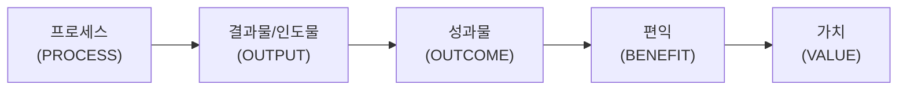
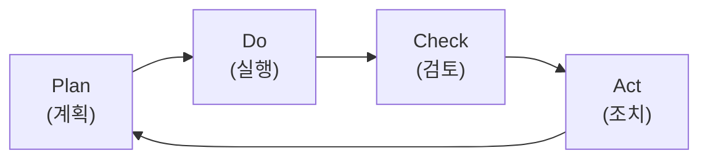

# 가치 전달 시스템

분류: 프로젝트 관리 개요
비고: 성과(Outcome), 편익(Benefit), 가치(Value), 가치전달시스템, 정보 흐름, PDCA
상위토픽: 01. 프로젝트 관리 개요
연번: 3

## 1.5 가치 전달 시스템 (System for value delivery)

### 가. 성과 (Outcome)

- 프로세스나 프로젝트의 최종 결과물.
- 성과에는 산출물과 결과물이 포함될 수 있지만 프로젝트를 통해 인도하려는 편익과 가치에 초점을 맞추면 의미가 더 넓어질 수 있음.

### 나. 편익 (Benefit)

- 측정 가능한 비즈니스 이익.

### 다. 가치 (Value)

- 어떤 것의 가치, 중요성 또는 유용성.
- 이해관계자마다 가치를 인식하는 방식이 다름. 고객은 제품의 특정 기능 및 특징을 사용할 수 있는 능력으로 가치를 정의할 수 있다. 조직은 재무 지표(예: 어떤 편익을 얻는 데 드는 비용보다 그 편익이 적음)에 따라 결정된 비즈니스 가치에 중점을 둘 수 있다. 사회적 가치에는 사람, 지역사회 또는 환경 그룹에 대한 기여도가 포함될 수 있다.

**가치 창출 흐름**

| 단계 | 예시 (온라인 민원 시스템) |
| --- | --- |
| **프로세스** (PROCESS) | 온라인 민원 시스템 구축 |
| **결과물/인도물** (OUTPUT) | 온라인 민원 시스템 |
| **성과물** (OUTCOME) | 온라인 민원 접수 가능 |
| **편익** (BENEFIT) | 민원 대응 비용 20% 절감 |
| **가치** (VALUE) | 이용자 만족도 개선 |

### 라. 가치 전달 시스템 구성요소

- 가치 인도 시스템의 구성요소는 성과를 생성하는 데 사용되는 인도물을 만든다. 성과는 프로세스나 프로젝트의 최종 결과 또는 결과물이다. 성과, 선택 및 의사결정에 중점을 두는 것은 프로젝트의 장기적인 성과를 강조하는 것이다.
- 성과는 편익 즉, 조직에서 실현하는 이익을 생성. 편익은 가치, 즉 값어치, 중요성 또는 유용성이 있는 어떤 것을 창출.

<aside>
🖼️

아래는 **가치 전달 시스템의 구성**(외부 환경 ⊃ 내부 환경 ⊃ 가치 전달 시스템 ⊃ 포트폴리오·프로그램·프로젝트, 하단 **운영**)을 나타낸 **원본 도식**입니다. 구조가 복잡하고 프로젝트 개수·배치가 원본에 특정되어 있어, 오독 방지를 위해 원본 슬라이드로 대체합니다.

</aside>

라. 가치 전달 시스템 구성 도식 (원본)

### 마. 정보 흐름

- 가치 인도 시스템은 모든 구성요소 간에 정보와 피드백을 지속적으로 공유하고, 시스템을 전략과 일치시키고, 환경에 적절하게 대응할 때 가장 효과적으로 작동.

<aside>
🖼️

아래는 **정보 흐름**(고위 경영진 ↔ 포트폴리오 ↔ 프로그램 및 프로젝트 ↔ 운영)을 나타낸 **원본 도식**입니다. 위쪽은 순방향(전략 → 성과·편익·가치 → 인도물), 아래쪽은 피드백 흐름으로 위치가 구분되어 있어, mermaid로 재현하면 선이 교차·혼잡해지므로 원본 슬라이드로 대체합니다.

</aside>

마. 정보 흐름 (원본)

### 바. PDCA (데밍 사이클)

- **PDCA**: 계획→실천→확인→조치를 반복해서 실행하여 목표 달성하고자 하는데 사용하는 기법. 최초 고안자는 **슈하르트**이며 미국의 **데밍**에 의해 체계화 되어 **데밍 사이클**이라고도 함.

| 단계 | 활동 |
| --- | --- |
| **Plan** (계획) | 목적을 명확히 하고 목표를 설정함. 목표달성을 위한 방법을 결정함 |
| **Do** (실행) | 작업방법을 교육.훈련한다. 작업을 실시한다. 작업결과 데이터를 기록함 |
| **Check** (검토) | 작업 상황 및 결과를 조사하고 평가하고 확인하는 단계. 기준대로 작업이 행해졌는지 조사하고 이상이 발견되었을 때 해결책을 강구함 |
| **Act** (조치) | Check단계에서 조사한 결과에 의해 조치를 취함 |

---

📎 **원본 이미지**: [프로젝트 관리 개요 (99. 이미지 보관)](https://app.notion.com/p/dcfe1254b337460c976e0aa0fad6ae40?pvs=21)