# 📘UML 다이어그램 14개 한 장 정리 (Obsidian)
# 1) 정적(구조) 다이어그램 7개

## 1. 클래스 다이어그램 (Class Diagram) 제일중요!!!

**정의**: 클래스의 구조(속성/연산/가시성)와 클래스 간 관계(연관/의존/상속/구현/집합/합성)를 표현

**필수 요소(3)**  
- Class(클래스) / Relationship(관계) / Multiplicity(다중도)

**선/기호(대표)**  
- 연관(Association): `-->` (필드로 지속 참조)  
- 의존(Dependency): `..>` (메서드에서 일시 사용)  
- 상속(Generalization): `--|>` (extends)  
- 구현(Realization): `..|>` (implements)  
- 집합(Aggregation): `o--` (생명주기 독립)  
- 합성(Composition): `*--` (생명주기 종속)

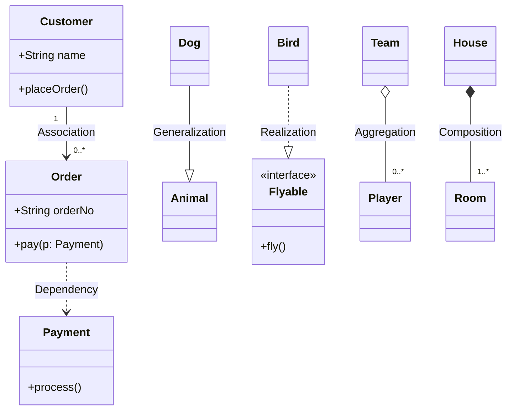
```mermaid
classDiagram
direction TB

class Customer {
  +String name
  +placeOrder()
}
class Order {
  +String orderNo
  +pay(p: Payment)
}
class Payment {
  +process()
}
class Animal
class Dog
class Flyable {
  <<interface>>
  +fly()
}
class Bird
class Team
class Player
class House
class Room

Customer "1" --> "0..*" Order : Association
Order ..> Payment : Dependency
Dog --|> Animal : Generalization
Bird ..|> Flyable : Realization
Team o-- "0..*" Player : Aggregation
House *-- "1..*" Room : Composition
```

**함정(3)**  
1) 연관 vs 의존: **필드면 연관 / 메서드(매개변수·지역변수)면 의존**  
2) 집합 vs 합성: **부분의 생명주기 독립=집합 / 종속=합성**  
3) 화살표 방향: **사용자→피사용자**, 상속/구현은 **자식→부모**

---

## 2. 객체 다이어그램 (Object Diagram)
**정의**: 특정 시점의 객체(인스턴스)와 링크를 스냅샷으로 표현

**필수 요소(3)**  
- Object(객체) / Slot(속성값) / Link(링크)

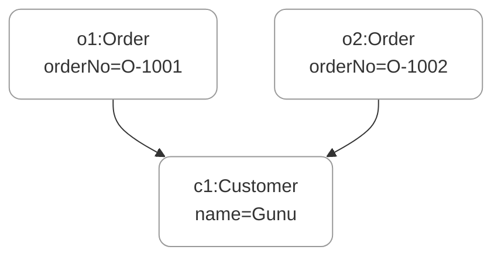
```mermaid
flowchart TB
  classDef obj fill:#ffffff,stroke:#999,stroke-width:1px,rx:10,ry:10;

  c1["c1:Customer<br/>name=Gunu"]:::obj
  o1["o1:Order<br/>orderNo=O-1001"]:::obj
  o2["o2:Order<br/>orderNo=O-1002"]:::obj

  o1 --> c1
  o2 --> c1
```

**함정(3)**  
1) 설계도가 아니라 **런타임 예시**  
2) 절차/흐름은 없음(활동/시퀀스로)  
3) 다중도 규칙은 클래스에서, 객체는 **실제 상태**

---

## 3. 컴포넌트 다이어그램 (Component Diagram)
**정의**: 배포/빌드 단위 모듈(컴포넌트) 간 의존 및 인터페이스 관계 표현

**필수 요소(3)**  
- Component(컴포넌트) / Provided(제공) / Required(요구)

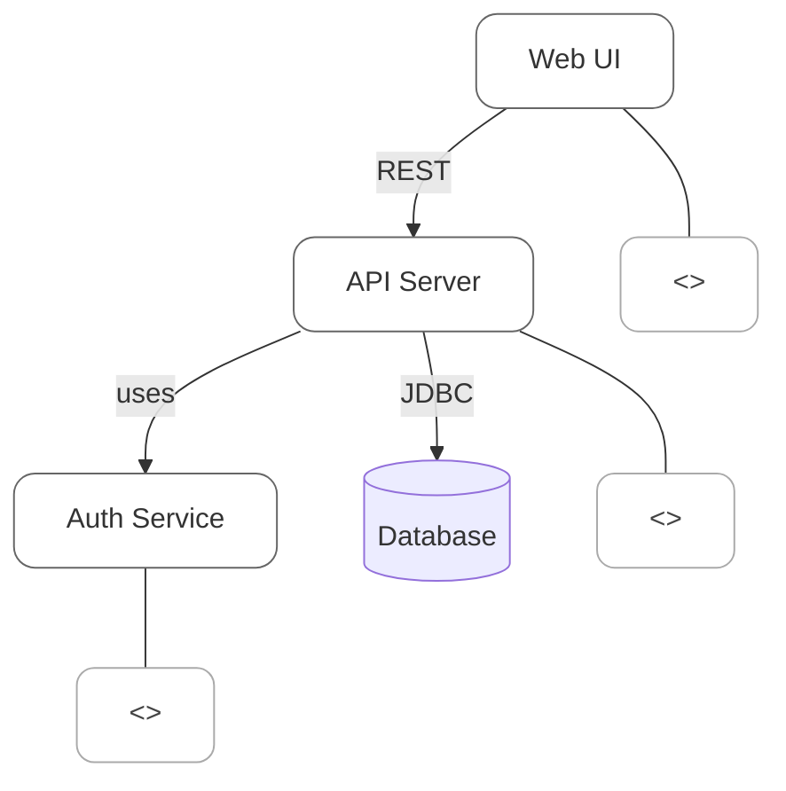
```mermaid
flowchart TB
  classDef c fill:#ffffff,stroke:#666,stroke-width:1px,rx:12,ry:12;
  classDef tag fill:#ffffff,stroke:#aaa,stroke-width:1px,rx:10,ry:10,color:#444;

  UI["Web UI"]:::c
  API["API Server"]:::c
  AUTH["Auth Service"]:::c
  DB[("Database")]

  t1["<<component>>"]:::tag
  t2["<<component>>"]:::tag
  t3["<<component>>"]:::tag

  UI --- t1
  API --- t2
  AUTH --- t3

  UI -->|"REST"| API
  API -->|"uses"| AUTH
  API -->|"JDBC"| DB
```

**함정(3)**  
1) 클래스(설계)와 다름 → 컴포넌트는 **모듈/배포 단위**  
2) 배치(물리 노드)와 혼동 금지  
3) 내부 클래스 구조는 클래스 다이어그램으로

---

## 4. 배치 다이어그램 (Deployment Diagram)
**정의**: 물리 노드(Node) 위에 소프트웨어(Artifact)가 어떻게 배치되는지 표현

**필수 요소(3)**  
- Node(노드) / Artifact(아티팩트) / Communication Path(통신 경로)

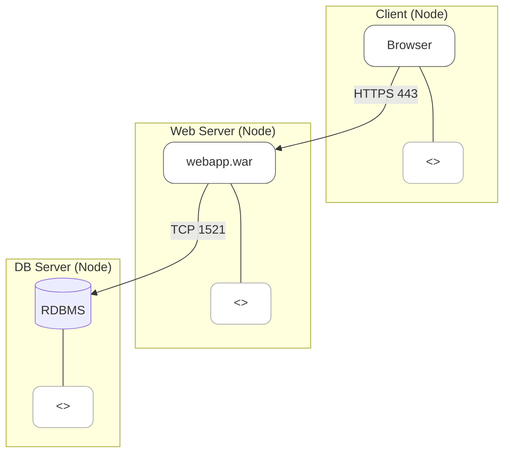
```mermaid
flowchart TB
  classDef n fill:#ffffff,stroke:#666,stroke-width:1px,rx:14,ry:14;
  classDef tag fill:#ffffff,stroke:#aaa,stroke-width:1px,rx:10,ry:10,color:#444;

  subgraph Client["Client (Node)"]
    B["Browser"]:::n
    aB["<<artifact>>"]:::tag
    B --- aB
  end

  subgraph Web["Web Server (Node)"]
    W["webapp.war"]:::n
    aW["<<artifact>>"]:::tag
    W --- aW
  end

  subgraph DBNode["DB Server (Node)"]
    D[("RDBMS")] 
    aD["<<artifact>>"]:::tag
    D --- aD
  end

  B -->|"HTTPS 443"| W
  W -->|"TCP 1521"| D
```

**함정(3)**  
1) 컴포넌트(모듈)와 다름 → 배치는 **물리 위치**  
2) 네트워크 상세 과다 금지(핵심 경로만)  
3) “어디에 배치되나”가 핵심

---

## 5. 패키지 다이어그램 (Package Diagram)
**정의**: 요소를 논리 묶음(패키지)으로 분리하고 의존 방향을 표현

**필수 요소(3)**  
- Package(패키지) / Dependency(의존) / Layering(레이어 규칙)

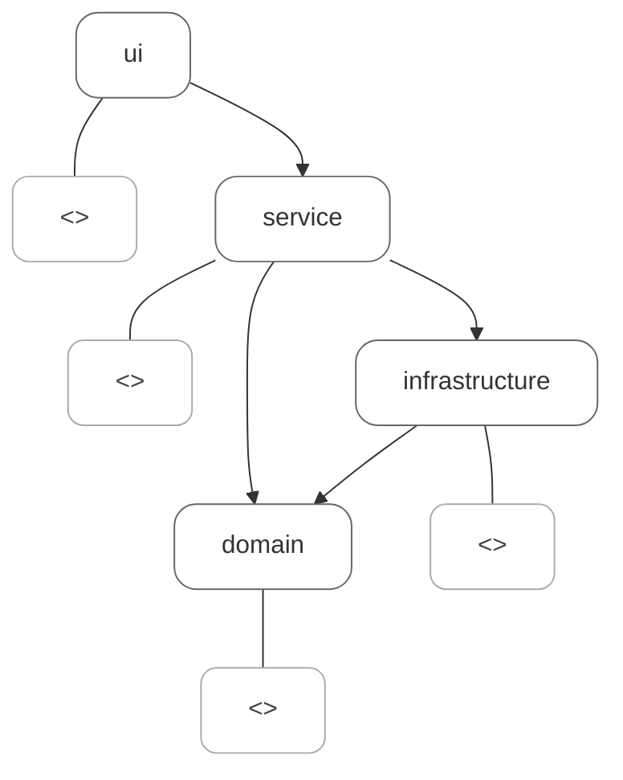
```mermaid
flowchart TB
  classDef p fill:#ffffff,stroke:#666,stroke-width:1px,rx:14,ry:14;
  classDef tag fill:#ffffff,stroke:#aaa,stroke-width:1px,rx:10,ry:10,color:#444;

  UI["ui"]:::p --- t1["<<package>>"]:::tag
  SVC["service"]:::p --- t2["<<package>>"]:::tag
  DOM["domain"]:::p --- t3["<<package>>"]:::tag
  INF["infrastructure"]:::p --- t4["<<package>>"]:::tag

  UI --> SVC
  SVC --> DOM
  SVC --> INF
  INF --> DOM
```

**함정(3)**  
1) 폴더 그림이 아니라 **의존 방향**이 핵심  
2) 순환 의존은 설계 냄새(시험 단골)  
3) 패키지로 클래스 설계를 대체 불가

---

## 6. 복합구조 다이어그램 (Composite Structure Diagram)
**정의**: 한 구조(클래스/컴포넌트) 내부의 Part/Port/Connector 연결을 표현

**필수 요소(3)**  
- Part(부품) / Port(포트) / Connector(커넥터)

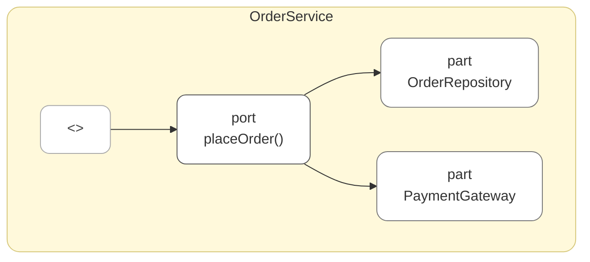
```mermaid
flowchart TB
  classDef boundary fill:#fff9db,stroke:#d6c77a,stroke-width:1px,rx:14,ry:14;
  classDef port fill:#ffffff,stroke:#555,stroke-width:1px,rx:10,ry:10;
  classDef part fill:#ffffff,stroke:#777,stroke-width:1px,rx:12,ry:12;
  classDef tag fill:#ffffff,stroke:#aaa,stroke-width:1px,rx:10,ry:10,color:#444;

  subgraph OS["OrderService"]
    style OS fill:#fff9db,stroke:#d6c77a,stroke-width:1px,rx:14,ry:14;

    T["<<composite>>"]:::tag
    P["port<br/>placeOrder()"]:::port
    R["part<br/>OrderRepository"]:::part
    G["part<br/>PaymentGateway"]:::part

    T --> P
    P --> R
    P --> G
  end
```

**함정(3)**  
1) 클래스 간 관계가 아니라 **내부 구조**  
2) 컴포넌트 다이어그램(모듈 간)과 다름  
3) 너무 상세하면 구현 문서화(핵심 part만)

---

## 7. 프로파일 다이어그램 (Profile Diagram)
**정의**: UML을 도메인에 맞게 스테레오타입/태그/제약으로 확장하는 규칙 표현

**필수 요소(3)**  
- Profile / Stereotype / Tagged Value(or Constraint)

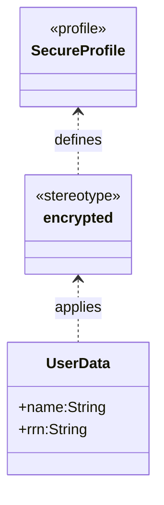
```mermaid
classDiagram
class SecureProfile {
  <<profile>>
}
class encrypted {
  <<stereotype>>
}
class UserData {
  +name:String
  +rrn:String
}
SecureProfile <.. encrypted : defines
encrypted <.. UserData : applies
```

**함정(3)**  
1) “설계 그림”이 아니라 **확장 규칙**  
2) 스테레오타입 남발 금지  
3) 표준/합의 없이 쓰면 혼란

---

> [!abstract] 동적(행위) 다이어그램 7개
> - 시간 흐름에 따른 **동작/상태/상호작용**

# 2) 동적(행위) 다이어그램 7개

## 8. 유스케이스 다이어그램 (Use Case Diagram)
**정의**: 액터와 유스케이스의 관계로 요구사항(무엇을)을 표현

**필수 요소(3)**  
- Actor / Use Case / System Boundary

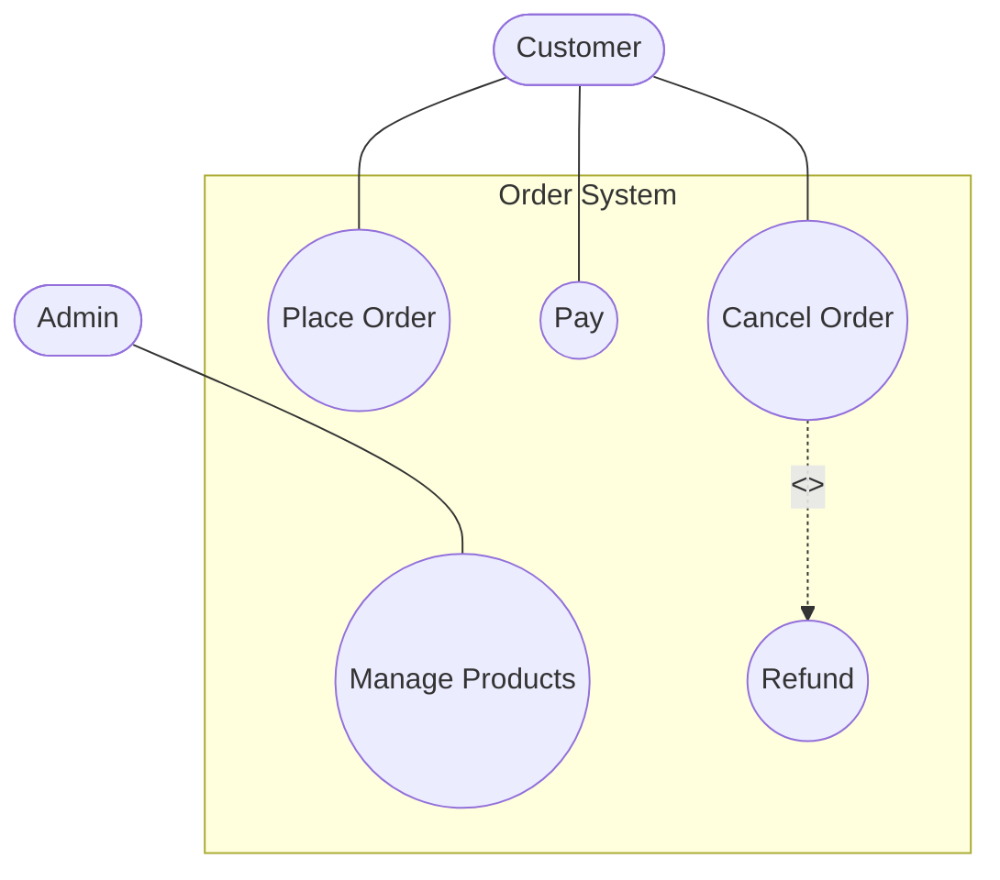
```mermaid
flowchart TB
  C([Customer])
  A([Admin])

  subgraph SYS["Order System"]
    UC1((Place Order))
    UC2((Pay))
    UC3((Cancel Order))
    UC4((Manage Products))
    UC5((Refund))
  end

  C --- UC1
  C --- UC2
  C --- UC3
  A --- UC4
  UC3 -.->|<<include>>| UC5
```

---

## 9. 활동 다이어그램 (Activity Diagram)
**정의**: 처리 절차의 흐름(분기/병렬/동기화)을 표현

**필수 요소(3)**  
- Action / Decision-Merge / Start-End

**Fork/Join**: 병렬 시작/동기화(굵은 막대가 교재 표준 기호)

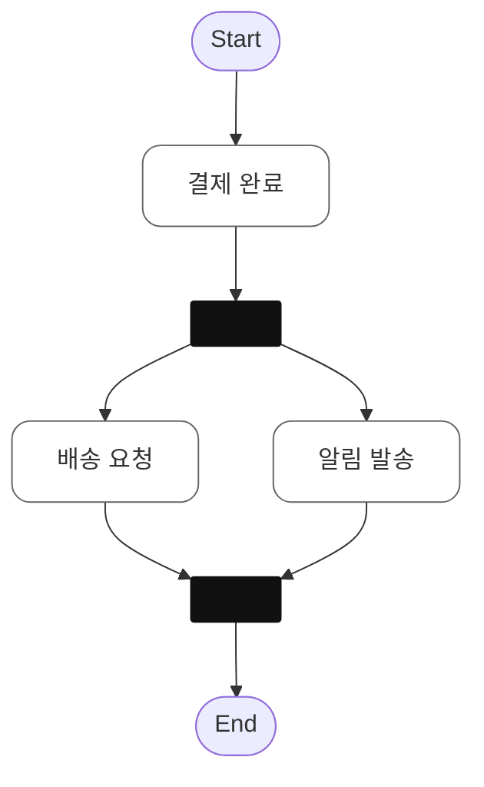
```mermaid
flowchart TB
  classDef act fill:#ffffff,stroke:#666,stroke-width:1px,rx:12,ry:12;
  classDef bar fill:#111,stroke:#111,color:#111,rx:2,ry:2;

  S([Start]) --> A[결제 완료]:::act
  A --> F[" "]:::bar
  F --> D[배송 요청]:::act
  F --> N[알림 발송]:::act
  D --> J[" "]:::bar
  N --> J
  J --> E([End])
```

---

## 10. 상태 다이어그램 (State Machine Diagram)
**정의**: 객체의 상태와 전이를 표현(이벤트/가드/액션)

**필수 요소(3)**  
- State / Transition / Event

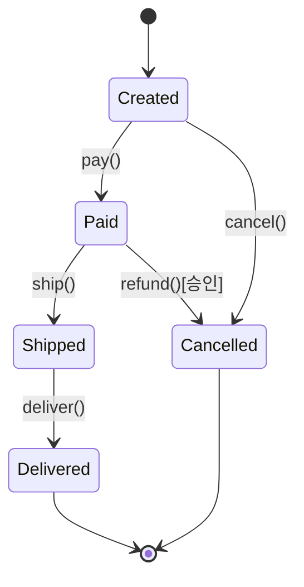
```mermaid
stateDiagram-v2
  [*] --> Created
  Created --> Paid : pay()
  Paid --> Shipped : ship()
  Shipped --> Delivered : deliver()
  Created --> Cancelled : cancel()
  Paid --> Cancelled : refund()[승인]
  Delivered --> [*]
  Cancelled --> [*]
```

---

## 11. 시퀀스 다이어그램 (Sequence Diagram)
**정의**: 시간 흐름에 따른 참여자 간 메시지 순서를 표현

**필수 요소(3)**  
- Participant / Lifeline / Message

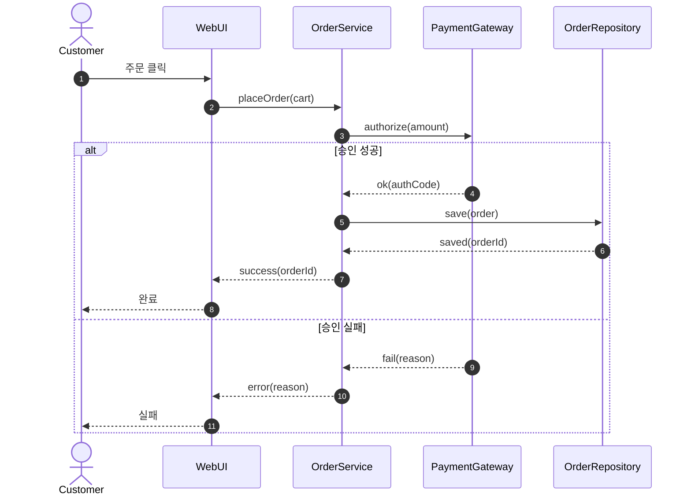
```mermaid
sequenceDiagram
  autonumber
  actor C as Customer
  participant UI as WebUI
  participant S as OrderService
  participant P as PaymentGateway
  participant R as OrderRepository

  C->>UI: 주문 클릭
  UI->>S: placeOrder(cart)
  S->>P: authorize(amount)

  alt 승인 성공
    P-->>S: ok(authCode)
    S->>R: save(order)
    R-->>S: saved(orderId)
    S-->>UI: success(orderId)
    UI-->>C: 완료
  else 승인 실패
    P-->>S: fail(reason)
    S-->>UI: error(reason)
    UI-->>C: 실패
  end
```

---

## 12. 커뮤니케이션 다이어그램 (Communication Diagram)
**정의**: 연결 구조 중심 + 메시지 번호로 순서를 표현

**필수 요소(3)**  
- Object / Link / Message Numbering

**병렬 의미**: 커뮤니케이션에서는 보통 번호로 설명(예: `1.3a/1.3b`)  
※ Fork/Join “막대”는 **활동 다이어그램 표준 기호**

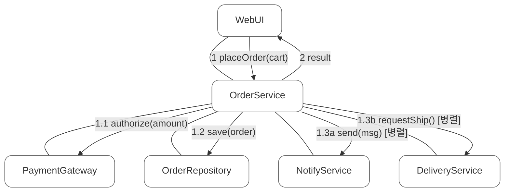
```mermaid
flowchart TB
  classDef n fill:#ffffff,stroke:#666,stroke-width:1px,rx:12,ry:12;

  UI[WebUI]:::n
  S[OrderService]:::n
  P[PaymentGateway]:::n
  R[OrderRepository]:::n
  N[NotifyService]:::n
  D[DeliveryService]:::n

  UI --- S
  S --- P
  S --- R
  S --- N
  S --- D

  UI -->|"1 placeOrder(cart)"| S
  S -->|"1.1 authorize(amount)"| P
  S -->|"1.2 save(order)"| R
  S -->|"1.3a send(msg) [병렬]"| N
  S -->|"1.3b requestShip() [병렬]"| D
  S -->|"2 result"| UI
```

---

## 13. 타이밍 다이어그램 (Timing Diagram)
**정의**: 시간축에 따라 상태/값이 변하는 모습을 표현

**필수 요소(3)**  
- Time Axis / State(or Value) / Change Point

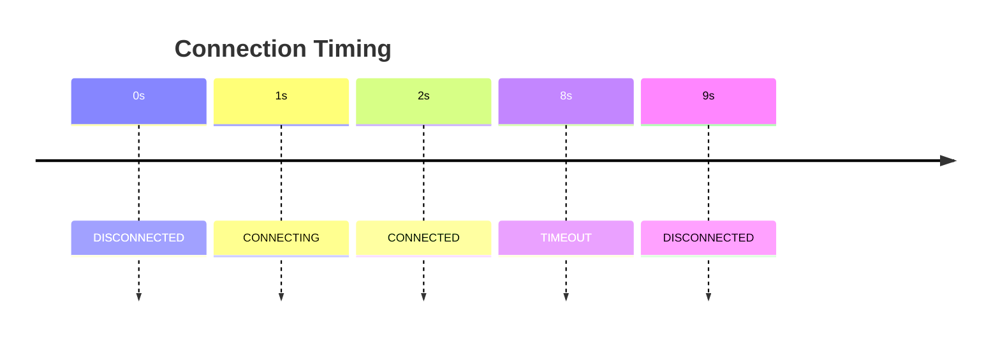
```mermaid
timeline
  title Connection Timing
  0s : DISCONNECTED
  1s : CONNECTING
  2s : CONNECTED
  8s : TIMEOUT
  9s : DISCONNECTED
```

---

## 14. 상호작용 개요 다이어그램 (Interaction Overview Diagram)
**정의**: 여러 상호작용(시퀀스/커뮤니케이션)을 활동처럼 묶어 큰 흐름을 표현

**필수 요소(3)**  
- Interaction Node / Decision-Merge / Start-End

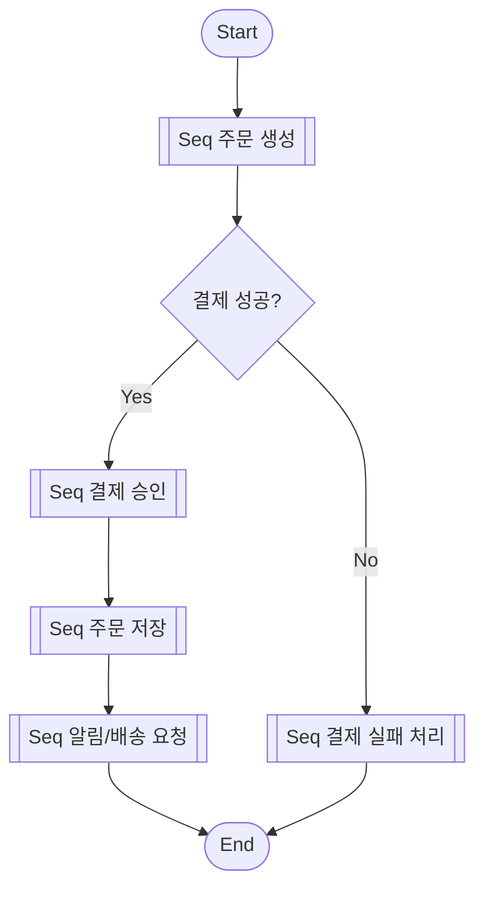
```mermaid
flowchart TB
  A([Start]) --> B[[Seq 주문 생성]]
  B --> C{결제 성공?}

  C -- Yes --> D[[Seq 결제 승인]]
  D --> E[[Seq 주문 저장]]
  E --> F[[Seq 알림/배송 요청]]
  F --> Z([End])

  C -- No --> X[[Seq 결제 실패 처리]]
  X --> Z
```

---

## (추가) “누락되기 쉬운 포인트” 한 줄 정리

- **Composite Structure / Profile / Interaction Overview / Timing** 이 4개가 제일 소외됨.
    
- 감리사 시험 체감상 출제 비중은 **Class / UseCase / Sequence / Activity / State**가 압도적.
    


## 🔷 UML 2.x 다이어그램 통합 정리표 (총 14개)

| 구분  | 다이어그램                        | 약어  | 핵심 역할           | 시험 키워드               |
| --- | ---------------------------- | --- | --------------- | -------------------- |
| 구조  | Class Diagram                | CD  | 클래스 구조 정의       | 상속, 연관               |
| 구조  | Object Diagram               | OD  | 객체 인스턴스 관계      | 런타임 상태               |
| 구조  | Component Diagram            | CMP | 컴포넌트 구조         | 배포 전 구조              |
| 구조  | Composite Structure Diagram  | CSD | 내부 구성 구조        | 내부 포트                |
| 구조  | Package Diagram              | PKG | 모델 그룹화          | 계층 구조                |
| 구조  | Deployment Diagram           | DD  | 물리적 배치          | 노드, 서버               |
| 행위  | Use Case Diagram             | UC  | 사용자-시스템 상호작용    | 요구 모델                |
| 행위  | Activity Diagram             | ACT | 작업 흐름           | 병렬 처리                |
| 행위  | State Machine Diagram        | STM | 상태 전이           | 이벤트                  |
| 행위  | Sequence Diagram             | SD  | 시간 순 메시지 흐름     | 생명선                  |
| 행위  | Communication Diagram        | COM | 객체 간 관계 중심 상호작용 | 번호 기반                |
| 행위  | Interaction Overview Diagram | IOD | 상호작용 흐름 제어      | Activity+Interaction |
| 행위  | Timing Diagram               | TD  | 시간 축 기반 상태 변화   | 실시간                  |
| 행위  | Interaction Diagram (상위 개념)  | -   | 상호작용 다이어그램 그룹   | SD/COM 포함            |

# (5) SysML

## 1) Requirement Diagram (REQ) — 요구사항/추적의 핵심

- SysML 전용, 시험에서 “추적(Traceability)” 관계를 자주 물음
    
- 자주 쓰는 관계: 
    
    - **deriveReqt**(파생), **refine**(정제), **satisfy**(만족: 설계/블록이 요구를 만족), **verify**(검증: 테스트가 요구를 검증), **trace**(추적)
        

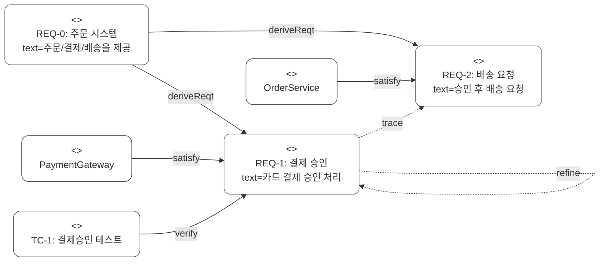
```mermaid
flowchart LR
  classDef req fill:#fff,stroke:#666,rx:10,ry:10;
  classDef blk fill:#fff,stroke:#444,rx:12,ry:12;
  classDef test fill:#fff,stroke:#444,rx:12,ry:12;

  R0["<<requirement>>\nREQ-0: 주문 시스템\ntext=주문/결제/배송을 제공"]:::req
  R1["<<requirement>>\nREQ-1: 결제 승인\ntext=카드 결제 승인 처리"]:::req
  R2["<<requirement>>\nREQ-2: 배송 요청\ntext=승인 후 배송 요청"]:::req

  B1["<<block>>\nOrderService"]:::blk
  B2["<<block>>\nPaymentGateway"]:::blk
  T1["<<testCase>>\nTC-1: 결제승인 테스트"]:::test

  R0 -->|deriveReqt| R1
  R0 -->|deriveReqt| R2

  B1 -->|satisfy| R2
  B2 -->|satisfy| R1

  T1 -->|verify| R1

  R1 -.->|trace| R2
  R1 -.->|refine| R1
```

**시험에서 자주 나오는 포인트**

- “설계요소가 요구를 **만족**” = `satisfy`
    
- “테스트가 요구를 **검증**” = `verify`
    

---

## 2) Block Definition Diagram (BDD) — SysML의 “클래스 다이어그램 대체”

- UML Class Diagram 확장/대체 성격
    
- Block(블록) = 시스템 구성요소(하드/소프트/인력/데이터 등 다 포함 가능)
    

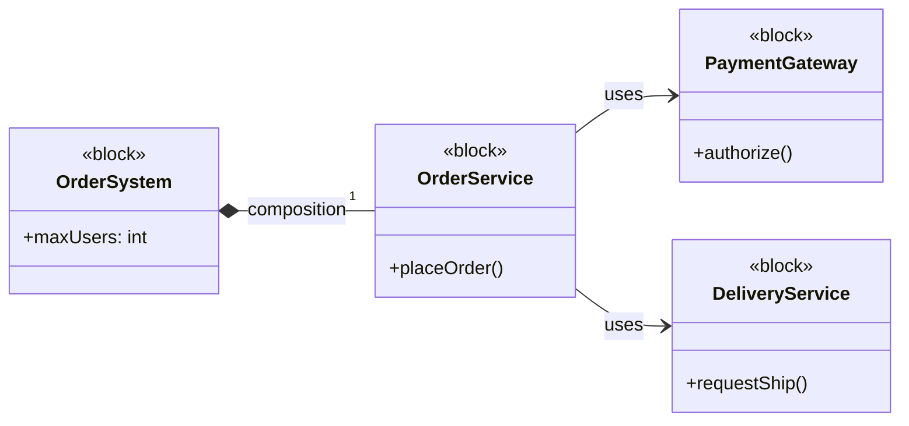
```mermaid
classDiagram
direction LR

class OrderSystem {
  <<block>>
  +maxUsers: int
}
class OrderService {
  <<block>>
  +placeOrder()
}
class PaymentGateway {
  <<block>>
  +authorize()
}
class DeliveryService {
  <<block>>
  +requestShip()
}

OrderSystem *-- "1" OrderService : composition
OrderService --> PaymentGateway : uses
OrderService --> DeliveryService : uses
```

**포인트**

- BDD는 “타입/구조(블록 정의)”
    
- “내부 연결(포트/흐름)”은 다음 IBD로 간다.
    

---

## 3) Internal Block Diagram (IBD) — 블록 내부 “파트/포트/흐름” 연결

- SysML 전용, UML Composite Structure 확장
    
- 구성요소(Part) + 포트(Port) + 흐름(Item Flow)을 보여주는 게 핵심
    

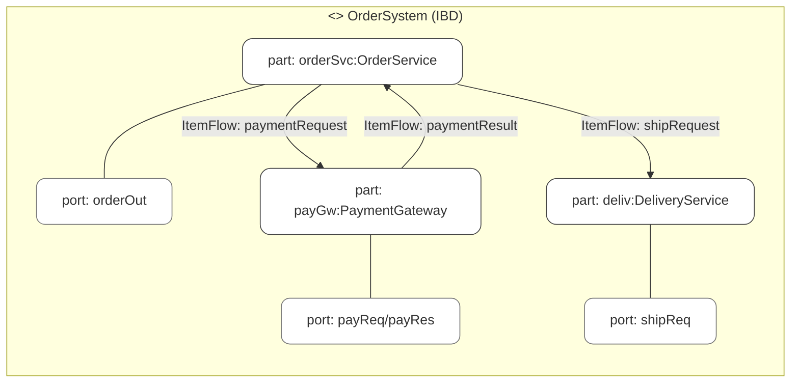
```mermaid
flowchart TB
  classDef part fill:#fff,stroke:#444,rx:12,ry:12;
  classDef port fill:#fff,stroke:#777,rx:10,ry:10;

  subgraph OS["<<block>> OrderSystem (IBD)"]
    direction TB

    p1["part: orderSvc:OrderService"]:::part
    p2["part: payGw:PaymentGateway"]:::part
    p3["part: deliv:DeliveryService"]:::part

    oPort["port: orderOut"]:::port
    payPort["port: payReq/payRes"]:::port
    shipPort["port: shipReq"]:::port

    p1 --- oPort
    p2 --- payPort
    p3 --- shipPort

    p1 -->|ItemFlow: paymentRequest| p2
    p2 -->|ItemFlow: paymentResult| p1
    p1 -->|ItemFlow: shipRequest| p3
  end
```

**시험 포인트**

- “블록 **정의**”는 BDD, “블록 **내부 배선/흐름**”은 IBD
    
- IBD에서 **포트/흐름** 키워드 나오면 거의 정답.
    

---

## 4) Parametric Diagram (PAR) — 제약식(Constraint)로 성능/공학 계산

- SysML 전용
    
- 핵심은 **Constraint Block(제약 블록)** + **바인딩(binding) 연결**로 “변수들이 수식으로 묶인다”를 보여주는 것
    

예: 응답시간 `T = Proc + Net`

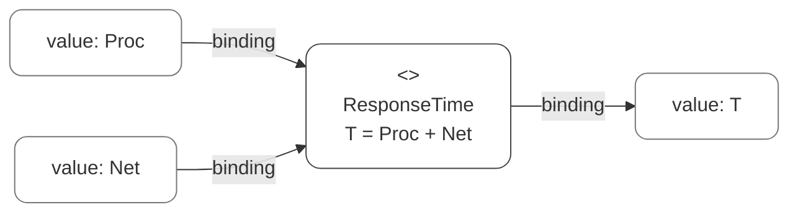
```mermaid
flowchart LR
  classDef c fill:#fff,stroke:#444,rx:12,ry:12;
  classDef v fill:#fff,stroke:#777,rx:10,ry:10;

  CB["<<constraint>>\nResponseTime\nT = Proc + Net"]:::c

  T["value: T"]:::v
  Proc["value: Proc"]:::v
  Net["value: Net"]:::v

  Proc -->|binding| CB
  Net -->|binding| CB
  CB -->|binding| T
```

**시험 포인트**

- PAR은 “다이어그램이 계산한다”기보다 **제약/수식을 모델에 박아 추적 가능**하게 만드는 용도.
    

---

## 5) 나머지 5개는 “UML과 거의 동일”이라 그림은 네 UML꺼 그대로 써도 됨

네 파일 표에서도 SysML에서 **ACT/SD/STM/UC/PKG는 UML 공통(거의 동일)**로 정리돼 있음

- Package Diagram (PKG) = UML 패키지와 동일
    
- Activity / Sequence / State Machine / Use Case = UML 그림 그대로 사용
    

---

원하면, 지금 네가 정리한 “UML 14개 한 장 정리” 스타일에 맞춰서 **SysML도 ‘9개 한 장 통합(그림 4개+표 1개)’**로 딱 맞춰서 재배치해줄게. (REQ/BDD/IBD/PAR만 제대로 잡아도 SysML은 시험에서 거의 커버됨)

---

## 5) 나머
## 🔷 SysML 9개 다이어그램 통합 정리표 (UML2 비교 포함)

| 구분  | 다이어그램                    | 약어  | 핵심 역할       | UML2 존재 여부 | SysML에서 변경 여부          | 시험 포인트   |
| --- | ------------------------ | --- | ----------- | ---------- | ---------------------- | -------- |
| 구조  | Block Definition Diagram | BDD | 시스템 블록 정의   | ❌          | Class Diagram 확장/대체    | Class 대체 |
| 구조  | Internal Block Diagram   | IBD | 블록 내부 연결/포트 | ❌          | Composite Structure 확장 | 포트/흐름    |
| 구조  | Package Diagram          | PKG | 모델 구성 정리    | ✅          | 거의 동일                  | UML 공통   |
| 구조  | Parametric Diagram       | PAR | 제약식/수식 표현   | ❌          | SysML 전용               | 성능/공학 계산 |
| 행위  | Activity Diagram         | ACT | 프로세스 흐름     | ✅          | 토큰/객체 흐름 강화            | UML 공통   |
| 행위  | Sequence Diagram         | SD  | 메시지 상호작용    | ✅          | 거의 동일                  | UML 공통   |
| 행위  | State Machine Diagram    | STM | 상태 전이       | ✅          | 거의 동일                  | UML 공통   |
| 행위  | Use Case Diagram         | UC  | 요구 상호작용     | ✅          | 거의 동일                  | UML 공통   |
| 요구  | Requirement Diagram      | REQ | 요구사항 정의/추적  | ❌          | SysML 전용               | SysML 핵심 |


# 📘 ✅ SOLID 원칙 (객체지향 설계 5대 원칙)

> 제안: **Robert C. Martin (Uncle Bob)**

---

## 1️⃣ S — **단일 책임 원칙 (SRP, Single Responsibility Principle)**

**정의**

> 하나의 클래스는 **오직 하나의 변경 이유(Responsibility)** 만 가져야 한다.

**핵심 키워드**

- 변경 이유 1개
    
- 역할 분리
    
- 응집도(High Cohesion) 향상
    

**잘못된 예**

- 주문 클래스가 결제 + DB저장 + 이메일 발송 다 함
    

**의도**

- 변경 영향 최소화
    
- 유지보수 용이성 증가
    

---

## 2️⃣ O — **개방-폐쇄 원칙 (OCP, Open-Closed Principle)**

**정의**

> 확장(Extension)에는 열려 있고, 수정(Modification)에는 닫혀 있어야 한다. (변하는것과 변하지 않는것 분리)

**핵심 키워드**

- 기존 코드 수정 X
    
- 인터페이스 / 추상화 사용
    
- 다형성(Polymorphism)
    

**예시**

```java
interface DiscountPolicy { 
    int discount(int price);
}
```

새 할인 정책 추가 시 기존 코드 수정 없이 구현 클래스만 추가

---

## 3️⃣ L — **리스코프 치환 원칙 (LSP, Liskov Substitution Principle)**

**정의**

> 자식 클래스는 부모 클래스를 대체(Substitute)할 수 있어야 한다.

**핵심 키워드**

- 행위 일관성
    
- 계약(Contract) 유지
    
- 오버라이딩 시 규약 위반 금지
    

**대표 사례**

- `Rectangle`을 상속한 `Square` 문제
    

**시험 포인트**

- "부모 타입으로 참조 가능해야 한다"
    
- "기능 축소 금지"
    

---

## 4️⃣ I — **인터페이스 분리 원칙 (ISP, Interface Segregation Principle)**

**정의**

> 클라이언트는 사용하지 않는 인터페이스에 의존하면 안 된다.

**핵심 키워드**

- 인터페이스 분리
    
- Fat Interface 지양
    
- 필요한 기능만 제공
    

**예시**

- 프린터 인터페이스에 scan(), fax() 다 넣지 말고 분리
    

---

## 5️⃣ D — **의존 역전 원칙 (DIP, Dependency Inversion Principle)**

**정의**

> 고수준(잘 바뀌지 않는것) 모듈은 저수준 모듈에 의존하면 안 되고,  
> 둘 다 **추상화(Abstraction)** 에 의존해야 한다.

**핵심 키워드**

- 구현체 → 인터페이스 의존
    
- DI (Dependency Injection)
    
- 결합도 감소
    

**잘못된 예**

```java
OrderService service = new OrderRepository();  // 구현체 직접 의존
```

**올바른 예**

```java
OrderService service = new OrderService(OrderRepositoryInterface repo);
```

---

# 🔥 한눈에 암기표

|원칙|한글명|영어명|핵심 포인트|
|---|---|---|---|
|S|단일 책임|Single Responsibility|변경 이유 1개|
|O|개방-폐쇄|Open-Closed|확장 O, 수정 X|
|L|리스코프 치환|Liskov Substitution|자식은 부모 대체 가능|
|I|인터페이스 분리|Interface Segregation|불필요 의존 제거|
|D|의존 역전|Dependency Inversion|추상화에 의존|

---

# 🎯 감리사 시험 포인트

- 설계 품질 개선 원칙
    
- 객체지향 설계 평가 항목
    
- OCP ↔ DIP 같이 묻는 문제 자주 출제
    
- LSP는 “치환 가능성” 키워드 나오면 바로 반응
    


---

# GoF 23 Design Patterns + UML

## 1) Creational (생성) — “어떻게 만들까?”

---

## 1. Singleton

- **의도**: 인스턴스 1개만 생성, 전역 접근점 제공
    
- **언제**: 설정/로그/커넥션풀 등 공유 자원
    
- **주의**: 테스트 어려움, 전역 상태(남용 금지)
    

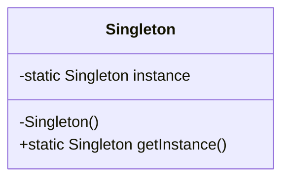
```mermaid
classDiagram
class Singleton {
  -Singleton()
  -static Singleton instance
  +static Singleton getInstance()
}
```

---

## 2. Factory Method

- **의도**: “무슨 객체를 만들지”를 서브클래스가 결정
    
- **언제**: 생성 로직 분기(if/switch)를 Creator 밖으로 밀어냄
    
- **키워드**: Creator의 `factoryMethod()` / Product 추상화
    

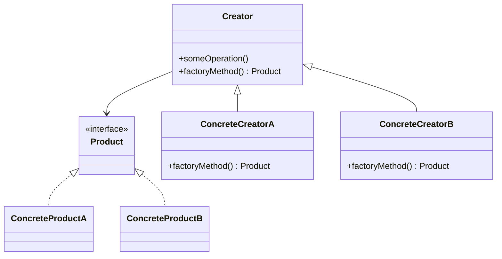
```mermaid
classDiagram
class Product
<<interface>> Product
class ConcreteProductA
class ConcreteProductB
Product <|.. ConcreteProductA
Product <|.. ConcreteProductB

class Creator {
  +someOperation()
  +factoryMethod() Product
}
class ConcreteCreatorA {
  +factoryMethod() Product
}
class ConcreteCreatorB {
  +factoryMethod() Product
}
Creator <|-- ConcreteCreatorA
Creator <|-- ConcreteCreatorB
Creator --> Product
```

---

## 3. Abstract Factory

- **의도**: 서로 관련된 객체군(제품군)을 “일관되게” 생성
    
- **언제**: UI 테마(Windows/Mac), DB 드라이버 세트 등
    
- **키워드**: Factory가 여러 create 메서드 제공
    

```mermaid
classDiagram
class AbstractFactory{
  +createA() AbstractProductA
  +createB() AbstractProductB
}
class ConcreteFactory1{
  +createA() AbstractProductA
  +createB() AbstractProductB
}
class ConcreteFactory2{
  +createA() AbstractProductA
  +createB() AbstractProductB
}
AbstractFactory <|-- ConcreteFactory1
AbstractFactory <|-- ConcreteFactory2

class AbstractProductA
<<interface>> AbstractProductA
class AbstractProductB
<<interface>> AbstractProductB
class ProductA1
class ProductA2
class ProductB1
class ProductB2
AbstractProductA <|.. ProductA1
AbstractProductA <|.. ProductA2
AbstractProductB <|.. ProductB1
AbstractProductB <|.. ProductB2

ConcreteFactory1 --> ProductA1
ConcreteFactory1 --> ProductB1
ConcreteFactory2 --> ProductA2
ConcreteFactory2 --> ProductB2
```

---

## 4. Builder

- **의도**: 복잡한 객체 생성 과정을 단계로 분리(조립)
    
- **언제**: 생성 옵션 많고 순서가 있는 경우 (예: 문서/리포트 생성)
    
- **키워드**: Director(선택) + Builder + Product
    

```mermaid
classDiagram
class Director{
  +construct()
}
class Builder{
  <<interface>>
  +buildPartA()
  +buildPartB()
  +getResult() Product
}
class ConcreteBuilder{
  +buildPartA()
  +buildPartB()
  +getResult() Product
}
Builder <|.. ConcreteBuilder
Director --> Builder

class Product
ConcreteBuilder --> Product
```

---

## 5. Prototype

- **의도**: 기존 객체를 복제해서 새 객체 생성
    
- **언제**: 생성 비용이 크거나, 런타임에 타입이 결정될 때
    
- **키워드**: `clone()` / 깊은복사 vs 얕은복사 주의
    

```mermaid
classDiagram
class Prototype{
  <<interface>>
  +clone() Prototype
}
class ConcretePrototype{
  +clone() Prototype
}
Prototype <|.. ConcretePrototype
```

---

## 2) Structural (구조) — “어떻게 붙일까?”

---

## 6. Adapter

- **의도**: 호환되지 않는 인터페이스를 변환
    
- **언제**: 레거시/외부 라이브러리 연동
    
- **키워드**: Target(원하는 인터페이스) / Adaptee(기존)
    

```mermaid
classDiagram
class Target{
  <<interface>>
  +request()
}
class Adaptee{
  +specificRequest()
}
class Adapter{
  -adaptee: Adaptee
  +request()
}
Target <|.. Adapter
Adapter --> Adaptee
```

---

## 7. Bridge

- **의도**: 추상(Abstraction)과 구현(Implementation)을 분리해 독립 확장
    
- **언제**: 기능 축과 구현 축이 둘 다 자주 변할 때(조합 폭발 방지)
    
- **키워드**: Abstraction has-a Implementor
    

```mermaid
classDiagram
class Implementor{
  <<interface>>
  +operationImpl()
}
class ConcreteImplementorA
class ConcreteImplementorB
Implementor <|.. ConcreteImplementorA
Implementor <|.. ConcreteImplementorB

class Abstraction{
  -impl: Implementor
  +operation()
}
class RefinedAbstraction{
  +operation()
}
Abstraction <|-- RefinedAbstraction
Abstraction --> Implementor
```

---

## 8. Composite

- **의도**: 부분-전체(트리) 구조를 동일 인터페이스로 다룸
    
- **언제**: 폴더/파일, UI 컴포넌트 트리
    
- **키워드**: Leaf/Composite 둘 다 Component를 구현
    

```mermaid
classDiagram
class Component{
  <<interface>>
  +operation()
}
class Leaf{
  +operation()
}
class Composite{
  -children: List~Component~
  +add(c:Component)
  +remove(c:Component)
  +operation()
}
Component <|.. Leaf
Component <|.. Composite
Composite o--> Component
```

---

## 9. Decorator

- **의도**: 상속 대신 “감싸서” 기능을 동적으로 추가
    
- **언제**: 옵션 조합이 많을 때(음료 토핑처럼)
    
- **키워드**: Decorator도 Component를 구현하고 Component를 가진다
    

```mermaid
classDiagram
class Component{
  <<interface>>
  +operation()
}
class ConcreteComponent{
  +operation()
}
Component <|.. ConcreteComponent

class Decorator{
  <<abstract>>
  -wrappee: Component
  +operation()
}
Component <|.. Decorator
Decorator --> Component

class ConcreteDecoratorA{
  +operation()
}
class ConcreteDecoratorB{
  +operation()
}
Decorator <|-- ConcreteDecoratorA
Decorator <|-- ConcreteDecoratorB
```

---

## 10. Facade

- **의도**: 복잡한 서브시스템에 단순한 창구 제공
    
- **언제**: 라이브러리/서브시스템 사용 단순화, 결합도 감소
    
- **키워드**: Facade가 내부 클래스들을 조율
    

```mermaid
classDiagram
class Facade{
  +doWork()
}
class SubsystemA{
  +a()
}
class SubsystemB{
  +b()
}
class SubsystemC{
  +c()
}
Facade --> SubsystemA
Facade --> SubsystemB
Facade --> SubsystemC
```

---

## 11. Flyweight

- **의도**: 공통 상태(내재/Intrinsic)를 공유해 메모리 절약
    
- **언제**: 엄청 많은 유사 객체(문자, 타일, 입자 등)
    
- **키워드**: 공유되는 것(내재) vs 호출 시 주는 것(외재/Extrinsic)
    

```mermaid
classDiagram
class Flyweight{
  <<interface>>
  +operation(extrinsicState)
}
class ConcreteFlyweight{
  -intrinsicState
  +operation(extrinsicState)
}
Flyweight <|.. ConcreteFlyweight

class FlyweightFactory{
  -pool: Map
  +get(key) Flyweight
}
FlyweightFactory --> Flyweight
```

---

## 12. Proxy

- **의도**: 실제 객체(RealSubject) 대신 대리 객체가 접근 제어
    
- **언제**: Lazy loading, 접근 권한, 원격 호출, 캐싱
    
- **키워드**: Proxy가 RealSubject를 보유
    

```mermaid
classDiagram
class Subject{
  <<interface>>
  +request()
}
class RealSubject{
  +request()
}
class Proxy{
  -real: RealSubject
  +request()
}
Subject <|.. RealSubject
Subject <|.. Proxy
Proxy --> RealSubject
```

---

## 3) Behavioral (행위) — “어떻게 협력할까?”

---

## 13. Chain of Responsibility

- **의도**: 요청을 처리할 객체를 체인으로 연결, 못하면 다음에게 전달
    
- **언제**: 필터 체인, 승인 라인, 이벤트 처리 파이프
    
- **키워드**: `nextHandler` / “넘긴다”
    

```mermaid
classDiagram
class Handler{
  <<abstract>>
  -next: Handler
  +setNext(h:Handler) Handler
  +handle(req)
}
class ConcreteHandlerA{
  +handle(req)
}
class ConcreteHandlerB{
  +handle(req)
}
Handler <|-- ConcreteHandlerA
Handler <|-- ConcreteHandlerB
Handler --> Handler : next
```

---

## 14. Command

- **의도**: “요청”을 객체로 캡슐화(Undo/Queue/Log 가능)
    
- **언제**: 버튼/메뉴 액션, 작업 큐, 트랜잭션/되돌리기
    
- **키워드**: Invoker(호출자) / Receiver(실행 주체)
    

```mermaid
classDiagram
class Command{
  <<interface>>
  +execute()
}
class ConcreteCommand{
  -receiver: Receiver
  +execute()
}
Command <|.. ConcreteCommand

class Invoker{
  -cmd: Command
  +setCommand(c:Command)
  +run()
}
class Receiver{
  +action()
}
Invoker --> Command
ConcreteCommand --> Receiver
```

---

## 15. Interpreter

- **의도**: 간단한 언어/규칙을 문법 트리로 해석
    
- **언제**: 규칙 엔진, 간단한 DSL, 수식 해석
    
- **키워드**: Expression 트리 / Context
    

```mermaid
classDiagram
class Context

class AbstractExpression{
  <<interface>>
  +interpret(ctx:Context)
}
class TerminalExpression{
  +interpret(ctx)
}
class NonterminalExpression{
  -left: AbstractExpression
  -right: AbstractExpression
  +interpret(ctx)
}
AbstractExpression <|.. TerminalExpression
AbstractExpression <|.. NonterminalExpression
NonterminalExpression --> AbstractExpression
```

---

## 16. Iterator

- **의도**: 내부 구조 노출 없이 순회
    
- **언제**: 컬렉션 순회 로직을 분리
    
- **키워드**: `hasNext()/next()`
    

```mermaid
classDiagram
class Iterator{
  <<interface>>
  +hasNext() bool
  +next() Item
}
class ConcreteIterator{
  -collection: ConcreteAggregate
  -index:int
  +hasNext()
  +next()
}
Iterator <|.. ConcreteIterator

class Aggregate{
  <<interface>>
  +createIterator() Iterator
}
class ConcreteAggregate{
  -items: List~Item~
  +createIterator()
}
Aggregate <|.. ConcreteAggregate
ConcreteAggregate --> Iterator
ConcreteIterator --> ConcreteAggregate
```

---

## 17. Mediator

- **의도**: 객체 간 직접 통신을 중재자(Mediator)로 몰아 결합도 감소
    
- **언제**: UI 위젯 상호작용, 복잡한 협업 로직
    
- **키워드**: Colleague ↔ Mediator
    

```mermaid
classDiagram
class Mediator{
  <<interface>>
  +notify(sender, event)
}
class ConcreteMediator{
  -c1: Colleague1
  -c2: Colleague2
  +notify(sender,event)
}
Mediator <|.. ConcreteMediator

class Colleague{
  <<abstract>>
  -mediator: Mediator
}
class Colleague1
class Colleague2
Colleague <|-- Colleague1
Colleague <|-- Colleague2
Colleague --> Mediator
```

---

## 18. Memento

- **의도**: 객체 상태를 캡슐화해 저장/복구(Undo)
    
- **언제**: 되돌리기, 체크포인트
    
- **키워드**: Originator(상태 보유) / Memento(스냅샷) / Caretaker(보관)
    

```mermaid
classDiagram
class Memento{
  -state
}
class Originator{
  -state
  +save() Memento
  +restore(m:Memento)
}
class Caretaker{
  -history: Stack~Memento~
  +backup()
  +undo()
}
Originator --> Memento
Caretaker --> Memento
Caretaker --> Originator
```

---

## 19. Observer

- **의도**: 상태 변화 시 구독자에게 자동 통지(1:N)
    
- **언제**: 이벤트 시스템, UI 갱신, Pub/Sub
    
- **키워드**: Subject가 Observer 리스트 관리
    

```mermaid
classDiagram
class Subject{
  <<interface>>
  +attach(o:Observer)
  +detach(o:Observer)
  +notify()
}
class ConcreteSubject{
  -state
  +getState()
  +setState()
}
Subject <|.. ConcreteSubject

class Observer{
  <<interface>>
  +update()
}
class ConcreteObserver{
  -subject: ConcreteSubject
  +update()
}
Observer <|.. ConcreteObserver
ConcreteSubject o--> Observer
ConcreteObserver --> ConcreteSubject
```

---

## 20. State

- **의도**: 내부 상태에 따라 동작이 바뀌며, 상태 전이를 객체로 표현
    
- **언제**: 상태 머신(주문/결제/배송), if/switch 폭발 제거
    
- **키워드**: Context → State 위임, 전이는 State 내부에서
    

```mermaid
classDiagram
class State{
  <<interface>>
  +handle(ctx:Context)
}
class ConcreteStateA{
  +handle(ctx)
}
class ConcreteStateB{
  +handle(ctx)
}
State <|.. ConcreteStateA
State <|.. ConcreteStateB

class Context{
  -state: State
  +setState(s:State)
  +request()
}
Context --> State
```

---

## 21. Strategy

- **의도**: 알고리즘(정책)을 객체로 분리, 런타임 교체 가능
    
- **언제**: 정렬/할인/경로탐색 등 알고리즘 변경 필요
    
- **키워드**: Context → Strategy, “알고리즘 교체”
    

```mermaid
classDiagram
class Strategy{
  <<interface>>
  +execute(data)
}
class ConcreteStrategyA{
  +execute(data)
}
class ConcreteStrategyB{
  +execute(data)
}
Strategy <|.. ConcreteStrategyA
Strategy <|.. ConcreteStrategyB

class Context{
  -strategy: Strategy
  +setStrategy(s:Strategy)
  +doWork(data)
}
Context --> Strategy
```

---

## 22. Template Method

- **의도**: 알고리즘 골격(순서)을 상위에서 고정, 일부 단계만 하위에서 구현
    
- **언제**: 처리 흐름은 같고 일부 단계만 다를 때
    
- **키워드**: abstract class + hook method
    

```mermaid
classDiagram
class AbstractClass{
  +templateMethod()
  #step1()
  #step2()
  #hook()
}
class ConcreteClassA{
  #step1()
  #step2()
}
class ConcreteClassB{
  #step1()
  #step2()
}
AbstractClass <|-- ConcreteClassA
AbstractClass <|-- ConcreteClassB
```

---

## 23. Visitor

- **의도**: 데이터 구조는 고정, 그 위에 “새 기능”을 추가(구조 변경 최소화)
    
- **언제**: 객체 구조(노드 타입)가 안정적이고, 기능이 자주 추가될 때
    
- **키워드**: `accept(visitor)` / Visitor에 `visitX()`가 늘어남
    

```mermaid
classDiagram
class Visitor{
  <<interface>>
  +visitA(e:ElementA)
  +visitB(e:ElementB)
}
class ConcreteVisitor{
  +visitA(e)
  +visitB(e)
}
Visitor <|.. ConcreteVisitor

class Element{
  <<interface>>
  +accept(v:Visitor)
}
class ElementA{
  +accept(v)
  +operationA()
}
class ElementB{
  +accept(v)
  +operationB()
}
Element <|.. ElementA
Element <|.. ElementB
ElementA --> Visitor
ElementB --> Visitor
```

---

# (중요) Strategy vs State vs Template Method — 3초 구분표

|구분 질문|Strategy|State|Template Method|
|---|---|---|---|
|바뀌는 것|**알고리즘**|**상태에 따른 행동**|**흐름(순서)**는 고정|
|교체 주체|외부에서 주입/교체|내부 전이(상태가 바뀜)|상위가 골격 제공|
|키워드|“알고리즘 교체”|“상태 전이”|“골격/훅”|

## 🔥 디자인 패턴 정리 (옵시디언 표 형식)

| 패턴 이름                                  | 키워드               | 설명                                                    |
| -------------------------------------- | ----------------- | ----------------------------------------------------- |
| **싱글턴 패턴 (Singleton)**                 | 단일 인스턴스           | 시스템 전체에서 **하나의 객체만**을 유지하고 **글로벌 접근** 제공              |
| **팩토리 메서드 (Factory Method)**           | 객체 생성, 인터페이스      | **객체 생성**을 하위 클래스에 위임하여, **구체 클래스**의 결합도를 낮춤          |
| **추상 팩토리 (Abstract Factory)**          | 객체 그룹, 생성을 일관성 있게 | **유사 객체 그룹을 생성**할 수 있도록 하는 인터페이스 제공                   |
| **빌더 패턴 (Builder)**                    | 객체 생성, 복잡한 객체     | **복잡한 객체**를 단계별로 만들 수 있도록 분리하여 생성하는 패턴                |
| **퍼사드 패턴 (Facade)**                    | 단순화, 인터페이스        | 복잡한 하위 시스템을 **단순한 인터페이스**로 감춰서 제공                     |
| **프록시 패턴 (Proxy)**                     | 대리자, 접근 제어        | **실제 객체**에 접근하는 **대리자**를 두고, **제어**하거나 **지연 로딩**      |
| **컴포지트 패턴 (Composite)**                | 트리 구조, 부분과 전체     | **부분**과 **전체**를 동일하게 다룰 수 있도록 하는 계층 구조                |
| **데코레이터 패턴 (Decorator)**               | 기능 확장, 객체 수정      | **기능을 동적으로** 추가할 수 있도록 **객체를 감싸는** 패턴                 |
| **어댑터 패턴 (Adapter)**                   | 인터페이스 변환          | 기존 객체를 **다른 인터페이스**로 변환하여 사용할 수 있도록 하는 패턴             |
| **브리지 패턴 (Bridge)**                    | 구현 분리, 추상화        | **구현**을 **추상화**와 분리하여 독립적으로 변화할 수 있도록 분리              |
| **합성 패턴 (Composite)**                  | 트리 구조, 객체 합성      | **부분**과 **전체**를 동일하게 다룰 수 있도록 계층적 구조로 결합              |
| **플라이웨이트 패턴 (Flyweight)**              | 공유, 객체 최소화        | **많은 객체를 공유**하여 메모리 소비를 줄이면서 객체 개수를 최소화               |
| **비지터 패턴 (Visitor)**                   | 객체 구조 변경 없이 기능 추가 | 객체의 **구조**는 그대로 두고, **기능**만 **외부에서 추가**하는 패턴          |
| **템플릿 메서드 패턴 (Template Method)**       | 알고리즘 뼈대, 하위 구현    | 알고리즘의 뼈대는 상위 클래스에서 정의하고, **세부 구현**은 하위 클래스에서 처리       |
| **상태 패턴 (State)**                      | 상태 기반 동작, 전이      | **상태**에 따라 **행동이 달라지는** 패턴, **상태 객체**가 동작을 처리         |
| **전략 패턴 (Strategy)**                   | 알고리즘 교체, 다형성      | 알고리즘을 **동적으로 교체**할 수 있게 해주는 패턴                        |
| **옵저버 패턴 (Observer)**                  | 이벤트 시스템, 구독       | **상태 변경 시 자동**으로 **구독자에게 알림**을 주는 패턴                  |
| **커맨드 패턴 (Command)**                   | 요청 객체화, 큐         | 요청을 **객체로 캡슐화**하여, 실행을 **지연**시키거나 **취소**할 수 있게 만드는 패턴 |
| **책임 연쇄 패턴 (Chain of Responsibility)** | 요청 처리, 책임 분배      | 여러 처리 객체가 **연결**되어, **요청을 처리할 수 있는 객체**에 전달되는 패턴      |
| **메디에이터 패턴 (Mediator)**                | 중앙 집중, 상호작용 중재    | 객체들 간의 **복잡한 상호작용**을 **중앙에서 중재**하는 패턴                 |
| **미멘토 패턴 (Memento)**                   | 상태 저장, 복원         | 객체의 **상태**를 **저장**하고, 필요시 **복원**할 수 있게 하는 패턴          |
| **가변 객체 패턴 (Null Object)**             | 기본 구현, 처리         | **Null 대신 기본 구현 객체**를 사용하는 패턴                         |
| **인터프리터 패턴 (Interpreter)**             | 문법 처리, 표현식        | **언어**의 문법을 처리하는 **해석기**를 정의하는 패턴                     |

---
# 📘 리팩토링 기법 24개 치트시트 (한글·영문·키워드·예시)

> 예시는 “패턴만 보이게” 아주 짧게 썼다. (시험용 식별에 집중)

| 한글명            | 영문명                                           | 코드에서 찾는 키워드/징후               | 미니 예시 (Before → After)                                      | 한 줄 설명          |
| -------------- | --------------------------------------------- | ---------------------------- | ----------------------------------------------------------- | --------------- |
| 메서드 추출         | Extract Method                                | 긴 코드 블록/중복 블록                | `...10줄...` → `calc();`                                     | 의미 단위로 메서드로 분리  |
| 메서드 인라인        | Inline Method                                 | “호출만 하는” 얇은 메서드              | `a=b();` → `a=...;`                                         | 불필요한 위임/추상 제거   |
| 임시변수 인라인       | Inline Temp                                   | temp가 한 번만 쓰임                | `t=f(); use(t)` → `use(f())`                                | 불필요한 temp 제거    |
| 임시변수 질의로 대체    | Replace Temp with Query                       | 계산값 저장(temp) 반복              | `t=price();` → `price()`                                    | 계산을 메서드(질의)로    |
| 임시변수 분리        | Split Temporary Variable                      | 같은 temp가 “다른 의미”로 재사용        | `t=a+b; t=c+d;` → `t1=...; t2=...;`                         | 의미가 다른 temp는 분리 |
| 매개변수 할당 제거     | Remove Assignments to Parameters              | 파라미터 직접 변경                   | `x++;` → `y=x; y++;`                                        | 파라미터는 불변처럼 취급   |
| 변수 추출          | Extract Variable                              | 복잡한 표현식                      | `if(a*b+c>d)` → `v=a*b+c; if(v>d)`                          | 가독성/의미 부여       |
| 매직넘버 상수화       | Replace Magic Number with Symbolic Constant   | 숫자 리터럴 남발                    | `if(x>86400)` → `if(x>SECONDS_PER_DAY)`                     | 의미를 이름으로        |
| 알고리즘 치환        | Substitute Algorithm                          | 로직이 복잡/대체 쉬움                 | `for(...)...` → `Collections.sort(...)`                     | 더 단순/명확한 알고리즘으로 |
| 메서드 이름 변경      | Rename Method                                 | 이름이 역할을 못함                   | `get()` → `getTotalPrice()`                                 | 이름이 문서          |
| 필드 캡슐화         | Encapsulate Field                             | `public field`               | `obj.x` → `obj.getX()`                                      | 정보은닉 강화         |
| 메서드 이동         | Move Method                                   | 다른 클래스 데이터 더 씀(Feature Envy) | `A.f()` → `B.f()`                                           | 관심사가 있는 곳으로 이동  |
| 필드 이동          | Move Field                                    | 필드가 다른 클래스에 더 어울림            | `A.x` → `B.x`                                               | 데이터의 “주인” 정리    |
| 클래스 추출         | Extract Class                                 | 한 클래스가 책임 과다(God Class)      | `User{addr,card,...}` → `User+Address+Payment`              | SRP로 분리         |
| 클래스 인라인        | Inline Class                                  | 클래스가 너무 빈약                   | `A{delegate}` + `B{...}` → `B{...+delegate}`                | 불필요 분리 제거       |
| 매개변수 객체 도입     | Introduce Parameter Object                    | 파라미터가 너무 많음                  | `f(a,b,c)` → `f(new P(a,b,c))`                              | 인자 묶어 응집        |
| 전체 객체 전달       | Preserve Whole Object                         | 객체에서 값만 쪼개 전달                | `f(o.x,o.y)` → `f(o)`                                       | 파라미터 폭발 감소      |
| 메서드 객체로 대체     | Replace Method with Method Object             | 긴 메서드+많은 지역변수                | `longMethod()` → `new MethodObj().run()`                    | 지역변수/단계 분리 쉬움   |
| 조건문 분해         | Decompose Conditional                         | if 조건/then/else가 복잡          | `if(complex){...}else{...}` → `if(isA())doA(); else doB();` | 조건/행동을 메서드화     |
| 중복 조건절 통합      | Consolidate Conditional Expression            | `if(a) .. else if(b)..` 공통   | `if(a                                                       |                 |
| 조건 중복 코드 통합    | Consolidate Duplicate Conditional Fragments   | then/else에 동일 코드             | `if..{x;}else{x;}` → `x; if..{..}else{..}`                  | 중복 제거           |
| 가드 절로 중첩 조건 대체 | Replace Nested Conditional with Guard Clauses | if 중첩이 깊음                    | `if(a){if(b){...}}` → `if(!a) return; if(!b) return; ...`   | 조기 반환으로 평탄화     |
| 조건을 다형성으로 대체   | Replace Conditional with Polymorphism         | type code + switch/if        | `switch(type){A...B...}` → `A.calc()/B.calc()`              | 분기 제거, 확장 용이    |
| 중간자 제거         | Remove Middle Man                             | 단순 위임 메서드만 존재                | `a.getB().getC()` (또는 `a.getC()->b.getC()`)                 | 불필요 위임 제거       |

---
# 📘코드 스멜 22개 종합 정리표
| 한글명        | 영어 (Code Smell)                               | 의미 (한 줄)         | 처리 방법 (한글)       |
| ---------- | --------------------------------------------- | ---------------- | ---------------- |
| 중복 코드      | Duplicated Code                               | 같은 코드 반복         | 메서드 추출 / 상위로 올리기 |
| 긴 메서드      | Long Method                                   | 메서드가 너무 김        | 메서드 분리           |
| 거대한 클래스    | Large Class                                   | 클래스 책임 과다        | 클래스 분리           |
| 긴 매개변수 목록  | Long Parameter List                           | 인자 과다            | 매개변수 묶기          |
| 분산 변경      | Divergent Change                              | 한 클래스가 여러 이유로 변경 | 클래스 분리           |
| 산탄총 수술     | Shotgun Surgery                               | 한 변경이 여러 클래스 수정  | 책임 이동            |
| 기능 탐닉      | Feature Envy                                  | 타 객체 데이터에 집착     | 메서드 이동           |
| 데이터 뭉치     | Data Clumps                                   | 항상 같이 다니는 변수     | 객체로 묶기           |
| 기본형 집착     | Primitive Obsession                           | 기본 자료형 남발        | 값 객체로 변경         |
| switch 남용  | Switch Statements                             | 조건문 분기 과다        | 다형성 도입           |
| 병렬 상속 계층   | Parallel Inheritance Hierarchies              | 계층이 함께 증가        | 계층 통합            |
| 게으른 클래스    | Lazy Class                                    | 하는 일 거의 없음       | 클래스 제거           |
| 과도한 일반화    | Speculative Generality                        | 불필요한 추상화         | 계층 축소            |
| 임시 필드      | Temporary Field                               | 특정 상황에서만 사용      | 클래스 분리           |
| 메시지 체인     | Message Chains                                | a.getB().getC()  | 위임 숨기기           |
| 중개자        | Middle Man                                    | 단순 위임만 수행        | 중간자 제거           |
| 부적절한 친밀성   | Inappropriate Intimacy                        | 내부 데이터 과도 접근     | 책임 재배치           |
| 인터페이스 불일치  | Alternative Classes with Different Interfaces | 유사 클래스 인터페이스 다름  | 메서드 이름 통일        |
| 불완전한 라이브러리 | Incomplete Library Class                      | 외부 클래스 수정 불가     | 외부 기능 추가         |
| 데이터 클래스    | Data Class                                    | 데이터 + getter만 존재 | 기능 추가            |
| 거부된 유산     | Refused Bequest                               | 상속받고 사용 안 함      | 상속 대신 위임         |
| 주석 남용      | Comments                                      | 코드 대신 주석 의존      | 코드로 의도 표현        |

---


# 📘 Clean Architecture – Component Coupling Principles

# 📌 Clean Architecture (클린 아키텍처)

## 🔷 한 줄 정의

> **비즈니스 규칙을 외부 요소(Framework, DB, UI)로부터 분리하고 보호하는 아키텍처**

---

# 🔷 왜 필요한가?

문제점:

- DB 바꾸면 코드 다 깨짐
    
- 프레임워크 바뀌면 로직 수정
    
- 테스트 어려움
    
- UI 변경 시 핵심 로직 영향
    

👉 해결책 = **의존성을 안쪽으로만 흐르게 한다**

---

# 🔷 계층 구조

```
Framework & Drivers   (DB, Web, UI)
Interface Adapters    (Controller, Presenter, Gateway)
Use Cases             (Application Business Rules)
Entities              (Enterprise Business Rules)
```

### 📌 핵심 원칙

> 의존성은 반드시 **안쪽 방향으로만** 향한다.

바깥 → 안쪽 가능  
안쪽 → 바깥 ❌

---

# 🔷 각 계층 설명

|계층|역할|특징|
|---|---|---|
|**Entities**|핵심 비즈니스 규칙|가장 안정적|
|**Use Cases**|애플리케이션 규칙|흐름 제어|
|**Interface Adapters**|외부 ↔ 내부 변환|DTO, Controller|
|**Frameworks & Drivers**|기술 요소|가장 변경 잦음|

---

# 🔷 핵심 철학

### 1️⃣ 독립성

- 프레임워크 독립
    
- DB 독립
    
- UI 독립
    

### 2️⃣ 테스트 가능

비즈니스 로직을 DB 없이 테스트 가능

### 3️⃣ 의존성 역전 (DIP)

고수준 정책이 저수준 구현에 의존하지 않음

---

# 🔷 핵심 한 문장 암기

> "비즈니스 규칙을 중심에 두고, 모든 기술 요소를 바깥으로 밀어낸 구조"

---

## 🔷 패키지 응집도 3원칙 요약표

|원칙|풀네임|핵심 문장|목적|시험 키워드|
|---|---|---|---|---|
|**REP**|Reuse/Release Equivalence Principle|재사용 단위와 배포 단위는 동일해야 한다|재사용 단위 명확화|같이 배포|
|**CCP**|Common Closure Principle|같은 이유로 변경되는 클래스는 함께 묶어야 한다|변경 파급 최소화|변경 축|
|**CRP**|Common Reuse Principle|함께 재사용되는 클래스만 같은 패키지에 포함해야 한다|불필요 의존 방지|불필요 import 제거|

---

## 🔷 패키지 결합도 3원칙 요약표

|원칙|풀네임|핵심 문장|목적|시험 키워드|
|---|---|---|---|---|
|**ADP**|Acyclic Dependencies Principle|의존성 그래프에 사이클이 없어야 한다|빌드 안정성, 변경 파급 최소화|사이클 금지|
|**SDP**|Stable Dependencies Principle|불안정한 컴포넌트는 더 안정적인 컴포넌트에 의존해야 한다|변경 영향 감소|Instability(I)|
|**SAP**|Stable Abstractions Principle|안정적인 컴포넌트일수록 추상화되어야 한다|확장성 확보|추상화 비율|

---

## 🔷 안정성 지표 공식 정리 (시험 계산용)

|항목|공식|의미|
|---|---|---|
|**Instability (I)**|I = Fan-out / (Fan-in + Fan-out)|0에 가까울수록 안정|
|**Abstractness (A)**|A = Na / Nc|추상 클래스 비율|
|**Distance (D)**|D =|A + I - 1|
- **Fan-out**: **패키지**에서 **다른 패키지**로의 의존성 수 (의존성이 많이 퍼져 있을수록 높음)
- **Fan-in**: **다른 패키지**에서 **현재 패키지**로의 의존성 수 (현재 패키지가 얼마나 많이 참조되는지)
- **Na**: **추상 클래스**의 수
- **Nc**: **전체 클래스**의 수
- **D = 0**: **완전히 구체적**이고, **안정적인 시스템**이다.
- **D = 2**: **추상화 수준**이 높지만 **불안정성**도 높다.
- **D = -0.5**: **구체적**이고 **안정적**인 시스템.

---
# 📘아키텍처 패턴 통합 정리표

## 🔷 아키텍처 패턴 통합 정리표 

|패턴|핵심 구조|데이터 흐름|결합도|장점|시험 키워드|
|---|---|---|---|---|---|
|**Layered (계층형)**|계층 간 위→아래 호출|순차적|중간|구조 명확|계층 분리|
|**MVC**|Model–View–Controller|UI 중심|낮음|UI 독립|화면 분리|
|**Client–Server**|클라이언트 ↔ 중앙 서버|요청/응답|중간|중앙 관리|서버 중심|
|**Pipe & Filter**|필터 체인 연결|스트림 처리|낮음|재사용 용이|데이터 변환|
|**Publish–Subscribe**|이벤트 브로커|비동기 이벤트|낮음|느슨한 결합|생성자/소비자|
|**Peer-to-Peer**|노드 직접 연결|분산|낮음|확장성 우수|중앙 없음|
|**Repository**|중앙 저장소 공유|데이터 공유|중간|일관성 유지|공통 DB|
|**Broker**|중개자 서버|메시지 중계|낮음|분산 객체 연결|ORB|
|**Event Bus**|이벤트 채널 기반|이벤트 전달|매우 낮음|확장성|채널/리스너|
|**Blackboard (칠판형)**|공통 데이터 공간 + 전문가 모듈|문제 해결 중심|낮음|복잡 문제 해결|지식 소스|

---
## 📘 SOA
## 🔷 SOA(Service Oriented Architecture) 주요 표준 정리표

**분산 시스템**을 설계할 때, **서비스**를 독립적으로 구성하여 **서로 통신**하도록 하는 아키텍처 스타일이다.  
즉, **서로 독립적인 서비스들이 네트워크를 통해 상호작용**하는 구조다.

| 표준          | 풀네임                                              | 역할                   | 계층      | 시험 키워드          |
| ----------- | ------------------------------------------------ | -------------------- | ------- | --------------- |
| **SOAP**    | Simple Object Access Protocol                    | 서비스 간 메시지 교환         | 메시징     | XML 기반, HTTP 사용 |
| **WSDL**    | Web Services Description Language                | 서비스 인터페이스 정의         | 기술 명세   | 서비스 계약          |
| **UDDI**    | Universal Description Discovery and Integration  | 서비스 등록/검색            | 디렉터리    | 서비스 레지스트리       |
| **WS-BPEL** | Web Services Business Process Execution Language | 여러 서비스 조합/프로세스 정의 언어 | 오케스트레이션 | 워크플로우           |
| **XML**     | eXtensible Markup Language                       | 데이터 표현 형식            | 데이터 표현  | SOAP 기반         |
| **HTTP**    | HyperText Transfer Protocol                      | 전송 프로토콜              | 전송      | SOAP 전송 채널      |


## 🔷 기능별 분류 정리

| 기능        | 해당 표준   |
| --------- | ------- |
| 메시지 교환    | SOAP    |
| 인터페이스 정의  | WSDL    |
| 서비스 검색    | UDDI    |
| 서비스 조합 언어 | WS-BPEL |
| 데이터 표현    | XML     |


---

# 📘 커버리지  & 테스트기법
# 1️⃣ 코드 기반 커버리지 (White-box Coverage, 화이트박스 커버리지)

## 📌 포함 관계

```text
Multiple Condition Coverage (다중 조건 커버리지)
   ⊃ MC/DC (Modified Condition/Decision Coverage, 수정 조건/결정 커버리지)
      ⊃ Condition/Decision Coverage (조건/결정 커버리지)
         ⊃ Decision Coverage (결정/분기 커버리지)
            ⊃ Statement Coverage (구문 커버리지)
```

---

## 📌 세부 정리표

| 영문                              | 한글            | 의미                 | 시험 포인트  | 갯수  |
| ------------------------------- | ------------- | ------------------ | ------- | --- |
| **Statement Coverage**          | 구문 커버리지       | 모든 문장 1회 이상 실행     | 가장 약함   |     |
| **Decision Coverage**           | 분기(결정) 커버리지   | 모든 분기 결과(T/F) 실행   | if의 T/F |     |
| **Condition Coverage**          | 조건 커버리지       | 각 조건식 T/F 실행       | A,B 각각  |     |
| **Condition/Decision Coverage** | 조건/결정 커버리지    | 조건 + 분기 모두 만족      | 강화형     | N+1 |
| **MC/DC**                       | 수정 조건/결정 커버리지 | 각 조건이 독립적으로 결과에 영향 | 항공 SW   |     |
| **Multiple Condition Coverage** | 다중 조건 커버리지    | 모든 조건 조합 실행        | 가장 강함   |     |

---

# 🔷 2️⃣ Decision Table Coverage (의사결정표 커버리지)

|영문|한글|의미|
|---|---|---|
|**Rule Coverage**|규칙 커버리지|조건 조합 수 (2ⁿ)|
|**Condition Coverage**|조건 커버리지|각 조건 T/F|
|**Action Coverage**|동작 커버리지|각 Action 실행 여부|


# 🔷 3️⃣ 블랙박스 테스트 기법 (Black-box Testing Techniques)

| 영문                            | 한글        | 설명        |
| ----------------------------- | --------- | --------- |
| **Equivalence Partitioning**  | 동등 분할     | 입력 영역 그룹화 |
| **Boundary Value Analysis**   | 경계값 분석    | 경계 집중     |
| **State Transition Testing**  | 상태 전이 테스트 | 상태 변화 기반  |
| **Cause-Effect Graphing**     | 원인-결과 그래프 | 논리 조합     |
| **Decision Table Testing**    | 의사결정표 테스트 | 조건 조합     |
| **Combinatorial Test Design** | 조합 테스트    | 입력 조합 기반  |

---

# 🔷 4️⃣ AI/신경망 커버리지 (Neural Network Coverage) 화이트박스

| 영문                        | 한글         | 의미                                              |
| ------------------------- | ---------- | ----------------------------------------------- |
| **Neuron Coverage**       | 뉴런 커버리지    | 뉴런 활성 여부                                        |
| **Layer Coverage**        | 계층 커버리지    | 레이어 실행 여부                                       |
| **Sign-sign Coverage**    | 부호 기반 커버리지 | 출력 부호 변화                                        |
| **Value-Change Coverage** | 값 변화 커버리지  | 뉴런의 **출력 값 변화량(change amount)**이 설정값 초과인 경우를 측정 |
| **Threshold Coverage**    | 임계점 커버리지   | 뉴런 활성값이 **사전 정의된 임계값(threshold) 초과**인 비율을 측정    |
# 🔷 AI 기반 시스템 블랙박스 테스트 기법 (시험형 정리)

| 영문                        | 한글         | 핵심 개념               | 오라클 해결 방식     | 시험 키워드   |
| ------------------------- | ---------- | ------------------- | ------------- | -------- |
| **Back-to-Back Testing**  | 백투백 테스팅    | 동일 입력을 다른 모델/버전과 비교 | 비교 대상이 오라클 역할 | 비교 모델    |
| **Metamorphic Testing**   | 변성(변환) 테스팅 | 입력 변형 후 출력 관계 검증    | 변성관계(MR) 사용   | 관계 유지    |
| **Combinatorial Testing** | 조합 테스팅     | 입력 변수 조합 체계적 선택     | t-way 조합      | Pairwise |
| **A/B Testing**           | A/B 테스팅    | 두 모델을 실제 환경에서 비교    | 사용자 반응 기반     | 실환경 비교   |

---

## 🔥 AI 기반 블랙 핵심 차이

| 상황                   | 해당 기법         |
| -------------------- | ------------- |
| 정답을 모르지만 출력 간 관계는 안다 | Metamorphic   |
| 다른 구현이 있다            | Back-to-Back  |
| 입력 경우의 수가 많다         | Combinatorial |
| 실제 사용자 반응 비교         | A/B           |
# 🔥 시험 핵심 암기

- Statement < Decision < Condition/Decision < MC/DC < Multiple Condition
    
- Rule Coverage = 2ⁿ
    
- MC/DC = 각 조건이 독립적으로 결과에 영향
    

---
# 📘   Cause-Effect Graph 제약 정리 

| 순서     | 제약명 (영문)             | 한글 의미  | 적용 대상           | 의미 (시험용 한 줄)             |
| ------ | -------------------- | ------ | --------------- | ------------------------ |
| **원인** | **Exclusive**        | 배타     | Cause 집합        | 여러 원인 중 동시에 참 불가 (최대 1개) |
| **원인** | **Inclusive**        | 하나 이상  | Cause 집합        | 여러 원인 중 적어도 하나는 참        |
| **원인** | **One and Only One** | 정확히 하나 | Cause 집합        | 여러 원인 중 딱 하나만 참          |
| **원인** | **Requires**         | 요구     | Cause ↔ Cause   | A가 참이면 B도 반드시 참          |
| **결과** | **Mask**             | 마스크    | Effect ↔ Effect | 하나의 결과가 다른 결과를 무효화       |
# 🔥 헷갈리는 구분

| 제약               | 참 차이 핵심                     |
| ---------------- | --------------------------- |
| Exclusive        | 0개 또는 1개 가능 **(둘 다 거짓 가능)** |
| Inclusive        | 1개 이상 **(동시 참 가능)**         |
| One and Only One | 반드시 1개 **(둘 다 참이거나 거짓 불가)** |
| Requires         | A → B (논리적 의존)              |
| Mask (결과)        | 결과 간 제약 (Effect 전용)         |

---

# 📘  Combinatorial Test Design
# 📌 예시 조건표 (공통 예시)

|요인(Factor)|수준(Level)|개수|
|---|---|---|
|글꼴 이름|궁서, 굴림, 바탕, 고딕|4|
|글꼴 크기|10, 12, 14, 16, 18|5|
|스타일|밑줄, 기울임, 보통|3|

👉 요인 수 = 3  
👉 수준 수 = 4, 5, 3

# 🔥 Combinatorial Test Design 암기표

| 영문                   | 한글     | 개념                       | 계산식                              | 예시 결과 (4×5×3)     |
| -------------------- | ------ | ------------------------ | -------------------------------- | ----------------- |
| **All Combinations** | 전체 조합  | 모든 가능한 조합을 전부 테스트        | $TC = n_1 \times n_2 \times n_3$ | 4×5×3 = **60**    |
| **Each Choice**      | 이치 초이스 | 각 수준(Level)이 최소 1번 이상 등장 | $TC \ge \max(n_i)$               | 최소 **5개 이상**      |
| **Pairwise (2-way)** | 2요인 조합 | 모든 2요인 조합이 최소 1회 포함      | 공식 없음 (알고리즘 기반)                  | 약 **15~20개 수준**   |
| **Base Choice**      | 기준 선택  | 기준 1개 + 한 요인씩 변경         | $TC = 1 + \sum (n_i - 1)$        | 1+(3+4+2)= **10** |

---

# 🔥 계산 예시

### 1️⃣ 전체 조합

4 × 5 × 3 = 60  

---

### 2️⃣ Each Choice

가장 많은 수준 수 = 5  
→ 최소 **5개 이상**

---

### 3️⃣ Base Choice

TC = 1 + (4-1) + (5-1) + (3-1)  
  
= 1 + 3 + 4 + 2 = 10  


---

# 🔥 난이도 순서 (시험 감각용)

Each Choice < Base Choice < Pairwise < All Combinations

---

# 🔥 한 줄 암기

- 곱하면 → 전체 조합
    
- max(n) → Each Choice
    
- 1+Σ(n-1) → Base Choice
    
- 2개씩 보장 → Pairwise
    

---


# 📘 순환복잡도 (Cyclomatic Complexity) — 

## 🔹 정의

> **독립 경로 수 = 최소 테스트 케이스 수**

제안자: McCabe  
기준: **제어 흐름(분기)**

---

## 🔹 계산 공식 3개

|방식|공식|
|---|---|
|결정문 기반|**CC = 결정문 수 + 1**|
|그래프 기반|**CC = E − N + 2**|
|영역 기반|**CC = 폐구간 수 + 1**|

---

## 🔹 핵심 개념

- 분기 없으면 1
    
- 분기 하나 추가될 때마다 +1
    

즉

> 기본 1 + 분기 수

---

# ⚠️ 시험 함정 포인트 (중요)

## 1️⃣ “조건 수”가 아니다 ❌

## 2️⃣ “결정문 수”다 ⭕

### 예시

```java
if (A && B)
```

- 조건식은 2개 (A, B)
    
- 하지만 **결정문은 1개**
    

👉 순환복잡도는 +1만 증가

---

# 📘 MC/DC와 비교

|구분|순환복잡도|MC/DC|
|---|---|---|
|기준|**결정문 수**|**조건 수**|
|목적|경로 복잡도|조건 영향 검증|
|계산|분기 수 +1|각 조건 독립 영향 확인|
|증가 기준|if 개수|A, B, C 개수|

---

### 다시 강조

```java
if (A && B)
```

|항목|값|
|---|---|
|순환복잡도|+1|
|MC/DC|조건 2개 → 최소 3개 이상 테스트 필요|

---

# 🔥 한 줄 정리

> 순환복잡도는 “결정문”  
> MC/DC는 “조건문”

---


## 📘 Defect-Based Metrics (결함 기반 메트릭) 통합 정리표

| 구분   | 영문                                          | 한글        | 계산식(개념)                             | 목적          | 좋을수록 |
| ---- | ------------------------------------------- | --------- | ----------------------------------- | ----------- | ---- |
| 제품   | **Defect Density**                          | 결함 밀도     | 총 결함 수 / 규모(KLOC, FP)               | 제품 품질 수준 비교 | 낮음   |
| 공정   | **PCE (Process Containment Effectiveness)** | 공정 구속성 효율 | 해당 단계 제거 결함 / 해당 단계 발생 결함           | 단계 내 결함 억제  | 높음   |
| 공정   | **DRE (Defect Removal Efficiency)**         | 결함 제거 효율  | 해당 단계 제거 결함 / (해당 단계 제거 + 이후 단계 발견) | 단계 품질       | 높음   |
| 테스트  | **DDE (Defect Detection Efficiency)**       | 결함 검출 효율성 | 테스트 발견 / (테스트 발견 + 운영 발견)           | 테스트 효과성     | 높음   |
| 공정   | **Defect Leakage**                          | 결함 유출률    | 이후 단계 발견 결함 / 전체 결함                 | 유출 정도       | 낮음   |
| 공정   | **Defect Detection Ratio**                  | 결함 검출 비율  | 특정 단계 발견 / 전체 결함                    | 단계 기여도 분석   | 높음   |
| 프로젝트 | **Defect Arrival Rate**                     | 결함 유입률    | 단위 기간 결함 수                          | 품질 안정화 추세   | 낮음   |

---
## 📘 Git 주요 명령어 정리표

| 구분   | 명령 내용              | 명령어 실행                          |
| ---- | ------------------ | ------------------------------- |
| 생성   | 새로운 로컬 저장소 생성      | `git init [project_name]`       |
| 생성   | 원격 저장소 복제          | `git clone [url]`               |
| 동기화  | 원격 저장소 변경사항 가져오기   | `git fetch <remote>`            |
| 동기화  | 원격 저장소 변경사항 가져와 병합 | `git pull <remote> <branch>`    |
| 동기화  | 원격 저장소로 변경사항 전송    | `git push <remote> <branch>`    |
| 확인   | 현재 상태 확인           | `git status`                    |
| 확인   | 커밋 이력 보기           | `git log`                       |
| 스테이징 | 변경 파일 스테이징 영역에 추가  | `git add <file>`                |
| 커밋   | 변경 내용 로컬 저장        | `git commit -m "message"`       |
| 브랜치  | 로컬 브랜치 목록 보기       | `git branch`                    |
| 브랜치  | 로컬 + 원격 브랜치 보기     | `git branch -av`                |
| 브랜치  | 브랜치 생성             | `git branch <new-branch>`       |
| 브랜치  | 브랜치 포인터 변경         | `git checkout <branch>`         |
| 브랜치  | 브랜치 삭제             | `git branch -d <branch>`        |
| 브랜치  | 원격 브랜치 추적 설정       | `git branch -u <remote/branch>` |
| 병합   | 브랜치 병합             | `git merge <branch>`            |
| 재배치  | 커밋 재배치             | `git rebase <branch>`           |
| 태그   | 현재 커밋에 태그 생성       | `git tag <tag-name>`            |
| 되돌리기 | 특정 커밋 되돌리기(안전)     | `git revert <commit>`           |
| 되돌리기 | 이전 상태로 리셋          | `git reset --hard <commit>`     |
| 임시저장 | 작업 임시 보관           | `git stash`                     |

---

# 📘  에자일!!
# 🔥 1️⃣ Agile Methodology (애자일 방법론)

## 📌 정의

> 변화에 유연하게 대응하며  
> 짧은 반복 개발을 통해  
> 고객과 협력하여 점진적으로 완성하는 개발 철학

---

## 📌 Agile Manifesto (애자일 선언 4대 가치)

|가치|설명|
|---|---|
|Individuals & Interactions|개인과 상호작용 중시|
|Working Software|동작하는 소프트웨어 중시|
|Customer Collaboration|고객 협력 중시|
|Responding to Change|변화 대응 중시|

---

## 📌 Agile 공통 특성

|구분|내용|
|---|---|
|개발 방식|Iterative + Incremental|
|문서|최소화|
|릴리즈|자주, 작게|
|팀|자율적(Self-organizing)|
|요구사항|변경 수용|

---

# 🔥 2️⃣ XP (Extreme Programming)

## 📌 정의

> 개발 실천(Practice)을 극단적으로 강화한 애자일 방법론

👉 초점 = **코드 품질 + 빠른 피드백**

---

## 📌 XP 핵심 가치 (5가지)

|가치|의미|
|---|---|
|Communication|의사소통|
|Simplicity|단순성|
|Feedback|피드백|
|Courage|용기|
|Respect|존중|

---

## 🔥 XP 12가지 핵심 실천 (시험 포인트)

| Practice (영어)                       | 한글              | 핵심 설명                               |
| ----------------------------------- | --------------- | ----------------------------------- |
| **Planning Game**                   | 계획 게임           | 고객과 개발자가 함께 요구사항 우선순위와 릴리즈 계획을 협의   |
| **Small Releases**                  | 작은 릴리즈          | 기능을 작게 나누어 자주 배포하여 피드백 확보           |
| **Metaphor (System Metaphor)**      | 시스템 은유          | 개발자와 고객이 공통으로 이해할 수 있는 비유적 개념 모델 사용 |
| **Simple Design**                   | 단순 설계           | 현재 요구를 만족하는 가장 단순한 설계 유지            |
| **Testing (TDD)**                   | 테스트 (테스트 주도 개발) | 구현 전에 테스트 코드 작성 후 개발 진행             |
| **Refactoring**                     | 리팩토링            | 기능 변경 없이 코드 구조를 지속적으로 개선            |
| **Pair Programming**                | 짝 프로그래밍         | 한 대의 컴퓨터에서 두 명이 함께 코딩               |
| **Collective Ownership**            | 공동 코드 소유        | 모든 개발자가 모든 코드를 수정 가능                |
| **Continuous Integration**          | 지속적 통합          | 코드를 자주 통합하고 자동 빌드/테스트 수행            |
| **40-Hour Week (Sustainable Pace)** | 주 40시간 원칙       | 과도한 초과근무 지양, 지속 가능한 개발 속도 유지        |
| **On-Site Customer**                | 현장 고객           | 고객이 팀 내에 상주하며 요구사항 즉시 결정            |
| **Coding Standards**                | 코딩 표준           | 팀 전체가 동일한 코드 스타일 규칙 준수              |

---

## 🔥 XP 핵심 정리

> “개발 기술 중심 방법론”  
> “고객을 팀원으로 본다”  
> “코드 품질 극대화”

---

# 🔥 3️⃣ Scrum (스크럼)

## 📌 정의

> 애자일 관리 프레임워크

👉 초점 = **프로세스 관리 + 일정 관리**

---

## 📌 Scrum 3대 역할 (Roles)

| 역할               | 설명             |
| ---------------- | -------------- |
| Product Owner    | 요구 우선순위 결정     |
| Scrum Master     | 프로세스 관리, 장애 제거 |
| Development Team | 개발 수행          |

---

## 📌 Scrum 3대 산출물 (Artifacts)

|산출물|설명|
|---|---|
|Product Backlog|전체 요구 목록|
|Sprint Backlog|스프린트 작업 목록|
|Increment|동작하는 결과물|

---

## 📌 Scrum 5대 이벤트 (Events)

|이벤트|설명|
|---|---|
|Sprint|반복 주기 (1~4주)|
|Sprint Planning|계획 회의|
|Daily Scrum|15분 일일 회의|
|Sprint Review|결과 검토|
|Sprint Retrospective|회고|

---

## 🔥 Scrum 핵심 정리

> “관리 프레임워크”  
> “고객은 Product Owner로 대표된다”  
> “스프린트 중심”

---

# 🔥 4️⃣ Agile vs XP vs Scrum 비교표 (시험 최중요)

|구분|Agile|XP|Scrum|
|---|---|---|---|
|성격|철학|개발 방법론|관리 프레임워크|
|초점|변화 대응|코드 품질|일정/관리|
|반복 단위|Iteration|Iteration|Sprint|
|고객|협력|팀 내부(On-site)|PO가 대표|
|문서|최소|거의 없음|Backlog 중심|
|기술 실천|없음|매우 강함|직접 언급 적음|

---

# 🔥 5️⃣ 시험 함정 패턴

|출제 트릭|정답|
|---|---|
|Sprint = XP|❌ (Scrum)|
|Inception~Transition = Scrum|❌ (RUP)|
|On-site Customer = Scrum|❌ (XP)|
|TDD = Scrum|❌ (XP)|
|Product Owner = XP|❌ (Scrum)|

---

# 🔥 6️⃣ 영어-한글 통합 암기표

## 📌 Agile 공통

|영어|한글|
|---|---|
|Agile|애자일|
|Iteration|반복|
|Increment|점진 증가|
|Agile Manifesto|애자일 선언|
|Self-organizing Team|자율적 팀|

---

## 📌 XP

|영어|한글|
|---|---|
|Extreme Programming|익스트림 프로그래밍|
|Pair Programming|짝 프로그래밍|
|Refactoring|리팩토링|
|Continuous Integration|지속적 통합|
|On-site Customer|현장 고객|
|Planning Game|계획 게임|
|Collective Ownership|공동 코드 소유|
|System Metaphor|시스템 은유|
|TDD|테스트 주도 개발|

---

## 📌 Scrum

|영어|한글|
|---|---|
|Scrum|스크럼|
|Sprint|스프린트|
|Product Owner|제품 책임자|
|Scrum Master|스크럼 마스터|
|Product Backlog|제품 백로그|
|Sprint Backlog|스프린트 백로그|
|Daily Scrum|일일 스크럼|
|Sprint Review|스프린트 검토|
|Sprint Retrospective|스프린트 회고|
|Increment|증가분(결과물)|

---

# 🔥 마지막 핵심 한 줄 암기법

> Agile = 철학  
> XP = 개발 기술  
> Scrum = 관리 프레임워크

---


# 📘   객체지향 개념 종합 식별표

| 구분  | 개념 (한글 / 영어)                 | 핵심 의미         | 코드에서 보이는 신호              | 시험 판별 공식     | 미니 코드 예시                                      |
| --- | ---------------------------- | ------------- | ------------------------ | ------------ | --------------------------------------------- |
| ①   | **추상화 (Abstraction)**        | 공통 규약 정의      | `interface`, `abstract`  | 틀만 있고 구현 없음  | `interface Shape { double area(); }`          |
| ②   | **캡슐화 (Encapsulation)**      | 데이터 보호        | `private`, getter/setter | 데이터 직접 접근 차단 | `private int r; public int getR(){return r;}` |
| ③   | **상속 (Inheritance)**         | 부모 기능 확장      | `extends`, `implements`  | is-a 관계      | `class Circle extends Shape {}`               |
| ④   | **다형성 (Polymorphism)**       | 같은 호출, 다른 실행  | 부모타입=자식객체                | 런타임에 실행 결정   | `Shape s = new Circle(); s.area();`           |
| ⑤   | **오버라이딩 (Overriding)**       | 부모 메서드 재정의    | `@Override`              | 시그니처 동일      | `@Override double area(){...}`                |
| ⑥   | **오버로딩 (Overloading)**       | 이름 같고 매개변수 다름 | 파라미터 개수/타입 다름            | 컴파일타임 다형성    | `sum(int a); sum(int a,int b);`               |
| ⑦   | **의존 (Dependency)**          | 사용하면 의존       | 매개변수 타입 사용               | “쓰면 의존”      | `void draw(Rect r){}`                         |
| ⑧   | **연관 (Association)**         | 객체가 객체를 참조    | 멤버 변수 참조<br>**생성하고 사용**  | has-a        | `class Car { Engine e; }`                     |
| ⑨   | **집합 (Aggregation)**         | 약한 포함         | 외부에서 주입                  | 독립 생명주기      | `Car(Engine e){this.e=e;}`                    |
| ⑩   | **합성 (Composition)**         | 강한 포함         | 내부에서 new                 | 같이 생성/소멸     | `Car(){ e=new Engine(); }`                    |
| ⑪   | **동적 바인딩 (Dynamic Binding)** | 런타임 결정        | 부모타입 호출                  | 다형성 기반       | `Shape s=new Circle();`                       |
| ⑫   | **정적 바인딩 (Static Binding)**  | 컴파일 시 결정      | `static`, `final`        | 다형성 약화       | `static void f(){}`                           |

---

# 🔥 4대 특징 한 번에 묶은 코드 예시

```java
interface Shape {              // ① 추상화
    double area();
}

class Circle implements Shape {   // ③ 상속(구현)
    private double r;             // ② 캡슐화

    @Override
    public double area() {        // ⑤ 오버라이딩
        return r * r * 3.14;
    }
}

Shape s = new Circle();           // ④ 다형성
s.area();                         // ⑪ 동적 바인딩
```

---

# 🔥 시험장에서 빠르게 찍는 요령

- `interface` → 추상화
    
- `private` → 캡슐화
    
- `extends` → 상속
    
- 부모타입 = 자식객체 → 다형성
    
- 매개변수로 쓰면 → 의존
    
- 내부 `new` → 합성
    

---

# 📘 파이썬!
인덱스는 0부터임
# 🔥 1️⃣ 들여쓰기 = 블록

파이썬은 `{}` 없음.

```python
if x > 10:
    print("A")
```

✔ 들여쓰기 틀리면 에러  
✔ 중괄호 없음

자바랑 가장 큰 차이.

---

# 🔥 2️⃣ 음수 인덱스

```python
arr = [1,2,3,4]

arr[-1]   # 4
arr[-2]   # 3
```

자바 ❌  
파이썬만 있음

---

# 🔥 3️⃣ 슬라이싱 (부분 추출)

```python
arr[1:3]   # 1번부터 2번까지
arr[:3]    # 앞에서 3개
arr[::2]   # 2칸씩 건너뜀
```

자바 기본 배열에는 없음.

---

# 🔥 4️⃣ pop() 기본은 “마지막”

```python
arr.pop()
```

→ 마지막 요소 제거

자바는 remove(index) 써야 함.

---

# 🔥 5️⃣ insert는 밀어낸다

```python
arr.insert(1, "A")
```

1번 자리에 끼워넣고 뒤로 밀림.

자바 ArrayList랑 비슷하지만  
시험에서 많이 출제됨.

---

# 🔥 6️⃣ range는 끝값 포함 안 함

```python
range(5)
```

→ 0,1,2,3,4

자바 for문이랑 비슷하지만  
range가 “객체”라는 점이 다름.

---

# 🔥 7️⃣ 리스트는 타입 혼합 가능

```python
arr = [1, "a", True]
```

자바 ❌  
파이썬 가능

---

# 🔥 8️⃣ 변수 타입 선언 없음

```python
x = 10
x = "abc"
```

자바 ❌  
파이썬 가능

시험에서 가끔 타입 헷갈리게 냄.

---

# 🔥 9️⃣ 튜플 (읽기전용)

```python
t = (1,2,3)
```

수정 불가.  
자바의 final 배열이랑 비슷하지만 다름.

---

# 🔥 10️⃣ 리스트는 참조 복사

```python
a = [1,2]
b = a
b[0] = 100
```

a도 바뀜.

얕은 복사 주의.

---


# 📘 SW Process 품질 & SW 품질 관련 표준 정리 (영문/한글 병기)

---

# 1️⃣ SW Process 품질 (Software Process Quality)

---

## 🔹 1. CMMI (Capability Maturity Model Integration, 능력성숙도 통합모델)

### 📌 목적

- 조직의 **소프트웨어 개발 프로세스 성숙도(Maturity)** 향상
    

### 📌 성숙도 단계 (Maturity Level, 성숙도 수준)

|Level|명칭|의미|
|---|---|---|
|1|Initial (초기)|비정형, 개인 역량 의존|
|2|Managed (관리)|프로젝트 단위 관리|
|3|Defined (정의)|조직 표준 프로세스 정립|
|4|Quantitatively Managed (정량적 관리)|통계적·정량적 통제|
|5|Optimizing (최적화)|지속적 프로세스 개선|

### 📌 핵심 포인트

- 조직 전체 성숙도 모델
    
- 단계적(Level) 향상 구조
    
- Level 4부터 정량 관리
    

---

## 🔹 2. ISO/IEC 15504 (SPICE, Software Process Improvement and Capability Determination, 소프트웨어 프로세스 개선 및 능력결정)

### 📌 목적

- 프로세스 **능력수준(Capability Level, 능력 수준)** 평가
    

### 📌 능력 수준

|Level|명칭|의미|
|---|---|---|
|0|Incomplete (불완전)|수행 안됨|
|1|Performed (수행)|프로세스 수행|
|2|Managed (관리)|계획·관리됨|
|3|Established (정립)|조직 표준화|
|4|Predictable (예측)|정량 통제|
|5|Optimizing (최적화)|지속 개선|

### 📌 특징

- 2차원 구조: 프로세스 차원(Process Dimension) + 능력 차원(Capability Dimension)
    
- CMMI는 성숙도(Maturity), SPICE는 능력수준(Capability) 중심
    

# 🔥 프로세스 모델 비교

| 구분        | 초점                  | 관점    |
| --------- | ------------------- | ----- |
| CMMI      | 조직 성숙도(Maturity)    | 단계 모델 |
| ISO 15504 | 프로세스 능력(Capability) | 수준 모델 |
| SP 인증     | 국내 인증 체계            | 실무 적용 |


---

# 2️⃣ SW 제품 품질 관련 국제표준 (Software Product Quality Standards)

---

## 🔹 1. ISO/IEC 12207 (Software Life Cycle Processes, 소프트웨어 생명주기 프로세스)

### 📌 목적

- 소프트웨어 **생명주기 프로세스(Life Cycle Process)** 정의
    

### 📌 프로세스 구조

|구분|내용|
|---|---|
|기본 프로세스 (Primary Process)|개발, 운영, 유지보수|
|지원 프로세스 (Supporting Process)|형상관리, 품질보증 등|
|조직 프로세스 (Organizational Process)|개선, 인프라, 교육|

### 📌 핵심

> 무엇을 수행해야 하는가를 정의하는 표준

---

## 🔹 2. ISO/IEC 25000 (SQuaRE, Software Quality Requirements and Evaluation, 소프트웨어 품질 요구사항 및 평가)

### 📌 목적

- 품질 요구사항 및 품질 평가 체계 정의
    

### 📌 ISO/IEC 25010 제품 품질 특성 (Product Quality Characteristics, 제품 품질 특성)

|특성 (한글 / 영어)|
|---|
|기능적합성 (Functional Suitability)|
|성능효율성 (Performance Efficiency)|
|호환성 (Compatibility)|
|사용성 (Usability)|
|신뢰성 (Reliability)|
|보안성 (Security)|
|유지보수성 (Maintainability)|
|이식성 (Portability)|

### 📌 핵심

- 품질 특성 모델 정의
    
- “좋은 품질이란 무엇인가” 정의
    

---

## 🔹 3. ISO/IEC 5055 (Automated Source Code Quality Measure, 자동화 소스코드 품질 측정)

### 📌 목적

- 소스코드 기반 **구조적 품질(Structural Quality, 구조적 품질)** 정량 측정
    

### 📌 측정 방식

- 정적 분석 (Static Analysis, 정적 분석)
    
- 자동화 도구 기반 측정
    

### 📌 평가 품질 특성

|품질 특성 (한글 / 영어)|
|---|
|보안성 (Security)|
|신뢰성 (Reliability)|
|성능효율성 (Performance Efficiency)|
|유지보수성 (Maintainability)|

### 📌 핵심

- 코드 수준 품질 측정 표준
    
- 기술부채(Technical Debt) 관리 가능
    
- ISO/IEC 25010과 연계
    

---

# 🎯 전체 비교 정리표

|구분|표준|초점|
|---|---|---|
|프로세스|CMMI|조직 성숙도|
|프로세스|ISO/IEC 15504|프로세스 능력|
|프로세스|SP 인증|국내 인증|
|생명주기|ISO/IEC 12207|수행 프로세스 정의|
|품질모델|ISO/IEC 25000|품질 특성 정의|
|코드품질|ISO/IEC 5055|구조적 품질 측정|

---

# 🧠 감리 시험 암기 핵심 구분

- CMMI = 성숙도(Maturity)
    
- ISO 15504 SPACE= 능력수준(Capability)
    
- ISO 12207 = 생명주기 프로세스 정의
    
- ISO 25010 = 제품 품질 특성 정의
    
- ISO 5055 = 정적 분석 기반 구조적 품질 측정
    

---


## 📘 ISO/IEC 5055 정리

# 🔎 1️⃣ 개요

|항목|내용|
|---|---|
|정식 명칭|ISO/IEC 5055|
|주제|자동화된 소스코드 기반 소프트웨어 품질 측정|
|목적|**구조적 품질(Structural Quality)**을 객관적·정량적으로 평가|
|평가 방식|**정적 분석(Static Analysis)** 기반|
|적용 대상|소스코드 보유 시스템|

👉 실행 테스트가 아니라 **코드 자체의 구조적 위험(결함 가능성)**을 평가하는 표준.

---

# 🧠 2️⃣ 핵심 개념

## 📌 Structural Quality (구조적 품질)

> 소프트웨어 내부 구조가 장기적으로  
> 유지보수·보안·성능·신뢰성에 미치는 영향

---

# 🎯 3️⃣ 4대 품질 특성

| 품질 특성                              | 의미        | 위험 요소 예         |
| ---------------------------------- | --------- | --------------- |
| **Security** (보안성)                 | 보안 취약 가능성 | 입력 검증 누락, 인증 우회 |
| **Reliability** (신뢰성 고장)           | 장애 발생 가능성 | 예외 처리 미흡        |
| **Performance Efficiency** (성능효율성) | 성능 저하 가능성 | 비효율 반복, 자원 누수   |
| **Maintainability** (유지보수성)        | 변경·확장 난이도 | 복잡도 과다, 결합도 높음  |

※ ISO 25010 품질모델과 연결되지만  
→ 5055는 **코드 수준 측정 기준**을 제시한다는 점이 차이.

---

# ⚙️ 4️⃣ 측정 방식

## ① 정적 코드 분석 도구 활용

- 실행 없이 코드 스캔
    
- 규칙 기반 위반 탐지
    
- 구조적 결함 패턴 분석
    

---

## ② 자동화 품질 점수 산출

- 위험도 기반 등급화
    
- 포트폴리오 비교 가능
    
- 조직 단위 벤치마킹 가능
    

---

# 📊 5️⃣ ISO/IEC 5055의 특징

|구분|설명|
|---|---|
|표준화된 규칙|도구 간 일관성 확보|
|벤치마킹 가능|시스템 간 품질 비교|
|투자 판단 지원|기술 부채(Technical Debt) 추정|
|경영 의사결정 활용|리스크 기반 판단 가능|

---

# 🔥 6️⃣ ISO 25010과 차이

|구분|ISO 25010|ISO 5055|
|---|---|---|
|성격|품질모델 정의|코드 기반 측정 표준|
|평가 대상|제품 전반|소스코드|
|방식|개념적 품질 특성|자동화 정적 분석|

👉 25010이 "무엇을 좋은 품질이라 하는가"라면  
👉 5055는 "코드로 어떻게 측정할 것인가"

---

# 🧩 7️⃣ 시험 포인트 (감리 관점)

✔ 구조적 품질(Structural Quality)  
✔ 정적 분석 기반  
✔ 4대 품질 특성  
✔ ISO 25010과의 관계  
✔ 기술부채 평가 연계

---

# 🎯 한 줄 암기

> ISO/IEC 5055 = **정적 분석 기반 구조적 품질 정량 측정 표준**

---


## 📘 SP 인증 (Software Process Certification, 소프트웨어 프로세스 인증)


SP 인증은 **정보통신산업진흥원**이 운영하는 국내 소프트웨어 프로세스 인증제도이다.  
평가 구조는 다음과 같다.

```
영역 → 평가항목 → 세부평가항목
```

---

# 1️⃣ 영역별 평가항목 정리표

SP는 5개 영역, 16개 내외 평가항목으로 구성된다.

## 🔷 (1) 프로젝트 관리 영역

|평가항목|핵심 내용|
|---|---|
|프로젝트 계획|일정·비용·범위 계획 수립|
|프로젝트 통제|진도관리, 이슈관리|
|위험관리|위험 식별·분석·대응|
|요구사항 관리|요구사항 추적성 확보|
|외주/협력업체 관리|협력사 통제|

---

## 🔷 (2) 개발 영역

|평가항목|핵심 내용|
|---|---|
|요구사항 분석|요구사항 명세화|
|설계|아키텍처·상세설계|
|구현|코딩 규칙 준수|
|테스트|시험 계획·수행·결과관리|

---

## 🔷 (3) 지원 영역

|평가항목|핵심 내용|
|---|---|
|품질보증|프로세스 준수 점검|
|형상관리|변경통제·형상식별|
|측정 및 분석|프로젝트 성과 측정|
|문서/정보관리|산출물 관리|

---

## 🔷 (4) 조직 관리 영역

|평가항목|핵심 내용|
|---|---|
|조직 프로세스 관리|조직 표준 프로세스 수립|
|교육훈련|인력 역량 강화|
|기반구조 관리|개발환경·자원 관리|

---

## 🔷 (5) 프로세스 개선 영역

|평가항목|핵심 내용|
|---|---|
|정량적 프로세스 관리|데이터 기반 관리|
|문제 해결|결함 원인 분석|
|지속적 개선|프로세스 개선 활동|

---

# 2️⃣ 등급별 적용 평가항목 정리

SP는 2~3등급**으로 구분되며, 등급이 올라갈수록 조직 차원의 관리·개선이 추가된다.

---


## 🟡 2등급 (관리 수준)

|적용 영역|특징|
|---|---|
|프로젝트 관리 전체||
|개발 영역||
|지원 영역||

✔ 프로젝트가 계획·통제됨  
✔ 형상관리·품질보증 체계 존재  
✔ 프로젝트 단위 관리 수준 확보

👉 시험에서 가장 많이 출제되는 구간

---

## 🔵 3등급 (정의/조직 수준)

|적용 영역|특징|
|---|---|
|프로젝트 관리||
|개발||
|지원||
|조직 관리||
|프로세스 개선||

✔ 조직 표준 프로세스 정의  
✔ 정량적 관리 수행  
✔ 지속적 개선 체계 확립

👉 조직 차원 통합 관리 가능

---

# 🎯 핵심 암기 구조

```

2등급 → 프로젝트 관리 체계화
3등급 → 조직 표준 + 정량 개선
```

---

# 📌 시험 포인트

- 2등급은 "프로젝트 단위 관리"
    
- 3등급은 "조직 차원 표준화 + 정량적 개선"
    
- CMMI Level 3와 구조 유사하나 국내형 모델
    

---
# 📘 IFPUG 정리 (Function Point 분석)

## 🔷 IFPUG 개요

International Function Point Users Group (IFPUG)는  
**기능점수(Function Point, FP)** 기반의 소프트웨어 규모 측정 표준을 관리·보급하는 국제 기관이다.

- 목적: SW **기능 규모 측정**
    
- 활용: 사업대가 산정, 생산성 측정, 견적 산정
    
- 표준 지침: **CPM (Counting Practices Manual)**
    

---

# 1️⃣ 기능점수(Function Point, FP) 개념

FP는 **사용자 관점의 기능 규모**를 측정한다.

✔ LOC(코드 라인 수)와 무관  
✔ 기술 독립적  
✔ 개발 전 요구사항 단계에서 측정 가능

---

# 2️⃣ 기능 유형 (5대 기능 요소)

IFPUG는 기능을 **데이터 기능 2개 + 트랜잭션 기능 3개**로 구분한다.

## 🔷 (1) 데이터 기능 (Data Functions)

|구분|의미|
|---|---|
|**ILF (Internal Logical File)**|내부에서 유지·관리하는 논리 데이터|
|**EIF (External Interface File)**|외부 시스템이 관리하는 참조 데이터|

---

## 🔷 (2) 트랜잭션 기능 (Transactional Functions)

|구분|의미|
|---|---|
|**EI (External Input)**|외부 → 내부 입력|
|**EO (External Output)**|내부 → 외부 출력 (가공 있음)|
|**EQ (External Inquiry)**|단순 조회 (가공 없음)|

---

# 3️⃣ 기능점수 산정 절차

## 🔥 ① 미조정 기능점수(UFP) 계산

각 기능 유형에 **복잡도(저·중·고)**를 적용하여 가중치 합산

### 🔷 가중치 표

|유형|저|중|고|
|---|---|---|---|
|ILF|7|10|15|
|EIF|5|7|10|
|EI|3|4|6|
|EO|4|5|7|
|EQ|3|4|6|

👉 가중치 합 = UFP

---

## 🔥 ② 보정계수 적용 (VAF)

14개 일반시스템특성(GSC)을 평가

```id="d84ksp"
VAF = 0.65 + (총 GSC 점수 × 0.01)
```

최종 FP 계산:

```id="x73jd9"
FP = UFP × VAF
```


# 🔥 EI / EO / EQ 구분 암기 핵심

```id="gsk3k2"
EI = 입력
EO = 출력(가공)
EQ = 단순조회
```

---
