# 감리사 23~24 기출 정리노트 통합본 (원문 보존)


## 목차
- [감리](#감리)
- [사업관리](#사업관리)
- [소프트웨어공학](#소프트웨어공학)
- [데이터베이스](#데이터베이스)
- [시스템구조](#시스템구조)
- [시스템구조-OSI7계층-데일리](#시스템구조-osi7계층-데일리)
- [보안](#보안)

---

# 감리

---


# 정보시스템 감리 관련 규정 체계 정리

| 구분                    | 성격       | 주요 내용                   | 비고              |
| --------------------- | -------- | ----------------------- | --------------- |
| **전자정부법**             | 법률       | 정보시스템 감리 제도 근거 규정       | 국회 제정           |
| **전자정부법 시행령**         | 대통령령     | 감리 대상, 감리 실시 시기 등 세부 규정 | 법률 하위           |
| **정보시스템 감리기준**        | 행정안전부 고시 | 감리 절차, 단계, 감리 수행 방법     | 실무 기준           |
| **정보시스템 감리 발주·관리 지침** | 행정안전부 지침 | 감리 발주 절차, 계약 및 관리 방법    | 발주기관 대상         |
| **SW사업 대가 산정 가이드**    | 가이드라인    | SW사업 비용 산정 방법           | 과기정통부/정보통신산업진흥원 |
| **엔지니어링사업 대가 기준**     | 산업부 고시   | 감리 인건비 산정 기준            | 감리대가 산정 시 사용    |
| **SW사업 계약 및 관리감독 지침** | 지침       | SW사업 계약 및 관리 절차         | 공공 SW사업         |

---

# 감리 제도 규정 구조 (시험 암기 구조)

```
법
↓
시행령
↓
행안부 고시
↓
지침
↓
가이드
```

즉

```id="y3evs9"
전자정부법
→ 시행령
→ 감리기준(행안부 고시)
→ 발주관리 지침
→ 대가 산정 가이드
```

---

# 시험에서 자주 묻는 포인트

|질문 유형|정답|
|---|---|
|감리 제도 근거|전자정부법|
|감리 대상 사업|전자정부법 시행령|
|감리 수행 방법|정보시스템 감리기준|
|감리 발주 관리|감리 발주·관리 지침|
|SW사업 비용 산정|SW사업 대가 산정 가이드|

---

# 실제 기출에서 많이 틀리는 포인트

|문장|출처|
|---|---|
|감리 단계 / 감리 절차|감리기준|
|감리 대상 사업 규모|시행령|
|감리 사업 발주 절차|발주관리 지침|
|SW사업 비용 산정|대가산정 가이드|

---

# 초압축 암기

```
법 → 령 → 고 → 지 → 가
```

|약어|의미|
|---|---|
|법|전자정부법|
|령|시행령|
|고|감리기준(고시)|
|지|발주관리 지침|
|가|대가산정 가이드|

---


# 📘 감리수행가이드 ― 단계별 점검사항 요약표

3단계감리

| 단계       | 감리기준              | 구축·운영지침                                   | DB표준지침                  |
| -------- | ----------------- | ----------------------------------------- | ----------------------- |
| **요구정의** | 요구사항 정의 점검        | 기술적용 **계획표** 준수 점검                        | -                       |
| **설계**   | 요구사항 **설계 반영** 점검 | 보안약점 제거 **적정성** 점검                        | DB 표준 적용  <br>DB 산출물 작성 |
| **종료**   | 과업 **이행 여부** 점검   | 기술적용 **결과표** 준수 점검  <br>보안약점 제거 **여부** 점검 | DB 표준 적용  <br>DB 산출물 작성 |
## 📘 감리 사업 적용 제도

| 제도            | 적용 여부 | 법적 근거                | 핵심 내용                       |
| ------------- | ----- | -------------------- | --------------------------- |
| 과업심의 간소화      | O     | 소프트웨어사업 계약 및 관리감독 지침 | 감리사업 과업심의를 간소화 방식으로 처리 가능   |
| 사전협의 대상 제외    | O     | 전자정부법 시행령/지침         | 감리사업은 금액 관계없이 사전협의 대상에서 제외  |
| 투입인력 관리 금지 예외 | O     | 정보시스템 구축·운영 지침       | 감리사업은 투입인력 관리 금지 대상에서 예외 적용 |


---

# 📘 개선권고 유형

|구분|내용|
|---|---|
|**필수**|발견된 문제점 중 사업목표를 달성하기 위하여 **반드시 개선해야 할 사항**|
|**협의**|발견된 문제점 또는 발생 가능성이 높은 문제점 중 **발주기관과 피감리인이 상호 협의를 거쳐 반영 여부를 결정할 수 있는 사항**|
|**권고**|감리의 대상범위를 벗어나지만 **사업목표 달성에 도움이 되는 사항**|

## 1️⃣개선 시점

|구분|내용|
|---|---|
|**장기**|장기적인 관점에서 **지속적으로 개선해야 하는 사항**|
|**단기**|감리 대상 사업의 해당 구축단계 종료 이전에 **개선해야 하는 사항**|

---

# 📘 감리 제안서 기술평가 기준 (별표2)

| 평가항목           | 세부평가요소                                                                                                                               |
| -------------- | ------------------------------------------------------------------------------------------------------------------------------------ |
| **점검내용**       | • 감리대상사업 특성을 고려하여 주요 위험요소·예상문제점 도출 및 감리 수행 주안점·전략 제시 여부<br>• 위험요소 및 예상문제점에 대해 단계별 점검방안을 구체적·적정하게 제시하였는지 여부                           |
| **점검방법**       | • 과업이행여부, 기술적용계획표 등 필수점검사항에 대한 점검방법을 구체적으로 제시하였는지 여부<br>• 점검결과의 객관성·타당성 확보를 위한 점검기법·방법을 구체적으로 제시하였는지 여부                              |
| **감리일정 및 절차**  | • 사업 단계별 감리일정 및 세부 감리절차를 적정하게 제시하였는지 여부<br>• 각 단계별 시정조치확인에 투입되는 감리인력·기간·수행방법 등을 구체적·적정하게 제시하였는지 여부                                   |
| **감리인력 구성**    | • 사업 위험도 및 특성을 고려한 분야별 감리원·특정분야 인력 배치 수준의 적정성 여부<br>※ 요구하지 않은 상주감리원·특정분야 인력 제안, 요구 투입공수 초과 제안은 평가 제외<br>• 상근감리원의 비율                  |
| **총괄감리원**      | • 총괄감리원이 업무 수행에 필요한 기술자격·유사업무·감리수행경력 등 전문성을 갖추었는지 여부                                                                                 |
| **각 분야별 감리인력** | • 투입 감리인력(요구하지 않은 상주감리원·특정분야 투입인력 제외)의 담당분야 관련 업무 또는 감리수행경력 전문성 여부<br>• 투입 감리원(총괄감리원 포함)의 계속교육 이수실적(교육 종류 및 시간)                      |
| **기타 지원사항 등**  | • 감리수행절차 또는 감리보고서 품질향상을 위한 감리법인 차원의 체계적 교육훈련·품질관리 수행 여부<br>• 시험·진단·점검 자동화 도구 및 기법 제안의 적정성 여부<br>• 발주자가 요청한 기타사항(감리범위 등)에 대한 적정 제안 여부 |

---

# 📘 감리원 윤리 준수 요소 행동 지침

|윤리 준수 요소|설명|
|---|---|
|**공익의 달성**|국가와 사회의 이익을 우선하는 직무 수행을 하며, 감리원 개인의 이익을 위하여 공익에 반하는 행동을 하지 않는 것|
|**객관성과 공정성 유지**|직무 수행 시 객관적·합리적 근거에 따라 판단하며, 직무 수행의 공정성을 해칠 수 있는 일체의 행위를 배격하는 것|
|**준법성과 비밀에 대한 보안유지**|관계 법령, 제 규정 및 실무 기준에 따라 객관적·독립적 관점에서 직무를 수행하고, 인지한 정보에 대해서는 보안을 유지하며 누설하지 않는 것|
|**전문성 유지**|감리기술 전문성 확보를 위하여 지속적인 노력과 부단한 자기계발을 하는 것|
|**사명감과 품위유지**|전문가의 지식과 기준에 근거하여 감리를 수행하며, 감리 수행 시 복장과 언어예절 등을 통해 전문가적 품위를 유지하는 것|


공익 : 사적이익 또는 회사의 이익을 위해 알선 인사 청탁 이권개입

객관성 과 공정성 : 고압적 감리 수행, 누군가의 편에 서서 하는 행위, 근거와 기준없는 보고서

준법성 비밀 : 기밀 누출 , 비밀유지 ,  기준에 따르지 않은 보고서(거짓)

전문성 : 전문성요구하는 지식이 없으면서 그 감리를 수행

사명감과 품의 : 업무경험에 과장된 주장 , 타 감리원 비방 , 감리권한을 이용한 금전 이익 및 직무상 경쟁


---

# 📘 적정 사업기간 산정 

## 1️⃣ 산정 대상

```
적정 사업기간 산정 대상 = **SW 개발** 관련 과업 포함 사업
```

❌ 제외

- ISP, BPR 등 컨설팅
    
- 운영·유지관리
    
- HW 도입
    
- 상용 SW 단순 도입
    

## 2️⃣ 1억원 예외

```
원칙 → 과업심의위원회 심의
예외 → 1억원 이하 = 기관장 직접 산정 가능
```

## 3️⃣ 1인 생산성 (FP/MM)

|사업규모(FP)|1인 생산성|
|---|---|
|1,000 미만|19|
|1,000~2,000 미만|22|
|2,000~3,000 미만|24|
|3,000 이상|22|

```
1200 FP → 22
```

## 4️⃣ 1년 초과

```
적정 사업기간 1년 초과 → 장기계속계약 체결
(국가계약법 적용)
```

# 🔥 시험 함정 포인트

```
유지관리 포함 X
3억원 X → 1억원 O
1200 FP → 22
1년 초과 → 장기계속계약
```

---

# 📘 대가산정 모형 

| 단계     | 사업유형        | 대가산정 기준                      |
| ------ | ----------- | ---------------------------- |
| **기획** | ISP / BPR   | 컨설팅업무량 또는 투입공수               |
|        | EA / ITA    | 투입공수                         |
|        | 정보시스템 마스터플랜 | 투입공수                         |
|        | 정보보안컨설팅     | 투입공수                         |
| **구현** | SW 개발       | 기능점수                         |
|        | SW 유지관리     | 유지관리  총점수 (요율제) 10~15%       |
|        | SW 운영       | 투입공수                         |
|        | 유지관리+운영     | 기능점수(완전유지관리) + 투입공수 / SLA 정산 |
| **운영** | 상용SW 유지관리   | 등급별 요율                       |
|        | 공개SW 유지관리   | 정액제                          |
|        | 보안성 지속 서비스  | 서비스 항목 + 요율                  |
|        | 보안관제 서비스    | 투입공수                         |
|        | SW 재개발      | 재개발 기능점수                     |


---

# 📘 소프트웨어사업 영향평가 제외사업 (민간사업침해하는지 평가)

## ① 「소프트웨어 진흥법 시행령」 제36조

```id="impact_exec_3"
① 상용SW 구매·설치·유지·관리 사업
② 국가안보·치안·외교 등 특수분야 사업
③ 민간투자형 소프트웨어사업
```

👉 시행령 = 사업 성격 중심 제외

---

## ② 「소프트웨어사업 계약 및 관리감독에 관한 지침」

```id="impact_guideline_3"
① 단일기관 내부사용 목적 사업
② 데이터베이스 구축 사업
③ 기능개선 없는 단순 유지관리·운영 사업
```

👉 지침 = 시장영향 미미 유형 구체화

---

# 🔥 초압축 암기 라인

```id="impact_one_line"
시행령 = 상용SW·안보특수·민간투자
지침 = 내부용·DB구축·단순유지
```


---

# 📘 정보시스템 감리대상 판단 다이어그램

```
                ┌───────────────┐
                │     시작      │
                └───────┬───────┘
                        │
                        ▼
        ┌───────────────────────────┐
        │ [조건1] 감리대상 요건?     │
        │ ① 대국민 서비스            │
        │ ② 중앙행정기관 공동        │
        │ ③ 5억 이상 구축사업        │
        └───────────┬───────────────┘
            NO      │        YES
            │       │
            ▼       ▼
      ┌─────────┐   ┌────────────────┐
      │ 감리아님 │   │ 감리대상 후보 │
      └─────────┘   └────────┬───────┘
                              │
                              ▼
                 ┌─────────────────────┐
                 │ 공공 PMO 수행?      │
                 └──────────┬──────────┘
                     NO     │     YES
                      │     │
                      ▼     ▼
            ┌────────────┐  ┌────────────────────┐
            │ 감리 의무  │  │ [조건2] 생략요건?   │
            └────────────┘  │ ① 1~5억 + 특성     │
                            │ ② 5개월 미만       │
                            └──────────┬─────────┘
                               YES     │    NO
                                │      │
                                ▼      ▼
                         ┌──────────┐  ┌────────────┐
                         │ 감리생략 │  │ 감리의무   │
                         └──────────┘  └────────────┘
```

---

# 🔢 숫자 트리거

```
1억  → 소규모 예외
5억  → 의무감리 기준
5개월 → PMO 생략 기준
**HW/SW 단순구입비 제외 **
```


---

# 정보시스템 감리대상 판단 – 시험용 암기표

## 1️⃣ 감리 대상 여부 판단 (조건1)

**다음 중 하나라도 해당 → 감리대상**

|기준|내용|
|---|---|
|사업비 기준|**사업비 5억원 이상 정보시스템 구축사업**|
|시스템 특성|**대국민 서비스 행정·민원 시스템**|
|시스템 특성|**여러 행정기관 공동 구축 또는 공동 사용 시스템**|
|기관 판단|EA, ISP, 개발·운영 사업 등 **기관장이 필요 인정**|

※ 예외

- **사업비 1억원 미만**이고 감리효과 낮다고 기관장이 인정 → 감리 제외
- **HW/SW 단순구입비 제외**
    

---

# 2️⃣ 공공 PMO 수행 시 감리 생략 (조건2)
 
**조건1으로 감리대상이어도 아래 해당 시 감리 생략 가능**

|기준|조건|
|---|---|
|사업비|**1억 이상 ~ 5억 미만**|
|시스템 특성|대국민 서비스 / 공동 구축·사용|
|사업기간|**5개월 미만 구축사업**|

→ **공공 PMO 수행 시 감리 생략 가능**

---

# 3️⃣ 예외 감리 수행 (조건3)

다음 정보는 **기관장이 지정한 기관이 감리 수행 가능**

| 유형        | 내용             |
| --------- | -------------- |
| 국가안보 정보   | 국방·외교·안보 관련 정보 |
| 민감 개인정보   | 사생활 보호 관련 개인정보 |
| 공신력 필요 정보 | 공신력 확보 필요 정보   |

---

# ⭐ 시험용 핵심 숫자 4개

|기준|값|
|---|---|
|감리 기준|**5억 이상**|
|소규모 예외|**1억 미만**|
|PMO 감리생략 범위|**1억~5억 미만**|
|사업기간 기준|**5개월 미만**|

---

# ⭐ 감리사 시험 판단 로직

```text
5억 이상 구축사업
 → 감리 대상

1억 ~ 5억 미만
 → 공공 PMO 수행 시 감리 생략 가능

1억 미만
 → 감리 제외 가능
```

---

💡 **감리사 시험에서 실제로 많이 나오는 함정**

1️⃣ **PMO 수행한다고 감리가 항상 면제되는 것이 아님**  
→ **1억~5억 미만** 범위일 때만 가능

2️⃣ **사업기간 5개월 미만이면 감리 생략 가능**

---


![[Pasted image 20260304170402.png]]


---


# 📘 감리대가 산정 (별표1 그대로)

| 구분                  | 산정식                                                                        |
| ------------------- | -------------------------------------------------------------------------- |
| **보정전 기본감리비 (3단계)** | 0.9307 × IT감리 평균임금 × (감리대상사업비보정금액 / FP단가)^0.6385 × (1 + 제경비율) × (1 + 기술료율) |
| **보정전 기본감리비 (2단계)** | 0.8516 × IT감리 평균임금 × (감리대상사업비보정금액 / FP단가)^0.6385 × (1 + 제경비율) × (1 + 기술료율) |
| **보정후 기본감리비**       | 보정전 기본감리비(3단계 or 2단계) × (1 + 난이도계수합)                                       |
| **상주 및 추가감리비**      | Σ(투입공수 × 해당 IT직무 평균임금) × (1 + 제경비율) × (1 + 기술료율)                           |
| **직접경비**            | 여비, 시험·진단 도구사용료, 특수분야 전문가 자문비 등 감리업무 직접 관련 비용                              |
| **최종 감리대가**         | 보정후 기본감리비 + 상주 및 추가감리비 + 직접경비 + 부가가치세                                      |
 📌 **감리대상사업비보정금액는 부가세 제외**
 
제경비 = 직접인건비 × 110~120%  **(대가산정가이드에서는 144~154%)**
기술료 = (직접인건비 + 제경비) × 20~40%

- 제경비는 간접운영비
    
- 기술료는 기술사용·축적 대가  
 
---
# 📊 감리대상사업비 보정비율 정리 (비율 기준 묶음)

| 해당 구성항목                                                        | 보정비율      |
| -------------------------------------------------------------- | --------- |
| 소프트웨어 개발비  <br>소프트웨어 유지관리비  <br>정보시스템 운영 용역비                   | **1.000** |
| 하드웨어 구입비  <br>상용 소프트웨어 구입비  <br>하드웨어 유지관리비  <br>상용 소프트웨어 유지관리비 | **0.456** |
| 데이터베이스 구축비 (지식정보자원 구축 포함)                                      | **0.422** |
| 기타 전산설비비  <br>임차료  <br>통신료  <br>재료비 등                          | **0.000** |

# 📌 난이도계수 산정표

|난이도요인|레벨|계수값|
|---|---|---|
|**신기술 적용 수준**|보통 (주요 신기술 없음)|0|
||복잡 (신기술 1개 적용)|0.05|
||매우복잡 (서로 다른 주요 신기술 2개 이상)|0.1|
|**감리현장 지역 다중성**|보통 (단일 지역)|0|
||복잡 (2~3개 지역)|0.05|
||매우복잡 (4개 지역 이상)|0.1|

---

# 📘 행정처분기준 (전자정부법 시행령 제77조제1항) [별표 5]

| 위반행위                                                                                 | 1차       | 2차       | 3차 이상    |
| ------------------------------------------------------------------------------------ | -------- | -------- | -------- |
| 가. 거짓이나 그 밖의 부정한 방법으로 등록을 한 경우                                                       | 등록취소     |          |          |
| 나. 최근 3년간 3회 이상 업무정지처분을 받은 경우                                                        | 등록취소     |          |          |
| 다. 업무정지기간 중 정보시스템 감리를 한 경우 (법 제63조에 따라 업무정지기간 중 정보시스템 감리업무를 한 경우는 제외한다)              | 등록취소     |          |          |
| 라. 법 제57조제6항을 위반하여 감리기준을 지키지 아니하고 감리업무를 수행한 경우                                       | 경고       | 업무정지 1개월 | 업무정지 2개월 |
| 마. 법 제58조제1항에 따른 감리법인의 등록기준에 미달된 경우                                                  | 경고       | 업무정지 1개월 | 등록취소     |
| 바. 법 제58조제2항에 따른 변경 사항을 신고하지 아니하거나 거짓으로 한 경우                                         |          |          |          |
| 1) 감리법인 등록기준 외의 변경사항을 신고하지 아니한 경우                                                    | 경고       | 경고       | 업무정지 10일 |
| 2) 감리법인 등록기준에 해당하는 변경사항을 신고하지 아니한 경우                                                 | 경고       | 업무정지 10일 | 업무정지 1개월 |
| 3) 거짓으로 변경신고를 한 경우                                                                   | 업무정지 1개월 | 업무정지 2개월 | 업무정지 3개월 |
| 사. 법 제59조제1항을 위반하여 감리원이 아닌 사람에게 감리업무를 수행하게 한 경우                                      | 업무정지 6개월 | 업무정지 9개월 |          |
| 아. 법 제59조제2항을 위반하여 거짓으로 감리보고서를 작성한 경우                                                | 경고       | 업무정지 2개월 | 업무정지 3개월 |
| 자. 법 제59조제3항을 위반하여 다른 사람에게 자기의 명칭을 사용하게 하여 정보시스템 감리를 하게 한 경우                         | 업무정지 6개월 | 업무정지 9개월 |          |
| 차. 임원이 법 제61조제1항에 따른 결격사유에 해당되는 경우 (결격사유에 해당된 날부터 6개월 이내에 그 임원을 다른 자로 임명하는 경우는 제외한다) | 등록취소     |          |          |

- “**위반행위의 횟수에 따른 행정처분의 기준은 최근 1년간 같은 위반행위로 행정처분을 받은 경우에 적용**한다.”
    
- **행정처분일과 그 처분 후의 재적발일을 기준**으로 한다.”
       
- **위반 행위가 둘이상인 경우 무거운 처분 기준 둘 이상이 동일한 업무정지인 경우 처분기간 합산 한 기간이 넘지 않는 범위에서 무거운 처분기준의 1/2를 가중


# 정보시스템 감리법인 등록기준

|구분|기준|
|---|---|
|법인 형태|**법인**이어야 함|
|감리사 인력|**정보시스템 감리사 5명 이상 상근 확보**|
|전담 조직|감리 업무 수행을 위한 **전담 조직** 보유|
|자본금|**1억 원 이상**|
|독립성|감리 대상 사업과 **이해관계가 없는 독립성 확보**|

---


# 📘 단계별 감리 조건

|감리 유형|구성 단계|조건|
|---|---|---|
|**3단계 감리**|요구정의 + 설계 + 종료|기본 원칙|
|**2단계 감리**|설계 + 종료|사업비 20억원 미만 **또는** 사업기간 6개월 미만|


---

# 📘 소프트웨어사업 계약·관리감독 지침 핵심

## 🔹 1️⃣ 적정 사업기간

```text
1억원 이하 → 기관장 직접 산정 가능
(원칙은 과업심의위원회)
```

---

## 🔹 2️⃣ 상용SW 5천만원 기준 

```text
5천만원 기준은 총액 기준 아님
다량 구매 시 단가·기준 혼동 주의
```

❗ 총금액 > 5천만원이라고 자동 적용 아님
기간이나 비용이 현저히 비효율 적이어도 해줌

| 구분      | 구매 주체       |
| ------- | ----------- |
| 직접구매 대상 | 발주기관        |
| 직접구매 제외 | 사업자(SI)가 구매 |

---

## 🔹 3️⃣ 민간투자형 SW사업

```text
민간투자형에서 구매하는 상용SW
→ 직접 구매 대상에서 제외 가능
```

---

## 🔹 4️⃣ 하도급 승인 간주

```text
승인 신청 후 10일 이내 통지 없으면
→ 승인한 것으로 간주
```

---


---

# 📘 소프트웨어사업 영향평가 정리

## 1️⃣ 목적

```text
공공 SW사업이 민간 SW시장에 미치는 영향 검토
→ 시장 침해 방지
→ 공정 경쟁 보호
```

---

## 2️⃣ 실시 시기

```text
입찰공고 전에 실시
```

✔ **사업 발주 이전**에 영향 여부 판단

---

## 3️⃣ 평가 내용

```text
① 민간 SW와의 유사성
② 민간시장 침해 가능성
③ 공공이 직접 개발할 필요성
```

핵심:  
"공공이 꼭 해야 하는가?"

---

## 4️⃣ 결과 처리

```text
영향평가 결과 공개
필요 시 사업계획 조정
```

✔ 단순 형식절차 아님  
✔ 시장 침해 우려 시 수정 가능

---

## 5️⃣ 영향평가 제외사업 (시행령)

```text
① 상용SW 구매·설치·유지관리
② 국가안보·치안 등 특수분야
③ 민간투자형 SW사업
```

---

## 6️⃣ 지침상 구체 제외 유형

```text
① 단일기관 내부사용
② 데이터베이스 구축
③ 기능개선 없는 단순 유지관리
```

---

## 7️⃣ 시험 핵심 포인트

```text
• 입찰공고 전 실시
• 민간시장 침해 가능성 검토
• 제출/관장 주체 구분
• 제외 유형 암기
```

---

# 🔥 초압축 한 줄

```text
영향평가 = 공공 SW가 민간시장 침해하는지 입찰 전 검토
```

# 📘 행정기관 및 공공기관 정보시스템 구축·운영 지침(행안부 고시) 핵심 정리

## 1) 개인정보 영향평가(Privacy Impact Assessment, PIA) 시기

```text
개인정보 영향평가(PIA)는 "정보시스템 설계완료 전" 수행
(분석완료 전 X)
```

- 지침에서 「개인정보 영향평가에 관한 고시」를 인용하며 **설계완료 전** 수행을 요구 ([법제처](https://www.law.go.kr/LSW/admRulLsInfoP.do?admRulSeq=2100000246404&utm_source=chatgpt.com "행정기관 및 공공기관 정보시스템 구축·운영 지침"))
    

---

## 2) 적정가격 산정(견적) 원칙

```text
(특정 경우 제외) 3개 이상의 공급업체로부터 직접 받은 견적가격을 기준으로 적정가격 산정
```

- “3개 이상 공급업체 견적” 문구가 지침에 명시 ([법제처](https://www.law.go.kr/LSW//admRulInfoP.do?admRulSeq=2100000252582&chrClsCd=010201&utm_source=chatgpt.com "행정기관 및 공공기관 정보시스템 구축·운영 지침"))
    

---

## 3) 웹 표준 / 무설치(브라우저 기반) 구현 원칙

```text
비표준 기술(예: ActiveX) 지양
최신 웹 표준기술(예: HTML5) 기반
여러 브라우저 호환성 확보
```

- 웹표준/비표준기술 배제/HTML5 등 요구사항 예시(지침 준용 문서에 상세) ([법제처](https://www.law.go.kr/LSW/flDownload.do?bylClsCd=200203&flNm=%5B%EB%B3%84%EC%A7%80+2%5D+%EC%A0%9C%EC%95%88%EC%9A%94%EC%B2%AD%EC%84%9C&flSeq=128033001&utm_source=chatgpt.com "제 안 요 청 서"))
    

---

## 4) 총사업비(변경) 협의 타이밍

```text
사업 단계(분석·설계·개발) 중
분석/설계 단계가 완료될 때마다 기재부와 변경 여부 협의
```

- “분석, 설계 단계 완료 시마다 기재부 협의” 문구가 지침에 나타남 ([법제처](https://www.law.go.kr/LSW/admRulLsInfoP.do?admRulSeq=2100000246404&utm_source=chatgpt.com "행정기관 및 공공기관 정보시스템 구축·운영 지침"))
    

---

# 🔥 25번이 노리는 함정(개념)

```text
PIA 시기: 설계완료 전(정답축)  vs  분석완료 전(과도하게 당겨서 오답 유도)
```

- 문제는 “언제까지 해야 하냐”를 **더 앞 시점으로 과장**해서 틀리게 만든다. ([법제처](https://www.law.go.kr/LSW/admRulLsInfoP.do?admRulSeq=2100000246404&utm_source=chatgpt.com "행정기관 및 공공기관 정보시스템 구축·운영 지침"))
    

---


# 📘 SW사업 대가산정 가이드(2023 개정)

### 사업유형별 “대가산정 모형” + 적용 가능 시점


| 수명주기 | 대상 사업유형    | 대가산정 모형(방식)                    | 예산확보 | 사업발주 | 사후정산 |
| ---- | ---------- | ------------------------------ | ---- | ---- | ---- |
| 기획   | ISP        | **컨설팅업무량 방식(정보전략계획수립비)**       | O    | O    | X    |
| 기획   | ISP        | **투입공수 방식(정보전략계획수립비)**         | O    | O    | O    |
| 기획   | ISP/BPR    | **컨설팅업무량 방식(ISP/BPR 수립비)**     | O    | O    | X    |
| 기획   | ISP/BPR    | **투입공수 방식(ISP/BPR 수립비)**       | O    | O    | O    |
| 기획   | EA/ITA     | **컨설팅업무량 방식(EA 수립비)**          | O    | O    | X    |
| 기획   | EA/ITA     | **투입공수 방식(EA 수립비)**            | O    | O    | O    |
| 기획   | ISMP       | (ISMP 수립비)                     | O    | O    | O    |
| 기획   | 정보보안컨설팅    | (정보보안컨설팅 수립비)                  | O    | O    | O    |
| 구현   | 소프트웨어 개발   | **기능점수(FP) 방식 – 정통법**          | O    | O    | O    |
| 구현   | 소프트웨어 개발   | **기능점수(FP) 방식 – 간이법**          | O    | O    | O    |
| 운영   | SW 유지관리    | **요율제(유지관리비)**                 | O    | O    | X    |
| 운영   | 상용SW 유지관리  | (상용SW 유지관리비) 12~20%            | O    | O    | X    |
| 운영   | 공개SW 유지관리  | (공개SW 유지관리비) 10~15%            | O    | O    | X    |
| 운영   | 보안성 지속 서비스 | (운영비)                          | O    | O    | X    |
| 운영   | SW 운영      | **투입공수 방식(운영비)**               | O    | O    | O    |
| 운영   | 보안관제 서비스   | (운영비)                          | O    | O    | O    |
| 운영   | 유지관리+운영 통합 | **고정비/변동비 방식**, **SLA 기반 정산법** | O    | O    | O    |
| 운영   | SW 재개발     | **재개발비 산정**                    | O    | O    | O    |

---


# 계약금액 조정 기준 

## 🔥 1️⃣ 기본 원칙

> 계약금액 조정 시  
> **대가산정 방식 + 제비율은 모두 당초 계약 기준 유지**

---

## 📌 2️⃣ 당초 계약 기준 유지 항목

|구분|적용 기준|
|---|---|
|대가산정 방식 (기능점수, 투입공수 등)|당초 계약 기준|
|보정계수|당초 계약 기준|
|제경비|당초 계약 기준|
|기술료|당초 계약 기준|
|이윤|당초 계약 기준|
|할인율 등 제비율|당초 계약 기준|

👉 **방식도 유지**  
👉 **비율도 유지**

---

## ⚡ 3️⃣ 변경요청 시점 기준 적용되는 것

|구분|적용 기준|
|---|---|
|조정 단가 산정|변경요청 시점 기준|
|기능점수 증감분|변경 내용 반영|
|물량 증감|변경 내용 반영|

단,  
👉 **낙찰률 범위 내 협의**

---
## 🧠 초압축 암기

```id="sw_adjust_final"
방식·비율 = 고정
금액 부분 현시점
```

---

# 📘 공공기관의 데이터베이스 표준화 지침 — 구조표 정리

## 🔥 1️⃣ 표준 구성 요소 (시험 최빈출)

## 1) ‘표준화’가 포함하는 범위(정의)

|항목|공식 정의 핵심|
|---|---|
|**표준화**|코드·용어·도메인·메타데이터·데이터셋 등의 표준을 수립해 **공공DB에 일관 적용**하는 활동|

## 🧱 2) 표준 “덩어리” 3종(시험용 큰 그림)

|덩어리|구성|한 줄 요약|
|---|---|---|
|**공통표준**|공통표준용어 + 공통표준단어 + 공통표준도메인|**“공통”은 용·단·도**|
|**기관표준**|기관표준용어 + 기관표준단어 + 기관표준도메인 + 기관표준코드|기관 내부 표준(코드 포함)|
|**DB표준**|DB 표준용어 + DB 표준단어 + DB 표준도메인 + DB 표준코드|개별 DB 적용 표준(코드 포함)|

> ✅ **함정 포인트:** “공통표준”에는 **코드가 안 들어간다**(공식 정의가 ‘용·단·도’).

## 🧾 3) 구성요소(정의) — 표준 구성요소를 ‘정확한 명칭’으로

|구성요소|공식 정의(요지)|키워드|
|---|---|---|
|**표준용어**|공공DB에서 업무적으로 쓰는 용어의 표준 정의|사용자 간 의사소통|
|**공통표준용어**|행안부장관이 정한 표준용어|“행안부장관”|
|**공통표준단어**|공통표준용어를 구성하는 단어 표준|최소 단위(단어)|
|**공통표준도메인**|데이터 값의 **형식**과 **값의 영역** 표준|형식/범위|
|**기관표준코드**|기관 업무를 기준으로 코드값/의미를 정해 활용하는 코드|코드값/의미/유일성|
|**DB표준**|(DB 표준용어/단어/도메인/코드) 통칭|DB단 적용|

---

## 🔥 2️⃣ 운영 중 DB 적용 방식

|구분|처리 방식|시험 함정|
|---|---|---|
|신규 구축 DB|즉시 표준 적용|정상|
|기존 운영 DB|매핑정보로 관리|재구축 “이전” 아님|
|전면 재구축 시|공통표준 적용|정답 포인트|

👉 “운영 중 DB는 재구축 이전에 적용” → 틀림  
👉 “전면 재구축 시 적용” → 맞음

---

## 🔥 3️⃣ 기관 책임 구조

|주체|역할|성격|
|---|---|---|
|**공공기관의 장**|표준 수립·적용·관리·점검·조치계획 수립|**최종 책임**|
|**업무담당자**|표준 적용·코드/용어/도메인 관리·메타데이터 현행화|수행|
|**감리법인**|표준화 업무 점검 및 결과보고서 반영|점검자|

---

## 🔥 4️⃣ 점검 및 관리


|구분|내용|주체|시험 포인트|
|---|---|---|---|
|**표준화 수준 점검**|소관 공공DB 표준화 수준 점검|공공기관의 장|**매년 1회 이상 정기 점검**|
|**개선 조치**|점검 결과 미흡 시 조치계획 수립 및 이행|공공기관의 장|점검만이 아니라 **조치까지 의무**|
|**표준 적용 관리**|표준 수립·적용·유지관리|공공기관|지속 관리 의무|
|**메타데이터 관리**|등록 및 현행화 유지|공공기관|운영 단계 관리|
|**정보화사업 반영**|사업 수행 시 표준 요구사항 반영|공공기관|발주/수행 단계 포함|
|**감리 시 점검**|감리 과정에서 표준화 업무 점검 및 결과 반영|감리법인(점검)|**책임 주체는 아님**|

---

# 🧠 초압축 암기

```
용·단·도·코
(용어·단어·도메인·코드)

기존DB=매핑
재구축시=표준적용

책임=기관
감리=점검
연1회점검
```

---

# 📘 「용역계약일반조건」 조문 구조 암기표

---

## 1️⃣ 계약문서 구성

|항목|내용|시험 포인트|
|---|---|---|
|계약문서 구성|계약서, 일반조건, 특수조건, 과업내용서 등|일반조건도 계약의 일부|
|효력 우선순위|특수조건 → 일반조건 → 과업내용서|충돌 시 우선순위|


---

## 2️⃣ 과업내용 변경

| 항목    | 내용            | 시험 포인트       |
| ----- | ------------- | ------------ |
| 변경 권한 | 계약담당공무원 지시 가능 | 발주기관 권한      |
| 금액 조정 | 증감분 정산        | 설계변경         |
| 심의 기준 | 일정 비율 이상 시 심의 | “10%” 출제 포인트 |

📌 **암기:** 과업변경은 발주기관 지시

---

## 3️⃣ 지식재산권 ⭐

| 항목        | 원칙                     | 시험 포인트 |
| --------- | ---------------------- | ------ |
| 소유        | 공동소유 원칙                | 매우 중요  |
| 지분        | 균등 원칙                  | 기본 구조  |
| 제3자 양도    | 타 공유자 동의 필요            | 자주 출제  |
| 타기관 공동 활용 | 계약서 또는 **입찰공고**에 명시 필요 | 문제 핵심  |

📌 **암기:** 공동소유 / 양도는 동의

---

## 4️⃣ 인력관리

| 항목   | 정확한 표현                           | 시험 포인트    |
| ---- | -------------------------------- | --------- |
| 핵심인력 | 계약조건에 명시된 경우 교체 시 발주기관과 협의·승인 필요 | 승인/협의 키워드 |
| 지원인력 | 보안 등 특별사유 없으면 계약상대자가 결정          | 조건부 자율    |
| 무단교체 | 계약조건 위반 시 계약위반 가능                | 위반 포인트    |
📌 **암기:** 핵심은 승인

---

## 5️⃣ 검사 및 대가

|항목|내용|시험 포인트|
|---|---|---|
|완료검사|검사 후 지급|지급 조건|
|부분지급|계약조건 따라 가능|조건부|
|지체상금|지연 시 부과|숫자 문제 가능|

📌 **암기:** 검사 후 지급

---


# 📘 지체상금 시험 포인트 압축표

## 1️⃣ 지체상금률 (국가계약법 시행규칙 기준)

| 계약 유형  | 1일 지체상금률   |
| ------ | ---------- |
| **용역** | **0.125%** |

📌 감리사 시험 → **용역 0.125%** 기억

---

## 2️⃣ 계산 구조 ⭐

  
     **지체상금 = 계약금액 × 지체상금률 × 지연일수**  


- 지연일수 = 계약 완료기한 다음 날부터 실제 완료일까지
    
- 계약서에 별도 비율 명시 시 그 비율 적용
    

---

## 3️⃣ 상한선 ⭐

| 항목    | 기준              |
| ----- | --------------- |
| 누적 한도 | **계약금액의 30%**   |
| 초과 시  | 계약해지 또는 추가조치 가능 |

📌 30% 숫자 기억

---

## 4️⃣ 감경·면제 사유

|구분|적용|
|---|---|
|불가항력|면제|
|발주기관 귀책|면제|
|승인된 공기연장|해당 기간 제외|
|일부 이행 완료|일부 감경 가능|

---

# 🎯 시험 핵심 4줄

```plaintext
용역 0.125%
계약금액 × 비율 × 일수
상한 30%
귀책 없으면 면제
```


---
# 📘 정보시스템 감리기준 고시 기반 문서 표


| 사업자(수행기관)              | 감리법인                   |
| ---------------------- | ---------------------- |
| 대비표 (요구정의/설계/종료)       | 감리계획서 (착수전)            |
| 검사기준서 (설계단계) (요구사항추적표) | 감리수행결과보고서 (요구정의/설계/종료) |
| 시정조치 결과 (요구정의/설계/종료)   | 시정조치확인보고서 (요구정의/설계/종료) |
|                        | 감리보고서(개념)              |
### 🎯 단계별 감리
**분석 : 요구정의 단계
설계 : 설계단계
구현/테스트 : 종료단계**

# 🎯 공통 개념 (정의 조항)

| 문서명   | 의미                           |
| ----- | ---------------------------- |
| 감리보고서 | 감리수행결과보고서 + 시정조치확인보고서의 합산 개념 |

---

# 🎯 시험용 핵심 흐름 정리

각 단계 공통 흐름:

1️⃣ 사업자 → 대비표 제출  
2️⃣ 감리법인 → 감리수행결과보고서 작성  
3️⃣ 사업자 → 시정조치 결과 제출  
4️⃣ 감리법인 → 시정조치확인보고서 작성

---
# 🤖 인공지능 발전과 신뢰 기반 조성 등에 관한 기본법
> [!info] 기본 정보
> - **법령명**: 인공지능 발전과 신뢰 기반 조성 등에 관한 기본법
> - **약칭**: 인공지능기본법
> - **소관**: 과학기술정보통신부
> - **현행 기준**: 법률 제21311호(2026.1.20. 일부개정, 2026.1.22. 시행)
> - **시행령**: 대통령령 제36053호(2026.1.21. 제정, 2026.1.22. 시행)

---

## 🎯 한 줄 핵심
이 법은 **인공지능의 발전·진흥**만 다루는 것이 아니라, 동시에 **안전성·신뢰성·투명성**을 확보하여 **국민의 권익과 존엄성**을 보호하는 기본법이다. 특히 **고영향 인공지능**에 대해서는 일반 AI보다 더 강한 확인·책무·영향평가 체계를 둔다.  
(법 제1조, 제3조, 제33조~제35조)

---

## 1️⃣ 기본원칙 및 국가 등의 책무
> [!tip] 핵심 키워드
> **진흥 + 안전 + 신뢰 + 권익보호 + 존엄성 존중**

- **제3조(기본원칙 및 국가 등의 책무)**  
  1. 인공지능기술과 인공지능산업은 **안전성과 신뢰성을 제고**하여 국민 삶의 질을 향상시키는 방향으로 발전해야 한다.  
  2. 개발·제공·이용 전 과정에서 **영향받는 자의 권리와 존엄성**이 존중되어야 한다.  
  3. **국가와 지방자치단체**는 인공지능의 건전한 발전과 신뢰 기반 조성을 위한 시책을 마련·시행할 책무를 진다.  
  4. 사업자도 이러한 기본원칙에 맞게 책임 있게 개발·제공·이용해야 하는 방향으로 이해하면 된다.  

> [!summary] 시험 포인트
> - 이 법은 단순 산업진흥법이 아니다.
> - **안전성·신뢰성**과 **국민 권익·존엄 보호**가 같이 간다.
> - “국가 등의 책무”는 **국가 + 지방자치단체**까지 포함한다.

---

## 2️⃣ 적용범위
> [!warning] 자주 꼬는 포인트
> **국외 행위라도 국내 영향이 있으면 적용 가능**

- **제4조(적용범위)**  
  이 법은 **국외에서 이루어진 행위라도 국내 시장 또는 이용자에게 영향을 미치는 경우** 적용된다.  
- 따라서 “해외에서 개발·제공된 AI니까 한국법 적용 대상이 아니다”라고 단정하면 틀릴 수 있다.
- 판단 포인트는 **국내 시장 영향성**, **국내 이용자 영향성**이다.

> [!summary] 암기
> **국외 행위 + 국내 시장/이용자 영향 → 적용 가능**

---

## 3️⃣ 국가인공지능위원회
> [!info] 구성 암기
> **대통령 소속 / 위원장 대통령 / 부위원장 3명 이내 / 위원 60명 이내**

### 3-1. 설치 및 성격
- **제7조(국가인공지능위원회)**에 따라 **대통령 소속**으로 둔다.
- 인공지능산업 진흥 및 신뢰 기반 조성에 관한 **주요 정책을 심의·의결**하는 기구이다.

### 3-2. 구성
- **위원장**: 대통령
- **부위원장**: 3명 이내
- **위원**: 부위원장을 포함하여 **60명 이내**
- 시행령은 위원회 구성과 운영 세부사항을 규정한다.

### 3-3. 각 호 취지 정리
> [!tip] 조문 취지로 이해하기
> 위원회는 인공지능 국가전략의 **최상위 정책조정 기구**다.

- **국가 비전·중장기 전략 수립**
- **기본계획 등 주요 정책 심의**
- **인공지능 활용 촉진 관련 중요 사항 심의**
- **고영향 인공지능 규율 등 신뢰 기반 조성 관련 중요 사항 심의**
- **부처 간 조정이 필요한 범정부 이슈 심의**

> [!summary] 시험 포인트
> - 단순 자문기구가 아니라 **심의·의결기구**
> - **국가전략, 기본계획, 활용 촉진, 고영향 인공지능 규율**까지 포괄

---

## 4️⃣ 인공지능 학습용데이터 관련 시책의 수립 등
> [!tip] 핵심
> **생산·수집·관리·유통·활용 + 품질 확보**

- **제15조(인공지능 학습용데이터 관련 시책의 수립 등)**  
  과학기술정보통신부장관은 관계 중앙행정기관의 장과 협의하여 **학습용데이터의 생산·수집·관리·유통 및 활용 촉진**을 위한 시책을 수립·시행할 수 있다.
- 2026.1.20. 일부개정으로 **제2조에 “학습용데이터” 정의가 신설**되었다.
- 정의: **인공지능의 개발·활용 등에 사용되는 데이터**

> [!summary] 시험 포인트
> - 단순 “데이터 확보”가 아니라 **유통·활용 촉진**까지 포함
> - 현행법에서는 **학습용데이터 정의조항(제2조)** 이 들어갔다

---

## 5️⃣ 인공지능 안전성·신뢰성 검증·인증 등의 지원
> [!tip] 키워드
> **정부 지원형 검증·인증 체계**

- **제30조(인공지능 안전성·신뢰성 검증·인증 등의 지원)**  
  정부는 인공지능의 **안전성·신뢰성 확보를 위한 검증·인증 등**을 지원할 수 있다.
- 즉, 사업자 의무만 있는 것이 아니라, 정부가 **검증·인증 기반과 확산 체계**를 지원하는 구조다.
- 과기정통부 직제상에도 인공지능 안전·신뢰 기반 조성, 표준화, 안전성·신뢰성 확보 기술 확산 업무가 반영되어 있다.

> [!summary] 시험 포인트
> - “검증·인증”은 처벌 중심이 아니라 **지원 정책**과 결합
> - **표준화, 기술개발, 확산**과 연결해서 기억

---

## 6️⃣ 인공지능 투명성 확보 의무
> [!warning] 핵심 문장
> **AI 사용 사실을 숨기지 말아야 함**

- **제31조(인공지능 투명성 확보 의무)**  
  인공지능사업자는 일정한 인공지능 또는 이를 이용한 제품·서비스를 제공하는 경우, **그것이 인공지능에 기반한다는 사실을 이용자가 알 수 있도록 필요한 조치**를 해야 한다.
- 시행령은 이 의무의 구체적 범위를 정한다.
- 이 조문은 특히 **생성형 인공지능**, **고영향 인공지능**과 연결해서 보는 것이 중요하다.

> [!summary] 시험 포인트
> - 투명성 = **고지·표시·인지 가능성 확보**
> - 이용자가 **AI 관여 사실을 알 수 있어야 함**

---

## 7️⃣ 인공지능 안전성 확보 의무
> [!warning] 핵심
> **대규모·최첨단·고위험 AI에 대한 안전 의무**

- **제32조(인공지능 안전성 확보 의무)**  
  인공지능사업자는 일정 기준 이상인 인공지능시스템에 대해 안전성 확보 조치를 해야 한다.
- 시행령은 그 기준을 구체화한다.
- 시행령상 기준은 다음 취지로 정리된다.  
  1. **학습에 사용된 누적 연산량이 10의 26승 부동소수점 연산 이상**  
  2. **최첨단 인공지능기술 적용**  
  3. 사람의 **생명·신체의 안전 및 기본권에 광범위하고 중대한 영향**을 미칠 우려가 있는 시스템

> [!summary] 시험 포인트
> - 모든 AI에 일괄 적용되는 의무가 아니다.
> - **대규모·최첨단·고위험 AI** 중심 의무다.

---

## 8️⃣ 고영향 인공지능 확인
> [!tip] 핵심
> **애매하면 장관에게 확인 요청 가능**

- **제33조(고영향 인공지능의 확인)**  
  인공지능사업자는 자신이 제공하는 인공지능 또는 이를 이용한 제품·서비스가 **고영향 인공지능에 해당하는지 확인**을 요청할 수 있다.
- 시행령과 서식에 따르면 확인(재확인) 요청 시 다음 자료가 요구된다.  
  - 제품·서비스 개요  
  - 개발 및 학습에 사용된 **학습용데이터 개요**  
  - 활용 과정 및 결과를 확인할 수 있는 자료  
  - 그 밖의 참고자료
- **처리기간은 30일**이다.

> [!summary] 시험 포인트
> - 고영향 여부는 사업자 자의판단만으로 끝나는 구조가 아니다.
> - **확인 / 재확인 제도**가 있다.

---

## 9️⃣ 고영향 인공지능과 관련된 사업자의 책무
> [!warning] 핵심
> **안전성·신뢰성 확보 조치 + 문서보관**

- **제34조(고영향 인공지능과 관련된 사업자의 책무)**  
  고영향 인공지능 또는 이를 이용한 제품·서비스를 제공하는 사업자는 **안전성·신뢰성 확보를 위한 조치**를 해야 한다.
- 시행령 제27조 및 별표 1은 그 이행조치를 구체화한다.
- 시행령 제정이유에 따르면, 사업자가 이러한 조치를 이행한 경우에는 **그 근거를 문서로 보관**해야 한다.
- 또한 특정 분야에서는 개별법상 품질관리체계 등을 갖춘 경우 일부 조치를 이행한 것으로 보는 연계체계가 있다. 예: **디지털의료기기** 분야.

> [!summary] 시험 포인트
> - 책무는 추상적 선언이 아니라 **조치 이행 + 근거 문서 보관**
> - 개별 법령과의 **연계 인정**이 가능하다

---

## 🔟 고영향 인공지능 영향평가
> [!warning] 핵심
> **성능평가가 아니라 위험·권리 영향평가**

- **제35조(고영향 인공지능 영향평가)**  
  인공지능사업자가 고영향 인공지능을 제공하려는 경우, **영향평가**를 실시해야 하는 구조다.
- 시행령 제28조는 영향평가에 포함될 사항을 규정한다.
- 취지는 다음과 같이 이해하면 된다.  
  - 해당 AI의 개요  
  - 활용 목적 및 방식  
  - 생명·신체·기본권에 대한 위험  
  - 위험을 줄이기 위한 조치

> [!summary] 시험 포인트
> - 영향평가는 단순 기술성능 검토가 아니다.
> - **권리침해·안전위험까지 보는 사전적 통제 장치**

---

## 1️⃣1️⃣ 벌칙 적용에서의 공무원 의제
> [!tip] 한 줄
> **민간위원도 뇌물죄 등 적용에선 공무원으로 본다**

- **제41조(벌칙 적용에서의 공무원 의제)**  
  위원회 위원 중 **공무원이 아닌 위원**은 형법상 벌칙 적용에서는 **공무원으로 의제**된다.

> [!summary] 시험 포인트
> - “공무원이 아닌 위원”이 대상
> - 전형적인 **공무원 의제 규정**

---

## 1️⃣2️⃣ 제2조의 고영향 인공지능 정의 및 각 목
> [!danger] 반드시 정확히 암기
> **고영향 인공지능 = 사람의 생명·신체의 안전 및 기본권에 중대한 영향을 미치거나 위험을 초래할 우려가 있는 인공지능시스템**

- **제2조 제4호**  
  고영향 인공지능은 위 정의에 해당하는 인공지능시스템으로서, **다음 각 목의 영역**에 해당하는 것을 말한다.

### 각 목 정리
- **가목**: 에너지
- **나목**: 먹는물
- **다목**: 보건의료
- **라목**: 의료기기
- **마목**: 원자력
- **바목**: 범죄의 수사·체포
- **사목**: 채용
- **아목**: 대출
- **자목**: 교통
- **차목**: 공공서비스
- **카목**: 교육

> [!summary] 암기코드
> **에-먹-보-의-원-범-채-대-교-공-교**
>
> - 에너지  
> - 먹는물  
> - 보건의료  
> - 의료기기  
> - 원자력  
> - 범죄의 수사·체포  
> - 채용  
> - 대출  
> - 교통  
> - 공공서비스  
> - 교육  

> [!warning] 주의
> 이전 대화에서 “채용·대출 심사”처럼 묶어 말하기 쉬운데, **각 목은 채용과 대출이 분리**되어 잡히는 구조로 보는 것이 더 정확하다.

---

## 🧠 초압축 암기본
> [!abstract] 30초 복기
> - **제3조**: 기본원칙 및 국가 등의 책무 → 진흥 + 안전 + 신뢰 + 존엄  
> - **제4조**: 국외라도 국내 시장/이용자 영향 있으면 적용  
> - **제7조**: 국가인공지능위원회 → 대통령 소속, 위원장 대통령, 부위원장 3 이내, 60 이내  
> - **제15조**: 학습용데이터 시책 → 생산·수집·관리·유통·활용  
> - **제30조**: 안전성·신뢰성 검증·인증 지원  
> - **제31조**: 투명성 확보 의무 → AI 사용 사실 고지  
> - **제32조**: 안전성 확보 의무 → 대규모·최첨단·고위험 AI  
> - **제33조**: 고영향 인공지능 확인  
> - **제34조**: 고영향 AI 사업자 책무 → 조치 + 문서보관  
> - **제35조**: 고영향 AI 영향평가  
> - **제41조**: 벌칙 적용상 공무원 의제  
> - **제2조 제4호 각 목**: 에먹보의원범채대교공교

---

## 📝 보충 메모
> [!note] 현행 개정 포인트
> - 원제정: **법률 제20676호**
> - 현행: **법률 제21311호**
> - 현행 개정 핵심 중 하나는 **제2조에 “학습용데이터” 정의 신설**

---

## 📚 출처
- 국가법령정보센터, **인공지능 발전과 신뢰 기반 조성 등에 관한 기본법** 현행 본문 및 연혁
- 국가법령정보센터, **인공지능 발전과 신뢰 기반 조성 등에 관한 기본법 시행령**
- 국가법령정보센터, **고영향 인공지능 (확인, 재확인) 요청서 서식**
---

# 🏛️ 전자정부 성과관리 지침 정리
> [!info] 기본 정보
> - **지침명**: 전자정부 성과관리 지침
> - **현행 기준**: **행정안전부고시 제2025-71호**
> - **시행일**: **2025.12.19.**
> - **관련 법령**: 「전자정부법 시행령」 제82조, 제83조

---

## 🎯 한 줄 핵심
전자정부 성과관리 지침은  
전자정부사업을 추진할 때 **사전협의로 중복·연계·공동이용 여부를 점검**하고,  
구축 후에는 **정보시스템 운영 성과를 측정·평가**하여,  
필요하면 **통폐합·기능고도화·전면재개발·폐기 등으로 정비**하도록 하는 기준이다.

---

## 1️⃣ 정보화 구축 컨설팅사업
> [!tip] 암기
> **ISP / BPR / ISMP**

- **정보화 구축 컨설팅사업**은 정보시스템 구축을 목적으로 하는 다음 사업을 말한다.
  - **정보화전략계획수립(ISP)**
  - **업무재설계(BPR)**
  - **정보화시스템 구축계획수립(ISMP)**

### 용어
- **ISP (Information Strategy Planning)**: 정보화전략계획수립
- **BPR (Business Process Reengineering)**: 업무재설계
- **ISMP (Information System Master Plan)**: 정보화시스템 구축계획수립

---

## 2️⃣ 사전협의 대상사업
> [!warning] 핵심
> **상호연계 또는 공동이용 관련 사업**

- 사전협의 대상사업은  
  **중앙행정기관등의 장이 다른 중앙행정기관등과 상호연계하거나 공동이용과 관련하여 추진하는 사업**이다.

### 절차 핵심
- **사업계획 수립 후 지체 없이** 행정안전부장관에게 요청
- 행정안전부장관은 **30일 이내** 결과 통보
- 결과에 이의가 있으면 **15일 이내** 이의제기 가능

---

## 3️⃣ 사전협의 제외사업
> [!danger] 시험 포인트
> **시행령상 제외 + 신청서/검토서상 예외유형**

### 3-1. 시행령상 제외
- **다른 법령에 따라 중복성 사전검토를 완료한 사업**
- **그 밖에 사업금액 등을 고려하여 행정안전부장관이 정하는 사업**

### 3-2. 신청서·검토자료상 확인되는 대표 제외/예외 유형
- **외교·국방·통일·안보 등 국가안전보장 관련 사업**
- **민간에 대한 정보화 지원 사업**
- **정보격차 해소 사업**
- **국제협력 사업**

> [!warning] 주의
> 사전협의 제외사업의 세부 금액기준은 화면상 전문 전체가 안정적으로 펼쳐지지 않아,
> 이번 정리에서는 **공식 검색으로 직접 확인된 범위만 확정 반영**한다.

---

## 4️⃣ 정보시스템 성과관리 대상 정보시스템
> [!tip] 핵심 기준
> **운영 개시 후 1년 경과**

- 정보시스템 운영 성과관리 대상은  
  **개발 및 구축이 완료되어 서비스 운영이 개시된 시점으로부터 1년이 경과한 정보시스템**이다.

### 예외
- 1년이 지나지 않았더라도 필요하면 측정 가능하다고 이해하면 된다.
- 또한 다음 각 호의 경우에는 **대상에서 제외할 수 있는 구조**가 확인된다.
  - **서비스 종료**
  - **통폐합**
  - **전면재개발**
  - 그 밖에 지침이 정한 예외사유

> [!summary] 시험 포인트
> - 현재 기준은 **1년 경과**
> - 단, **서비스 종료·통폐합·전면재개발 등은 대상 제외 가능**

---

## 5️⃣ 정보시스템 운영 성과측정의 절차
> [!info] 흐름
> **대상 선정 → 성과측정 → 성과평가 → 정비계획/이행**

1. **성과측정 대상 선정**
2. **운영 성과측정 실시**
3. **성과평가**
4. **정비 필요 여부 판단**
5. **정비계획 수립 및 이행**
6. **결과 제출·활용**

---

## 6️⃣ 정보시스템의 정비
> [!warning] 점수구간을 같이 외워야 함

### 점수구간 기준
- **총점 40점 미만**: **폐기**
- **총점 40점 이상 60점 미만**: **폐기하거나, 통폐합·기능고도화·전면재개발 등의 개선방안 마련**
- **60점 이상**: 위 두 구간처럼 즉시 정비대상으로 분류되는 구조로 단순 암기하지 말 것

### 중요한 보정
- 다만 실제 적용에서는 **성과측정 대상 제외 사유**가 함께 있으므로,
  **“40점 미만이면 언제나 무조건 폐기”**라고 기계적으로 외우면 위험하다.
- 특히 **이미 서비스 종료·통폐합·전면재개발 단계인 시스템**은 별도의 예외 구조와 함께 봐야 한다.

### 정비 후속
- 폐기대상으로 결정된 정보시스템은 지침상 정한 절차에 따라 **처분**해야 한다.
- 통폐합·기능고도화·전면재개발로 분류되면 그에 따른 **정비계획 수립 및 추진**으로 연결된다.

---

## 7️⃣ 감리사 시험용 압축 정리
> [!abstract] 초압축
> - **정보화 구축 컨설팅사업** = **ISP + BPR + ISMP**
> - **사전협의 대상** = **상호연계·공동이용 관련 사업**
> - **사전협의 절차** = **사업계획 수립 후 지체 없이 요청 / 30일 이내 통보 / 15일 이내 이의제기**
> - **사전협의 제외** = **다른 법령상 중복성 사전검토 완료 사업 + 행안부장관이 정하는 사업 + 국가안전보장 등 예외유형**
> - **성과관리 대상** = **운영 개시 후 1년 경과 정보시스템**
> - **대상 제외 가능** = **서비스 종료 / 통폐합 / 전면재개발 등**
> - **정비 기준**
>   - **40점 미만 = 폐기**
>   - **40점 이상 60점 미만 = 폐기 또는 통폐합·기능고도화·전면재개발**
> - 따라서 **점수구간 + 예외사유**를 같이 암기해야 한다.

---

## 🧠 암기코드
> [!tip]
> **아비심 / 연공 / 1년 / 40폐기 / 40~60 통고전 / 종료통재 예외**
>
> - **아비심** = ISP, BPR, ISMP
> - **연공** = 연계, 공동이용
> - **1년** = 성과관리 대상
> - **40폐기** = 40점 미만 폐기
> - **40~60 통고전** = 통폐합, 기능고도화, 전면재개발
> - **종료통재 예외** = 서비스 종료, 통폐합, 전면재개발은 대상 제외 가능

# 📱 모바일 전자정부 서비스 관리지침 - 모바일 앱 정비

> [!info] 기본 정보
> - **지침명**: 모바일 전자정부 서비스 관리 지침
> - **현행 기준**: **행정안전부예규 제350호**
> - **시행일**: **2025.12.19.**
> - **핵심 조문**: 모바일 앱 운영성과 측정 및 정비 관련 조문

---

## 🎯 한 줄 핵심
모바일 앱은 운영성과 측정 결과에 따라  
**유지 / 기능고도화 / 활성화 / 폐기** 등으로 정비한다.  
따라서 **총점 구간**과 **세부 측면 기준**을 함께 봐야 한다.

---

## 1️⃣ 모바일 앱 정비의 기본 구조
- 모바일 앱은 운영성과 측정 결과를 바탕으로 정비한다.
- 단순히 총점만 보는 것이 아니라,
  **하위 측면 점수**도 함께 고려하는 구조로 이해해야 한다.

---

## 2️⃣ 총점 기준 정리
> [!warning] 기본 점수구간

- **총점 60점 미만** → **폐기**
- **총점 60점 이상 70점 미만** → **폐기하거나 개선방안 마련**
- **총점 70점 이상** → 원칙적으로 유지 가능 구간으로 이해

---

## 3️⃣ 하위 측면 기준 주의
> [!danger] 함정 포인트
> **총점이 높아도 세부 측면 기준 미달이면 유지로 바로 가지 않을 수 있음**

- 모바일 행정서비스 성과측정 지표에는
  운영 측면 하위항목으로 **관계규정 준수 여부(20점)** 가 존재한다.
- 따라서 총점만으로 일괄 판단하지 말고,
  **국민이용 측면 / 운영 측면 / 비용 측면 등 하위 항목 기준**을 같이 봐야 한다.

### 현재 확인 상태
- **확정 확인**: 하위 측면 점수 구조와 20점 배점 존재
- **추가 원문확인 필요**:  
  **“국민이용 측면 20점 미만이면 총점이 70점 이상이어도 유지 제외”**

> [!warning] 공부 팁
> 시험 대비용으로는
> **“총점 기준 + 하위 측면 미달 예외 가능”**
> 까지 같이 기억하는 것이 안전하다.

---

## 4️⃣ 시험용 압축 정리
> [!abstract]
> - **60점 미만** = 폐기
> - **60점 이상 70점 미만** = 폐기 또는 개선
> - **70점 이상** = 원칙적 유지 가능 구간
> - 단, **하위 측면 점수 미달 예외 가능성** 주의
> - 특히 **국민이용 측면 20점 미달 예외**

---

## 🧠 암기코드
> [!tip]
> **60 폐기 / 70 유지권 / 하위점수 예외**
>
> - **60 미만** → 폐기
> - **60~70 미만** → 폐기 or 개선
> - **70 이상** → 유지 가능
> - **하지만 하위항목 미달이면 예외**
---


---

# 사업관리

---

# 📘 EVM 진척 측정 방법 정리

## 1️⃣ 고정비율법 (Fixed Formula Method)

```text
작업 시작 시 일정 비율 인정
작업 완료 시 나머지 비율 인정
중간 진행률은 반영하지 않음
```

### 📌 대표 유형

- 50-50 Rule
    
- 20-80 Rule
    
- 0-100 Rule (시작 0%, 완료 100%)
    

### 📌 특징

- 진척 측정이 단순
    
- 단기 작업에 적합
    
- 과대 진척 인식 가능성 있음
    

---

## 2️⃣ 시작-종료법 (0-100 Rule)

```text
시작 시 0%
완료 시 100%
```

- 가장 보수적
    
- 완료 전까지 EV = 0
    

---

## 3️⃣ 가중 마일스톤 (Weighted Milestone)

```text
중간 마일스톤마다 가중치 부여
각 단계 완료 시 진척 인정
```

- 대규모·복잡 작업에 적합
    
- 통제력 우수
    

---

## 4️⃣ 달성률 방식 (Percent Complete)

```text
실제 작업 진행률을 그대로 반영
```

- 주관 개입 가능성
    
- 관리 성숙도 필요
    

---

## 5️⃣ 노력비례법 (Level of Effort, LOE)

```text
시간 경과에 비례해 진척 인정
산출물 없는 지원업무에 사용
```

---

# 🎯 시험용 구분 키워드

```text
정해진 % → 고정비율
중간 단계 여러 개 → 가중 마일스톤
완료 시 100 → 0-100
실제 진행률 → 달성률
지원업무 → LOE
```

---

# 📘 프로젝트 생애주기 4유형 비교표 (반복 vs 점증 명확화)

| 구분        | 예측형 (Predictive) | 반복적 (Iterative) | 점증적 (Incremental) | 애자일 (Agile)   |
| --------- | ---------------- | --------------- | ----------------- | ------------- |
| 기본 개념     | 처음에 전체 계획 수립     | 같은 기능을 반복 개선    | 기능을 하나씩 추가        | 반복 + 점증 결합    |
| 무엇이 변하는가  | 거의 변하지 않음        | **품질·해결책이 변함**  | **기능 범위가 늘어남**    | 품질 + 기능 모두 유연 |
| 결과물 제공    | 마지막에 전체 제공       | 개선 중인 결과        | 단계별 완성 기능         | 짧은 주기마다 완성 기능 |
| 피드백 역할    | 제한적              | 핵심 요소           | 선택적               | 필수            |
| 핵심 문장     | 계획 중심            | 같은 걸 고친다        | 다른 걸 더한다          | 적응 + 협업       |
| 시험 구분 키워드 | 순차적, 전통적         | 수정, 정제, 개선      | 점진적 제공, 단계적 기능    | 스프린트, 협업      |

---

# 🎯 반복 vs 점증 한 줄 구분

|반복적|점증적|
|---|---|
|기능은 그대로|기능이 늘어남|
|해결책 개선|범위 확장|
|피드백 중심|인도물 중심|

---

# 📘 일정관리 기법 요약 암기본

## 1️⃣ 네트워크 기반 기법

|구분|CPM|PERT|GERT|
|---|---|---|---|
|기간 성격|결정적|확률적|확률적|
|3점 추정|❌|⭕|❌|
|기간 공식|ES/EF 계산|(O+4M+P)/6|고정 공식 없음|
|분산 계산|❌|⭕|❌|
|확률 분기|❌|❌|⭕|
|루프 허용|❌|❌|⭕|
|핵심 키워드|최장경로|베타분포|확률 분기|

---

## 2️⃣  CPM (Critical Path Method)

#### 1️⃣ 기본 계산식

```text
EF = ES + Duration
LS = LF - Duration
Float = LS - ES = LF - EF
```

✔ **Float = 0 → Critical Path**

(PMI, _PMBOK Guide_)

---

##### 2️⃣ Forward Pass (전진 계산)

프로젝트 시작 → 끝 방향 계산

```text
ES = 이전 작업 EF 중 최대값
EF = ES + Duration
```

의미  
→ **가장 빨리 시작 / 종료 가능한 시간 계산**

---

##### 3️⃣ Backward Pass (후진 계산)

프로젝트 끝 → 시작 방향 계산

```text
LF = 다음 작업 LS 중 최소값
LS = LF - Duration
```

의미  
→ **늦어도 시작 / 종료해야 하는 시간 계산**

---

##### 4️⃣ 약어 정리

| 약어  | Full Name    | 의미             |
| --- | ------------ | -------------- |
| ES  | Early Start  | 가장 빨리 시작 가능 시간 |
| EF  | Early Finish | 가장 빨리 끝나는 시간   |
| LS  | Late Start   | 늦어도 시작해야 하는 시간 |
| LF  | Late Finish  | 늦어도 끝나야 하는 시간  |

---

##### 5️⃣ 여유시간 (Float / Slack)

## Total Float (총 여유시간)

```text
TF = LS - ES
TF = LF - EF
```

의미  
→ **작업이 지연되어도 프로젝트 완료일에 영향 없는 시간**

✔ **TF = 0 → Critical Activity**

---

## Free Float (자유 여유시간)

```text
FF = 다음 작업 ES - 현재 작업 EF
```

의미  
→ **다음 작업 시작에 영향을 주지 않고 지연 가능한 시간**

---

##### 6️⃣ 여유시간 관계

```text
Free Float ≤ Total Float
```

---

##### 7️⃣ Critical Path

```text
Float = 0 인 경로
```

특징

- 프로젝트 **최장 경로**
    
- 지연 시 **프로젝트 전체 지연**
    
- 프로젝트 **최소 완료기간 결정**
    

---

##### 8️⃣ 시험용 핵심 기억

```text
Forward Pass → ES EF
Backward Pass → LS LF
Float = LS - ES = LF - EF
Float = 0 → Critical Path
```

---

##### 9️⃣ 시험에서 자주 나오는 포인트

|문제 유형|답|
|---|---|
|프로젝트 최소 기간|Critical Path|
|여유시간 계산|LS − ES|
|Forward Pass|ES EF 계산|
|Backward Pass|LS LF 계산|
 
---

✔ 이 정도가 **감리사 시험 CPM 범위에서 실제로 쓰는 핵심 정리 수준**입니다.  
(PMI, _PMBOK Guide_)

---

원하면 제가 **CPM 계산 문제에서 사람들이 가장 많이 틀리는 포인트 3개**도 정리해 줄게요.  
감리사 시험에서 **진짜 자주 틀립니다.**

```text
EF = ES + Duration
LS = LF - Duration
Float = LS - ES = LF - EF
```

✔ Float(여유시간) = 0 → Critical Path

|약어|풀네임|의미|계산식|
|---|---|---|---|
|ES|Early Start|가장 빨리 시작할 수 있는 시간|이전 작업 EF 중 최대값|
|EF|Early Finish|가장 빨리 끝날 수 있는 시간|ES + 기간|
|LS|Late Start|늦어도 시작해야 하는 시간|LF - 기간|
|LF|Late Finish|늦어도 끝나야 하는 시간|다음 작업 LS 중 최소값|

---

## 3️⃣ PERT 핵심 계산식

| 공식 종류           | 계산식              | 특징                                                     |
| --------------- | ---------------- | ------------------------------------------------------ |
| **삼각분포**        | ((O + M + P)/3)  | 단순평균, 모든 값에 동일 가중치, 빠르고 간단함 >> μ                       |
| **PERT (베타분포)** | ((O + 4M + P)/6) | M에 높은 가중치, 현실적 예측에 유리  >> μ                            |
| **표준편차** (PERT) | ((P - O)/6)      | 예측의 불확실성 정도 측정 >> σ                                    |
| 분산 (Variance)   | ((P - O)/6)²     | 분산은 최소값(O)과 최대값(P)을 사용하여 작업 시간의 **변동성**을 측정하는 데 사용됩니다. |
| Z스코어            | Z = (X-μ)/σ      | 3점기법의 계산 평균 =  μ   ,표준편차 = σ   X = 관측값                 |
|                 |                  |                                                        |

✔ O 최적시간 M 가능성있는시간 P 비관적시간
✔ 베타분포 가정  
✔ 3점 추정
✔ Z=(값−평균)/표준편차
### 🔥 **정규분포에서 표준편차에 따른 확률 값**

| **시그마 (σ)**   | **범위** | **확률 값 (%)**  |
| ------------- | ------ | ------------- |
| **1시그마 (1σ)** | μ ± 1σ | **68.23%**    |
| **2시그마 (2σ)** | μ ± 2σ | **95.5%**     |
| **3시그마 (3σ)** | μ ± 3σ | **99.7%**     |
| **4시그마 (4σ)** | μ ± 4σ | **99.9937%**  |
| **5시그마 (5σ)** | μ ± 5σ | **99.99994%** |
|**6시그마 (6σ)**|μ ± 6σ|**99.9999998%**|

# 🔥 **PDM**과 ADM


#### 1️⃣ PDM (Precedence Diagramming Method)

![[Pasted image 20260306124433.png]]

|항목|내용|
|---|---|
|한글|선후행 다이어그램 방법|
|구조|**노드 = 작업(Activity)**|
|연결|화살표는 **작업 간 의존관계**|
|특징|**4가지 관계 표현 가능**|

### 관계 유형

|관계|의미|
|---|---|
|**FS (Finish → Start)**|선행 종료 후 시작|
|**SS (Start → Start)**|동시에 시작|
|**FF (Finish → Finish)**|동시에 종료|
|**SF (Start → Finish)**|시작해야 종료 가능|

(PMI, _PMBOK Guide_)

---

#### 2️⃣ ADM (Arrow Diagramming Method)

![[Pasted image 20260306124737.png]]

| 항목  | 내용                           |
| --- | ---------------------------- |
| 한글  | 화살표 다이어그램 방법                 |
| 구조  | **화살표 = 작업(Activity)**       |
| 노드  | **이벤트(Event)**               |
| 특징  | **FS 관계만 표현 가능**             |
| 특징2 | **더미 활동(dummy activity) 필요** |

(PMI, _PMBOK Guide_)

---

#### 3️⃣ 차이 핵심

|구분|PDM|ADM|
|---|---|---|
|작업 표시|노드|화살표|
|관계|4가지|FS만|
|더미 작업|없음|필요|
|사용|**현재 표준**|과거 기법|

---

#### 4️⃣ 시험용 한 줄 암기

**PDM → 노드가 작업 (현대 방식)**  
**ADM → 화살표가 작업 (더미 필요)**

---

#### 5️⃣ 시험에서 자주 나오는 포인트

|문제 유형|답|
|---|---|
|**더미 작업 사용하는 기법**|ADM|
|**4가지 의존관계 표현**|PDM|
|**현대 일정 네트워크 기법**|PDM|

---

## 4️⃣ ==일정== 단축 기법

| 기법            | 핵심 개념       |
| ------------- | ----------- |
| Crashing      | 비용 ↑ → 기간 ↓ |
| Fast Tracking | 순차 작업 병렬 수행 |

| 구분    | Crashing              | Fast Tracking             |
| ----- | --------------------- | ------------------------- |
| 개념    | **추가 자원을 투입하여 일정 단축** | **순차 작업을 병렬로 수행하여 일정 단축** |
| 방법    | 인력·장비·비용 증가           | 작업을 겹쳐서 수행                |
| 비용    | **증가**                | 증가하지 않을 수도 있음             |
| 위험    | 비교적 낮음                | **재작업 위험 증가**             |
| 적용 대상 | Critical Path 작업      | 순차 의존성이 있는 작업             |
| 핵심 특징 | **돈으로 시간 단축**         | **동시 수행으로 시간 단축**         |

---

## 5️⃣ 자원 조정 기법

| 기법                       | 특징                    |
| ------------------------ | --------------------- |
| Resource Leveling 자원평준화  | 자원 초과 해결, 일정 늘어날 수 있음 |
| Resource Smoothing 자원평활화 | 일정 유지, 자원만 조정         |
### 1️) Resource Leveling (자원 평준화)

| 구분    | 내용                                              |
| ----- | ----------------------------------------------- |
| 정의    | **자원(Resource) 제약을 기준으로 일정(Schedule)을 조정하는 기법** |
| 목적    | 특정 시점에 **자원이 부족하거나 과다 배치된 문제 해결**               |
| 일정 변경 | **가능 (프로젝트 종료일이 늘어날 수 있음)**                     |
| 적용 대상 | 자원이 절대적으로 부족할 때                                 |
| 특징    | Critical Path(주경로)도 변경될 수 있음                    |
### 1️) Resource Smoothing (자원 평활화)

| 구분    | 내용                                       |
| ----- | ---------------------------------------- |
| 정의    | **일정 여유(Float) 범위 내에서 자원을 균등하게 배치하는 기법** |
| 목적    | 자원 사용량의 **변동을 완화**                       |
| 일정 변경 | **불가 (프로젝트 종료일 유지)**                     |
| 적용 대상 | 일정 여유가 존재할 때                             |
| 특징    | Critical Path는 **절대 변경되지 않음**            |

---

## 6️⃣ 분석·시뮬레이션

|기법|특징|
|---|---|
|Monte Carlo|확률 시뮬레이션|
|What-if|가정 분석|

---

# 🎯 시험 초압축 암기

```text
최장경로 = CPM
3점추정 + 베타 = PERT
확률분기 + 루프 = GERT
비용투입 단축 = Crashing
병렬 수행 = Fast Tracking
```


---

# 📘 WBS 핵심 법칙 정리

|법칙|내용|의미|시험 포인트|
|---|---|---|---|
|100% 규칙|WBS는 프로젝트 범위 100% 포함|누락·중복 금지|“범위 완전성”|
|유용성 법칙|관리 가능한 수준까지 분해|과도·과소 분해 금지|통제 가능 단위|
|8/80 Rule|8~80시간 공수 권장|너무 작거나 크면 안 됨|작업패키지 크기|
|보고(Report) 법칙|작업패키지 ≤ 보고주기|진척 통제 가능|주기보다 짧게|

# 🎯 초압축 암기

```text
100% 포함
관리 가능 단위
8~80
보고주기보다 짧게
```

---


# 📘 EVM 초압축 이해 + 계산 정리

---

## 1️⃣ 기본 개념 (3개만 기억)

|항목|의미|한 줄 이해|
|---|---|---|
|PV|계획가치|원래 이만큼 해야 함|
|EV|획득가치|실제로 번 성과|
|AC|실제비용|실제로 쓴 돈|

---
## 2️⃣ EVM 전체 공식

| 항목  | 공식        | 기준  | 해석        |
| --- | --------- | --- | --------- |
| SV  | EV - PV   | 0   | +면 일정 빠름  |
| CV  | EV - AC   | 0   | +면 비용 절감  |
| SPI | EV / PV   | 1   | 1↑ 일정 양호  |
| CPI | EV / AC   | 1   | 1↑ 비용 양호  |
| EAC | BAC / CPI | -   | 완료 예상 총비용 |
| ETC | EAC - AC  | -   | 남은 필요 비용  |
# EAC 공식 4가지 (시험 핵심)

| 상황                               | 공식                                      | 의미                    |
| -------------------------------- | --------------------------------------- | --------------------- |
| **현재 비용 성과(CPI)가 계속 유지된다고 가정**⭐⭐ | **EAC = BAC / CPI**                     | 가장 자주 출제되는 공식         |
| **앞으로는 계획대로 진행된다고 가정**⭐⭐         | **EAC = AC + (BAC − EV)**               | 과거 문제 무시, 남은 일은 정상 진행 |
| **비용과 일정 영향 모두 반영**⭐             | **EAC = AC + (BAC − EV) / (CPI × SPI)** | 일정 영향까지 고려            |
| **새로운 재추정 수행**                   | **EAC = AC + ETC**                      | ETC를 새로 계산            |

---

# 💣 절대 안 틀리는 공식

```text
EV - PV = 일정
EV - AC = 비용
SPI/CPI는 1 기준
```

---

## 3️⃣ BAC (Budget At Completion) 정리

|항목|의미|한 줄 이해|
|---|---|---|
|BAC|총예산|프로젝트 전체 승인 예산|

---

## 4️⃣  BAC 관련 계산식

| 구분  | 공식          | 의미              |
| --- | ----------- | --------------- |
| EV  | BAC × 실제진척률 | 실제 성과 가치        |
| PV  | BAC × 계획진척률 | 계획상 가치          |
| EAC | BAC / CPI   | 완료 시 예상 총비용     |
| ETC | EAC - AC    | 앞으로 더 필요한 비용    |
| VAC | BAC - EAC   | 프로젝트 종료 시 예산 차이 |

# 🎯 BAC 기억 포인트

```text
BAC = 전체 예산
EV/PV는 BAC에서 계산
EAC는 BAC와 CPI로 계산
```

---

# 🔥 시험장에서 자주 나오는 유형

1️⃣ BAC와 %만 줌 → EV, PV 계산  
2️⃣ CPI 줌 → EAC 계산  
3️⃣ CV/SV 해석 문제

---
## 5️⃣값이 안 주어지면 직접 계산

## 1) EV 역산 (가장 중요)

|주어진 값|EV 공식|
|---|---|
|BAC & 실제%|**EV = BAC × 실제%**|
|PV & SPI|**EV = SPI × PV**|
|PV & SV|**EV = SV + PV**|
|AC & CPI|**EV = CPI × AC**|
|AC & CV|**EV = CV + AC**|

---

## 2) PV 역산

|주어진 값|PV 공식|
|---|---|
|BAC & 계획%|**PV = BAC × 계획%**|
|EV & SPI|**PV = EV / SPI**|
|EV & SV|**PV = EV - SV**|

---

## 3) AC 역산

|주어진 값|AC 공식|
|---|---|
|(직접 제시)|**AC = 실제 사용비용**|
|EV & CPI|**AC = EV / CPI**|
|EV & CV|**AC = EV - CV**|

---

# 📘 일정단축 관련 기법 분류

## 1️⃣ 시간압축(Time Compression) ― 핵심 2개

|기법|방법|비용|위험|키워드|
|---|---|---|---|---|
|Crashing|자원 추가 투입|↑|낮음|비용-시간 교환|
|Fast Tracking|순차 작업 병렬화|보통 유지|↑|재작업 위험|

돈 쓰면 Crashing  
겹치면 Fast Tracking


---

# 📘 PMBOK 7판 프로젝트 성과영역 (8개)

|번호|성과영역|영어|핵심 의미|
|---|---|---|---|
|1|이해관계자|Stakeholders|이해관계자 참여 및 기대관리|
|2|팀|Team|고성과 팀 구축|
|3|개발 접근 및 생애주기|Development Approach & Life Cycle|예측·반복·애자일 선택|
|4|기획|Planning|적응적 계획 수립|
|5|프로젝트 작업|Project Work|작업 수행 및 통제|
|6|인도|Delivery|가치 있는 결과물 제공|
|7|측정|Measurement|성과 측정 및 평가|
|8|가치|Value|비즈니스 가치 실현|

# 📘 PMBOK 7판 관리원칙 (12개)

| 번호  | 관리원칙     | 영어 핵심 키워드                 | 키워드       |
| --- | -------- | ------------------------- | --------- |
| 1   | 스튜어드쉽    | Stewardship               | 책임감 있게 관리 |
| 2   | 팀        | Team                      | 팀 환경 조성   |
| 3   | 이해관계자    | Stakeholders              | 이해관계자 참여  |
| 4   | 가치       | Value                     | 가치에 집중    |
| 5   | 시스템사고    | Systems Thinking          | 시스템 사고    |
| 6   | 리더쉽      | Leadership                | 리더십 발휘    |
| 7   | 품질       | Quality                   | 품질 내재화    |
| 8   | 복잡성      | Complexity                | 복잡성 대응    |
| 9   | 리스크      | Risk                      | 위험 대응     |
| 10  | 적응 및 복원력 | Adaptability & Resilience | 적응 및 탄력성  |
| 11  | 변경       | Change                    | 변화 수용     |
| 12  | 조정       | Tailoring                 | 맞춤화       |

# 🔥 성과영역 vs 관리원칙 차이

| 구분  | 성과영역        | 관리원칙        |
| --- | ----------- | ----------- |
| 개수  | 8개          | 12개         |
| 성격  | 무엇을 관리할 것인가 | 어떻게 행동할 것인가 |
| 구조  | 실행 중심       | 철학·가치 중심    |

---

# 📘 터크만 팀 발달 5단계

| 단계  | 영어       | 특징         | 팀 분위기        | PM 역할 |
| --- | -------- | ---------- | ------------ | ----- |
| 1   | 형성기      | Forming    | 서로 탐색, 예의 바름 | 지시적   |
| 2   | 폭풍기(격동기) | Storming   | 갈등 발생        | 갈등 ↑  |
| 3   | 규범기      | Norming    | 규칙 형성, 협력 증가 | 안정    |
| 4   | 수행기(성과기) | Performing | 높은 생산성       | 자율    |
| 5   | 해산기      | Adjourning | 프로젝트 종료      | 성취감   |

---
## 📘 감성지능 4대 영역 (Goleman 기준)

|영역|영어|의미|
|---|---|---|
|자기 인식|Self-awareness|자신의 감정 인식|
|자기 관리|Self-management|감정 조절|
|사회적 인식|Social awareness|타인 감정 이해|
|관계 관리|Relationship management (또는 Social skill)|관계 유지·소통|

# 📘 PMBOK 기반 동기부여 이론 정리

---

## 1️⃣ 매슬로우 욕구 5단계 (Maslow)

|단계|욕구|핵심|
|---|---|---|
|5|자아실현|성장·잠재력|
|4|존중|인정·평가|
|3|사회적|소속감|
|2|안전|안정·보장|
|1|생리|기본 욕구|

## 🎯 시험 포인트

- 낮은 욕구 충족 후 상위 욕구
    
- 순차적 구조
    

---

## 2️⃣ 허즈버그 2요인 이론 (Herzberg)

|구분|위생요인|동기요인|
|---|---|---|
|예|급여, 근무환경|성취, 인정|
|효과|불만 제거|만족 유발|

### 🎯 시험 포인트

- 급여는 동기요인 아님
    
- 위생요인 = 불만 방지
    

---

## 3️⃣ 맥그리거 X·Y 이론 (McGregor)

|구분|X이론|Y이론|
|---|---|---|
|인간관|게으름|자율적|
|관리|통제|자율|

---

## 4️⃣ 맥클렐랜드 성취이론 (McClelland)

|욕구|특징|
|---|---|
|성취욕|도전 과제 선호|
|권력욕|영향력 행사|
|친화욕|관계 중시|

---

## 5️⃣ 브룸 기대이론 (Vroom Expectancy Theory)

|요소|의미|
|---|---|
|기대|노력 → 성과|
|수단성|성과 → 보상|
|유의성|보상 가치|

```text
동기 = 기대 × 수단성 × 유의성
```

---

## 6️⃣ 아담스 공정성 이론 (Equity Theory)

| 핵심    | 비교     |
| ----- | ------ |
| 투입/산출 | 타인과 비교 |
| 불공정   | 동기 저하  |
내가 더 일하는데 덜받으면 동기저하됨

---

## 7️⃣ 다니엘 핑크 (PMBOK7 맥락 자주 출제)

|요인|의미|
|---|---|
|자율성|스스로 결정|
|숙련도|성장 욕구|
|목적|의미 있는 일|

---

# 📘 PMBOK 6 vs 7 출제 포인트

|구분|6판|7판|
|---|---|---|
|이론 중심|전통 이론 다수|가치·팀 중심|
|리더십|상황적 리더십 강조|원칙 기반 리더십|
|동기|인간행동 이론|팀 환경 조성|

---

# 📘 의사소통 채널 공식

##  1️⃣ 의사소통 채널 수 (Communication Channels)

#      🔥  n(n−1)/2

| 항목  | 의미                     |
| --- | ---------------------- |
| n   | 이해관계자 또는 팀원 수          |
| 공식  | nC2 (2명씩 조합)           |
| 적용  | 모든 사람이 서로 직접 소통 가능한 경우 |

예) 10명 이라면 10 * (10-1) /2

# 🎯  같은 공식!

| 상황            | 의미        | 공식       |
| ------------- | --------- | -------- |
| 프로젝트 의사소통     | 사람-사람 연결  | n(n-1)/2 |
| 완전 연결 그래프 p2p | 노드-노드 연결  | n(n-1)/2 |
| 대칭키 관리        | 사용자-사용자 키 | n(n-1)/2 |

---
# 📘 리더십 이론 비교표

| 구분       | 이론명                   | 핵심 개념                   | 리더 유형/특징                |
| -------- | --------------------- | ----------------------- | ----------------------- |
| 특성이론     | 특성 이론                 | 리더는 타고난 자질              | 지능, 카리스마, 자신감 등         |
| 행동이론     | 오하이오/미시간 연구           | 리더 행동 유형 구분             | 과업 중심 / 관계 중심           |
| 상황이론     | **상황적 리더십 (허시-블랜차드)** | 구성원 성숙도에 따라 리더십 변화      | 지시→설득→참여→위임             |
| 상황이론     | 피들러(Fiedler)          | 상황 호의성에 따라 효과적 리더 유형 다름 | 과업형 / 관계형               |
| 경로-목표 이론 | 하우스(House)            | 목표 달성 경로를 제시            | 지시형 / 지원형 / 참여형 / 성취지향형 |
| 거래적 리더십  | Transactional         | 보상·처벌 중심                | 조건적 보상                  |
| 변혁적 리더십  | Transformational      | 비전·동기부여                 | 카리스마, 영감                |
| 서번트 리더십  | Servant               | 구성원 봉사 중심               | 지원, 배려                  |
| 카리스마 리더십 | Charismatic           | 리더 개인 매력 중심             | 강한 영향력                  |

---
# 📘 상황적 리더십 정확 구조

성숙도 = 능력 + 의지

성숙도 낮음 → 능력도 없고 의지도 낮음  
👉 **지시형 (Telling)**  
= 구체적으로 “이렇게 해” 알려줘야 함

성숙도 조금 상승 → 능력 부족하지만 의지는 있음  
👉 **설득형 (Selling / Coaching)**  
= 가르치면서 왜 해야 하는지 설명

성숙도 더 상승 → 능력 있음, 자신감 부족  
👉 **참여형 (Participating / Supporting)**  
= 의사결정에 참여시켜 동기 강화

성숙도 높음 → 능력도 의지도 충분  
👉 **위임형 (Delegating)**  
= 맡기고 간섭 최소

✅ **지시형(Directing/Telling)** → **설득형(Coaching/Selling)** → **참여형(Supporting/Participating)** → **위임형(Delegating)**

---
# 📘 인도측정(Delivery Measurements)

> “얼마나 빠르고 안정적으로 가치를 전달하고 있는가?”를 보는 지표


| 구분    | 지표                      | 의미                  | 핵심 포인트      |
| ----- | ----------------------- | ------------------- | ----------- |
| 시간 기반 | **주기 시간 (Cycle Time)**  | 작업 시작 → 완료까지 걸린 시간  | 짧을수록 효율 ↑   |
| 시간 기반 | **리드 타임 (Lead Time)**   | 요청 접수 → 완료까지 전체 시간  | 고객 관점 시간    |
| 흐름 기반 | **대기열 크기 (Queue Size)** | 처리 대기 중인 작업 수       | 많으면 병목 가능성  |
| 흐름 기반 | **WIP (진행 중 작업)**       | 현재 수행 중인 작업 수       | 제한이 핵심      |
| 흐름 기반 | **배치 크기 (Batch Size)**  | 한 번에 처리하는 작업 묶음 수   | 작을수록 빠른 피드백 |
| 속도 기반 | **속도 (Velocity)**       | 스프린트당 완료한 스토리 포인트 합 | 예측 가능성 판단   |
| 시각화   | **번다운 차트**              | 남은 작업량 감소 추이        | 일정 예측       |
| 시각화   | **번업 차트**               | 완료된 작업량 증가 추이       | 범위 변화 확인    |
| 시각화   | **누적 흐름도(CFD)**         | 작업 상태별 흐름 시각화       | 병목 구간 확인    |

---
#  📘 리스크 관리 프로세스 순서 (PMBOK 흐름)

1. **리스크 관리 계획 수립** (Plan Risk Management)
    
2. **리스크 식별** (Identify Risks)
    
3. **정성적 리스크 분석** (Perform Qualitative Risk Analysis)
    
4. **정량적 리스크 분석** (Perform Quantitative Risk Analysis)
    
5. **리스크 대응 계획 수립** (Plan Risk Responses)
    
6. **리스크 대응 실행** (Implement Risk Responses)
    
7. **리스크 모니터링** (Monitor Risks)
    

# 📘 리스크 대응 전략 (위협 ↔ 기회 대응 구조)

|위협 (Threat)|↔|기회 (Opportunity)|의미|
|---|---|---|---|
|**회피 (Avoid)**|↔|**활용 (Exploit)**|반드시 없애거나 / 반드시 실현시키거나|
|**완화 (Mitigate)**|↔|**증대 (Enhance)**|영향 줄이거나 / 가능성 키우거나|
|**전가 (Transfer)**|↔|**공유 (Share)**|제3자에게 넘기거나 / 제3자와 나누거나|
|**수용 (Accept)**|↔|**수용 (Accept)**|그냥 받아들임|

---

# 🎯 이렇게 보면 이해가 쉽다

- 회피 ↔ 활용 → “강하게 개입”
    
- 완화 ↔ 증대 → “조절”
    
- 전가 ↔ 공유 → “제3자 활용”
    
- 수용 ↔ 수용 → “그냥 둠”
    

---
# 📘 연동 기획 (Rolling Wave Planning)

## 🔥 정의

> 단기 작업은 상세 계획,  
> 장기 작업은 개략 계획 후 **점진적으로 구체화**하는 기법

## 📌 적용 상황

- 프로젝트 초기에 모든 세부사항을 알 수 없음
    
- 불확실성이 높음
    
- 점진적 상세화 필요
    

## 📊 특징

|구분|내용|
|---|---|
|단기 계획|상세하게 수립|
|장기 계획|개략적으로 수립|
|시간 경과|점차 구체화|
|적용 영역|일정관리 (계획 수립)|

## 🎯 시험 포인트

- 일정 계획 기법
    
- “가까운 것은 상세, 먼 것은 거칠게”
    
- 애자일/적응형 환경과도 연결 가능
---

# 📘 MBO (목표에 의한 관리, Management by Objectives)

## 🔥 정의

> 상사와 부하가 함께 목표를 설정하고  
> 그 달성 여부로 성과를 평가하는 관리 방식


## 📌 핵심 특징

|항목|내용|
|---|---|
|목표 설정|구체적·측정 가능|
|참여|구성원이 목표 설정에 참여|
|기간 명시|달성 기한 명확|
|피드백|성과 평가 및 환류|

## 🎯 시험 포인트

- 성과 중심 관리
    
- 상하 합의 기반
    
- 자율 책임 강조
    
- **다면평가는 MBO 자체 개념 아님**
    

## 🧠 한 줄 암기

> 목표 합의 + 기간 명확 + 성과 평가 = MBO

---
# 🧠형상관리 4대 활동 (식통감기)

| 구분     | 영어                              | 핵심 의미                 |
| ------ | ------------------------------- | --------------------- |
| 형상식별   | Configuration Identification    | 형상항목(CI) 식별, 베이스라인 설정 |
| 형상통제   | Configuration Control           | 변경 요청 평가·승인·통제        |
| 형상감사   | Configuration Audit             | 제품이 명세와 일치하는지 확인      |
| 형상상태기록 | Configuration Status Accounting | 변경 이력 기록 및 보고         |


예:

- 베이스라인 설정 → **식별**
    
- 변경 승인 → **통제**
    
- 변경 이력 기록 → **상태기록**
    
- 명세와 일치 여부 확인 → **감사**
    

---

# 시험에서 가장 많이 나오는 함정

| 표현       | 정답     |
| -------- | ------ |
| 변경 승인    | 형상통제   |
| 변경 이력 기록 | 형상상태기록 |
| 명세 일치 확인 | 형상감사   |
| 베이스라인 설정 | 형상식별   |


---
# 🧠 소프트웨어 유지보수 4유형

|유형|영어|의미|
|---|---|---|
|수정형|Corrective Maintenance|**오류 수정**|
|적응형|Adaptive Maintenance|**환경 변화 대응**|
|완전형|Perfective Maintenance|**성능/기능 개선**|
|예방형|Preventive Maintenance|**미래 문제 예방**|

---

# 시험에서 많이 쓰는 함정

|문제 문장|정답|
|---|---|
|오류 수정|수정형|
|OS·HW 환경 변화 대응|적응형|
|성능 향상|완전형|
|미래 오류 예방|예방형|


---

# 소프트웨어공학

# 📘UML 다이어그램 14개 한 장 정리 (Obsidian)
# 1) 정적(구조) 다이어그램 7개

## 1. 클래스 다이어그램 (Class Diagram) 제일중요!!!

**정의**: 클래스의 구조(속성/연산/가시성)와 클래스 간 관계(연관/의존/상속/구현/집합/합성)를 표현

**필수 요소(3)**  
- Class(클래스) / Relationship(관계) / Multiplicity(다중도)

**선/기호(대표)**  
- 연관(Association): `-->` (필드로 지속 참조)  
- 의존(Dependency): `..>` (메서드에서 일시 사용)  
- 상속(Generalization): `--|>` (extends)  
- 구현(Realization): `..|>` (implements)  
- 집합(Aggregation): `o--` (생명주기 독립)  
- 합성(Composition): `*--` (생명주기 종속)

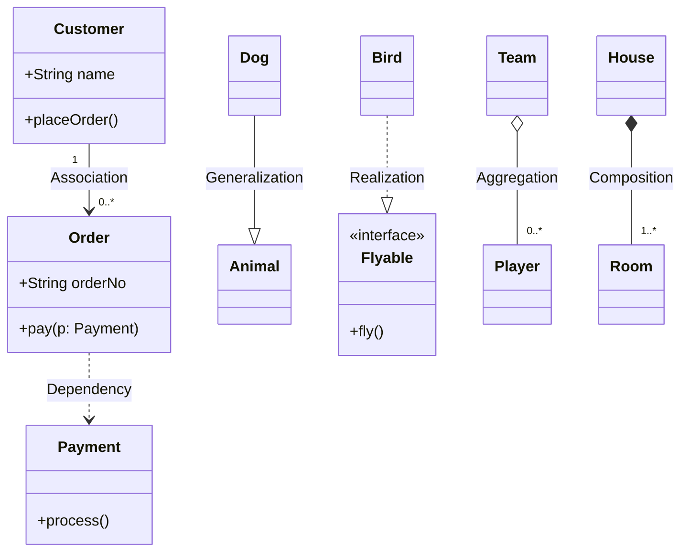
```mermaid
classDiagram
direction TB

class Customer {
  +String name
  +placeOrder()
}
class Order {
  +String orderNo
  +pay(p: Payment)
}
class Payment {
  +process()
}
class Animal
class Dog
class Flyable {
  <<interface>>
  +fly()
}
class Bird
class Team
class Player
class House
class Room

Customer "1" --> "0..*" Order : Association
Order ..> Payment : Dependency
Dog --|> Animal : Generalization
Bird ..|> Flyable : Realization
Team o-- "0..*" Player : Aggregation
House *-- "1..*" Room : Composition
```

**함정(3)**  
1) 연관 vs 의존: **필드면 연관 / 메서드(매개변수·지역변수)면 의존**  
2) 집합 vs 합성: **부분의 생명주기 독립=집합 / 종속=합성**  
3) 화살표 방향: **사용자→피사용자**, 상속/구현은 **자식→부모**

---

## 2. 객체 다이어그램 (Object Diagram)
**정의**: 특정 시점의 객체(인스턴스)와 링크를 스냅샷으로 표현

**필수 요소(3)**  
- Object(객체) / Slot(속성값) / Link(링크)

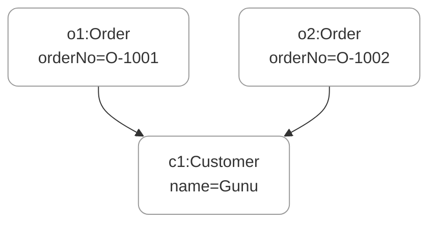
```mermaid
flowchart TB
  classDef obj fill:#ffffff,stroke:#999,stroke-width:1px,rx:10,ry:10;

  c1["c1:Customer<br/>name=Gunu"]:::obj
  o1["o1:Order<br/>orderNo=O-1001"]:::obj
  o2["o2:Order<br/>orderNo=O-1002"]:::obj

  o1 --> c1
  o2 --> c1
```

**함정(3)**  
1) 설계도가 아니라 **런타임 예시**  
2) 절차/흐름은 없음(활동/시퀀스로)  
3) 다중도 규칙은 클래스에서, 객체는 **실제 상태**

---

## 3. 컴포넌트 다이어그램 (Component Diagram)
**정의**: 배포/빌드 단위 모듈(컴포넌트) 간 의존 및 인터페이스 관계 표현

**필수 요소(3)**  
- Component(컴포넌트) / Provided(제공) / Required(요구)

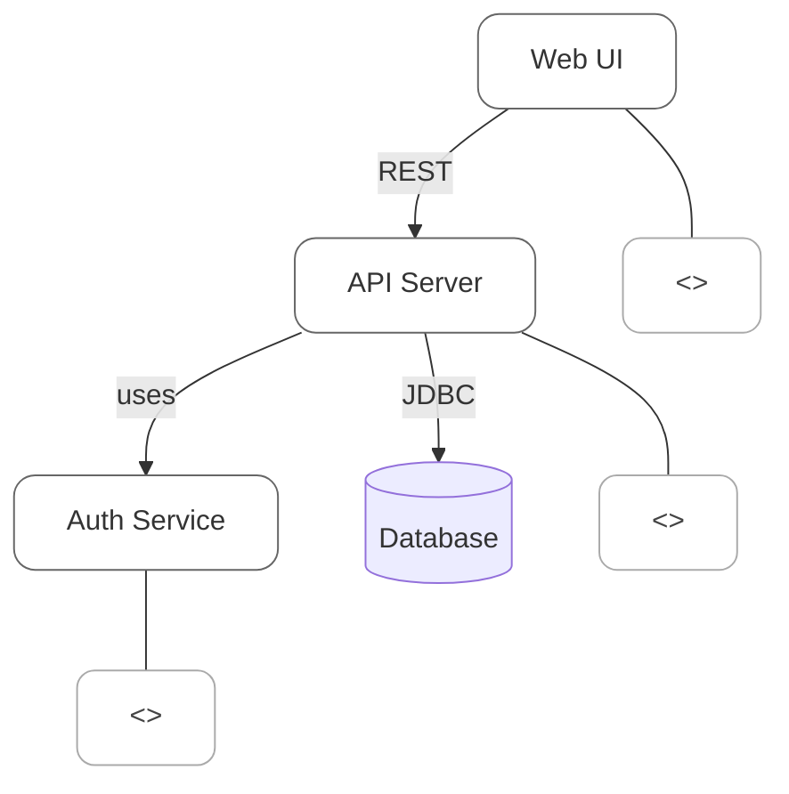
```mermaid
flowchart TB
  classDef c fill:#ffffff,stroke:#666,stroke-width:1px,rx:12,ry:12;
  classDef tag fill:#ffffff,stroke:#aaa,stroke-width:1px,rx:10,ry:10,color:#444;

  UI["Web UI"]:::c
  API["API Server"]:::c
  AUTH["Auth Service"]:::c
  DB[("Database")]

  t1["<<component>>"]:::tag
  t2["<<component>>"]:::tag
  t3["<<component>>"]:::tag

  UI --- t1
  API --- t2
  AUTH --- t3

  UI -->|"REST"| API
  API -->|"uses"| AUTH
  API -->|"JDBC"| DB
```

**함정(3)**  
1) 클래스(설계)와 다름 → 컴포넌트는 **모듈/배포 단위**  
2) 배치(물리 노드)와 혼동 금지  
3) 내부 클래스 구조는 클래스 다이어그램으로

---

## 4. 배치 다이어그램 (Deployment Diagram)
**정의**: 물리 노드(Node) 위에 소프트웨어(Artifact)가 어떻게 배치되는지 표현

**필수 요소(3)**  
- Node(노드) / Artifact(아티팩트) / Communication Path(통신 경로)

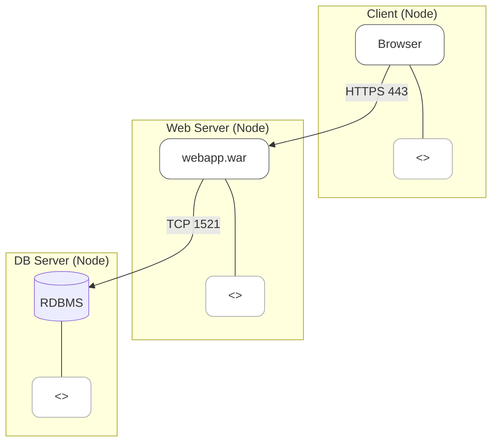
```mermaid
flowchart TB
  classDef n fill:#ffffff,stroke:#666,stroke-width:1px,rx:14,ry:14;
  classDef tag fill:#ffffff,stroke:#aaa,stroke-width:1px,rx:10,ry:10,color:#444;

  subgraph Client["Client (Node)"]
    B["Browser"]:::n
    aB["<<artifact>>"]:::tag
    B --- aB
  end

  subgraph Web["Web Server (Node)"]
    W["webapp.war"]:::n
    aW["<<artifact>>"]:::tag
    W --- aW
  end

  subgraph DBNode["DB Server (Node)"]
    D[("RDBMS")] 
    aD["<<artifact>>"]:::tag
    D --- aD
  end

  B -->|"HTTPS 443"| W
  W -->|"TCP 1521"| D
```

**함정(3)**  
1) 컴포넌트(모듈)와 다름 → 배치는 **물리 위치**  
2) 네트워크 상세 과다 금지(핵심 경로만)  
3) “어디에 배치되나”가 핵심

---

## 5. 패키지 다이어그램 (Package Diagram)
**정의**: 요소를 논리 묶음(패키지)으로 분리하고 의존 방향을 표현

**필수 요소(3)**  
- Package(패키지) / Dependency(의존) / Layering(레이어 규칙)

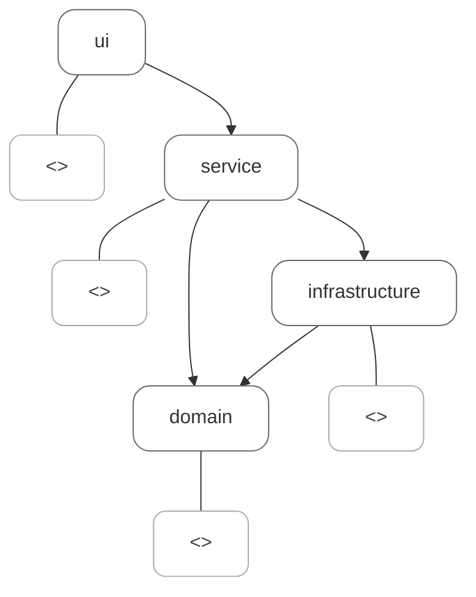
```mermaid
flowchart TB
  classDef p fill:#ffffff,stroke:#666,stroke-width:1px,rx:14,ry:14;
  classDef tag fill:#ffffff,stroke:#aaa,stroke-width:1px,rx:10,ry:10,color:#444;

  UI["ui"]:::p --- t1["<<package>>"]:::tag
  SVC["service"]:::p --- t2["<<package>>"]:::tag
  DOM["domain"]:::p --- t3["<<package>>"]:::tag
  INF["infrastructure"]:::p --- t4["<<package>>"]:::tag

  UI --> SVC
  SVC --> DOM
  SVC --> INF
  INF --> DOM
```

**함정(3)**  
1) 폴더 그림이 아니라 **의존 방향**이 핵심  
2) 순환 의존은 설계 냄새(시험 단골)  
3) 패키지로 클래스 설계를 대체 불가

---

## 6. 복합구조 다이어그램 (Composite Structure Diagram)
**정의**: 한 구조(클래스/컴포넌트) 내부의 Part/Port/Connector 연결을 표현

**필수 요소(3)**  
- Part(부품) / Port(포트) / Connector(커넥터)

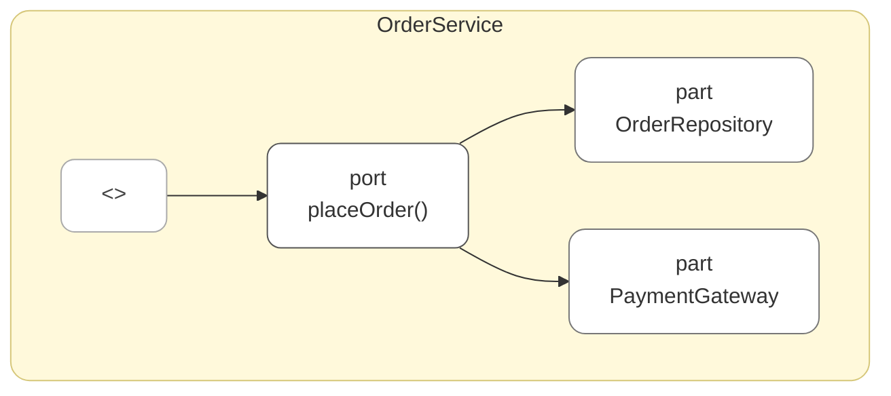
```mermaid
flowchart TB
  classDef boundary fill:#fff9db,stroke:#d6c77a,stroke-width:1px,rx:14,ry:14;
  classDef port fill:#ffffff,stroke:#555,stroke-width:1px,rx:10,ry:10;
  classDef part fill:#ffffff,stroke:#777,stroke-width:1px,rx:12,ry:12;
  classDef tag fill:#ffffff,stroke:#aaa,stroke-width:1px,rx:10,ry:10,color:#444;

  subgraph OS["OrderService"]
    style OS fill:#fff9db,stroke:#d6c77a,stroke-width:1px,rx:14,ry:14;

    T["<<composite>>"]:::tag
    P["port<br/>placeOrder()"]:::port
    R["part<br/>OrderRepository"]:::part
    G["part<br/>PaymentGateway"]:::part

    T --> P
    P --> R
    P --> G
  end
```

**함정(3)**  
1) 클래스 간 관계가 아니라 **내부 구조**  
2) 컴포넌트 다이어그램(모듈 간)과 다름  
3) 너무 상세하면 구현 문서화(핵심 part만)

---

## 7. 프로파일 다이어그램 (Profile Diagram)
**정의**: UML을 도메인에 맞게 스테레오타입/태그/제약으로 확장하는 규칙 표현

**필수 요소(3)**  
- Profile / Stereotype / Tagged Value(or Constraint)

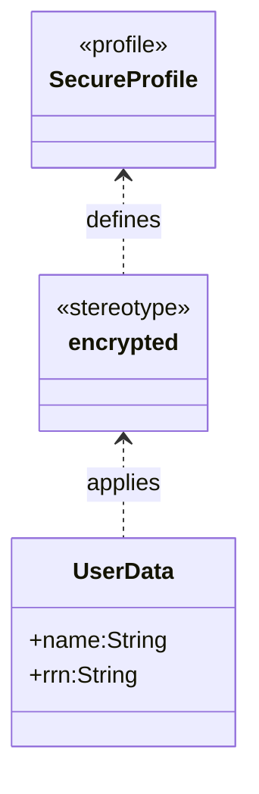
```mermaid
classDiagram
class SecureProfile {
  <<profile>>
}
class encrypted {
  <<stereotype>>
}
class UserData {
  +name:String
  +rrn:String
}
SecureProfile <.. encrypted : defines
encrypted <.. UserData : applies
```

**함정(3)**  
1) “설계 그림”이 아니라 **확장 규칙**  
2) 스테레오타입 남발 금지  
3) 표준/합의 없이 쓰면 혼란

---

> [!abstract] 동적(행위) 다이어그램 7개
> - 시간 흐름에 따른 **동작/상태/상호작용**

# 2) 동적(행위) 다이어그램 7개

## 8. 유스케이스 다이어그램 (Use Case Diagram)
**정의**: 액터와 유스케이스의 관계로 요구사항(무엇을)을 표현

**필수 요소(3)**  
- Actor / Use Case / System Boundary

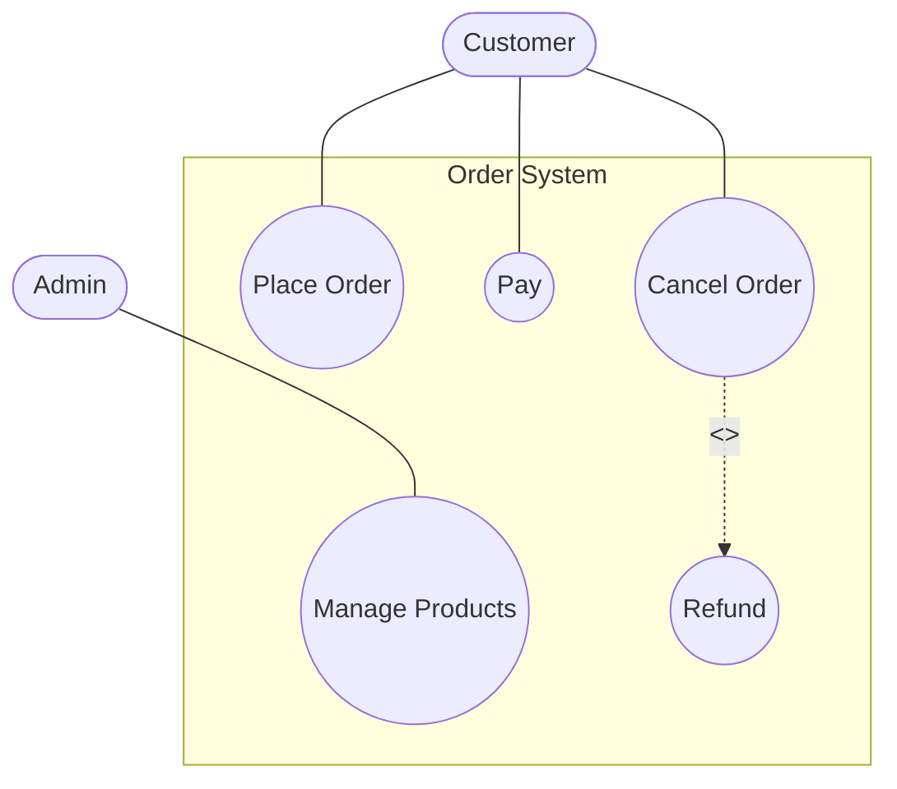
```mermaid
flowchart TB
  C([Customer])
  A([Admin])

  subgraph SYS["Order System"]
    UC1((Place Order))
    UC2((Pay))
    UC3((Cancel Order))
    UC4((Manage Products))
    UC5((Refund))
  end

  C --- UC1
  C --- UC2
  C --- UC3
  A --- UC4
  UC3 -.->|<<include>>| UC5
```

---

## 9. 활동 다이어그램 (Activity Diagram)
**정의**: 처리 절차의 흐름(분기/병렬/동기화)을 표현

**필수 요소(3)**  
- Action / Decision-Merge / Start-End

**Fork/Join**: 병렬 시작/동기화(굵은 막대가 교재 표준 기호)

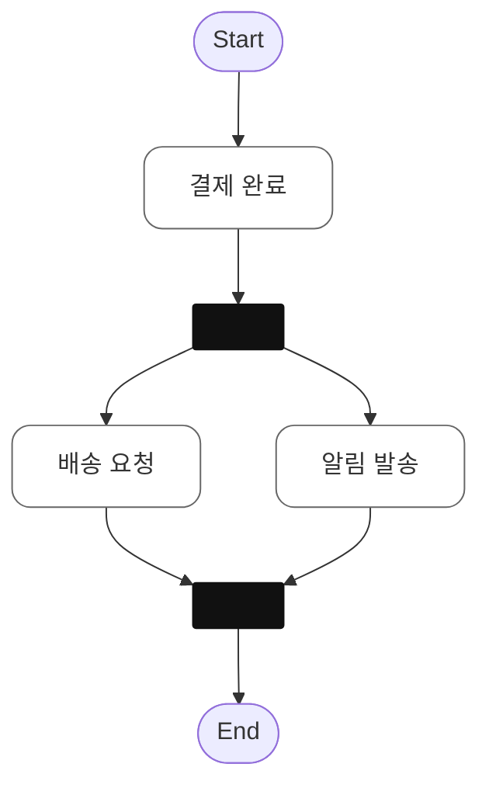
```mermaid
flowchart TB
  classDef act fill:#ffffff,stroke:#666,stroke-width:1px,rx:12,ry:12;
  classDef bar fill:#111,stroke:#111,color:#111,rx:2,ry:2;

  S([Start]) --> A[결제 완료]:::act
  A --> F[" "]:::bar
  F --> D[배송 요청]:::act
  F --> N[알림 발송]:::act
  D --> J[" "]:::bar
  N --> J
  J --> E([End])
```

---

## 10. 상태 다이어그램 (State Machine Diagram)
**정의**: 객체의 상태와 전이를 표현(이벤트/가드/액션)

**필수 요소(3)**  
- State / Transition / Event

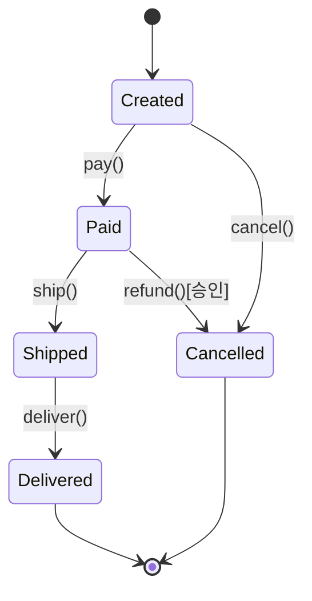
```mermaid
stateDiagram-v2
  [*] --> Created
  Created --> Paid : pay()
  Paid --> Shipped : ship()
  Shipped --> Delivered : deliver()
  Created --> Cancelled : cancel()
  Paid --> Cancelled : refund()[승인]
  Delivered --> [*]
  Cancelled --> [*]
```

---

## 11. 시퀀스 다이어그램 (Sequence Diagram)
**정의**: 시간 흐름에 따른 참여자 간 메시지 순서를 표현

**필수 요소(3)**  
- Participant / Lifeline / Message

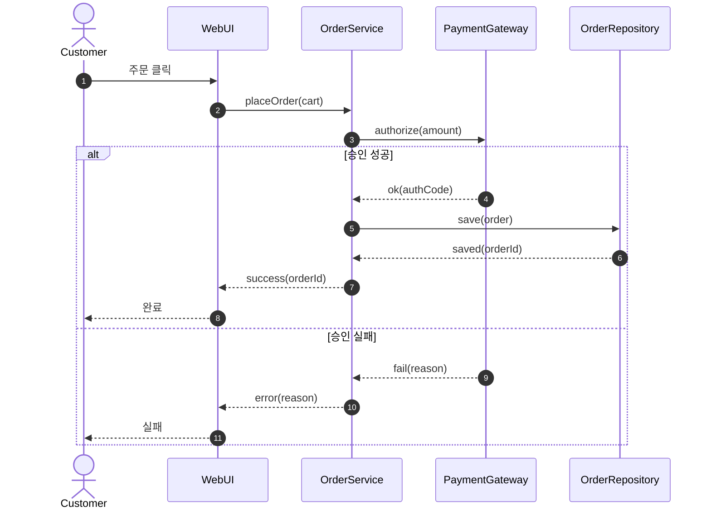
```mermaid
sequenceDiagram
  autonumber
  actor C as Customer
  participant UI as WebUI
  participant S as OrderService
  participant P as PaymentGateway
  participant R as OrderRepository

  C->>UI: 주문 클릭
  UI->>S: placeOrder(cart)
  S->>P: authorize(amount)

  alt 승인 성공
    P-->>S: ok(authCode)
    S->>R: save(order)
    R-->>S: saved(orderId)
    S-->>UI: success(orderId)
    UI-->>C: 완료
  else 승인 실패
    P-->>S: fail(reason)
    S-->>UI: error(reason)
    UI-->>C: 실패
  end
```

---

## 12. 커뮤니케이션 다이어그램 (Communication Diagram)
**정의**: 연결 구조 중심 + 메시지 번호로 순서를 표현

**필수 요소(3)**  
- Object / Link / Message Numbering

**병렬 의미**: 커뮤니케이션에서는 보통 번호로 설명(예: `1.3a/1.3b`)  
※ Fork/Join “막대”는 **활동 다이어그램 표준 기호**

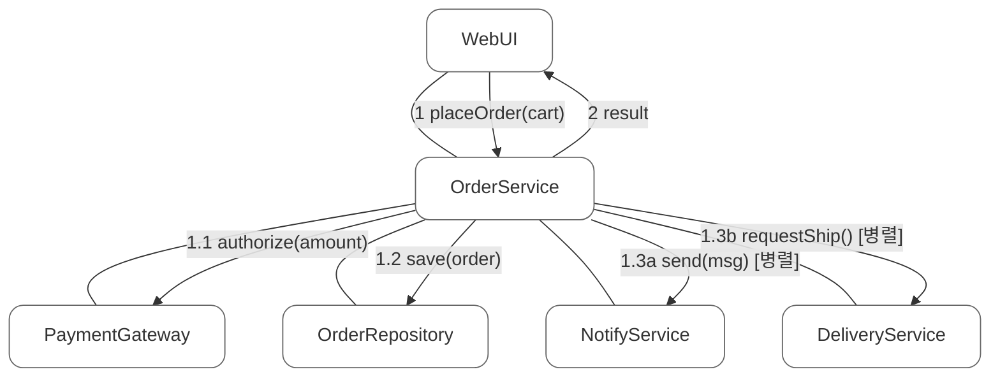
```mermaid
flowchart TB
  classDef n fill:#ffffff,stroke:#666,stroke-width:1px,rx:12,ry:12;

  UI[WebUI]:::n
  S[OrderService]:::n
  P[PaymentGateway]:::n
  R[OrderRepository]:::n
  N[NotifyService]:::n
  D[DeliveryService]:::n

  UI --- S
  S --- P
  S --- R
  S --- N
  S --- D

  UI -->|"1 placeOrder(cart)"| S
  S -->|"1.1 authorize(amount)"| P
  S -->|"1.2 save(order)"| R
  S -->|"1.3a send(msg) [병렬]"| N
  S -->|"1.3b requestShip() [병렬]"| D
  S -->|"2 result"| UI
```

---

## 13. 타이밍 다이어그램 (Timing Diagram)
**정의**: 시간축에 따라 상태/값이 변하는 모습을 표현

**필수 요소(3)**  
- Time Axis / State(or Value) / Change Point

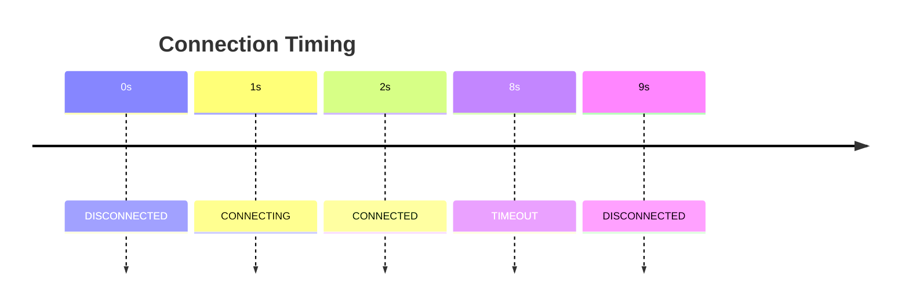
```mermaid
timeline
  title Connection Timing
  0s : DISCONNECTED
  1s : CONNECTING
  2s : CONNECTED
  8s : TIMEOUT
  9s : DISCONNECTED
```

---

## 14. 상호작용 개요 다이어그램 (Interaction Overview Diagram)
**정의**: 여러 상호작용(시퀀스/커뮤니케이션)을 활동처럼 묶어 큰 흐름을 표현

**필수 요소(3)**  
- Interaction Node / Decision-Merge / Start-End

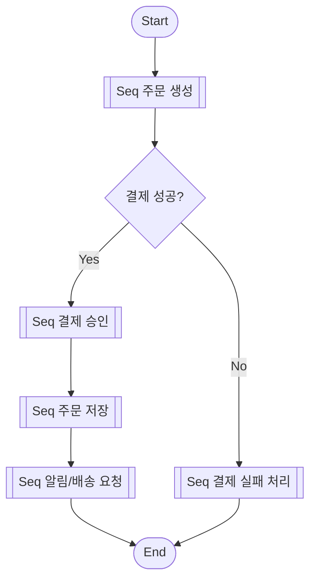
```mermaid
flowchart TB
  A([Start]) --> B[[Seq 주문 생성]]
  B --> C{결제 성공?}

  C -- Yes --> D[[Seq 결제 승인]]
  D --> E[[Seq 주문 저장]]
  E --> F[[Seq 알림/배송 요청]]
  F --> Z([End])

  C -- No --> X[[Seq 결제 실패 처리]]
  X --> Z
```

---

## (추가) “누락되기 쉬운 포인트” 한 줄 정리

- **Composite Structure / Profile / Interaction Overview / Timing** 이 4개가 제일 소외됨.
    
- 감리사 시험 체감상 출제 비중은 **Class / UseCase / Sequence / Activity / State**가 압도적.
    


## 🔷 UML 2.x 다이어그램 통합 정리표 (총 14개)

| 구분  | 다이어그램                        | 약어  | 핵심 역할           | 시험 키워드               |
| --- | ---------------------------- | --- | --------------- | -------------------- |
| 구조  | Class Diagram                | CD  | 클래스 구조 정의       | 상속, 연관               |
| 구조  | Object Diagram               | OD  | 객체 인스턴스 관계      | 런타임 상태               |
| 구조  | Component Diagram            | CMP | 컴포넌트 구조         | 배포 전 구조              |
| 구조  | Composite Structure Diagram  | CSD | 내부 구성 구조        | 내부 포트                |
| 구조  | Package Diagram              | PKG | 모델 그룹화          | 계층 구조                |
| 구조  | Deployment Diagram           | DD  | 물리적 배치          | 노드, 서버               |
| 행위  | Use Case Diagram             | UC  | 사용자-시스템 상호작용    | 요구 모델                |
| 행위  | Activity Diagram             | ACT | 작업 흐름           | 병렬 처리                |
| 행위  | State Machine Diagram        | STM | 상태 전이           | 이벤트                  |
| 행위  | Sequence Diagram             | SD  | 시간 순 메시지 흐름     | 생명선                  |
| 행위  | Communication Diagram        | COM | 객체 간 관계 중심 상호작용 | 번호 기반                |
| 행위  | Interaction Overview Diagram | IOD | 상호작용 흐름 제어      | Activity+Interaction |
| 행위  | Timing Diagram               | TD  | 시간 축 기반 상태 변화   | 실시간                  |
| 행위  | Interaction Diagram (상위 개념)  | -   | 상호작용 다이어그램 그룹   | SD/COM 포함            |

# (5) SysML

## 1) Requirement Diagram (REQ) — 요구사항/추적의 핵심

- SysML 전용, 시험에서 “추적(Traceability)” 관계를 자주 물음
    
- 자주 쓰는 관계: 
    
    - **deriveReqt**(파생), **refine**(정제), **satisfy**(만족: 설계/블록이 요구를 만족), **verify**(검증: 테스트가 요구를 검증), **trace**(추적)
        

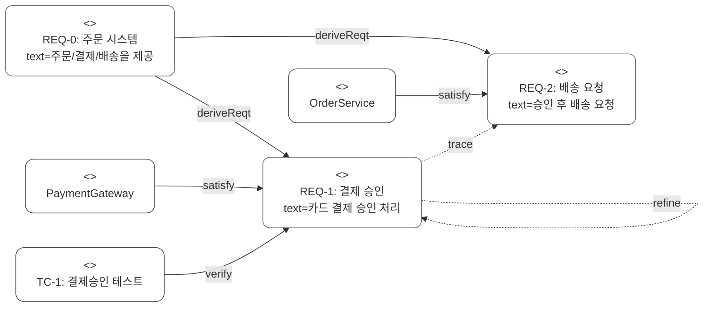
```mermaid
flowchart LR
  classDef req fill:#fff,stroke:#666,rx:10,ry:10;
  classDef blk fill:#fff,stroke:#444,rx:12,ry:12;
  classDef test fill:#fff,stroke:#444,rx:12,ry:12;

  R0["<<requirement>>\nREQ-0: 주문 시스템\ntext=주문/결제/배송을 제공"]:::req
  R1["<<requirement>>\nREQ-1: 결제 승인\ntext=카드 결제 승인 처리"]:::req
  R2["<<requirement>>\nREQ-2: 배송 요청\ntext=승인 후 배송 요청"]:::req

  B1["<<block>>\nOrderService"]:::blk
  B2["<<block>>\nPaymentGateway"]:::blk
  T1["<<testCase>>\nTC-1: 결제승인 테스트"]:::test

  R0 -->|deriveReqt| R1
  R0 -->|deriveReqt| R2

  B1 -->|satisfy| R2
  B2 -->|satisfy| R1

  T1 -->|verify| R1

  R1 -.->|trace| R2
  R1 -.->|refine| R1
```

**시험에서 자주 나오는 포인트**

- “설계요소가 요구를 **만족**” = `satisfy`
    
- “테스트가 요구를 **검증**” = `verify`
    

---

## 2) Block Definition Diagram (BDD) — SysML의 “클래스 다이어그램 대체”

- UML Class Diagram 확장/대체 성격
    
- Block(블록) = 시스템 구성요소(하드/소프트/인력/데이터 등 다 포함 가능)
    

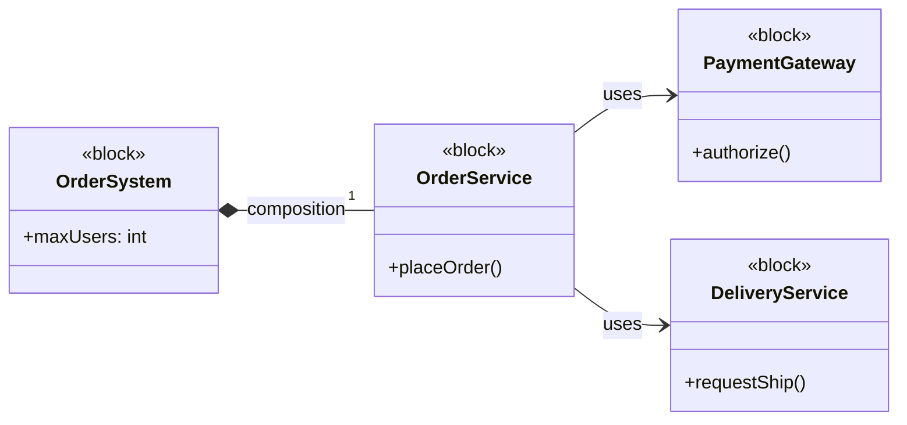
```mermaid
classDiagram
direction LR

class OrderSystem {
  <<block>>
  +maxUsers: int
}
class OrderService {
  <<block>>
  +placeOrder()
}
class PaymentGateway {
  <<block>>
  +authorize()
}
class DeliveryService {
  <<block>>
  +requestShip()
}

OrderSystem *-- "1" OrderService : composition
OrderService --> PaymentGateway : uses
OrderService --> DeliveryService : uses
```

**포인트**

- BDD는 “타입/구조(블록 정의)”
    
- “내부 연결(포트/흐름)”은 다음 IBD로 간다.
    

---

## 3) Internal Block Diagram (IBD) — 블록 내부 “파트/포트/흐름” 연결

- SysML 전용, UML Composite Structure 확장
    
- 구성요소(Part) + 포트(Port) + 흐름(Item Flow)을 보여주는 게 핵심
    

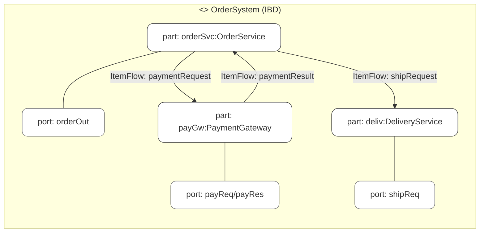
```mermaid
flowchart TB
  classDef part fill:#fff,stroke:#444,rx:12,ry:12;
  classDef port fill:#fff,stroke:#777,rx:10,ry:10;

  subgraph OS["<<block>> OrderSystem (IBD)"]
    direction TB

    p1["part: orderSvc:OrderService"]:::part
    p2["part: payGw:PaymentGateway"]:::part
    p3["part: deliv:DeliveryService"]:::part

    oPort["port: orderOut"]:::port
    payPort["port: payReq/payRes"]:::port
    shipPort["port: shipReq"]:::port

    p1 --- oPort
    p2 --- payPort
    p3 --- shipPort

    p1 -->|ItemFlow: paymentRequest| p2
    p2 -->|ItemFlow: paymentResult| p1
    p1 -->|ItemFlow: shipRequest| p3
  end
```

**시험 포인트**

- “블록 **정의**”는 BDD, “블록 **내부 배선/흐름**”은 IBD
    
- IBD에서 **포트/흐름** 키워드 나오면 거의 정답.
    

---

## 4) Parametric Diagram (PAR) — 제약식(Constraint)로 성능/공학 계산

- SysML 전용
    
- 핵심은 **Constraint Block(제약 블록)** + **바인딩(binding) 연결**로 “변수들이 수식으로 묶인다”를 보여주는 것
    

예: 응답시간 `T = Proc + Net`

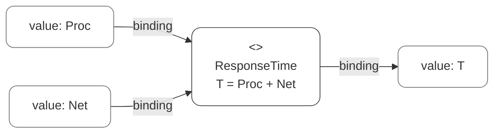
```mermaid
flowchart LR
  classDef c fill:#fff,stroke:#444,rx:12,ry:12;
  classDef v fill:#fff,stroke:#777,rx:10,ry:10;

  CB["<<constraint>>\nResponseTime\nT = Proc + Net"]:::c

  T["value: T"]:::v
  Proc["value: Proc"]:::v
  Net["value: Net"]:::v

  Proc -->|binding| CB
  Net -->|binding| CB
  CB -->|binding| T
```

**시험 포인트**

- PAR은 “다이어그램이 계산한다”기보다 **제약/수식을 모델에 박아 추적 가능**하게 만드는 용도.
    

---

## 5) 나머지 5개는 “UML과 거의 동일”이라 그림은 네 UML꺼 그대로 써도 됨

네 파일 표에서도 SysML에서 **ACT/SD/STM/UC/PKG는 UML 공통(거의 동일)**로 정리돼 있음

- Package Diagram (PKG) = UML 패키지와 동일
    
- Activity / Sequence / State Machine / Use Case = UML 그림 그대로 사용
    

---

원하면, 지금 네가 정리한 “UML 14개 한 장 정리” 스타일에 맞춰서 **SysML도 ‘9개 한 장 통합(그림 4개+표 1개)’**로 딱 맞춰서 재배치해줄게. (REQ/BDD/IBD/PAR만 제대로 잡아도 SysML은 시험에서 거의 커버됨)

---

## 5) 나머
## 🔷 SysML 9개 다이어그램 통합 정리표 (UML2 비교 포함)

| 구분  | 다이어그램                    | 약어  | 핵심 역할       | UML2 존재 여부 | SysML에서 변경 여부          | 시험 포인트   |
| --- | ------------------------ | --- | ----------- | ---------- | ---------------------- | -------- |
| 구조  | Block Definition Diagram | BDD | 시스템 블록 정의   | ❌          | Class Diagram 확장/대체    | Class 대체 |
| 구조  | Internal Block Diagram   | IBD | 블록 내부 연결/포트 | ❌          | Composite Structure 확장 | 포트/흐름    |
| 구조  | Package Diagram          | PKG | 모델 구성 정리    | ✅          | 거의 동일                  | UML 공통   |
| 구조  | Parametric Diagram       | PAR | 제약식/수식 표현   | ❌          | SysML 전용               | 성능/공학 계산 |
| 행위  | Activity Diagram         | ACT | 프로세스 흐름     | ✅          | 토큰/객체 흐름 강화            | UML 공통   |
| 행위  | Sequence Diagram         | SD  | 메시지 상호작용    | ✅          | 거의 동일                  | UML 공통   |
| 행위  | State Machine Diagram    | STM | 상태 전이       | ✅          | 거의 동일                  | UML 공통   |
| 행위  | Use Case Diagram         | UC  | 요구 상호작용     | ✅          | 거의 동일                  | UML 공통   |
| 요구  | Requirement Diagram      | REQ | 요구사항 정의/추적  | ❌          | SysML 전용               | SysML 핵심 |


# 📘 ✅ SOLID 원칙 (객체지향 설계 5대 원칙)

> 제안: **Robert C. Martin (Uncle Bob)**

---

## 1️⃣ S — **단일 책임 원칙 (SRP, Single Responsibility Principle)**

**정의**

> 하나의 클래스는 **오직 하나의 변경 이유(Responsibility)** 만 가져야 한다.

**핵심 키워드**

- 변경 이유 1개
    
- 역할 분리
    
- 응집도(High Cohesion) 향상
    

**잘못된 예**

- 주문 클래스가 결제 + DB저장 + 이메일 발송 다 함
    

**의도**

- 변경 영향 최소화
    
- 유지보수 용이성 증가
    

---

## 2️⃣ O — **개방-폐쇄 원칙 (OCP, Open-Closed Principle)**

**정의**

> 확장(Extension)에는 열려 있고, 수정(Modification)에는 닫혀 있어야 한다. (변하는것과 변하지 않는것 분리)

**핵심 키워드**

- 기존 코드 수정 X
    
- 인터페이스 / 추상화 사용
    
- 다형성(Polymorphism)
    

**예시**

```java
interface DiscountPolicy { 
    int discount(int price);
}
```

새 할인 정책 추가 시 기존 코드 수정 없이 구현 클래스만 추가

---

## 3️⃣ L — **리스코프 치환 원칙 (LSP, Liskov Substitution Principle)**

**정의**

> 자식 클래스는 부모 클래스를 대체(Substitute)할 수 있어야 한다.

**핵심 키워드**

- 행위 일관성
    
- 계약(Contract) 유지
    
- 오버라이딩 시 규약 위반 금지
    

**대표 사례**

- `Rectangle`을 상속한 `Square` 문제
    

**시험 포인트**

- "부모 타입으로 참조 가능해야 한다"
    
- "기능 축소 금지"
    

---

## 4️⃣ I — **인터페이스 분리 원칙 (ISP, Interface Segregation Principle)**

**정의**

> 클라이언트는 사용하지 않는 인터페이스에 의존하면 안 된다.

**핵심 키워드**

- 인터페이스 분리
    
- Fat Interface 지양
    
- 필요한 기능만 제공
    

**예시**

- 프린터 인터페이스에 scan(), fax() 다 넣지 말고 분리
    

---

## 5️⃣ D — **의존 역전 원칙 (DIP, Dependency Inversion Principle)**

**정의**

> 고수준(잘 바뀌지 않는것) 모듈은 저수준 모듈에 의존하면 안 되고,  
> 둘 다 **추상화(Abstraction)** 에 의존해야 한다.

**핵심 키워드**

- 구현체 → 인터페이스 의존
    
- DI (Dependency Injection)
    
- 결합도 감소
    

**잘못된 예**

```java
OrderService service = new OrderRepository();  // 구현체 직접 의존
```

**올바른 예**

```java
OrderService service = new OrderService(OrderRepositoryInterface repo);
```

---

# 🔥 한눈에 암기표

|원칙|한글명|영어명|핵심 포인트|
|---|---|---|---|
|S|단일 책임|Single Responsibility|변경 이유 1개|
|O|개방-폐쇄|Open-Closed|확장 O, 수정 X|
|L|리스코프 치환|Liskov Substitution|자식은 부모 대체 가능|
|I|인터페이스 분리|Interface Segregation|불필요 의존 제거|
|D|의존 역전|Dependency Inversion|추상화에 의존|

---

# 🎯 감리사 시험 포인트

- 설계 품질 개선 원칙
    
- 객체지향 설계 평가 항목
    
- OCP ↔ DIP 같이 묻는 문제 자주 출제
    
- LSP는 “치환 가능성” 키워드 나오면 바로 반응
    


---

# GoF 23 Design Patterns + UML

## 1) Creational (생성) — “어떻게 만들까?”

---

## 1. Singleton

- **의도**: 인스턴스 1개만 생성, 전역 접근점 제공
    
- **언제**: 설정/로그/커넥션풀 등 공유 자원
    
- **주의**: 테스트 어려움, 전역 상태(남용 금지)
    

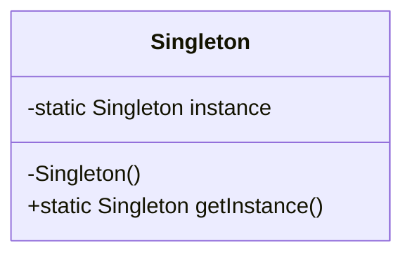
```mermaid
classDiagram
class Singleton {
  -Singleton()
  -static Singleton instance
  +static Singleton getInstance()
}
```

---

## 2. Factory Method

- **의도**: “무슨 객체를 만들지”를 서브클래스가 결정
    
- **언제**: 생성 로직 분기(if/switch)를 Creator 밖으로 밀어냄
    
- **키워드**: Creator의 `factoryMethod()` / Product 추상화
    

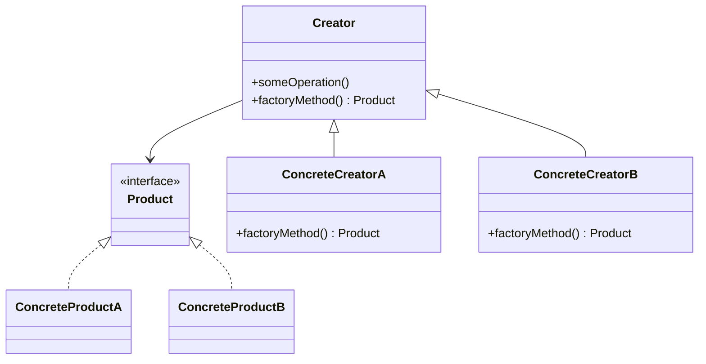
```mermaid
classDiagram
class Product
<<interface>> Product
class ConcreteProductA
class ConcreteProductB
Product <|.. ConcreteProductA
Product <|.. ConcreteProductB

class Creator {
  +someOperation()
  +factoryMethod() Product
}
class ConcreteCreatorA {
  +factoryMethod() Product
}
class ConcreteCreatorB {
  +factoryMethod() Product
}
Creator <|-- ConcreteCreatorA
Creator <|-- ConcreteCreatorB
Creator --> Product
```

---

## 3. Abstract Factory

- **의도**: 서로 관련된 객체군(제품군)을 “일관되게” 생성
    
- **언제**: UI 테마(Windows/Mac), DB 드라이버 세트 등
    
- **키워드**: Factory가 여러 create 메서드 제공
    

```mermaid
classDiagram
class AbstractFactory{
  +createA() AbstractProductA
  +createB() AbstractProductB
}
class ConcreteFactory1{
  +createA() AbstractProductA
  +createB() AbstractProductB
}
class ConcreteFactory2{
  +createA() AbstractProductA
  +createB() AbstractProductB
}
AbstractFactory <|-- ConcreteFactory1
AbstractFactory <|-- ConcreteFactory2

class AbstractProductA
<<interface>> AbstractProductA
class AbstractProductB
<<interface>> AbstractProductB
class ProductA1
class ProductA2
class ProductB1
class ProductB2
AbstractProductA <|.. ProductA1
AbstractProductA <|.. ProductA2
AbstractProductB <|.. ProductB1
AbstractProductB <|.. ProductB2

ConcreteFactory1 --> ProductA1
ConcreteFactory1 --> ProductB1
ConcreteFactory2 --> ProductA2
ConcreteFactory2 --> ProductB2
```

---

## 4. Builder

- **의도**: 복잡한 객체 생성 과정을 단계로 분리(조립)
    
- **언제**: 생성 옵션 많고 순서가 있는 경우 (예: 문서/리포트 생성)
    
- **키워드**: Director(선택) + Builder + Product
    

```mermaid
classDiagram
class Director{
  +construct()
}
class Builder{
  <<interface>>
  +buildPartA()
  +buildPartB()
  +getResult() Product
}
class ConcreteBuilder{
  +buildPartA()
  +buildPartB()
  +getResult() Product
}
Builder <|.. ConcreteBuilder
Director --> Builder

class Product
ConcreteBuilder --> Product
```

---

## 5. Prototype

- **의도**: 기존 객체를 복제해서 새 객체 생성
    
- **언제**: 생성 비용이 크거나, 런타임에 타입이 결정될 때
    
- **키워드**: `clone()` / 깊은복사 vs 얕은복사 주의
    

```mermaid
classDiagram
class Prototype{
  <<interface>>
  +clone() Prototype
}
class ConcretePrototype{
  +clone() Prototype
}
Prototype <|.. ConcretePrototype
```

---

## 2) Structural (구조) — “어떻게 붙일까?”

---

## 6. Adapter

- **의도**: 호환되지 않는 인터페이스를 변환
    
- **언제**: 레거시/외부 라이브러리 연동
    
- **키워드**: Target(원하는 인터페이스) / Adaptee(기존)
    

```mermaid
classDiagram
class Target{
  <<interface>>
  +request()
}
class Adaptee{
  +specificRequest()
}
class Adapter{
  -adaptee: Adaptee
  +request()
}
Target <|.. Adapter
Adapter --> Adaptee
```

---

## 7. Bridge

- **의도**: 추상(Abstraction)과 구현(Implementation)을 분리해 독립 확장
    
- **언제**: 기능 축과 구현 축이 둘 다 자주 변할 때(조합 폭발 방지)
    
- **키워드**: Abstraction has-a Implementor
    

```mermaid
classDiagram
class Implementor{
  <<interface>>
  +operationImpl()
}
class ConcreteImplementorA
class ConcreteImplementorB
Implementor <|.. ConcreteImplementorA
Implementor <|.. ConcreteImplementorB

class Abstraction{
  -impl: Implementor
  +operation()
}
class RefinedAbstraction{
  +operation()
}
Abstraction <|-- RefinedAbstraction
Abstraction --> Implementor
```

---

## 8. Composite

- **의도**: 부분-전체(트리) 구조를 동일 인터페이스로 다룸
    
- **언제**: 폴더/파일, UI 컴포넌트 트리
    
- **키워드**: Leaf/Composite 둘 다 Component를 구현
    

```mermaid
classDiagram
class Component{
  <<interface>>
  +operation()
}
class Leaf{
  +operation()
}
class Composite{
  -children: List~Component~
  +add(c:Component)
  +remove(c:Component)
  +operation()
}
Component <|.. Leaf
Component <|.. Composite
Composite o--> Component
```

---

## 9. Decorator

- **의도**: 상속 대신 “감싸서” 기능을 동적으로 추가
    
- **언제**: 옵션 조합이 많을 때(음료 토핑처럼)
    
- **키워드**: Decorator도 Component를 구현하고 Component를 가진다
    

```mermaid
classDiagram
class Component{
  <<interface>>
  +operation()
}
class ConcreteComponent{
  +operation()
}
Component <|.. ConcreteComponent

class Decorator{
  <<abstract>>
  -wrappee: Component
  +operation()
}
Component <|.. Decorator
Decorator --> Component

class ConcreteDecoratorA{
  +operation()
}
class ConcreteDecoratorB{
  +operation()
}
Decorator <|-- ConcreteDecoratorA
Decorator <|-- ConcreteDecoratorB
```

---

## 10. Facade

- **의도**: 복잡한 서브시스템에 단순한 창구 제공
    
- **언제**: 라이브러리/서브시스템 사용 단순화, 결합도 감소
    
- **키워드**: Facade가 내부 클래스들을 조율
    

```mermaid
classDiagram
class Facade{
  +doWork()
}
class SubsystemA{
  +a()
}
class SubsystemB{
  +b()
}
class SubsystemC{
  +c()
}
Facade --> SubsystemA
Facade --> SubsystemB
Facade --> SubsystemC
```

---

## 11. Flyweight

- **의도**: 공통 상태(내재/Intrinsic)를 공유해 메모리 절약
    
- **언제**: 엄청 많은 유사 객체(문자, 타일, 입자 등)
    
- **키워드**: 공유되는 것(내재) vs 호출 시 주는 것(외재/Extrinsic)
    

```mermaid
classDiagram
class Flyweight{
  <<interface>>
  +operation(extrinsicState)
}
class ConcreteFlyweight{
  -intrinsicState
  +operation(extrinsicState)
}
Flyweight <|.. ConcreteFlyweight

class FlyweightFactory{
  -pool: Map
  +get(key) Flyweight
}
FlyweightFactory --> Flyweight
```

---

## 12. Proxy

- **의도**: 실제 객체(RealSubject) 대신 대리 객체가 접근 제어
    
- **언제**: Lazy loading, 접근 권한, 원격 호출, 캐싱
    
- **키워드**: Proxy가 RealSubject를 보유
    

```mermaid
classDiagram
class Subject{
  <<interface>>
  +request()
}
class RealSubject{
  +request()
}
class Proxy{
  -real: RealSubject
  +request()
}
Subject <|.. RealSubject
Subject <|.. Proxy
Proxy --> RealSubject
```

---

## 3) Behavioral (행위) — “어떻게 협력할까?”

---

## 13. Chain of Responsibility

- **의도**: 요청을 처리할 객체를 체인으로 연결, 못하면 다음에게 전달
    
- **언제**: 필터 체인, 승인 라인, 이벤트 처리 파이프
    
- **키워드**: `nextHandler` / “넘긴다”
    

```mermaid
classDiagram
class Handler{
  <<abstract>>
  -next: Handler
  +setNext(h:Handler) Handler
  +handle(req)
}
class ConcreteHandlerA{
  +handle(req)
}
class ConcreteHandlerB{
  +handle(req)
}
Handler <|-- ConcreteHandlerA
Handler <|-- ConcreteHandlerB
Handler --> Handler : next
```

---

## 14. Command

- **의도**: “요청”을 객체로 캡슐화(Undo/Queue/Log 가능)
    
- **언제**: 버튼/메뉴 액션, 작업 큐, 트랜잭션/되돌리기
    
- **키워드**: Invoker(호출자) / Receiver(실행 주체)
    

```mermaid
classDiagram
class Command{
  <<interface>>
  +execute()
}
class ConcreteCommand{
  -receiver: Receiver
  +execute()
}
Command <|.. ConcreteCommand

class Invoker{
  -cmd: Command
  +setCommand(c:Command)
  +run()
}
class Receiver{
  +action()
}
Invoker --> Command
ConcreteCommand --> Receiver
```

---

## 15. Interpreter

- **의도**: 간단한 언어/규칙을 문법 트리로 해석
    
- **언제**: 규칙 엔진, 간단한 DSL, 수식 해석
    
- **키워드**: Expression 트리 / Context
    

```mermaid
classDiagram
class Context

class AbstractExpression{
  <<interface>>
  +interpret(ctx:Context)
}
class TerminalExpression{
  +interpret(ctx)
}
class NonterminalExpression{
  -left: AbstractExpression
  -right: AbstractExpression
  +interpret(ctx)
}
AbstractExpression <|.. TerminalExpression
AbstractExpression <|.. NonterminalExpression
NonterminalExpression --> AbstractExpression
```

---

## 16. Iterator

- **의도**: 내부 구조 노출 없이 순회
    
- **언제**: 컬렉션 순회 로직을 분리
    
- **키워드**: `hasNext()/next()`
    

```mermaid
classDiagram
class Iterator{
  <<interface>>
  +hasNext() bool
  +next() Item
}
class ConcreteIterator{
  -collection: ConcreteAggregate
  -index:int
  +hasNext()
  +next()
}
Iterator <|.. ConcreteIterator

class Aggregate{
  <<interface>>
  +createIterator() Iterator
}
class ConcreteAggregate{
  -items: List~Item~
  +createIterator()
}
Aggregate <|.. ConcreteAggregate
ConcreteAggregate --> Iterator
ConcreteIterator --> ConcreteAggregate
```

---

## 17. Mediator

- **의도**: 객체 간 직접 통신을 중재자(Mediator)로 몰아 결합도 감소
    
- **언제**: UI 위젯 상호작용, 복잡한 협업 로직
    
- **키워드**: Colleague ↔ Mediator
    

```mermaid
classDiagram
class Mediator{
  <<interface>>
  +notify(sender, event)
}
class ConcreteMediator{
  -c1: Colleague1
  -c2: Colleague2
  +notify(sender,event)
}
Mediator <|.. ConcreteMediator

class Colleague{
  <<abstract>>
  -mediator: Mediator
}
class Colleague1
class Colleague2
Colleague <|-- Colleague1
Colleague <|-- Colleague2
Colleague --> Mediator
```

---

## 18. Memento

- **의도**: 객체 상태를 캡슐화해 저장/복구(Undo)
    
- **언제**: 되돌리기, 체크포인트
    
- **키워드**: Originator(상태 보유) / Memento(스냅샷) / Caretaker(보관)
    

```mermaid
classDiagram
class Memento{
  -state
}
class Originator{
  -state
  +save() Memento
  +restore(m:Memento)
}
class Caretaker{
  -history: Stack~Memento~
  +backup()
  +undo()
}
Originator --> Memento
Caretaker --> Memento
Caretaker --> Originator
```

---

## 19. Observer

- **의도**: 상태 변화 시 구독자에게 자동 통지(1:N)
    
- **언제**: 이벤트 시스템, UI 갱신, Pub/Sub
    
- **키워드**: Subject가 Observer 리스트 관리
    

```mermaid
classDiagram
class Subject{
  <<interface>>
  +attach(o:Observer)
  +detach(o:Observer)
  +notify()
}
class ConcreteSubject{
  -state
  +getState()
  +setState()
}
Subject <|.. ConcreteSubject

class Observer{
  <<interface>>
  +update()
}
class ConcreteObserver{
  -subject: ConcreteSubject
  +update()
}
Observer <|.. ConcreteObserver
ConcreteSubject o--> Observer
ConcreteObserver --> ConcreteSubject
```

---

## 20. State

- **의도**: 내부 상태에 따라 동작이 바뀌며, 상태 전이를 객체로 표현
    
- **언제**: 상태 머신(주문/결제/배송), if/switch 폭발 제거
    
- **키워드**: Context → State 위임, 전이는 State 내부에서
    

```mermaid
classDiagram
class State{
  <<interface>>
  +handle(ctx:Context)
}
class ConcreteStateA{
  +handle(ctx)
}
class ConcreteStateB{
  +handle(ctx)
}
State <|.. ConcreteStateA
State <|.. ConcreteStateB

class Context{
  -state: State
  +setState(s:State)
  +request()
}
Context --> State
```

---

## 21. Strategy

- **의도**: 알고리즘(정책)을 객체로 분리, 런타임 교체 가능
    
- **언제**: 정렬/할인/경로탐색 등 알고리즘 변경 필요
    
- **키워드**: Context → Strategy, “알고리즘 교체”
    

```mermaid
classDiagram
class Strategy{
  <<interface>>
  +execute(data)
}
class ConcreteStrategyA{
  +execute(data)
}
class ConcreteStrategyB{
  +execute(data)
}
Strategy <|.. ConcreteStrategyA
Strategy <|.. ConcreteStrategyB

class Context{
  -strategy: Strategy
  +setStrategy(s:Strategy)
  +doWork(data)
}
Context --> Strategy
```

---

## 22. Template Method

- **의도**: 알고리즘 골격(순서)을 상위에서 고정, 일부 단계만 하위에서 구현
    
- **언제**: 처리 흐름은 같고 일부 단계만 다를 때
    
- **키워드**: abstract class + hook method
    

```mermaid
classDiagram
class AbstractClass{
  +templateMethod()
  #step1()
  #step2()
  #hook()
}
class ConcreteClassA{
  #step1()
  #step2()
}
class ConcreteClassB{
  #step1()
  #step2()
}
AbstractClass <|-- ConcreteClassA
AbstractClass <|-- ConcreteClassB
```

---

## 23. Visitor

- **의도**: 데이터 구조는 고정, 그 위에 “새 기능”을 추가(구조 변경 최소화)
    
- **언제**: 객체 구조(노드 타입)가 안정적이고, 기능이 자주 추가될 때
    
- **키워드**: `accept(visitor)` / Visitor에 `visitX()`가 늘어남
    

```mermaid
classDiagram
class Visitor{
  <<interface>>
  +visitA(e:ElementA)
  +visitB(e:ElementB)
}
class ConcreteVisitor{
  +visitA(e)
  +visitB(e)
}
Visitor <|.. ConcreteVisitor

class Element{
  <<interface>>
  +accept(v:Visitor)
}
class ElementA{
  +accept(v)
  +operationA()
}
class ElementB{
  +accept(v)
  +operationB()
}
Element <|.. ElementA
Element <|.. ElementB
ElementA --> Visitor
ElementB --> Visitor
```

---

# (중요) Strategy vs State vs Template Method — 3초 구분표

|구분 질문|Strategy|State|Template Method|
|---|---|---|---|
|바뀌는 것|**알고리즘**|**상태에 따른 행동**|**흐름(순서)**는 고정|
|교체 주체|외부에서 주입/교체|내부 전이(상태가 바뀜)|상위가 골격 제공|
|키워드|“알고리즘 교체”|“상태 전이”|“골격/훅”|

## 🔥 디자인 패턴 정리 (옵시디언 표 형식)

| 패턴 이름                                  | 키워드               | 설명                                                    |
| -------------------------------------- | ----------------- | ----------------------------------------------------- |
| **싱글턴 패턴 (Singleton)**                 | 단일 인스턴스           | 시스템 전체에서 **하나의 객체만**을 유지하고 **글로벌 접근** 제공              |
| **팩토리 메서드 (Factory Method)**           | 객체 생성, 인터페이스      | **객체 생성**을 하위 클래스에 위임하여, **구체 클래스**의 결합도를 낮춤          |
| **추상 팩토리 (Abstract Factory)**          | 객체 그룹, 생성을 일관성 있게 | **유사 객체 그룹을 생성**할 수 있도록 하는 인터페이스 제공                   |
| **빌더 패턴 (Builder)**                    | 객체 생성, 복잡한 객체     | **복잡한 객체**를 단계별로 만들 수 있도록 분리하여 생성하는 패턴                |
| **퍼사드 패턴 (Facade)**                    | 단순화, 인터페이스        | 복잡한 하위 시스템을 **단순한 인터페이스**로 감춰서 제공                     |
| **프록시 패턴 (Proxy)**                     | 대리자, 접근 제어        | **실제 객체**에 접근하는 **대리자**를 두고, **제어**하거나 **지연 로딩**      |
| **컴포지트 패턴 (Composite)**                | 트리 구조, 부분과 전체     | **부분**과 **전체**를 동일하게 다룰 수 있도록 하는 계층 구조                |
| **데코레이터 패턴 (Decorator)**               | 기능 확장, 객체 수정      | **기능을 동적으로** 추가할 수 있도록 **객체를 감싸는** 패턴                 |
| **어댑터 패턴 (Adapter)**                   | 인터페이스 변환          | 기존 객체를 **다른 인터페이스**로 변환하여 사용할 수 있도록 하는 패턴             |
| **브리지 패턴 (Bridge)**                    | 구현 분리, 추상화        | **구현**을 **추상화**와 분리하여 독립적으로 변화할 수 있도록 분리              |
| **합성 패턴 (Composite)**                  | 트리 구조, 객체 합성      | **부분**과 **전체**를 동일하게 다룰 수 있도록 계층적 구조로 결합              |
| **플라이웨이트 패턴 (Flyweight)**              | 공유, 객체 최소화        | **많은 객체를 공유**하여 메모리 소비를 줄이면서 객체 개수를 최소화               |
| **비지터 패턴 (Visitor)**                   | 객체 구조 변경 없이 기능 추가 | 객체의 **구조**는 그대로 두고, **기능**만 **외부에서 추가**하는 패턴          |
| **템플릿 메서드 패턴 (Template Method)**       | 알고리즘 뼈대, 하위 구현    | 알고리즘의 뼈대는 상위 클래스에서 정의하고, **세부 구현**은 하위 클래스에서 처리       |
| **상태 패턴 (State)**                      | 상태 기반 동작, 전이      | **상태**에 따라 **행동이 달라지는** 패턴, **상태 객체**가 동작을 처리         |
| **전략 패턴 (Strategy)**                   | 알고리즘 교체, 다형성      | 알고리즘을 **동적으로 교체**할 수 있게 해주는 패턴                        |
| **옵저버 패턴 (Observer)**                  | 이벤트 시스템, 구독       | **상태 변경 시 자동**으로 **구독자에게 알림**을 주는 패턴                  |
| **커맨드 패턴 (Command)**                   | 요청 객체화, 큐         | 요청을 **객체로 캡슐화**하여, 실행을 **지연**시키거나 **취소**할 수 있게 만드는 패턴 |
| **책임 연쇄 패턴 (Chain of Responsibility)** | 요청 처리, 책임 분배      | 여러 처리 객체가 **연결**되어, **요청을 처리할 수 있는 객체**에 전달되는 패턴      |
| **메디에이터 패턴 (Mediator)**                | 중앙 집중, 상호작용 중재    | 객체들 간의 **복잡한 상호작용**을 **중앙에서 중재**하는 패턴                 |
| **미멘토 패턴 (Memento)**                   | 상태 저장, 복원         | 객체의 **상태**를 **저장**하고, 필요시 **복원**할 수 있게 하는 패턴          |
| **가변 객체 패턴 (Null Object)**             | 기본 구현, 처리         | **Null 대신 기본 구현 객체**를 사용하는 패턴                         |
| **인터프리터 패턴 (Interpreter)**             | 문법 처리, 표현식        | **언어**의 문법을 처리하는 **해석기**를 정의하는 패턴                     |

---
# 📘 리팩토링 기법 24개 치트시트 (한글·영문·키워드·예시)

> 예시는 “패턴만 보이게” 아주 짧게 썼다. (시험용 식별에 집중)

| 한글명            | 영문명                                           | 코드에서 찾는 키워드/징후               | 미니 예시 (Before → After)                                      | 한 줄 설명          |
| -------------- | --------------------------------------------- | ---------------------------- | ----------------------------------------------------------- | --------------- |
| 메서드 추출         | Extract Method                                | 긴 코드 블록/중복 블록                | `...10줄...` → `calc();`                                     | 의미 단위로 메서드로 분리  |
| 메서드 인라인        | Inline Method                                 | “호출만 하는” 얇은 메서드              | `a=b();` → `a=...;`                                         | 불필요한 위임/추상 제거   |
| 임시변수 인라인       | Inline Temp                                   | temp가 한 번만 쓰임                | `t=f(); use(t)` → `use(f())`                                | 불필요한 temp 제거    |
| 임시변수 질의로 대체    | Replace Temp with Query                       | 계산값 저장(temp) 반복              | `t=price();` → `price()`                                    | 계산을 메서드(질의)로    |
| 임시변수 분리        | Split Temporary Variable                      | 같은 temp가 “다른 의미”로 재사용        | `t=a+b; t=c+d;` → `t1=...; t2=...;`                         | 의미가 다른 temp는 분리 |
| 매개변수 할당 제거     | Remove Assignments to Parameters              | 파라미터 직접 변경                   | `x++;` → `y=x; y++;`                                        | 파라미터는 불변처럼 취급   |
| 변수 추출          | Extract Variable                              | 복잡한 표현식                      | `if(a*b+c>d)` → `v=a*b+c; if(v>d)`                          | 가독성/의미 부여       |
| 매직넘버 상수화       | Replace Magic Number with Symbolic Constant   | 숫자 리터럴 남발                    | `if(x>86400)` → `if(x>SECONDS_PER_DAY)`                     | 의미를 이름으로        |
| 알고리즘 치환        | Substitute Algorithm                          | 로직이 복잡/대체 쉬움                 | `for(...)...` → `Collections.sort(...)`                     | 더 단순/명확한 알고리즘으로 |
| 메서드 이름 변경      | Rename Method                                 | 이름이 역할을 못함                   | `get()` → `getTotalPrice()`                                 | 이름이 문서          |
| 필드 캡슐화         | Encapsulate Field                             | `public field`               | `obj.x` → `obj.getX()`                                      | 정보은닉 강화         |
| 메서드 이동         | Move Method                                   | 다른 클래스 데이터 더 씀(Feature Envy) | `A.f()` → `B.f()`                                           | 관심사가 있는 곳으로 이동  |
| 필드 이동          | Move Field                                    | 필드가 다른 클래스에 더 어울림            | `A.x` → `B.x`                                               | 데이터의 “주인” 정리    |
| 클래스 추출         | Extract Class                                 | 한 클래스가 책임 과다(God Class)      | `User{addr,card,...}` → `User+Address+Payment`              | SRP로 분리         |
| 클래스 인라인        | Inline Class                                  | 클래스가 너무 빈약                   | `A{delegate}` + `B{...}` → `B{...+delegate}`                | 불필요 분리 제거       |
| 매개변수 객체 도입     | Introduce Parameter Object                    | 파라미터가 너무 많음                  | `f(a,b,c)` → `f(new P(a,b,c))`                              | 인자 묶어 응집        |
| 전체 객체 전달       | Preserve Whole Object                         | 객체에서 값만 쪼개 전달                | `f(o.x,o.y)` → `f(o)`                                       | 파라미터 폭발 감소      |
| 메서드 객체로 대체     | Replace Method with Method Object             | 긴 메서드+많은 지역변수                | `longMethod()` → `new MethodObj().run()`                    | 지역변수/단계 분리 쉬움   |
| 조건문 분해         | Decompose Conditional                         | if 조건/then/else가 복잡          | `if(complex){...}else{...}` → `if(isA())doA(); else doB();` | 조건/행동을 메서드화     |
| 중복 조건절 통합      | Consolidate Conditional Expression            | `if(a) .. else if(b)..` 공통   | `if(a                                                       |                 |
| 조건 중복 코드 통합    | Consolidate Duplicate Conditional Fragments   | then/else에 동일 코드             | `if..{x;}else{x;}` → `x; if..{..}else{..}`                  | 중복 제거           |
| 가드 절로 중첩 조건 대체 | Replace Nested Conditional with Guard Clauses | if 중첩이 깊음                    | `if(a){if(b){...}}` → `if(!a) return; if(!b) return; ...`   | 조기 반환으로 평탄화     |
| 조건을 다형성으로 대체   | Replace Conditional with Polymorphism         | type code + switch/if        | `switch(type){A...B...}` → `A.calc()/B.calc()`              | 분기 제거, 확장 용이    |
| 중간자 제거         | Remove Middle Man                             | 단순 위임 메서드만 존재                | `a.getB().getC()` (또는 `a.getC()->b.getC()`)                 | 불필요 위임 제거       |

---
# 📘코드 스멜 22개 종합 정리표
| 한글명        | 영어 (Code Smell)                               | 의미 (한 줄)         | 처리 방법 (한글)       |
| ---------- | --------------------------------------------- | ---------------- | ---------------- |
| 중복 코드      | Duplicated Code                               | 같은 코드 반복         | 메서드 추출 / 상위로 올리기 |
| 긴 메서드      | Long Method                                   | 메서드가 너무 김        | 메서드 분리           |
| 거대한 클래스    | Large Class                                   | 클래스 책임 과다        | 클래스 분리           |
| 긴 매개변수 목록  | Long Parameter List                           | 인자 과다            | 매개변수 묶기          |
| 분산 변경      | Divergent Change                              | 한 클래스가 여러 이유로 변경 | 클래스 분리           |
| 산탄총 수술     | Shotgun Surgery                               | 한 변경이 여러 클래스 수정  | 책임 이동            |
| 기능 탐닉      | Feature Envy                                  | 타 객체 데이터에 집착     | 메서드 이동           |
| 데이터 뭉치     | Data Clumps                                   | 항상 같이 다니는 변수     | 객체로 묶기           |
| 기본형 집착     | Primitive Obsession                           | 기본 자료형 남발        | 값 객체로 변경         |
| switch 남용  | Switch Statements                             | 조건문 분기 과다        | 다형성 도입           |
| 병렬 상속 계층   | Parallel Inheritance Hierarchies              | 계층이 함께 증가        | 계층 통합            |
| 게으른 클래스    | Lazy Class                                    | 하는 일 거의 없음       | 클래스 제거           |
| 과도한 일반화    | Speculative Generality                        | 불필요한 추상화         | 계층 축소            |
| 임시 필드      | Temporary Field                               | 특정 상황에서만 사용      | 클래스 분리           |
| 메시지 체인     | Message Chains                                | a.getB().getC()  | 위임 숨기기           |
| 중개자        | Middle Man                                    | 단순 위임만 수행        | 중간자 제거           |
| 부적절한 친밀성   | Inappropriate Intimacy                        | 내부 데이터 과도 접근     | 책임 재배치           |
| 인터페이스 불일치  | Alternative Classes with Different Interfaces | 유사 클래스 인터페이스 다름  | 메서드 이름 통일        |
| 불완전한 라이브러리 | Incomplete Library Class                      | 외부 클래스 수정 불가     | 외부 기능 추가         |
| 데이터 클래스    | Data Class                                    | 데이터 + getter만 존재 | 기능 추가            |
| 거부된 유산     | Refused Bequest                               | 상속받고 사용 안 함      | 상속 대신 위임         |
| 주석 남용      | Comments                                      | 코드 대신 주석 의존      | 코드로 의도 표현        |

---


# 📘 Clean Architecture – Component Coupling Principles

# 📌 Clean Architecture (클린 아키텍처)

## 🔷 한 줄 정의

> **비즈니스 규칙을 외부 요소(Framework, DB, UI)로부터 분리하고 보호하는 아키텍처**

---

# 🔷 왜 필요한가?

문제점:

- DB 바꾸면 코드 다 깨짐
    
- 프레임워크 바뀌면 로직 수정
    
- 테스트 어려움
    
- UI 변경 시 핵심 로직 영향
    

👉 해결책 = **의존성을 안쪽으로만 흐르게 한다**

---

# 🔷 계층 구조

```
Framework & Drivers   (DB, Web, UI)
Interface Adapters    (Controller, Presenter, Gateway)
Use Cases             (Application Business Rules)
Entities              (Enterprise Business Rules)
```

### 📌 핵심 원칙

> 의존성은 반드시 **안쪽 방향으로만** 향한다.

바깥 → 안쪽 가능  
안쪽 → 바깥 ❌

---

# 🔷 각 계층 설명

|계층|역할|특징|
|---|---|---|
|**Entities**|핵심 비즈니스 규칙|가장 안정적|
|**Use Cases**|애플리케이션 규칙|흐름 제어|
|**Interface Adapters**|외부 ↔ 내부 변환|DTO, Controller|
|**Frameworks & Drivers**|기술 요소|가장 변경 잦음|

---

# 🔷 핵심 철학

### 1️⃣ 독립성

- 프레임워크 독립
    
- DB 독립
    
- UI 독립
    

### 2️⃣ 테스트 가능

비즈니스 로직을 DB 없이 테스트 가능

### 3️⃣ 의존성 역전 (DIP)

고수준 정책이 저수준 구현에 의존하지 않음

---

# 🔷 핵심 한 문장 암기

> "비즈니스 규칙을 중심에 두고, 모든 기술 요소를 바깥으로 밀어낸 구조"

---

## 🔷 패키지 응집도 3원칙 요약표

|원칙|풀네임|핵심 문장|목적|시험 키워드|
|---|---|---|---|---|
|**REP**|Reuse/Release Equivalence Principle|재사용 단위와 배포 단위는 동일해야 한다|재사용 단위 명확화|같이 배포|
|**CCP**|Common Closure Principle|같은 이유로 변경되는 클래스는 함께 묶어야 한다|변경 파급 최소화|변경 축|
|**CRP**|Common Reuse Principle|함께 재사용되는 클래스만 같은 패키지에 포함해야 한다|불필요 의존 방지|불필요 import 제거|

---

## 🔷 패키지 결합도 3원칙 요약표

|원칙|풀네임|핵심 문장|목적|시험 키워드|
|---|---|---|---|---|
|**ADP**|Acyclic Dependencies Principle|의존성 그래프에 사이클이 없어야 한다|빌드 안정성, 변경 파급 최소화|사이클 금지|
|**SDP**|Stable Dependencies Principle|불안정한 컴포넌트는 더 안정적인 컴포넌트에 의존해야 한다|변경 영향 감소|Instability(I)|
|**SAP**|Stable Abstractions Principle|안정적인 컴포넌트일수록 추상화되어야 한다|확장성 확보|추상화 비율|

---

## 🔷 안정성 지표 공식 정리 (시험 계산용)

|항목|공식|의미|
|---|---|---|
|**Instability (I)**|I = Fan-out / (Fan-in + Fan-out)|0에 가까울수록 안정|
|**Abstractness (A)**|A = Na / Nc|추상 클래스 비율|
|**Distance (D)**|D =|A + I - 1|
- **Fan-out**: **패키지**에서 **다른 패키지**로의 의존성 수 (의존성이 많이 퍼져 있을수록 높음)
- **Fan-in**: **다른 패키지**에서 **현재 패키지**로의 의존성 수 (현재 패키지가 얼마나 많이 참조되는지)
- **Na**: **추상 클래스**의 수
- **Nc**: **전체 클래스**의 수
- **D = 0**: **완전히 구체적**이고, **안정적인 시스템**이다.
- **D = 2**: **추상화 수준**이 높지만 **불안정성**도 높다.
- **D = -0.5**: **구체적**이고 **안정적**인 시스템.

---
# 📘아키텍처 패턴 통합 정리표

## 🔷 아키텍처 패턴 통합 정리표 

|패턴|핵심 구조|데이터 흐름|결합도|장점|시험 키워드|
|---|---|---|---|---|---|
|**Layered (계층형)**|계층 간 위→아래 호출|순차적|중간|구조 명확|계층 분리|
|**MVC**|Model–View–Controller|UI 중심|낮음|UI 독립|화면 분리|
|**Client–Server**|클라이언트 ↔ 중앙 서버|요청/응답|중간|중앙 관리|서버 중심|
|**Pipe & Filter**|필터 체인 연결|스트림 처리|낮음|재사용 용이|데이터 변환|
|**Publish–Subscribe**|이벤트 브로커|비동기 이벤트|낮음|느슨한 결합|생성자/소비자|
|**Peer-to-Peer**|노드 직접 연결|분산|낮음|확장성 우수|중앙 없음|
|**Repository**|중앙 저장소 공유|데이터 공유|중간|일관성 유지|공통 DB|
|**Broker**|중개자 서버|메시지 중계|낮음|분산 객체 연결|ORB|
|**Event Bus**|이벤트 채널 기반|이벤트 전달|매우 낮음|확장성|채널/리스너|
|**Blackboard (칠판형)**|공통 데이터 공간 + 전문가 모듈|문제 해결 중심|낮음|복잡 문제 해결|지식 소스|

---
## 📘 SOA
## 🔷 SOA(Service Oriented Architecture) 주요 표준 정리표

**분산 시스템**을 설계할 때, **서비스**를 독립적으로 구성하여 **서로 통신**하도록 하는 아키텍처 스타일이다.  
즉, **서로 독립적인 서비스들이 네트워크를 통해 상호작용**하는 구조다.

| 표준          | 풀네임                                              | 역할                   | 계층      | 시험 키워드          |
| ----------- | ------------------------------------------------ | -------------------- | ------- | --------------- |
| **SOAP**    | Simple Object Access Protocol                    | 서비스 간 메시지 교환         | 메시징     | XML 기반, HTTP 사용 |
| **WSDL**    | Web Services Description Language                | 서비스 인터페이스 정의         | 기술 명세   | 서비스 계약          |
| **UDDI**    | Universal Description Discovery and Integration  | 서비스 등록/검색            | 디렉터리    | 서비스 레지스트리       |
| **WS-BPEL** | Web Services Business Process Execution Language | 여러 서비스 조합/프로세스 정의 언어 | 오케스트레이션 | 워크플로우           |
| **XML**     | eXtensible Markup Language                       | 데이터 표현 형식            | 데이터 표현  | SOAP 기반         |
| **HTTP**    | HyperText Transfer Protocol                      | 전송 프로토콜              | 전송      | SOAP 전송 채널      |


## 🔷 기능별 분류 정리

| 기능        | 해당 표준   |
| --------- | ------- |
| 메시지 교환    | SOAP    |
| 인터페이스 정의  | WSDL    |
| 서비스 검색    | UDDI    |
| 서비스 조합 언어 | WS-BPEL |
| 데이터 표현    | XML     |


---
# 📘  테스트

## 📌 FIRST 테스트 원칙
| 문자    | 의미                  | 설명                                      |
| ----- | ------------------- | --------------------------------------- |
| **F** | **Fast**            | 테스트는 **빠르게 실행**되어야 한다                   |
| **I** | **Independent**     | 테스트는 **서로 독립적**이어야 한다                   |
| **R** | **Repeatable**      | **어떤 환경에서도 동일한 결과**가 나와야 한다             |
| **S** | **Self-Validating** | 테스트는 **자동으로 성공/실패 판단** 가능해야 한다          |
| **T** | **Timely**          | 테스트는 **적절한 시점(보통 코드 작성 전/직후)**에 작성해야 한다 |

# 📌 소프트웨어 테스팅 7원칙

| 번호  | 원칙 (영문 / 한글)                                      | 핵심 의미                                         |
| --- | ------------------------------------------------- | --------------------------------------------- |
| 1   | **Testing shows presence of defects** (결함 존재 증명)  | 테스트는 **결함이 존재함을 보여줄 뿐**, 결함이 없음을 증명하지 못한다     |
| 2   | **Exhaustive testing is impossible** (완전 테스트 불가능) | 모든 입력·경로 테스트는 현실적으로 **불가능**                   |
| 3   | **Early testing** (조기 테스트)                        | 테스트는 **요구사항 단계부터** 시작해야 비용 감소                 |
| 4   | **Defect clustering** (결함 집중)                     | 결함은 **특정 모듈에 집중**되는 경향(새거나 개발품질이 낮은 사람이 담당한곳) |
| 5   | **Pesticide paradox** (살충제 패러독스)                  | 같은 테스트 반복 시 **새로운 결함 발견 감소**                  |
| 6   | **Testing is context dependent** (상황 의존)          | 테스트 방법은 **시스템 종류에 따라 달라짐**                    |
| 7   | **Absence-of-errors fallacy** (오류 부재의 오류)         | 버그가 없어도 **요구사항을 만족 못하면 실패**                   |

# 📌 갤퍼린–헤첼 테스트 진화 과정

| 레벨  | 한글 명칭          | 영문 명칭                  | 내용                                                                                               |
| --- | -------------- | ---------------------- | ------------------------------------------------------------------------------------------------ |
| 1   | **디버깅 위주의 시대** | Debugging-Oriented     | 테스트와 디버깅의 차이가 거의 없는 단계. 우연히 발견된 결함을 수정하는 **디버깅 중심 활동**이며, 결함을 찾기 위한 체계적인 테스트 활동은 거의 없음.          |
| 2   | **증명 위주의 시대**  | Demonstration-Oriented | 프로그램이 **정상적으로 동작함을 증명**하기 위해 테스트 수행. 시스템이 올바르게 작동한다는 사실을 보여주는 데 초점을 둔 테스트 케이스 설계.                |
| 3   | **파괴 위주의 시대**  | Destruction-Oriented   | 프로그램에 **결함이 존재함을 보여주기 위한 테스트** 수행. 결함을 발견하는 테스트 케이스가 더 높은 가치를 가지며, 테스트의 목적이 결함 발견임을 인식.          |
| ==4==   | ==**평가 위주의 시대**==  | ==Evaluation-Oriented==    | ==테스트를 통해 **소프트웨어 품질을 평가**하는 단계. 코딩 이후에만 테스트하는 것이 아니라 **개발 초기 단계부터 리뷰와 검증을 통해 시스템을 평가**하는 개념으로 확장.== |
| 5   | **예방 위주의 시대**  | Prevention-Oriented    | 결함을 사후 발견하는 것이 아니라 **사전에 예방**하는 단계. 테스트 용이성을 고려한 설계와 개발 수행 (예: **TDD, 테스트 케이스 선설계** 등).          |

**4 단계부터 평가위주의 시대부터 개발초기부터 테스트 진행함. 
5 단계 TDD(개발주도 방식), 테스트 케이스 선설계**


# 📌  Glenford J. Myers (소프트웨어 테스트 원칙)

| No  | 내용                                                                      |
| --- | ----------------------------------------------------------------------- |
| 1   | 테스트 케이스는 반드시 예상되는 출력이나 결과를 정의해야 한다.                                     |
| 2   | 프로그래머는 자신이 개발한 프로그램의 테스트를 피해야 한다.                                       |
| 3   | 프로그램을 개발한 조직에서 자기 조직의 프로그램을 테스트해서는 안 된다.                                |
| 4   | 각각의 테스트 결과를 완전히 검사해야 한다.                                                |
| 5   | 테스트 케이스는 입력값으로 유효한 예상결과뿐만 아니라, 예상되지 않는 비유효한 상태도 작성해야 한다.                |
| 6   | 프로그램이 의도한 대로 동작하는지 검사하는 것은 반만 수행한 것이다. 나머지 반은 의도하지 않는 동작을 하는지 확인하는 것이다. |
| ==7==   | ==폐기할 프로그램이 아니라면 테스트 케이스를 버려서는 안 된다.==                                      |
| 8   | 오류가 발견되지 않을 것이라는 가정하에 테스트 계획을 세우면 안 된다.                                 |
| 9   | 특정 영역에서 이미 발견된 오류의 수에 비례하여 그 영역에 오류가 남아있을 확률이 높다.                       |
| 10  | 테스트는 매우 창조적이고 지적인 도전의 작업이다.                                             |

#  📌그 외
| 법칙      | 내용                                                                                                          |
| ------- | ----------------------------------------------------------------------------------------------------------- |
| 맷칼프의 법칙 | 네트워크의 유용성 또는 효용성은 그 네트워크 사용자의 제곱에 비례한다. 네트워크의 사용자 수가 많을수록 네트워크의 가치는 높아진다.                                   |
| 요르돈의 법칙 | 소프트웨어 개발 초기 체계적인 분석 및 설계가 수행되지 못하면 그 결과가 프로젝트 후반에 영향을 미쳐 비용이 커진다. (Snowball Effect, 눈덩이 법칙, 결함 증폭 모델)       |
| 길더의 법칙  | 광섬유의 대역폭은 12개월마다 3배씩 증가한다. (대역폭: 1초 동안 전송 가능한 데이터의 양)                                                       |
| 무어의 법칙  | 반도체칩 기술의 발전속도에 관한 것으로 약 18~24개월 주기로 칩의 집적도가 약 2배씩 상승한다. 즉, 트랜지스터가 두배씩 증가한다.                                 |
| 브룩스의 법칙 | 지연되는 개발 프로젝트에 인력을 추가 투입하는 것은 개발 일정을 더욱 지연시킨다. 개발자를 추가할수록 그들 사이에서의 미팅, 인터페이스 합의, 의사소통 등과 같은 커뮤니케이션 비용이 증가한다. |

|법칙|핵심|
|---|---|
|맷칼프의 법칙|네트워크 가치 ∝ 사용자²|
|요르돈의 법칙|초기 설계 실패 → 후반 비용 급증|
|길더의 법칙|광대역 대역폭 12개월마다 3배 증가|
|무어의 법칙|트랜지스터 18~24개월마다 2배 증가|
|브룩스의 법칙|지연 프로젝트에 인력 추가 → 일정 더 지연|

---


# 📘 커버리지  & 테스트기법
# 1️⃣ 코드 기반 커버리지 (White-box Coverage, 화이트박스 커버리지)

## 📌 포함 관계

```text
Multiple Condition Coverage (다중 조건 커버리지)
   ⊃ MC/DC (Modified Condition/Decision Coverage, 수정 조건/결정 커버리지)
      ⊃ Condition/Decision Coverage (조건/결정 커버리지)
         ⊃ Decision Coverage (결정/분기 커버리지)
            ⊃ Statement Coverage (구문 커버리지)
```

---

## 📌 세부 정리표

| 영문                              | 한글            | 의미                 | 시험 포인트  | 갯수           |
| ------------------------------- | ------------- | ------------------ | ------- | ------------ |
| **Statement Coverage**          | 구문 커버리지       | 모든 문장 1회 이상 실행     | 가장 약함   |              |
| **Decision Coverage**           | 분기(결정) 커버리지   | 모든 분기 결과(T/F) 실행   | if의 T/F |              |
| **Condition Coverage**          | 조건 커버리지       | 각 조건식 T/F 실행       | A,B 각각  |              |
| **Condition/Decision Coverage** | 조건/결정 커버리지    | 조건 + 분기 모두 만족      | 강화형     | macd보다 같거나 큼 |
| **MC/DC**                       | 수정 조건/결정 커버리지 | 각 조건이 독립적으로 결과에 영향 | 항공 SW   | N+1          |
| **Multiple Condition Coverage** | 다중 조건 커버리지    | 모든 조건 조합 실행        | 가장 강함   |              |

조건식(IF중 제일 큰거 잡아서) + 1

---

# 🔷 2️⃣ Decision Table Coverage (의사결정표 커버리지)

|영문|한글|의미|
|---|---|---|
|**Rule Coverage**|규칙 커버리지|조건 조합 수 (2ⁿ)|
|**Condition Coverage**|조건 커버리지|각 조건 T/F|
|**Action Coverage**|동작 커버리지|각 Action 실행 여부|


# 🔷 3️⃣ 블랙박스 테스트 기법 (Black-box Testing Techniques)

| 영문                            | 한글        | 설명        |
| ----------------------------- | --------- | --------- |
| **Equivalence Partitioning**  | 동등 분할     | 입력 영역 그룹화 |
| **Boundary Value Analysis**   | 경계값 분석    | 경계 집중     |
| **State Transition Testing**  | 상태 전이 테스트 | 상태 변화 기반  |
| **Cause-Effect Graphing**     | 원인-결과 그래프 | 논리 조합     |
| **Decision Table Testing**    | 의사결정표 테스트 | 조건 조합     |
| **Combinatorial Test Design** | 조합 테스트    | 입력 조합 기반  |

---

# 🔷 4️⃣ AI/신경망 커버리지 (Neural Network Coverage) 화이트박스

| 영문                        | 한글         | 의미                                              |
| ------------------------- | ---------- | ----------------------------------------------- |
| **Neuron Coverage**       | 뉴런 커버리지    | 뉴런 활성 여부                                        |
| **Layer Coverage**        | 계층 커버리지    | 레이어 실행 여부                                       |
| **Sign-sign Coverage**    | 부호 기반 커버리지 | 출력 부호 변화                                        |
| **Value-Change Coverage** | 값 변화 커버리지  | 뉴런의 **출력 값 변화량(change amount)**이 설정값 초과인 경우를 측정 |
| **Threshold Coverage**    | 임계점 커버리지   | 뉴런 활성값이 **사전 정의된 임계값(threshold) 초과**인 비율을 측정    |
# 🔷 AI 기반 시스템 블랙박스 테스트 기법 (시험형 정리)

| 영문                        | 한글         | 핵심 개념               | 오라클 해결 방식     | 시험 키워드   |
| ------------------------- | ---------- | ------------------- | ------------- | -------- |
| **Back-to-Back Testing**  | 백투백 테스팅    | 동일 입력을 다른 모델/버전과 비교 | 비교 대상이 오라클 역할 | 비교 모델    |
| **Metamorphic Testing**   | 변성(변환) 테스팅 | 입력 변형 후 출력 관계 검증    | 변성관계(MR) 사용   | 관계 유지    |
| **Combinatorial Testing** | 조합 테스팅     | 입력 변수 조합 체계적 선택     | t-way 조합      | Pairwise |
| **A/B Testing**           | A/B 테스팅    | 두 모델을 실제 환경에서 비교    | 사용자 반응 기반     | 실환경 비교   |

---

## 🔥 AI 기반 블랙 핵심 차이

| 상황                   | 해당 기법         |
| -------------------- | ------------- |
| 정답을 모르지만 출력 간 관계는 안다 | Metamorphic   |
| 다른 구현이 있다            | Back-to-Back  |
| 입력 경우의 수가 많다         | Combinatorial |
| 실제 사용자 반응 비교         | A/B           |
# 🔥 시험 핵심 암기

- Statement < Decision < Condition/Decision < MC/DC < Multiple Condition
    
- Rule Coverage = 2ⁿ
    
- MC/DC = 각 조건이 독립적으로 결과에 영향
    

---
# 📘   Cause-Effect Graph 제약 정리 

| 순서     | 제약명 (영문)             | 한글 의미  | 적용 대상           | 의미 (시험용 한 줄)             |
| ------ | -------------------- | ------ | --------------- | ------------------------ |
| **원인** | **Exclusive**        | 배타     | Cause 집합        | 여러 원인 중 동시에 참 불가 (최대 1개) |
| **원인** | **Inclusive**        | 하나 이상  | Cause 집합        | 여러 원인 중 적어도 하나는 참        |
| **원인** | **One and Only One** | 정확히 하나 | Cause 집합        | 여러 원인 중 딱 하나만 참          |
| **원인** | **Requires**         | 요구     | Cause ↔ Cause   | A가 참이면 B도 반드시 참          |
| **결과** | **Mask**             | 마스크    | Effect ↔ Effect | 하나의 결과가 다른 결과를 무효화       |
# 🔥 헷갈리는 구분

| 제약               | 참 차이 핵심                     |
| ---------------- | --------------------------- |
| Exclusive        | 0개 또는 1개 가능 **(둘 다 거짓 가능)** |
| Inclusive        | 1개 이상 **(동시 참 가능)**         |
| One and Only One | 반드시 1개 **(둘 다 참이거나 거짓 불가)** |
| Requires         | A → B (논리적 의존)              |
| Mask (결과)        | 결과 간 제약 (Effect 전용)         |

---

# 📘  Combinatorial Test Design
# 📌 예시 조건표 (공통 예시)

|요인(Factor)|수준(Level)|개수|
|---|---|---|
|글꼴 이름|궁서, 굴림, 바탕, 고딕|4|
|글꼴 크기|10, 12, 14, 16, 18|5|
|스타일|밑줄, 기울임, 보통|3|

👉 요인 수 = 3  
👉 수준 수 = 4, 5, 3

# 🔥 Combinatorial Test Design 암기표

| 영문                   | 한글     | 개념                       | 계산식                              | 예시 결과 (4×5×3)     |
| -------------------- | ------ | ------------------------ | -------------------------------- | ----------------- |
| **All Combinations** | 전체 조합  | 모든 가능한 조합을 전부 테스트        | $TC = n_1 \times n_2 \times n_3$ | 4×5×3 = **60**    |
| **Each Choice**      | 이치 초이스 | 각 수준(Level)이 최소 1번 이상 등장 | $TC \ge \max(n_i)$               | 최소 **5개 이상**      |
| **Pairwise (2-way)** | 2요인 조합 | 모든 2요인 조합이 최소 1회 포함      | 공식 없음 (알고리즘 기반)                  | 약 **15~20개 수준**   |
| **Base Choice**      | 기준 선택  | 기준 1개 + 한 요인씩 변경         | $TC = 1 + \sum (n_i - 1)$        | 1+(3+4+2)= **10** |

---

# 🔥 계산 예시

### 1️⃣ 전체 조합

4 × 5 × 3 = 60  

---

### 2️⃣ Each Choice

가장 많은 수준 수 = 5  
→ 최소 **5개 이상**

---

### 3️⃣ Base Choice

TC = 1 + (4-1) + (5-1) + (3-1)  
  
= 1 + 3 + 4 + 2 = 10  


---

# 🔥 난이도 순서 (시험 감각용)

Each Choice < Base Choice < Pairwise < All Combinations

---

# 🔥 한 줄 암기

- 곱하면 → 전체 조합
    
- max(n) → Each Choice
    
- 1+Σ(n-1) → Base Choice
    
- 2개씩 보장 → Pairwise
    

---


# 📘 순환복잡도 (Cyclomatic Complexity) — 

## 🔹 정의

> **독립 경로 수 = 최소 테스트 케이스 수**

제안자: McCabe  
기준: **제어 흐름(분기)**

---

## 🔹 계산 공식 3개

|방식|공식|
|---|---|
|결정문 기반|**CC = 결정문 수 + 1**|
|그래프 기반|**CC = E − N + 2**|
|영역 기반|**CC = 폐구간 수 + 1**|

---

## 🔹 핵심 개념

- 분기 없으면 1
    
- 분기 하나 추가될 때마다 +1
    

즉

> 기본 1 + 분기 수

---

# ⚠️ 시험 함정 포인트 (중요)

## 1️⃣ “조건 수”가 아니다 ❌

## 2️⃣ “결정문 수”다 ⭕

### 예시

```java
if (A && B)
```

- 조건식은 2개 (A, B)
    
- 하지만 **결정문은 1개**
    

👉 순환복잡도는 +1만 증가

---

# 📘 MC/DC와 비교

|구분|순환복잡도|MC/DC|
|---|---|---|
|기준|**결정문 수**|**조건 수**|
|목적|경로 복잡도|조건 영향 검증|
|계산|분기 수 +1|각 조건 독립 영향 확인|
|증가 기준|if 개수|A, B, C 개수|

---

### 다시 강조

```java
if (A && B)
```

|항목|값|
|---|---|
|순환복잡도|+1|
|MC/DC|조건 2개 → 최소 3개 이상 테스트 필요|

---

# 🔥 한 줄 정리

> 순환복잡도는 “결정문”  
> MC/DC는 “조건문”

---


## 📘 Defect-Based Metrics (결함 기반 메트릭) 통합 정리표

| 구분   | 영문                                          | 한글        | 계산식(개념)                             | 목적          | 좋을수록 |
| ---- | ------------------------------------------- | --------- | ----------------------------------- | ----------- | ---- |
| 제품   | **Defect Density**                          | 결함 밀도     | 총 결함 수 / 규모(KLOC, FP)               | 제품 품질 수준 비교 | 낮음   |
| 공정   | **PCE (Process Containment Effectiveness)** | 공정 구속성 효율 | 해당 단계 제거 결함 / 해당 단계 발생 결함           | 단계 내 결함 억제  | 높음   |
| 공정   | **DRE (Defect Removal Efficiency)**         | 결함 제거 효율  | 해당 단계 제거 결함 / (해당 단계 제거 + 이후 단계 발견) | 단계 품질       | 높음   |
| 테스트  | **DDE (Defect Detection Efficiency)**       | 결함 검출 효율성 | 테스트 발견 / (테스트 발견 + 운영 발견)           | 테스트 효과성     | 높음   |
| 공정   | **Defect Leakage**                          | 결함 유출률    | 이후 단계 발견 결함 / 전체 결함                 | 유출 정도       | 낮음   |
| 공정   | **Defect Detection Ratio**                  | 결함 검출 비율  | 특정 단계 발견 / 전체 결함                    | 단계 기여도 분석   | 높음   |
| 프로젝트 | **Defect Arrival Rate**                     | 결함 유입률    | 단위 기간 결함 수                          | 품질 안정화 추세   | 낮음   |

---
## 📘 Git 주요 명령어 정리표

| 구분   | 명령 내용              | 명령어 실행                          |
| ---- | ------------------ | ------------------------------- |
| 생성   | 새로운 로컬 저장소 생성      | `git init [project_name]`       |
| 생성   | 원격 저장소 복제          | `git clone [url]`               |
| 동기화  | 원격 저장소 변경사항 가져오기   | `git fetch <remote>`            |
| 동기화  | 원격 저장소 변경사항 가져와 병합 | `git pull <remote> <branch>`    |
| 동기화  | 원격 저장소로 변경사항 전송    | `git push <remote> <branch>`    |
| 확인   | 현재 상태 확인           | `git status`                    |
| 확인   | 커밋 이력 보기           | `git log`                       |
| 스테이징 | 변경 파일 스테이징 영역에 추가  | `git add <file>`                |
| 커밋   | 변경 내용 로컬 저장        | `git commit -m "message"`       |
| 브랜치  | 로컬 브랜치 목록 보기       | `git branch`                    |
| 브랜치  | 로컬 + 원격 브랜치 보기     | `git branch -av`                |
| 브랜치  | 브랜치 생성             | `git branch <new-branch>`       |
| 브랜치  | 브랜치 포인터 변경         | `git checkout <branch>`         |
| 브랜치  | 브랜치 삭제             | `git branch -d <branch>`        |
| 브랜치  | 원격 브랜치 추적 설정       | `git branch -u <remote/branch>` |
| 병합   | 브랜치 병합             | `git merge <branch>`            |
| 재배치  | 커밋 재배치             | `git rebase <branch>`           |
| 태그   | 현재 커밋에 태그 생성       | `git tag <tag-name>`            |
| 되돌리기 | 특정 커밋 되돌리기(안전)     | `git revert <commit>`           |
| 되돌리기 | 이전 상태로 리셋          | `git reset --hard <commit>`     |
| 임시저장 | 작업 임시 보관           | `git stash`                     |

---

# 📘  에자일!!
# 🔥 1️⃣ Agile Methodology (애자일 방법론)

## 📌 정의

> 변화에 유연하게 대응하며  
> 짧은 반복 개발을 통해  
> 고객과 협력하여 점진적으로 완성하는 개발 철학

---

## 📌 Agile Manifesto (애자일 선언 4대 가치)

|가치|설명|
|---|---|
|Individuals & Interactions|개인과 상호작용 중시|
|Working Software|동작하는 소프트웨어 중시|
|Customer Collaboration|고객 협력 중시|
|Responding to Change|변화 대응 중시|

---

## 📌 Agile 공통 특성

|구분|내용|
|---|---|
|개발 방식|Iterative + Incremental|
|문서|최소화|
|릴리즈|자주, 작게|
|팀|자율적(Self-organizing)|
|요구사항|변경 수용|

---

# 🔥 2️⃣ XP (Extreme Programming)

## 📌 정의

> 개발 실천(Practice)을 극단적으로 강화한 애자일 방법론

👉 초점 = **코드 품질 + 빠른 피드백**

---

## 📌 XP 핵심 가치 (5가지)

|가치|의미|
|---|---|
|Communication|의사소통|
|Simplicity|단순성|
|Feedback|피드백|
|Courage|용기|
|Respect|존중|

---

## 🔥 XP 12가지 핵심 실천 (시험 포인트)

| Practice (영어)                       | 한글              | 핵심 설명                               |
| ----------------------------------- | --------------- | ----------------------------------- |
| **Planning Game**                   | 계획 게임           | 고객과 개발자가 함께 요구사항 우선순위와 릴리즈 계획을 협의   |
| **Small Releases**                  | 작은 릴리즈          | 기능을 작게 나누어 자주 배포하여 피드백 확보           |
| **Metaphor (System Metaphor)**      | 시스템 은유          | 개발자와 고객이 공통으로 이해할 수 있는 비유적 개념 모델 사용 |
| **Simple Design**                   | 단순 설계           | 현재 요구를 만족하는 가장 단순한 설계 유지            |
| **Testing (TDD)**                   | 테스트 (테스트 주도 개발) | 구현 전에 테스트 코드 작성 후 개발 진행             |
| **Refactoring**                     | 리팩토링            | 기능 변경 없이 코드 구조를 지속적으로 개선            |
| **Pair Programming**                | 짝 프로그래밍         | 한 대의 컴퓨터에서 두 명이 함께 코딩               |
| **Collective Ownership**            | 공동 코드 소유        | 모든 개발자가 모든 코드를 수정 가능                |
| **Continuous Integration**          | 지속적 통합          | 코드를 자주 통합하고 자동 빌드/테스트 수행            |
| **40-Hour Week (Sustainable Pace)** | 주 40시간 원칙       | 과도한 초과근무 지양, 지속 가능한 개발 속도 유지        |
| **On-Site Customer**                | 현장 고객           | 고객이 팀 내에 상주하며 요구사항 즉시 결정            |
| **Coding Standards**                | 코딩 표준           | 팀 전체가 동일한 코드 스타일 규칙 준수              |

---

## 🔥 XP 핵심 정리

> “개발 기술 중심 방법론”  
> “고객을 팀원으로 본다”  
> “코드 품질 극대화”

---

# 🔥 3️⃣ Scrum (스크럼)

## 📌 정의

> 애자일 관리 프레임워크

👉 초점 = **프로세스 관리 + 일정 관리**

---

## 📌 Scrum 3대 역할 (Roles)

| 역할               | 설명             |
| ---------------- | -------------- |
| Product Owner    | 요구 우선순위 결정     |
| Scrum Master     | 프로세스 관리, 장애 제거 |
| Development Team | 개발 수행          |

---

## 📌 Scrum 3대 산출물 (Artifacts)

|산출물|설명|
|---|---|
|Product Backlog|전체 요구 목록|
|Sprint Backlog|스프린트 작업 목록|
|Increment|동작하는 결과물|

---

## 📌 Scrum 5대 이벤트 (Events)

|이벤트|설명|
|---|---|
|Sprint|반복 주기 (1~4주)|
|Sprint Planning|계획 회의|
|Daily Scrum|15분 일일 회의|
|Sprint Review|결과 검토|
|Sprint Retrospective|회고|

---

## 🔥 Scrum 핵심 정리

> “관리 프레임워크”  
> “고객은 Product Owner로 대표된다”  
> “스프린트 중심”

---

# 🔥 4️⃣ Agile vs XP vs Scrum 비교표 (시험 최중요)

|구분|Agile|XP|Scrum|
|---|---|---|---|
|성격|철학|개발 방법론|관리 프레임워크|
|초점|변화 대응|코드 품질|일정/관리|
|반복 단위|Iteration|Iteration|Sprint|
|고객|협력|팀 내부(On-site)|PO가 대표|
|문서|최소|거의 없음|Backlog 중심|
|기술 실천|없음|매우 강함|직접 언급 적음|

---

# 🔥 5️⃣ 시험 함정 패턴

|출제 트릭|정답|
|---|---|
|Sprint = XP|❌ (Scrum)|
|Inception~Transition = Scrum|❌ (RUP)|
|On-site Customer = Scrum|❌ (XP)|
|TDD = Scrum|❌ (XP)|
|Product Owner = XP|❌ (Scrum)|

---

# 🔥 6️⃣ 영어-한글 통합 암기표

## 📌 Agile 공통

|영어|한글|
|---|---|
|Agile|애자일|
|Iteration|반복|
|Increment|점진 증가|
|Agile Manifesto|애자일 선언|
|Self-organizing Team|자율적 팀|

---

## 📌 XP

|영어|한글|
|---|---|
|Extreme Programming|익스트림 프로그래밍|
|Pair Programming|짝 프로그래밍|
|Refactoring|리팩토링|
|Continuous Integration|지속적 통합|
|On-site Customer|현장 고객|
|Planning Game|계획 게임|
|Collective Ownership|공동 코드 소유|
|System Metaphor|시스템 은유|
|TDD|테스트 주도 개발|

---

## 📌 Scrum

|영어|한글|
|---|---|
|Scrum|스크럼|
|Sprint|스프린트|
|Product Owner|제품 책임자|
|Scrum Master|스크럼 마스터|
|Product Backlog|제품 백로그|
|Sprint Backlog|스프린트 백로그|
|Daily Scrum|일일 스크럼|
|Sprint Review|스프린트 검토|
|Sprint Retrospective|스프린트 회고|
|Increment|증가분(결과물)|

---

# 🔥 마지막 핵심 한 줄 암기법

> Agile = 철학  
> XP = 개발 기술  
> Scrum = 관리 프레임워크

---


# 📘   객체지향 개념 종합 식별표

| 구분  | 개념 (한글 / 영어)                 | 핵심 의미         | 코드에서 보이는 신호              | 시험 판별 공식     | 미니 코드 예시                                      |
| --- | ---------------------------- | ------------- | ------------------------ | ------------ | --------------------------------------------- |
| ①   | **추상화 (Abstraction)**        | 공통 규약 정의      | `interface`, `abstract`  | 틀만 있고 구현 없음  | `interface Shape { double area(); }`          |
| ②   | **캡슐화 (Encapsulation)**      | 데이터 보호        | `private`, getter/setter | 데이터 직접 접근 차단 | `private int r; public int getR(){return r;}` |
| ③   | **상속 (Inheritance)**         | 부모 기능 확장      | `extends`, `implements`  | is-a 관계      | `class Circle extends Shape {}`               |
| ④   | **다형성 (Polymorphism)**       | 같은 호출, 다른 실행  | 부모타입=자식객체                | 런타임에 실행 결정   | `Shape s = new Circle(); s.area();`           |
| ⑤   | **오버라이딩 (Overriding)**       | 부모 메서드 재정의    | `@Override`              | 시그니처 동일      | `@Override double area(){...}`                |
| ⑥   | **오버로딩 (Overloading)**       | 이름 같고 매개변수 다름 | 파라미터 개수/타입 다름            | 컴파일타임 다형성    | `sum(int a); sum(int a,int b);`               |
| ⑦   | **의존 (Dependency)**          | 사용하면 의존       | 매개변수 타입 사용               | “쓰면 의존”      | `void draw(Rect r){}`                         |
| ⑧   | **연관 (Association)**         | 객체가 객체를 참조    | 멤버 변수 참조<br>**생성하고 사용**  | has-a        | `class Car { Engine e; }`                     |
| ⑨   | **집합 (Aggregation)**         | 약한 포함         | 외부에서 주입                  | 독립 생명주기      | `Car(Engine e){this.e=e;}`                    |
| ⑩   | **합성 (Composition)**         | 강한 포함         | 내부에서 new                 | 같이 생성/소멸     | `Car(){ e=new Engine(); }`                    |
| ⑪   | **동적 바인딩 (Dynamic Binding)** | 런타임 결정        | 부모타입 호출                  | 다형성 기반       | `Shape s=new Circle();`                       |
| ⑫   | **정적 바인딩 (Static Binding)**  | 컴파일 시 결정      | `static`, `final`        | 다형성 약화       | `static void f(){}`                           |

---

# 🔥 4대 특징 한 번에 묶은 코드 예시

```java
interface Shape {              // ① 추상화
    double area();
}

class Circle implements Shape {   // ③ 상속(구현)
    private double r;             // ② 캡슐화

    @Override
    public double area() {        // ⑤ 오버라이딩
        return r * r * 3.14;
    }
}

Shape s = new Circle();           // ④ 다형성
s.area();                         // ⑪ 동적 바인딩
```

---

# 🔥 시험장에서 빠르게 찍는 요령

- `interface` → 추상화
    
- `private` → 캡슐화
    
- `extends` → 상속
    
- 부모타입 = 자식객체 → 다형성
    
- 매개변수로 쓰면 → 의존
    
- 내부 `new` → 합성
    

---

# 📘 파이썬!
인덱스는 0부터임
# 🔥 1️⃣ 들여쓰기 = 블록

파이썬은 `{}` 없음.

```python
if x > 10:
    print("A")
```

✔ 들여쓰기 틀리면 에러  
✔ 중괄호 없음

자바랑 가장 큰 차이.

---

# 🔥 2️⃣ 음수 인덱스

```python
arr = [1,2,3,4]

arr[-1]   # 4
arr[-2]   # 3
```

자바 ❌  
파이썬만 있음

---

# 🔥 3️⃣ 슬라이싱 (부분 추출)

```python
arr[1:3]   # 1번부터 2번까지
arr[:3]    # 앞에서 3개
arr[::2]   # 2칸씩 건너뜀
```

자바 기본 배열에는 없음.

---

# 🔥 4️⃣ pop() 기본은 “마지막”

```python
arr.pop()
```

→ 마지막 요소 제거

자바는 remove(index) 써야 함.

---

# 🔥 5️⃣ insert는 밀어낸다

```python
arr.insert(1, "A")
```

1번 자리에 끼워넣고 뒤로 밀림.

자바 ArrayList랑 비슷하지만  
시험에서 많이 출제됨.

---

# 🔥 6️⃣ range는 끝값 포함 안 함

```python
range(5)
```

→ 0,1,2,3,4

자바 for문이랑 비슷하지만  
range가 “객체”라는 점이 다름.

---

# 🔥 7️⃣ 리스트는 타입 혼합 가능

```python
arr = [1, "a", True]
```

자바 ❌  
파이썬 가능

---

# 🔥 8️⃣ 변수 타입 선언 없음

```python
x = 10
x = "abc"
```

자바 ❌  
파이썬 가능

시험에서 가끔 타입 헷갈리게 냄.

---

# 🔥 9️⃣ 튜플 (읽기전용)

```python
t = (1,2,3)
```

수정 불가.  
자바의 final 배열이랑 비슷하지만 다름.

---

# 🔥 10️⃣ 리스트는 참조 복사

```python
a = [1,2]
b = a
b[0] = 100
```

a도 바뀜.

얕은 복사 주의.

---


# 📘 SW Process 품질 & SW 품질 관련 표준 정리 (영문/한글 병기)

---

# 1️⃣ SW Process 품질 (Software Process Quality)

---

## 🔹 1. CMMI (Capability Maturity Model Integration, 능력성숙도 통합모델)

### 📌 목적

- 조직의 **소프트웨어 개발 프로세스 성숙도(Maturity)** 향상
    

### 📌 성숙도 단계 (Maturity Level, 성숙도 수준)

|Level|명칭|의미|
|---|---|---|
|1|Initial (초기)|비정형, 개인 역량 의존|
|2|Managed (관리)|프로젝트 단위 관리|
|3|Defined (정의)|조직 표준 프로세스 정립|
|4|Quantitatively Managed (정량적 관리)|통계적·정량적 통제|
|5|Optimizing (최적화)|지속적 프로세스 개선|

### 📌 핵심 포인트

- 조직 전체 성숙도 모델
    
- 단계적(Level) 향상 구조
    
- Level 4부터 정량 관리
    

---

## 🔹 2. ISO/IEC 15504 (SPICE, Software Process Improvement and Capability Determination, 소프트웨어 프로세스 개선 및 능력결정)

### 📌 목적

- 프로세스 **능력수준(Capability Level, 능력 수준)** 평가
    

### 📌 능력 수준

|Level|명칭|의미|
|---|---|---|
|0|Incomplete (불완전)|수행 안됨|
|1|Performed (수행)|프로세스 수행|
|2|Managed (관리)|계획·관리됨|
|3|Established (정립)|조직 표준화|
|4|Predictable (예측)|정량 통제|
|5|Optimizing (최적화)|지속 개선|

### 📌 특징

- 2차원 구조: 프로세스 차원(Process Dimension) + 능력 차원(Capability Dimension)
    
- CMMI는 성숙도(Maturity), SPICE는 능력수준(Capability) 중심
    

# 🔥 프로세스 모델 비교

| 구분        | 초점                  | 관점    |
| --------- | ------------------- | ----- |
| CMMI      | 조직 성숙도(Maturity)    | 단계 모델 |
| ISO 15504 | 프로세스 능력(Capability) | 수준 모델 |
| SP 인증     | 국내 인증 체계            | 실무 적용 |


---

# 2️⃣ SW 제품 품질 관련 국제표준 (Software Product Quality Standards)


|표준|핵심 키워드|시험에서 바로 떠올릴 것|
|---|---|---|
|**12207**|소프트웨어 생명주기|소프트웨어 전 과정 프로세스|
|**15288**|시스템 생명주기|시스템 전체 관점, 12207보다 범위 큼|
|**15504**|SPICE|프로세스 평가, 능력수준 0~5|
|**33063**|테스트 프로세스 평가|29119 테스트 프로세스를 평가|
|**29119**|소프트웨어 테스트 표준|테스트 용어·프로세스·문서·기법|
|**9126**|구 품질모델|25010의 이전 표준|
|**25010**|신 품질모델|품질특성 정의, 품질모델 핵심|
|**14598**|구 품질평가|25040의 이전 표준|
|**12119**|패키지 SW 품질|패키지 소프트웨어 요구사항/시험|
|**25000**|SQuaRE|품질 요구사항·평가 전체 틀|
|**25023**|품질 측정지표|25010 특성을 수치로 측정|
|**25040**|품질 평가 프로세스|품질평가 절차/방법|
|**5055**|정적분석 코드품질|소스코드 자동 정적분석 품질 측정|


## 🔹 1. ISO/IEC 12207 (Software Life Cycle Processes, 소프트웨어 생명주기 프로세스)

### 📌 목적

- 소프트웨어 **생명주기 프로세스(Life Cycle Process)** 정의
    

### 📌 프로세스 구조

|구분|내용|
|---|---|
|기본 프로세스 (Primary Process)|개발, 운영, 유지보수|
|지원 프로세스 (Supporting Process)|형상관리, 품질보증 등|
|조직 프로세스 (Organizational Process)|개선, 인프라, 교육|

### 📌 핵심

> 무엇을 수행해야 하는가를 정의하는 표준

---

## 🔹 2. ISO/IEC 25000 (SQuaRE, Software Quality Requirements and Evaluation, 소프트웨어 품질 요구사항 및 평가)

### 📌 목적

- 품질 요구사항 및 품질 평가 체계 정의
    

### 📌 ISO/IEC 25010 제품 품질 특성 (Product Quality Characteristics, 제품 품질 특성)

| 특성 (한글 / 영어)                   |
| ------------------------------ |
| 기능적합성 (Functional Suitability) |
| 성능효율성 (Performance Efficiency) |
| 호환성 (Compatibility)            |
| 사용성 (Usability)                |
| 신뢰성 (Reliability)              |
| 보안성 (Security)                 |
| 유지보수성 (Maintainability)        |
| 이식성 (Portability)              |

### 📌 핵심

- 품질 특성 모델 정의
    
- “좋은 품질이란 무엇인가” 정의
    

---

## 🔹 3. ISO/IEC 5055 (Automated Source Code Quality Measure, 자동화 소스코드 품질 측정)

### 📌 목적

- 소스코드 기반 **구조적 품질(Structural Quality, 구조적 품질)** 정량 측정
    

### 📌 측정 방식

- 정적 분석 (Static Analysis, 정적 분석)
    
- 자동화 도구 기반 측정
    

### 📌 평가 품질 특성

|품질 특성 (한글 / 영어)|
|---|
|보안성 (Security)|
|신뢰성 (Reliability)|
|성능효율성 (Performance Efficiency)|
|유지보수성 (Maintainability)|

### 📌 핵심

- 코드 수준 품질 측정 표준
    
- 기술부채(Technical Debt) 관리 가능
    
- ISO/IEC 25010과 연계
    

---

# 🎯 전체 비교 정리표

|구분|표준|초점|
|---|---|---|
|프로세스|CMMI|조직 성숙도|
|프로세스|ISO/IEC 15504|프로세스 능력|
|프로세스|SP 인증|국내 인증|
|생명주기|ISO/IEC 12207|수행 프로세스 정의|
|품질모델|ISO/IEC 25000|품질 특성 정의|
|코드품질|ISO/IEC 5055|구조적 품질 측정|

---

# 🧠 감리 시험 암기 핵심 구분

- CMMI = 성숙도(Maturity)
    
- ISO 15504 SPACE= 능력수준(Capability)
    
- ISO 12207 = 생명주기 프로세스 정의
    
- ISO 25010 = 제품 품질 특성 정의
    
- ISO 5055 = 정적 분석 기반 구조적 품질 측정
    

---


## 📘 ISO/IEC 5055 정리

# 🔎 1️⃣ 개요

|항목|내용|
|---|---|
|정식 명칭|ISO/IEC 5055|
|주제|자동화된 소스코드 기반 소프트웨어 품질 측정|
|목적|**구조적 품질(Structural Quality)**을 객관적·정량적으로 평가|
|평가 방식|**정적 분석(Static Analysis)** 기반|
|적용 대상|소스코드 보유 시스템|

👉 실행 테스트가 아니라 **코드 자체의 구조적 위험(결함 가능성)**을 평가하는 표준.

---

# 🧠 2️⃣ 핵심 개념

## 📌 Structural Quality (구조적 품질)

> 소프트웨어 내부 구조가 장기적으로  
> 유지보수·보안·성능·신뢰성에 미치는 영향

---

# 🎯 3️⃣ 4대 품질 특성

| 품질 특성                              | 의미        | 위험 요소 예         |
| ---------------------------------- | --------- | --------------- |
| **Security** (보안성)                 | 보안 취약 가능성 | 입력 검증 누락, 인증 우회 |
| **Reliability** (신뢰성 고장)           | 장애 발생 가능성 | 예외 처리 미흡        |
| **Performance Efficiency** (성능효율성) | 성능 저하 가능성 | 비효율 반복, 자원 누수   |
| **Maintainability** (유지보수성)        | 변경·확장 난이도 | 복잡도 과다, 결합도 높음  |

※ ISO 25010 품질모델과 연결되지만  
→ 5055는 **코드 수준 측정 기준**을 제시한다는 점이 차이.

---

# ⚙️ 4️⃣ 측정 방식

## ① 정적 코드 분석 도구 활용

- 실행 없이 코드 스캔
    
- 규칙 기반 위반 탐지
    
- 구조적 결함 패턴 분석
    

---

## ② 자동화 품질 점수 산출

- 위험도 기반 등급화
    
- 포트폴리오 비교 가능
    
- 조직 단위 벤치마킹 가능
    

---

# 📊 5️⃣ ISO/IEC 5055의 특징

|구분|설명|
|---|---|
|표준화된 규칙|도구 간 일관성 확보|
|벤치마킹 가능|시스템 간 품질 비교|
|투자 판단 지원|기술 부채(Technical Debt) 추정|
|경영 의사결정 활용|리스크 기반 판단 가능|

---

# 🔥 6️⃣ ISO 25010과 차이

|구분|ISO 25010|ISO 5055|
|---|---|---|
|성격|품질모델 정의|코드 기반 측정 표준|
|평가 대상|제품 전반|소스코드|
|방식|개념적 품질 특성|자동화 정적 분석|

👉 25010이 "무엇을 좋은 품질이라 하는가"라면  
👉 5055는 "코드로 어떻게 측정할 것인가"

---

# 🧩 7️⃣ 시험 포인트 (감리 관점)

✔ 구조적 품질(Structural Quality)  
✔ 정적 분석 기반  
✔ 4대 품질 특성  
✔ ISO 25010과의 관계  
✔ 기술부채 평가 연계

---

# 🎯 한 줄 암기

> ISO/IEC 5055 = **정적 분석 기반 구조적 품질 정량 측정 표준**

---


## 📘 SP 인증 (Software Process Certification, 소프트웨어 프로세스 인증)


SP 인증은 **정보통신산업진흥원**이 운영하는 국내 소프트웨어 프로세스 인증제도이다.  
평가 구조는 다음과 같다.

```
영역 → 평가항목 → 세부평가항목
```

---

# 1️⃣ 영역별 평가항목 정리표

SP는 5개 영역, 16개 내외 평가항목으로 구성된다.

## 🔷 (1) 프로젝트 관리 영역

|평가항목|핵심 내용|
|---|---|
|프로젝트 계획|일정·비용·범위 계획 수립|
|프로젝트 통제|진도관리, 이슈관리|
|위험관리|위험 식별·분석·대응|
|요구사항 관리|요구사항 추적성 확보|
|외주/협력업체 관리|협력사 통제|

---

## 🔷 (2) 개발 영역

|평가항목|핵심 내용|
|---|---|
|요구사항 분석|요구사항 명세화|
|설계|아키텍처·상세설계|
|구현|코딩 규칙 준수|
|테스트|시험 계획·수행·결과관리|

---

## 🔷 (3) 지원 영역

|평가항목|핵심 내용|
|---|---|
|품질보증|프로세스 준수 점검|
|형상관리|변경통제·형상식별|
|측정 및 분석|프로젝트 성과 측정|
|문서/정보관리|산출물 관리|

---

## 🔷 (4) 조직 관리 영역

|평가항목|핵심 내용|
|---|---|
|조직 프로세스 관리|조직 표준 프로세스 수립|
|교육훈련|인력 역량 강화|
|기반구조 관리|개발환경·자원 관리|

---

## 🔷 (5) 프로세스 개선 영역

|평가항목|핵심 내용|
|---|---|
|정량적 프로세스 관리|데이터 기반 관리|
|문제 해결|결함 원인 분석|
|지속적 개선|프로세스 개선 활동|

---

# 2️⃣ 등급별 적용 평가항목 정리

SP는 2~3등급**으로 구분되며, 등급이 올라갈수록 조직 차원의 관리·개선이 추가된다.

---


## 🟡 2등급 (관리 수준)

|적용 영역|특징|
|---|---|
|프로젝트 관리 전체||
|개발 영역||
|지원 영역||

✔ 프로젝트가 계획·통제됨  
✔ 형상관리·품질보증 체계 존재  
✔ 프로젝트 단위 관리 수준 확보

👉 시험에서 가장 많이 출제되는 구간

---

## 🔵 3등급 (정의/조직 수준)

|적용 영역|특징|
|---|---|
|프로젝트 관리||
|개발||
|지원||
|조직 관리||
|프로세스 개선||

✔ 조직 표준 프로세스 정의  
✔ 정량적 관리 수행  
✔ 지속적 개선 체계 확립

👉 조직 차원 통합 관리 가능

---

# 🎯 핵심 암기 구조

```

2등급 → 프로젝트 관리 체계화
3등급 → 조직 표준 + 정량 개선
```

---

# 📌 시험 포인트

- 2등급은 "프로젝트 단위 관리"
    
- 3등급은 "조직 차원 표준화 + 정량적 개선"
    
- CMMI Level 3와 구조 유사하나 국내형 모델
    

---
# 📘 IFPUG 정리 (Function Point 분석)

## 🔷 IFPUG 개요

International Function Point Users Group (IFPUG)는  
**기능점수(Function Point, FP)** 기반의 소프트웨어 규모 측정 표준을 관리·보급하는 국제 기관이다.

- 목적: SW **기능 규모 측정**
    
- 활용: 사업대가 산정, 생산성 측정, 견적 산정
    
- 표준 지침: **CPM (Counting Practices Manual)**
    

---

# 1️⃣ 기능점수(Function Point, FP) 개념

FP는 **사용자 관점의 기능 규모**를 측정한다.

✔ LOC(코드 라인 수)와 무관  
✔ 기술 독립적  
✔ 개발 전 요구사항 단계에서 측정 가능

---

# 2️⃣ 기능 유형 (5대 기능 요소)

IFPUG는 기능을 **데이터 기능 2개 + 트랜잭션 기능 3개**로 구분한다.

## 🔷 (1) 데이터 기능 (Data Functions)

|구분|의미|
|---|---|
|**ILF (Internal Logical File)**|내부에서 유지·관리하는 논리 데이터|
|**EIF (External Interface File)**|외부 시스템이 관리하는 참조 데이터|

---

## 🔷 (2) 트랜잭션 기능 (Transactional Functions)

|구분|의미|
|---|---|
|**EI (External Input)**|외부 → 내부 입력|
|**EO (External Output)**|내부 → 외부 출력 (가공 있음)|
|**EQ (External Inquiry)**|단순 조회 (가공 없음)|

---

# 3️⃣ 기능점수 산정 절차

## 🔥 ① 미조정 기능점수(UFP) 계산

각 기능 유형에 **복잡도(저·중·고)**를 적용하여 가중치 합산

### 🔷 가중치 표

|유형|저|중|고|
|---|---|---|---|
|ILF|7|10|15|
|EIF|5|7|10|
|EI|3|4|6|
|EO|4|5|7|
|EQ|3|4|6|

👉 가중치 합 = UFP

---

## 🔥 ② 보정계수 적용 (VAF)

14개 일반시스템특성(GSC)을 평가

```id="d84ksp"
VAF = 0.65 + (총 GSC 점수 × 0.01)
```

최종 FP 계산:

```id="x73jd9"
FP = UFP × VAF
```


# 🔥 EI / EO / EQ 구분 암기 핵심

```id="gsk3k2"
EI = 입력
EO = 출력(가공)
EQ = 단순조회
```

---


---

# 데이터베이스

#  📘 ACID 정리표

| 요소  | 의미                | 설명             | 예시              |
| --- | ----------------- | -------------- | --------------- |
| A   | Atomicity (원자성)   | 전부 수행되거나 전부 취소 | 송금 중 오류 → 전체 롤백 |
| C   | Consistency (일관성) | 무결성 규칙 항상 만족   | 잔액 합계 유지        |
| I   | Isolation (격리성)   | 동시에 실행해도 독립적   | 동시 송금 충돌 방지     |
| D   | Durability (지속성)  | 커밋 후 영구 저장     | 시스템 장애 후에도 유지   |

---

# 📌 한 줄 설명

- **Atomicity** → 올 오어 낫싱
    
- **Consistency** → 규칙 위반 없음
    
- **Isolation** → 서로 간섭 없음
    
- **Durability** → 커밋은 영구

---

# 📘 정규화 전체 요약표

## 1️⃣ 단계별 핵심 정리
| 단계       | 제거 대상  | 위반 구조                         | 판단 기준                                 | 핵심 키워드    |
| -------- | ------ | ----------------------------- | ------------------------------------- | --------- |
| **1NF**  | 반복/다중값 | 한 칸에 여러 값                     | 원자값인가?                                | 값은 하나     |
| **2NF**  | 부분 종속  | (복합키 일부 → 일반속성)               | 기본키 일부에 종속 존재?                        | 복합키 쪼개기   |
| **3NF**  | 이행 종속  | (키 → 비키 → 비키)                 | 비키가 비키를 결정하는가? (Prime 예외 존재)          | 중간단계 제거   |
| **BCNF** | 결정자 위반 | (비키 → 속성)                     | 모든 결정자가 후보키인가?                        | 결정자는 키    |
| **4NF**  | 다치 종속  | (X ↠ Y)<br>정확히는<br>X ↠ Y \| Z | **같은 A에서 B랑 C가 서로 상관없이 막 섞이면 = 다치종속** | 독립 다중값 분리 |
| **5NF**  | 조인 종속  | JD                            | 후보키 기반 분해인가?<br>쪼갯다가 합쳤더니 가짜생김        | 완전 분해     |

---

## 2️⃣ 종속 유형 정리

|종속 종류|기호|구조|제거 단계|
|---|---|---|---|
|함수 종속 (FD)|X → Y|하나 결정|2NF~BCNF|
|부분 종속|키 일부 → 속성|복합키 일부 종속|2NF|
|이행 종속|키 → 비키 → 비키|중간 단계 존재|3NF|
|비키 결정|비키 → 속성|결정자가 키 아님|BCNF|
|다치 종속 (MVD)|X ↠ Y|독립 다중값|4NF|

---

## 3️⃣ 3NF vs BCNF 비교

X - > Y (후보키면)

| 구분     | 3NF              | BCNF    |
| ------ | ---------------- | ------- |
| 결정자 조건 | 슈퍼키이거나 Y가 후보키 일부 | 무조건 후보키 |
| 엄격함    | 덜 엄격             | 더 엄격    |
| 시험 출제  | 매우 자주            | 고난도     |

---

## 4️⃣ 정규화 흐름 정리

|단계| 질문                    |
|---|---|
|1NF| 값이 원자값인가?             |
|2NF| 복합키 일부에만 종속되는 속성 있는가? |
|3NF| 비키가 또 다른 비키를 결정하는가?   |
|BCNF| 모든 결정자가 후보키인가?        |
|4NF| 독립적 다중값 존재하는가?        |

---

## 5️⃣ 이상 현상과 연결

|이상|원인|
|---|---|
|삽입 이상|부분/이행 종속|
|삭제 이상|중복 저장|
|갱신 이상|같은 값 여러 곳 저장|

---

# 📘 최종 한 줄 요약표

|단계|기억 공식|
|---|---|
|1NF|칸에는 하나|
|2NF|복합키 일부 종속 제거|
|3NF|비키가 비키 결정 금지|
|BCNF|결정자는 무조건 키|
|4NF|다치 종속 금지|


# 📘 Armstrong 공리 (Armstrong’s Axioms)

## ■ 개요

함수 종속(Function Dependency)에서  
**항상 성립하는 기본 추론 규칙 3가지**

---

## 🔵 1. 기본 공리 3개

| 구분  | 명칭 (한글 / 영어)              | 형식                   | 의미              | 시험 포인트        |
| --- | ------------------------- | -------------------- | --------------- | ------------- |
| ①   | 반사성(재귀) (Reflexivity)     | Y ⊆ X ⇒ X → Y        | 포함된 것은 항상 종속    | 자명 종속 근거      |
| ②   | 부가(첨가/확장성) (Augmentation) | X → Y ⇒ XZ → YZ      | 양쪽에 동일 속성 추가 가능 | 속성 추가해도 종속 유지 |
| ③   | 이행성 (Transitivity)        | X → Y, Y → Z ⇒ X → Z | 체인 종속 가능        | 이행 종속 근거      |

---

# 🔵 2. 파생 규칙 (Derived Rules)

※ 전부 위 3개에서 유도됨

| 명칭                         | 형식                       | 유도 근거     | 시험 출제 빈도 |
| -------------------------- | ------------------------ | --------- | -------- |
| 분해 (Decomposition)         | X → YZ ⇒ X → Y AND X → Z | 반사성 + 이행성 | 매우 높음    |
| 결합(합집합) (Union)            | X → Y AND X → Z ⇒ X → YZ | 확장성 + 이행성 | 높음       |
| 의사이행 (Pseudo-Transitivity) | X → Y, YZ → W ⇒ XZ → W   | 확장 + 이행   | 중상       |

---


# 🔵 3. 암스트롱 공리 특징

|특징|설명|
|---|---|
|Sound (정확성)|공리로 유도된 종속은 항상 참|
|Complete (완전성)|참인 종속은 공리로 유도 가능|
|폐포 계산 근거|X⁺ 계산은 공리 반복 적용 과정|

---

좋다.  
👉 **딱 간략 + 예제 1개만**.

---

# 📘 폐포(Closure) 초간략 정리

## 1️⃣ 정의

```text
X⁺ = X로부터 연쇄적으로 얻을 수 있는 모든 속성
```

---

## 2️⃣ 계산 규칙 (이거 하나)

```text
LHS ⊆ 현재 폐포  →  RHS 추가
```

- 왼쪽 전부 있으면
    
- 오른쪽 가져온다
    
- 새로 추가되면 다시 처음부터 훑는다
    
- 더 이상 추가 없으면 끝
# 종속자에 포함이 안되는 결정자는 후보키에 포함됨!!
    

---

| 구분   | 기준                           |
| ---- | ---------------------------- |
| BCNF | 결정자가 후보키여야 함                 |
| 3NF  | 결정자가 슈퍼키거나, 종속자가 후보키 속성이면 OK |

# 📘 예제 하나로 끝내기

## R(A,B,C,D,E)

FD:

```text
1) A → B
2) B → C
3) AC → D
4) D → E
```

---

## ❓ A⁺ 구하기

### 시작

```
{A}
```

### A → B

```
{A,B}
```

### B → C

```
{A,B,C}
```

### AC → D (A,C 있음)

```
{A,B,C,D}
```

### D → E

```
{A,B,C,D,E}
```

---

## ✅ 결과

```text
A⁺ = {A,B,C,D,E}
```

---

# 🎯 핵심만 기억

- 왼쪽 다 있으면 오른쪽 추가
    
- 새로 생기면 다시 검사
    
- 안 생기면 끝
    

---


# 📘 최소커버 (Minimal Cover) 암기본

---

## 1️⃣ 정의

```text
의미는 동일하고
가장 단순한 함수종속 집합
```

---

## 2️⃣ 목적

- 정규화 분해 기준
    
- 불필요 종속 제거
    
- 중복 제거
    

---

## 3️⃣ 계산 순서 (무조건 이 순서)

|단계|작업|핵심|
|---|---|---|
|①|RHS 분해|X → YZ ⇒ X → Y, X → Z|
|②|LHS 축소|속성 제거 후 폐포 확인|
|③|FD 제거|FD 제거 후 폐포 확인|

---

## 4️⃣ LHS 축소 공식

```text
(X − a)⁺ 에 RHS 포함되면
a 제거 가능
```

---

## 5️⃣ FD 제거 공식

```text
FD 제거 후
LHS⁺에 RHS 포함되면 삭제 가능
```

---

## 6️⃣ 폐포 사용 위치

|위치|이유|
|---|---|
|LHS 축소|속성 제거 가능 여부 판단|
|FD 제거|유도 가능 여부 판단|

---

## 7️⃣ 핵심 암기 문장

```text
최소커버 = 쪼개고 → 줄이고 → 지우고
```


# 📘 [예제] 최소커버 + 후보키 순차 정리

## 🔷 문제

릴레이션 R(A, B, C, D, E, F, G)

함수종속 F:

```
1) AB → CE
2) A → B
3) C → D
4) D → E
5) BE → F
6) F → G
7) A → C
```

---

# 1️⃣ STEP 1 — RHS 분해

### 🔎 왜?

최소커버는 **RHS가 단일 속성**이어야 판단이 정확하다.

### 적용

```
AB → CE
⇒ AB → C
⇒ AB → E
```

현재 FD:

```
AB → C
AB → E
A → B
C → D
D → E
BE → F
F → G
A → C
```

---

# 2️⃣ STEP 2 — LHS 축소 (줄이기)

### 🔎 왜?

왼쪽 속성 중 불필요한 것을 제거하여 단순화.

---

## 🔹 (1) AB → C

이미 A → C 가 있다.

확장성(augmentation):  
A→C 이면 AB→C 자동 성립.

👉 **AB→C 삭제 가능 (완전 중복)**

---

## 🔹 (2) AB → E

B 제거 가능 여부 확인

👉 A⁺ 계산

A → C  
C → D  
D → E

⇒ A⁺에 E 있음

즉 A만으로 E 도달 가능

👉 **AB→E ⇒ A→E 로 축소 가능**

---

현재 FD:

```
A → B
A → C
C → D
D → E
A → E
BE → F
F → G
```

---

# 3️⃣ STEP 3 — FD 삭제 (중복 제거)

### 🔎 왜?

이미 다른 경로로 유도 가능하면 불필요.

---

## 🔹 A → E 삭제 가능?

A → C  
C → D  
D → E

⇒ A → E 유도 가능 (이행)

👉 **A→E 삭제**

---

최종 최소커버:

```
A → B
A → C
C → D
D → E
BE → F
F → G
```

---

# ✅ 최소커버 결과

```text
{ A→B, A→C, C→D, D→E, BE→F, F→G }
```

---

# 4️⃣ STEP 4 — 후보키 구하기

---

## 🔷 1단계: RHS 모으기

RHS = {B, C, D, E, F, G}

전체 = {A,B,C,D,E,F,G}

```
전체 − RHS = {A}
```

👉 A는 반드시 후보키에 포함

---

## 🔷 2단계: A⁺ 계산

시작 {A}

A→B  
A→C  
C→D  
D→E  
이제 B,E 있음 → BE→F  
F→G

⇒ A⁺ = 전체

---

# ✅ 후보키

```
{A}
```

---

# 📌 핵심 흐름 요약

|단계|무엇을 했는가|왜 했는가|
|---|---|---|
|RHS 분해|AB→CE → AB→C, AB→E|표준화|
|LHS 축소|AB→E → A→E|불필요 속성 제거|
|삭제|A→E 제거|이행으로 유도 가능|
|후보키|전체−RHS → 폐포|최소 결정자 판별|

---

# 🔥 시험용 한 줄 정리

```
최소커버 = 분해 → 축소 → 삭제
삭제 판단은 항상 LHS 폐포
후보키는 (전체−RHS)부터 시작
```


# 🔥 무손실 분해 시 분해되는 결정자는 양쪽에 남아야한다.


---

# 📘 Chen ER 다이어그램
# 🔷 Chen ER 다이어그램 핵심 정리표

| 구분                | 도형(표현)    | 의미        | 관계형 모델 변환            |
| ----------------- | --------- | --------- | -------------------- |
| 엔터티 (Entity)      | □ 사각형     | 독립 객체     | 테이블 1개 생성            |
| 관계 (Relationship) | ◇ 마름모     | 엔터티 간 연결  | 1:N은 FK, M:N은 별도 테이블 |
| 속성 (Attribute)    | ○ 타원      | 엔터티 성질    | 컬럼                   |
| 기본키 (Key)         | ○ + 밑줄    | 식별자       | PK                   |
| 다중값 속성(다치)        | ○○ 이중 타원  | 여러 값 가능   | **별도 테이블 생성**        |
| 유도 속성             | 점선 타원     | 계산 값      | 보통 저장 안함             |
| 약한 엔터티            | □□ 이중 사각형 | 독립 식별 불가  | 부모 PK 포함             |
| 식별 관계             | ◇◇ 이중 마름모 | 약한 엔터티 식별 | FK + PK 일부 구성        |

---

# 🔷 관계 차수 정리

| 관계 유형 | Chen 표현       | 변환 방식     |
| ----- | ------------- | --------- |
| 1:1   | (1) — ◇ — (1) | 한쪽에 FK    |
| 1:N   | (1) — ◇ — (N) | N쪽에 FK    |
| M:N   | (M) — ◇ — (N) | 교차 테이블 생성 |

---

# 🔷 Chen vs Crow’s Foot 비교

| 항목    | Chen  | Crow’s Foot |
| ----- | ----- | ----------- |
| 관계 표현 | 마름모   | 선           |
| 속성 위치 | 엔터티 밖 | 엔터티 내부      |
| 다중성   | 숫자 표기 | 갈퀴 모양       |

---

# 🔥 감리사 시험 핵심 포인트

1. 마름모 보이면 Chen
    
2. 이중 사각형 → 약한 엔터티
    
3. /**M:N 관계는 반드시 테이블 1개 더 생김, 다중(다치) 속성 → 1개 추가 (별도 테이블)**/
    
4. 다중값 속성도 테이블로 분리
    

---
## 📘 SQL 분류

| 구분  | 의미      | 예                              |
| --- | ------- | ------------------------------ |
| DDL | 구조 정의   | CREATE, ALTER, DROP            |
| DML | 데이터 조작  | SELECT, INSERT, UPDATE, DELETE |
| DCL | 권한 제어   | GRANT, REVOKE                  |
| TCL | 트랜잭션 제어 | COMMIT, ROLLBACK               |

# 📘 View (뷰) 정리

---

## 1️⃣ 기본 개념

- **View = 가상 테이블 (Virtual Table)**
    
- 하나 이상의 기본 테이블(Base Table)로부터 정의
    
- 실제 데이터 저장하지 않음
    
- SELECT 문만 저장
    

---

## 2️⃣ View 목적

|목적|설명|
|---|---|
|보안|특정 컬럼/행만 노출|
|단순화|복잡한 쿼리 숨김|
|논리적 독립성|구조 변경 영향 최소화|

---

## 3️⃣ View 특징

- 실제 데이터 저장 ❌
    
- 기본 테이블 변경 시 자동 반영
    
- 인덱스 생성 불가 (일반 View 기준)
    
- DML 가능 여부는 조건에 따라 다름
    

---

# 4️⃣ 갱신 가능한 View 조건 (시험 핵심)

## ✅ 갱신 가능 조건

- 단일 기본 테이블 기반
    
- 기본 테이블의 PK 포함
    
- 집계 함수 없음
    
- GROUP BY 없음
    
- DISTINCT 없음
    
- UNION 없음
    
- 계산식 컬럼 없음
    

---

## ❌ 갱신 불가 View 유형

|유형|이유|
|---|---|
|조인 뷰|시험 기준 원칙적으로 불가|
|GROUP BY|집계 결과|
|DISTINCT|중복 제거|
|집계 함수|SUM, AVG 등|
|UNION|집합 결합|
|계산식 컬럼|원본 컬럼 아님|

---

## 🔥 시험 암기 공식

> GROUP BY / DISTINCT / 집계 / UNION  
> → 무조건 갱신 불가

> 단일 테이블 → 갱신 가능  
> 조인 → 시험 기준 불가

---

## 5️⃣ WITH CHECK OPTION

```sql
CREATE VIEW v_emp AS
SELECT * FROM emp
WHERE deptno = 10
WITH CHECK OPTION;
```

- 뷰 조건 위반하는 INSERT/UPDATE 금지
    

---

## 6️⃣ View vs Base Table

|구분|View|Base Table|
|---|---|---|
|데이터 저장|❌|⭕|
|물리적 공간|없음|있음|
|인덱스|불가|가능|
|DML|조건부 가능|가능|

---

## 7️⃣ Oracle 예외 (참고용)

- Key-Preserved Table 조건 시 조인 뷰 일부 UPDATE 가능
    
- 감리사 시험은 이론 기준 적용
    

---

# 📘 관계대수 기초 정리표
관계대수는 중복 제거가 기본임

|기호|한글|정의식(쓰는 법)|의미|예시|
|---|---|---|---|---|
|σ|선택|`σ_{조건}(R)`|조건 만족 행만 남김|`σ_{B=10}(R)`|
|Π|투영|`Π_{속성들}(R)`|지정 열만 남김 (중복 제거)|`Π_{A,B}(R)`|
|×|카티션곱|`R × S`|모든 행 조합|R 2개 × S 3개 = 6개|
|⋈|자연조인|`R ⋈ S`|공통 속성 자동 = 조인|`R(A,B) ⋈ S(B,C)`|
|⋈_{θ}|세타조인|`R ⋈_{R.B<S.B} S`|조건 만족 행 결합|`R ⋈_{R.B=S.B} S`|
|∪|합집합|`R ∪ S`|두 릴레이션 합침|스키마 동일 필요|
|−|차집합|`R − S`|R에만 있는 튜플|공통 스키마 필요|
|∩|교집합|`R ∩ S`|공통 튜플|`R − (R − S)` 가능|
|÷|나눗셈|`R(A,B) ÷ T(B)`|T의 모든 B 가진 A|“for all” 개념|
|⋉|세미조인|`R ⋉ S`|조인되지만 R만 반환|EXISTS 느낌|
|⟕|좌외부조인|`R ⟕ S`|R 전부 유지|NULL 발생 가능|
|⟖|우외부조인|`R ⟖ S`|S 전부 유지|NULL 발생 가능|
|⟗|완전외부조인|`R ⟗ S`|양쪽 전부 유지|FULL OUTER JOIN|

|표현|의미|
|---|---|
|R ⋈ S|자연조인|
|R ⋈_N S|자연조인|
|R ⋈_{조건} S|조건조인|
|R × S|카티션곱|

#  📌조인 총정리 – 한 표 정리
| 구분        | 기호          | 조인 조건               | 결과 속성 수 | 중복 속성 제거 | NULL 발생 | 핵심 개념         |
| --------- | ----------- | ------------------- | ------- | -------- | ------- | ------------- |
| 카티션 곱     | R × S       | ❌ 없음                | R+S     | ❌        | ❌       | 모든 조합         |
| 세타 조인     | R ⋈θ S      | ⭕ 일반조건(=,>,<,≠ 등)   | R+S     | ❌        | ❌       | 조건 만족 튜플      |
| 동등 조인     | R ⋈ S (조건=) | ⭕ = 조건              | R+S     | ❌        | ❌       | 세타조인의 특수형     |
| 자연 조인     | R ⋈ S       | 공통 속성 자동 =          | R+S-공통  | ⭕        | ❌       | 공통 속성 하나로 병합  |
| 왼쪽 외부 조인  | R ⟕ S       | ⭕                   | R+S     | ❌        | S쪽      | R 전부 유지       |
| 오른쪽 외부 조인 | R ⟖ S       | ⭕                   | R+S     | ❌        | R쪽      | S 전부 유지       |
| 완전 외부 조인  | R ⟗ S       | ⭕                   | R+S     | ❌        | 양쪽      | 모두 유지         |
| 세미 조인     | R ⋉ S       | ⭕EXISTS / IN        | R만      | 해당없음     | ❌       | S에 존재하는 R만 반환 |
| 역세미 조인    | R ⋊ S       | ⭕ NOT EXISTS/NOT IN | R만      | 해당없음     | ❌       | S에 없는 R 반환    |
| 자기 조인     | R ⋈ R       | ⭕                   | R+R     | ❌        | ❌       | 동일 릴레이션 조인    |
| 교집합 조인    | R ⋂ S       | 암묵적                 | 동일      | 해당없음     | ❌       | 동일 스키마 교집합    |
| 외부 세미 조인  | R ⟕⋉ S      | ⭕                   | R만      | 해당없음     | 가능      | 존재 여부 + 외부 유지 |

---

# 📌 추가 개념

|개념|의미|
|---|---|
|카디널리티|행(row) 개수|
|차수(degree)|열(column) 개수|
|관계대수 기본|집합(set) → 중복 제거|

---

# 📌 디비전(÷)만 따로

|형태|의미|
|---|---|
|R(A,B) ÷ T(B)|T에 있는 모든 B값과 짝이 있는 A만 남김|
|결과 스키마|A만 남음|
|기억법|÷ = **for all(모든)**|

---

# 📌 한 줄 요약

- σ → 행 필터
    
- Π → 열 선택 + 중복 제거
    
- ⋈ → 붙이기
    
- ∪ / − → 집합 연산
    
- ÷ → “모든 값 만족”
    
---

# 📘 FOREIGN KEY 제약 옵션 정리
## 1️⃣ 기본 구조

CONSTRAINT fk_name  
FOREIGN KEY (child_column)  
REFERENCES parent_table(parent_pk)  
ON DELETE 옵션  
ON UPDATE 옵션

무결성은 삽입만 자식쪽에서 검사

---
## 📌 NULL 핵심 정리

| 표현              | 내부 의미              |
| --------------- | ------------------ |
| IN              | OR                 |
| NOT IN          | AND                |
| NULL 포함된 NOT IN | 전부 UNKNOWN → 전부 탈락 |

# 🔥 ON DELETE / ON UPDATE 옵션

| 옵션          | 의미      | 동작                         |
| ----------- | ------- | -------------------------- |
| CASCADE     | 연쇄 적용   | 부모 변경/삭제 → 자식도 같이 변경/삭제    |
| SET NULL    | NULL 설정 | 부모 삭제/변경 → 자식 FK를 NULL     |
| SET DEFAULT | 기본값 설정  | 부모 삭제 → 자식 FK를 DEFAULT 값   |
| RESTRICT    | 제한      | 자식 존재 시 부모 삭제 불가           |
| NO ACTION   | 제한      | RESTRICT와 유사 (DBMS별 처리 차이) |

---
# 📘 체크포인트 복구 – 최종 정리

## 🔥 1️⃣ 판단 기준

👉 **커밋했냐? 안 했냐?**

---

## 🔥 2️⃣ 처리 규칙

| 상황              | 처리       | 처리2 |
| --------------- | -------- | --- |
| 체크포인트 이전에 커밋 완료 | 아무것도 안 함 |     |
| 체크포인트 이후에 커밋 완료 | REDO     | 재수행 |
| 장애 시점에 미커밋      | UNDO     | 삭제  |
# 체크포인트! 이후만 재수행 한다!!(REDO)
# 체크포인트 상관없이 삭제 취소는 모두 취소다!(UNDO)
---


## 🔥 3️⃣ 핵심만 기억

- 시작 시점 ❌ 중요하지 않음
    
- 커밋 시점 ⭕ 중요
    
- 체크포인트는 복구 범위 줄이는 기준점
    

---

## 🔥 한 줄 암기

> 끝난 놈은 살리고(REDO)  
> 안 끝난 놈은 지운다(UNDO)  
> 체크포인트 이전 완료는 건들지 않는다

---
# 📘 동시성 이상 현상 – 최종 정리표 

| 유형     | 한글명       | 영어                  | 무엇이 문제?   | 발생 원인           | 핵심 특징         |
| ------ | --------- | ------------------- | --------- | --------------- | ------------- |
| 오손 읽기  | 더티 리드     | Dirty Read          | 잘못된 값 읽음  | 미커밋 데이터 읽기      | 커밋 전 데이터      |
| 비반복 읽기 | 반복 불가능 읽기 | Non-Repeatable Read | 값 변경      | UPDATE 후 재조회    | 같은 행 값이 바뀜    |
| 유령 읽기  | 팬텀 리드     | Phantom Read        | 행 개수 변경   | INSERT / DELETE | 조건 결과 개수 변함   |
| 연쇄 읽기  | 캐스케이딩 리드  | Cascading Read      | 연쇄 롤백     | 미커밋 의존          | 롤백 전파         |
| 분실 갱신  | 로스트 업데이트  | Lost Update         | 업데이트 덮어쓰기 | 동시 UPDATE       | 한 트랜잭션 결과 사라짐 |

---
# 📘 Isolation Level (트랜잭션 격리 수준)


## 🔥 격리 수준 표

|Isolation Level|Dirty Read|Non-Repeatable|Phantom|설명|
|---|---|---|---|---|
|READ UNCOMMITTED|⭕ 허용|⭕|⭕|가장 낮음|
|READ COMMITTED|❌|⭕|⭕|커밋된 것만 읽음|
|REPEATABLE READ|❌|❌|⭕|같은 행은 보호|
|SERIALIZABLE|❌|❌|❌|완전 직렬화|

---

## 🔎 단계별 이해

### 1️⃣ READ UNCOMMITTED

- 미커밋 값도 읽음
    
- Dirty Read 발생
    

---

### 2️⃣ READ COMMITTED

- 커밋된 데이터만 읽음
    
- Dirty Read 차단
    
- 하지만 다시 읽으면 값 바뀔 수 있음
    

---

### 3️⃣ REPEATABLE READ

- 내가 읽은 행은 다른 트랜잭션이 못 바꿈 (UDATE DELETE 가능)
    
- 하지만 새로운 행 삽입은 막지 못함
    
- Phantom 발생 가능
    

---

### 4️⃣ SERIALIZABLE

- 완전 고립
    
- 다른 트랜잭션이 조건 범위에 접근 못함 (조건범위에 3의 조건에 INSERT 도 못한다.)
    
- Phantom도 차단

---

# 📘 로킹(Locking) 한방 정리

---

# 1️⃣ 로킹의 목적

👉 **격리성(Isolation) 보장**  
👉 동시 실행 시 데이터 일관성 유지

---

# 2️⃣ 락 종류 (Lock Mode)

## 🔹 기본 락

| 락                 | 의미  | 특징      |
| ----------------- | --- | ------- |
| S (Shared) 공유락    | 읽기  | 여러 개 가능 |
| X (Exclusive) 베타락 | 쓰기  | 단독만 가능  |

### 🔥 충돌표

| 요청 보유 | S   | X   |
| ----- | --- | --- |
| S     | 가능  | 대기  |
| X     | 대기  | 대기  |

👉 쓰기는 항상 혼자

---

# 3️⃣ 의도 락 (Intention Lock)

계층 구조(DB→테이블→페이지→레코드) 때문에 필요

|락|의미|
|---|---|
|IS|하위에 S락 예정|
|IX|하위에 X락 예정|
|SIX|상위는 S, 하위 일부는 X|

---

## 🔥 의도락 충돌 핵심

| 요청 보유 | IS  | IX  | S   | X   |
| ----- | --- | --- | --- | --- |
| IS    | ✔   | ✔   | ✔   | ❌   |
| IX    | ✔   | ✔   | ❌   | ❌   |
| S     | ✔   | ❌   | ✔   | ❌   |
| X     | ❌   | ❌   | ❌   | ❌   |

✔ IS는 거의 안 막힘  
✔ IX는 S랑 충돌  
✔ X는 전부 충돌

---

# 4️⃣ 로킹 단위 (Granularity)

|단위 작음|단위 큼|
|---|---|
|동시성 ↑|동시성 ↓|
|오버헤드 ↑|오버헤드 ↓|

👉 시험 단골 문장

---

# 5️⃣ 2단계 로킹 (2PL)

- 확장 단계(Growing): 락 획득만
    
- 축소 단계(Shrinking): 락 해제만
    
- 중간에 다시 획득 불가
    

### 종류

| 유형               | 특징                         | 직렬성 | Dirty Read 방지 | Cascading Rollback 방지 |
| ---------------- | -------------------------- | --- | ------------- | --------------------- |
| **Basic 2PL**    | Growing → Shrinking 단계만 지킴 | ⭕   | ❌             | ❌                     |
| **Strict 2PL**   | **X락을 COMMIT까지 유지**        | ⭕   | ⭕             | ⭕                     |
| **Rigorous 2PL** | **모든 락(S,X)을 COMMIT까지 유지** | ⭕   | ⭕             | ⭕                     |

#  2PL 유형 비교

| 구분             | Basic 2PL | Strict 2PL | Rigorous 2PL |
| -------------- | --------- | ---------- | ------------ |
| 2단계 구조         | ✔         | ✔          | ✔            |
| X락 커밋까지 유지     | ❌         | ✔          | ✔            |
| S락 커밋까지 유지     | ❌         | ❌          | ✔            |
| 연쇄 롤백 방지       | ❌         | ✔          | ✔            |
| 직렬 가능성 보장      | ✔         | ✔          | ✔            |
| **교착상태 발생 가능** | ✔         | ✔          | ✔            |

---

# 6️⃣ 데드락

서로 락을 기다리며 멈춤

## 🔥 데드락 4대 필요조건

|조건|의미|
|---|---|
|상호 배제 (Mutual Exclusion)|자원은 한 번에 하나만 사용|
|점유 대기 (Hold and Wait)|자원 잡고 다른 자원 기다림|
|비선점 (No Preemption)|강제로 빼앗지 못함|
|**순환 대기 (Circular Wait)**|서로가 서로를 기다림|

# 🔥 해결

| 방법  | 시점                           | 핵심        |
| --- | ---------------------------- | --------- |
| 예방  | 사전 차단                        | 조건 제거     |
| 회피  | 발생 직전 (Wait-Die, Wound-Wait) | 안전 상태만 허용 |
| 탐지  | 발생 후 (Wait-for Graph)        | 그래프 분석    |
| 회복  | 탐지 후 (Rollback)              | 롤백        |
### 🔥 Wait-Die

- **늙은 트랜잭션이 기다림**
    
- 젊은 트랜잭션은 죽음(rollback)
    

### 🔥 Wound-Wait

- 늙은 트랜잭션이 젊은 것을 죽임 (은행원 알고리즘도 여기에 포함)
    
- 젊은 트랜잭션이 기다림
---

# 7️⃣ 동시성 이상과 로킹 관계

|이상 현상|방지 방법|
|---|---|
|Dirty Read|X락 + READ COMMITTED|
|Non-repeatable|REPEATABLE READ|
|Phantom|SERIALIZABLE|
|Lost Update|Strict 2PL|

---

# 🎯 시험 초압축 암기

> S=읽기, X=쓰기  
> 단위↓ 동시성↑  
> IX는 S랑 충돌  
> Strict 2PL은 롤백 전파 방지

---

# 📘 분산 데이터베이스 투명성 정리표

| 구분                        | 의미                        | 사용자 입장         | 시험 키워드            |
| ------------------------- | ------------------------- | -------------- | ----------------- |
| 위치 투명성 (Location)         | 데이터 저장 위치 숨김              | 어디 있는지 몰라도 됨   | 논리적 이름만 사용        |
| 단편화 투명성 (Fragmentation)   | 릴레이션이 여러 조각으로 분할됨         | 하나의 테이블처럼 사용   | 완전성, 재구성 가능성, 분리성 |
| 중복/복제 투명성 (Replication)   | 동일 데이터가 여러 곳에 복제          | 복제 여부 몰라도 됨    | 복제본 인식 불필요        |
| 장애 투명성 (Failure)          | 일부 노드 장애 발생               | 시스템은 정상처럼 동작   | 분산 트랜잭션 일관성 유지    |
| 병행 투명성 (Concurrency)      | 여러 트랜잭션 동시 수행             | 충돌 없이 일관성 유지   | 동시성 제어            |
| 성능 투명성 (Performance)      | 시스템 재구성/확장                | 성능 변화 체감 최소    | 부하 분산             |
| 확장 투명성 (Scaling)          | 노드 수 증가                   | 사용자 변화 없음      | 시스템 확장성           |
| 지역 사상 투명성 (Local Mapping) | 지역 사상 투명성 (Local Mapping) | 지역 DB 구조 몰라도 됨 | 지역 DB 구조 몰라도 됨    |

---

# 📌 단편화 조건 (시험 단골)

|조건|의미|
|---|---|
|완전성|모든 데이터 포함|
|재구성 가능성|원래 릴레이션 복원 가능|
|분리성|단편 간 중복 없음|

---

# 🎯 시험 초압축 암기

> 위치 모름  
> 조각 몰라도 됨  
> 복제 몰라도 됨  
> 장애 몰라도 됨


---


# 📘 1️⃣ NoSQL 기본 개념

## 🔹 NoSQL이란?

> RDBMS의 ACID 중심 구조 대신  
> 분산 환경에 적합한 유연한 데이터 모델 사용

✔ 대용량  
✔ 분산 처리  
✔ 스키마 유연성 
✔ 오픈소스 저렴
✔ Scale Out 용이 분산형이니
✔ 중복데이터를 여러 노드에 가지고 있어 가용성이 높고 오류 회복이빠름
✔ 범용적이지 않음,.특정조건에서 사용하거나 특정용도로 사용

---

# 📘 2️⃣ NoSQL 유형

| 유형            | 특징      | 예시              |
| ------------- | ------- | --------------- |
| Key-Value     | 단순 키-값  | Redis           |
| Document      | JSON 문서 | MongoDB         |
| Column-Family | 컬럼 기반   | Cassandra Hbase |
| Graph         | 관계 중심   | Neo4j           |

---

# 📘 3️⃣ CAP 이론

분산 시스템에서 동시에 만족할 수 없는 3가지 속성

| 요소                      | 한글    | 의미             |
| ----------------------- | ----- | -------------- |
| C (Consistency)         | 일관성   | 모든 노드가 동일한 데이터 |
| A (Availability)        | 가용성   | 항상 응답 가능       |
| P (Partition Tolerance) | 분할 허용 | 네트워크 분할에도 동작   |

---

# 🔥 핵심 원리

> 분산 시스템에서는  
> C, A, P를 동시에 완벽히 만족 불가

→ 반드시 **2개 선택**

---

# 📘 4️⃣ CAP 조합 유형

| 유형  | 특징          | 예                          |
| --- | ----------- | -------------------------- |
| CP  | 일관성 + 분할 허용 | MongoDB (기본 설정)            |
| AP  | 가용성 + 분할 허용 | Cassandra                  |
| CA  | 일관성 + 가용성   | (이론적, 분산에선 어려움) 관계형 데이터베이스 |

※ 분산 시스템이면 P는 사실상 필수  
→ 현실은 CP 또는 AP 선택

---

# 📘 5️⃣ 궁극적 일관성 (Eventual Consistency)

> 시간이 지나면 결국 일관성 도달

✔ 즉시 일관성은 아님  
✔ AP 계열에서 많이 사용

---

# 📘 6️⃣ ACID vs BASE

|ACID|BASE|
|---|---|
|즉시 일관성|궁극적 일관성|
|강한 트랜잭션|약한 일관성|
|RDB 중심|NoSQL 중심|

BASE =  
Basically Available   시스템은 항상 응답을 준다(일부 노드 장애가 있어도)
Soft state  (데이터 상태가 시간이 지나면서 변할 수 있다. 즉시 일관성 유지 안 함)
**Eventually consistent (시간이 지나면 결국 일관된 상태가 된다.)**

---


# 🎯 초압축 암기

> CAP는 3개 다 못 가짐  
> 분산이면 P는 기본  
> 결국 CP vs AP  
> NoSQL은 BASE 지향


# 📘 NoSQL 샤딩(Sharding) — 초압축 정리

## 🔥 1️⃣ 샤딩(Sharding)이란?

> 대용량 데이터를 **여러 서버에 수평 분할(Horizontal Partitioning)** 하여 저장하는 기법

- 하나의 거대한 테이블을
    
- 여러 개의 물리적 노드에 나눠 저장
    

📌 목적

- 확장성(Scalability)
    
- 성능 향상
    
- 트래픽 분산
    

---

#  📌수평 분할 vs 수직 분할

| 구분    | 수평 분할 (Horizontal Partitioning) | 수직 분할 (Vertical Partitioning) |
| ----- | ------------------------------- | ----------------------------- |
| 분할 기준 | **행(row)** 기준                   | **열(column)** 기준              |
| 샤딩 여부 | ✅ 샤딩                            | ❌ 샤딩 아님                       |
| 예시    | 고객 1~1000 / 1001~2000           | 이름/주소 테이블 분리                  |


---

## 🔹 2️⃣ 샤딩 방식 3가지

|방식|원리|장단점|
|---|---|---|
|Range|값 범위별 분산|단순 / Hotspot 위험|
|Hash|hash(key) % N|균등 분산 / 범위조회 불리|
|Directory|중앙 메타서버 관리|유연 / 메타 장애 위험|

---

## 🔹 3️⃣ 샤딩 키 (Shard Key)

좋은 조건

- 균등 분포
    
- 자주 조회 조건
    
- 변경 거의 없음
    

> 샤딩 성패 = 샤딩 키 선택

---

## 🔹 4️⃣ 샤딩 vs 레플리케이션

|구분|샤딩|레플리케이션|
|---|---|---|
|데이터|서로 다름|동일 복제|
|목적|쓰기 확장|읽기 확장|
|효과|용량 증가|가용성 증가|


---

# 📘 조인 알고리즘 4대장
---

## 🔵 1️⃣ 중첩 루프 조인

**Nested Loop Join (NLJ, 중첩 루프 조인)**

### 🔹 동작 원리

외부 테이블(R)의 각 튜플에 대해  
내부 테이블(S)을 전체 스캔

```
for each r in R:
    for each s in S:
        if join condition:
            output
```

### 🔹 비용 개념

- O(N × M)
    
- 작은 테이블 × 큰 테이블일 때 유리
    

### 🔹 특징

- 정렬 필요 없음
    
- 인덱스 필요 없음
    
- 모든 조인 조건 가능 (=, <, > 등)
    

### 🔹 튜닝 포인트

- 작은 테이블을 Outer로
    
- 내부 테이블에 인덱스가 있으면 Indexed NLJ로 전환
    

---

## 🟢 2️⃣ 인덱스 중첩 루프 조인

**Indexed Nested Loop Join (인덱스 중첩 루프 조인)**

### 🔹 전제

- 내부 테이블 조인 키에 인덱스 존재
    

### 🔹 동작

- 외부 테이블 1건
    
- 내부 테이블은 인덱스 탐색
    

### 🔹 비용

- O(N × log M)
    

### 🔹 특징

- 인덱스 없으면 불가능
    
- 선택도(selectivity) 높을수록 효과 큼
    

### 🔹 시험 포인트

> “내부 테이블 조인 속성에 B-tree 인덱스 존재” → 이거

---

## 🟡 3️⃣ 정렬 합병 조인

**Sort-Merge Join (정렬 합병 조인)**

### 🔹 전제

- 두 테이블이 조인 키 기준 정렬되어 있어야 함
    

### 🔹 동작

- 두 정렬된 리스트를 병합하듯 진행
    

```
R pointer →
S pointer →
작은 쪽 이동
```

### 🔹 비용

- 정렬 비용 O(N log N)
    
- 이미 정렬돼 있으면 O(N+M)
    

### 🔹 특징

- 범위 조인(<, >) 가능
    
- 대용량에 안정적
    
- 정렬 상태면 매우 강력
    

### 🔹 시험 키워드

- “오름차순 정렬”
    
- “정렬된 파일”
    

---

## 🔴 4️⃣ 해시 조인

**Hash Join (해시 조인)**

### 🔹 전제

- 동등조인(=) 조건만 가능
    

### 🔹 동작

1. 작은 테이블 해시 테이블 생성
    
2. 큰 테이블 순차 탐색하면서 매칭
    

### 🔹 비용

- O(N + M)
    

### 🔹 특징

- 대용량 동등조인 최강
    
- 정렬 필요 없음
    
- 메모리 사용
    

### 🔹 시험 키워드

- “동등조인”
    
- “대용량”
    
- “해시 기반”
    

---

# 📊 종합 비교표 (감리사 암기판)

|구분|중첩 루프|인덱스 NLJ|정렬 합병|해시 조인|
|---|---|---|---|---|
|정렬 필요|❌|❌|✅|❌|
|인덱스 필요|❌|✅|❌|❌|
|동등조인|가능|가능|가능|**필수**|
|범위조인|가능|가능|**유리**|❌|
|대용량|❌|보통|좋음|**최강**|
|메모리 의존|낮음|낮음|보통|높음|

---


# 📘 동시성 제어 – 낙관적 vs 비관적

## 🔥 먼저 직관부터

### 🟢 낙관적(Optimistic)

> “설마 충돌하겠어?”  
> 일단 그냥 진행하고, 마지막에 확인하자.

- 작업 중에는 락 거의 안 건다.
    
- 커밋 직전에 충돌 검사.
    
- 충돌 나면 → 롤백 후 재시도.
    

✔ 충돌이 거의 없으면 매우 빠름  
❌ 충돌 많으면 계속 재시도 → 성능 폭락

---

### 🔴 비관적(Pessimistic)

> “충돌 날 거야.”  
> 시작할 때부터 락 걸고 안전하게 가자.

- 데이터를 읽거나 수정할 때 바로 락 획득.
    
- 다른 트랜잭션은 기다림.
    

✔ 충돌 많을 때 안정적  
❌ 락 대기로 느려질 수 있음  
❌ 교착상태 가능

---

# 📊 부드러운 비교표

|구분|낙관적|비관적|
|---|---|---|
|기본 가정|충돌 적음|충돌 많음|
|락 시점|마지막 검증 단계|시작 시|
|작업 중 락|거의 없음|계속 유지|
|충돌 발생 시|재시도|대기|
|교착 상태|거의 없음|발생 가능|
|적합 환경|읽기 많고 수정 적음|경쟁 심한 환경|

---

# 🔥 그림으로 이해하기

## 낙관적

```
읽기 → 계산 → (검증) → 커밋
                ↑
            충돌 검사
```

→ 충돌 나면 여기서 되돌아감.

---

## 비관적

```
락 획득 → 읽기/쓰기 → 커밋 → 락 해제
```

→ 처음부터 잠가버림.

---

# 📌 언제 어떤 걸 쓰냐?

### 🟢 낙관적이 좋은 경우

- 웹 서비스
    
- 읽기 많고 쓰기 적음
    
- 충돌 확률 낮음
    

### 🔴 비관적이 좋은 경우

- 은행 계좌
    
- 재고 관리
    
- 동일 레코드 접근 잦음
    

---

# 🎯 시험에서 묻는 포인트

- “충돌 많으면?” → 비관적이 유리
    
- “충돌 적으면?” → 낙관적이 유리
    
- “락 보유 시간?” → 비관적이 길다
    
- “재시도?” → 낙관적에서 발생
    

---

# 📘 이진분류 평가척도
# 📌 1️⃣ 기본 구조 — 검색 결과 기준

어떤 키워드를 검색했다고 하자.

|            | 실제 관련 문서 | 실제 비관련 문서 |
| ---------- | -------- | --------- |
| **검색됨**    | TP       | FP        |
| **검색 안 됨** | FN       | TN        |

- **TP** : 관련 문서를 제대로 검색
    
- **FP** : 관련 아닌데 검색됨 (노이즈)
    
- **FN** : 관련인데 못 찾음 (놓침)
    
- **TN** : 관련 아닌데 안 나옴
    

---

# 📌 2️⃣ 평가 지표를 검색 관점에서

## 🔹 ① 정밀도 (Precision)

> 검색된 문서 중에 얼마나 정확했나

Precision = TP / (TP + FP)

- 검색 결과의 “순도”
    
- 광고, 노이즈 많으면 낮아짐
    

---

## 🔹 ② 재현율 (Recall)

> 전체 관련 문서 중 얼마나 찾아냈나

Recall = TP / (TP + FN)

- 중요한 문서를 놓치면 낮아짐
    
- “검색 커버리지”
    

---

## 🔹 ③ 특이도 (Specificity)

> 관련 아닌 문서를 잘 걸러냈나

Specificity = TN / (TN + FP)

- 불필요한 문서가 적을수록 높음
    

---

## 🔹 ④ 정확도 (Accuracy)

> 전체 문서 중 맞게 분류한 비율

Accuracy = (TP + TN) / 전체

⚠ 검색에서는 TN이 너무 많아 의미 약함

---

## 🔹 ⑤ 에러율

> 틀린 비율

Error Rate = (FP + FN) / 전체

---

## 🔹 ⑥ F1 Score

> 정밀도와 재현율의 균형 점수

- 둘 중 낮은 값에 끌림
    
- 둘 다 좋아야 높음 (조화평균)
    

---

# 📌 3️⃣ 한눈에 비교표

|지표|공식|기준|의미|낮아지는 원인|
|---|---|---|---|---|
|**Precision (정밀도)**|TP / (TP + FP)|검색된 것 기준|검색 결과의 정확성|FP 증가|
|**Recall (재현율, 민감도)**|TP / (TP + FN)|전체 관련 기준|관련 문서를 얼마나 놓치지 않았는가|FN 증가|
|**Specificity (특이도)**|TN / (TN + FP)|전체 비관련 기준|비관련 문서를 잘 걸러냈는가|FP 증가|
|**Accuracy (정확도)**|(TP + TN) / (TP + TN + FP + FN)|전체 기준|전체 중 맞춘 비율|클래스 불균형|
|**Error Rate (에러율)**|(FP + FN) / (TP + TN + FP + FN)|전체 기준|전체 중 틀린 비율|FP 또는 FN 증가|
|**F1 Score**|2 × (Precision × Recall) / (Precision + Recall)|P + R 균형|정밀도·재현율 균형 점수|FP 또는 FN 증가|

---

# 📌 4️⃣ 검색 상황에서 감각

- 광고/쓰레기 문서 많다 → Precision 낮음
    
- 중요한 문서 많이 빠졌다 → Recall 낮음
    
- 둘 중 하나만 높아도 F1 낮음
    

---

# 🎯 실전 예시

검색 결과 10개 중  
5개가 진짜 관련 → Precision 50%

전체 관련 문서가 20개인데  
5개만 찾음 → Recall 25%

→ F1은 25%에 가까운 값 (낮은 쪽에 끌림)

---


# 📘 비트리 !!공통 데이터
# 🌳 B-TREE (차수 3)

데이터:

```
17, 20, 5, 15, 7, 18, 16, 19
```

차수 3 → 최대 키 2개

---

## 🔹 STEP 1: 17

```
[17]
```

---

## 🔹 STEP 2: 20

```
[17 | 20]
```

---

## 🔹 STEP 3: 5

임시:

```
[5 | 17 | 20]
```

가운데 17 승격

```
      [17]
     /    \
   [5]    [20]
```

---

## 🔹 STEP 4: 15

15 < 17 → 왼쪽

```
      [17]
     /    \
 [5 | 15] [20]
```

---

## 🔹 STEP 5: 7

왼쪽 노드 overflow

임시:

```
[5 | 7 | 15]
```

7 승격

```
        [7 | 17]
       /   |    \
    [5]  [15]  [20]
```

---

## 🔹 STEP 6: 18

18 > 17

```
        [7 | 17]
       /   |    \
    [5]  [15] [18 | 20]
```

---

## 🔹 STEP 7: 16

7 < 16 < 17

```
        [7 | 17]
       /   |    \
    [5] [15 | 16] [18 | 20]
```

---

## 🔹 STEP 8: 19

오른쪽 overflow

임시:

```
[18 | 19 | 20]
```

19 승격

루트 overflow

임시 루트:

```
[7 | 17 | 19]
```

17 승격

---

## 🔥 최종

```
           [17]
          /     \
       [7]       [19]
      /   \      /    \
    [5] [15|16] [18]  [20]
```

---

# 🌿 B+ TREE (차수 3)

같은 데이터로 정확히 다시 한다.

규칙:

- 데이터는 리프
    
- 승격 시 복사
    
- 리프 연결
    

---

## STEP 1: 17

```
[17]
```

---

## STEP 2: 20

```
[17 | 20]
```

---

## STEP 3: 5

임시:

```
[5 | 17 | 20]
```

리프 분할

```
[5 | 17]   [20]
```

17 복사

```
      [17]
     /    \
 [5|17]  [20]
```

---

## STEP 4: 15

왼쪽 리프

```
[5 | 15 | 17]
```

overflow

```
[5 | 15] [17]
```

15 복사

```
      [15 | 17]
     /    |     \
 [5|15] [17]   [20]
```

---

## STEP 5: 7

왼쪽 리프

```
[5 | 7 | 15]
```

overflow

```
[5|7] [15]
```

7 복사

```
       [7 | 15 | 17]
      /   |    |    \
 [5|7] [15] [17]  [20]
```

루트 overflow

15 승격

---

## 계속 삽입 끝까지 하면

```
          [15 | 17 | 19]
         /     |     |     \
 [5|7] [15|16] [17|18] [19|20]
```

리프 연결 필수:

```
[5|7] — [15|16] — [17|18] — [19|20]
```

---

# ⭐ B* TREE (차수 3)

같은 데이터.

차이점은 overflow 처리.

예:

왼쪽 노드 overflow:

```
[5 | 7 | 15]
```

B-Tree → 바로 7 승격

B*Tree → 오른쪽 형제와 합쳐 재배치

예:

형제 노드:

```
[5 | 7] + [15]
```

재분배 후 균등

즉,

```
[5 | 7]   [15]
```

바로 승격 안 한다.

그래서 노드 점유율이 높다.

---

# 🔵 비교 다시 정리

| 구분     | overflow 시 행동              |
| ------ | -------------------------- |
| B-Tree | 즉시 split                   |
| B+Tree | 즉시 split (리프 분할 + 키 복사)    |
| B*Tree | 형제에 여유 있으면 재분배 → 없으면 split |


# 📘 3개 삽입 시 분할 & 승격 기준 정리 (차수 3, 최대 키 2)

---

# 🔵 1️⃣ 공통 전제

```text
차수 m = 3
최대 키 = m - 1 = 2
```

리프에 3개 들어가면 overflow

---

# 🔵 2️⃣ 예제 ①

현재 리프:

```
[5 | 20]
```

10 삽입

---

## STEP 1: 정렬

```
[5 | 10 | 20]
```

---

## STEP 2: 분할

```
왼쪽:  [5]
오른쪽: [10 | 20]
```

---

# 🔵 3️⃣ B-Tree vs B+Tree vs B*Tree 비교표

|구분|리프 분할 후 부모로 올라가는 값|리프에 남는가?|
|---|---|---|
|**B-Tree**|가운데 값 (10) 승격|❌ 사라짐|
|**B+Tree**|오른쪽 최소값 (10) 복사|✅ 남음|
|**B*Tree**|(재분배 불가 시) B+와 동일|✅ 남음|

---

# 🔵 4️⃣ 예제 ②

현재 리프:

```
[10 | 30]
```

20 삽입

---

## STEP 1: 정렬

```
[10 | 20 | 30]
```

---

## STEP 2: 분할

```
왼쪽:  [10]
오른쪽: [20 | 30]
```

---

## 부모에 올라가는 값

|트리|올라가는 값|
|---|---|
|B-Tree|20 (가운데)|
|B+Tree|20 (오른쪽 최소값)|
|B*Tree|재분배 안 되면 20|

---

# 🔵 5️⃣ 핵심 승격/복사 기준 표

|트리|기준|
|---|---|
|B-Tree|**가운데 값 승격 (median)**|
|B+Tree|**오른쪽 노드의 최소값 복사**|
|B*Tree|**형제 재분배 우선 → 안 되면 B+와 동일**|

---

# 🔵 6️⃣ 구조 비교 그림

## 🌳 B-Tree

```
분할 전:
[5 | 10 | 20]

→ 10 승격

      [10]
     /    \
   [5]    [20]
```

---

## 🌿 B+Tree

```
분할 전:
[5 | 10 | 20]

→ 10 복사

      [10]
     /    \
   [5]  [10 | 20]
```

---

# 🔥 최종 암기 라인

```text
B-Tree  : 가운데 값 승격
B+Tree  : 오른쪽 최소값 복사
B*Tree  : 형제 재분배 우선, 안 되면 B+와 동일
```

---

# 📘 확장성 해시 (Extendible Hash)

---

# 🔵 1️⃣ 기본 구조

```text
확장성 해시 = Directory + Bucket
```

- **Directory(디렉토리)** : 해시 prefix → 버킷을 가리키는 포인터 테이블
    
- **Bucket(버킷)** : 실제 레코드를 저장하는 블록
    

---

# 🔵 2️⃣ 핵심 용어 정리

## ✅ GD (Global Depth, 전역 깊이)

```text
디렉토리가 사용하는 비트 수
```

- 디렉토리 크기 결정
    
- 공식:
    

```text
디렉토리 수 = 2^GD
```

예:

- GD=3 → 8개
    
- GD=4 → 16개
    
- GD=5 → 32개
    

---

## ✅ LD (Local Depth, 지역 깊이)

```text
특정 버킷이 구분에 사용하는 prefix 길이
```

- 그 버킷을 가리키는 디렉토리들의
    
- **공통 prefix 길이**
    

항상:

```text
LD ≤ GD
```

---

# 🔵 3️⃣ GD vs LD 차이 완전 고정

|구분|GD|LD|
|---|---|---|
|의미|전체 디렉토리 깊이|특정 버킷 깊이|
|범위|시스템 전체|개별 버킷|
|영향|디렉토리 크기 결정|공유 개수 결정|
|관계|항상 LD ≤ GD||

---

# 🔵 4️⃣ 공유 개수 공식 (시험 핵심)

```text
한 버킷을 가리키는 디렉토리 수 = 2^(GD - LD)
```

---

## 📌 패턴 (GD=4 기준)

|LD|공유 개수|
|---|---|
|4|1|
|3|2|
|2|4|
|1|8|
|0|16|

👉 LD가 1 줄어들 때마다 공유 수는 2배 증가  
👉 LD = GD이면 1:1 대응

---

# 🔵 5️⃣ LD 구하는 방법

### ✔ 방법 1 : 공통 prefix 길이 찾기

예:

```
100
101
110
111
```

공통 prefix = `1`  
→ LD = 1

---

예:

```
0100
0101
```

공통 prefix = `010`  
→ LD = 3

---

### ✔ 방법 2 : 공식으로 역산

공유 개수 알 때:

```text
공유 개수 = 2^(GD - LD)
```

예:

- GD=5
    
- 공유=4
    

```
4 = 2^(5 - LD)
2 = 5 - LD
LD = 3
```

---

# 🔵 6️⃣ overflow 처리 규칙

overflow 발생 시:

```
1️⃣ LD < GD
   → 버킷만 split
   → LD++

2️⃣ LD = GD
   → GD++
   → 디렉토리 2배
   → LD++
```

---

# 🔵 7️⃣ 직관 고정

```text
GD = 전체 배율
LD = 버킷 분화 정도
LD 작으면 많이 공유
LD 크면 적게 공유
LD=GD → 한 디렉토리만 가리킴
```

---

# 🔥 최종 암기 5줄

```text
1) 디렉토리 수 = 2^GD
2) LD ≤ GD
3) 공유 수 = 2^(GD - LD)
4) overflow & LD<GD → 버킷만 분할
5) overflow & LD=GD → GD 증가
```

---
좋다.  
지금 헷갈리는 이유는 **이름은 많은데 계층 구조가 안 잡혀서**다.  
딱 “위에서 아래로” 순서대로 정리해준다.  
(시험용 핵심 키워드만)

---
# 📘  하둡~
# 🧱 0️⃣ 전체 큰 구조

```text
[하드웨어]
   ↓
Hadoop (플랫폼)
   ├─ HDFS (저장)
   ├─ YARN (자원관리)
   └─ MapReduce (처리)
   
Spark (별도 처리 엔진, Hadoop과 연동 가능)
```

---

# 1️⃣ HDD (하드디스크)

- 물리 저장 장치
    
- 그냥 컴퓨터 디스크
    
- 소프트웨어 아님
    

---

# 2️⃣ Hadoop (하둡)

👉 **빅데이터 플랫폼 이름**

안에 여러 구성요소가 들어 있음.

HDFS + YARN + MapReduce

---

# 3️⃣ HDFS (Hadoop Distributed File System)

👉 **분산 저장 시스템**

- 여러 서버 디스크를 묶음
    
- 대용량 데이터 저장
    
- 블록 단위 저장
    
- 복제 기능 있음
    

📌 역할 = 저장

---

# 4️⃣ YARN (Yet Another Resource Negotiator)

👉 **자원 관리 시스템**

- CPU, 메모리 배분
    
- 어떤 작업이 어디서 실행될지 관리
    

📌 역할 = 스케줄러 / 자원관리

---

# 5️⃣ MapReduce

👉 **하둡의 처리 방식**

- Map → Reduce
    
- 단계마다 디스크 기록
    
- 느림
    

📌 역할 = 구형 분산 처리

---

# 6️⃣ Spark

👉 **고속 분산 처리 엔진 (하둡과 별개)**

- 메모리 기반 처리
    
- DAG 실행 구조
    
- RDD 사용
    
- 반복 연산 빠름
    

📌 역할 = 현대식 처리

---

# 7️⃣ RDD (Resilient Distributed Dataset)

👉 Spark의 데이터 추상화

- 분산된 데이터 집합
    
- 불변(immutable)
    
- 변환(Transformation) + 액션(Action)
    

📌 Spark에서 릴레이션 같은 개념

---

# 🔥 핵심 관계 한 줄씩

```text
HDFS = 저장
YARN = 자원관리
MapReduce = 구형 처리
Spark = 최신 처리
RDD = Spark의 데이터 구조
```

---

# 🔵 자주 나오는 시험 함정

|문장|정답|
|---|---|
|HDFS는 처리 엔진이다|❌|
|Spark는 MapReduce 기반이다|❌|
|MapReduce는 Hadoop의 구성요소이다|⭕|
|Spark는 HDFS 없이 실행 가능하다|⭕|
|YARN은 자원관리 담당이다|⭕|

---

# 🧠 기억 방법

하둡은 세트다:

```text
HDFS + YARN + MapReduce
```

Spark는 별도 처리 엔진인데  
HDFS를 저장소로 사용할 수 있다.

---

이제 구조가 이렇게 잡혀 있으면 된다:

```text
데이터 저장 → HDFS
자원 관리 → YARN
구형 처리 → MapReduce
고속 처리 → Spark
```

---


---

# 시스템구조

# 📘 **OSI 7계층별 장비와 의미**

### 1️⃣ **물리 계층 (Physical Layer)**

|장비|의미|
|---|---|
|**허브 (Hub)**|여러 장치를 **물리적으로 연결**하는 장치. 신호를 그대로 전송.|
|**리피터 (Repeater)**|**신호 증폭기**로, 신호를 전송 범위 내에서 **증폭**하여 전달.|
|**케이블 (Cable)**|네트워크 장비 간에 데이터를 **전송**하는 물리적 매체.|

#### 🔥 **물리 계층** 특징

- 실제 **전기적 신호**가 전송됨.
    
- **신호의 전달**만 담당, 데이터의 해석이나 조작은 하지 않음.
    

---

### 2️⃣ **데이터 링크 계층 (Data Link Layer)**

|장비|의미|
|---|---|
|**스위치 (Switch)**|**MAC 주소**를 기반으로 **프레임**을 처리하고 전송.|
|**브리지 (Bridge)**|네트워크 **두 개의 세그먼트**를 연결하여 **충돌 도메인**을 분리.|
|**NIC (Network Interface Card)**|컴퓨터와 네트워크 간에 데이터를 전송하는 **네트워크 카드**.|

#### 🔥 **데이터 링크 계층** 특징

- **프레임**을 다루며 **MAC 주소**를 기반으로 데이터를 처리.
    
- **충돌 도메인**을 관리하고, 네트워크 **논리적 연결**을 제공.
    

---

### 3️⃣ **네트워크 계층 (Network Layer)**

|장비|의미|
|---|---|
|**라우터 (Router)**|**IP 주소**를 기반으로 **네트워크 간 데이터 전송**을 담당.|
|**L3 스위치 (Layer 3 Switch)**|**라우팅 기능**을 추가한 스위치로, IP 주소를 기반으로 패킷 전달.|

#### 🔥 **네트워크 계층** 특징

- **IP 주소**를 사용해 **라우팅**을 수행.
    
- **패킷**을 처리하며, **다른 네트워크** 간의 통신을 가능하게 함.
    

---

### 4️⃣ **전송 계층 (Transport Layer)**

|장비|의미|
|---|---|
|**게이트웨이 (Gateway)**|네트워크 간 프로토콜 변환을 담당하며 **다양한 프로토콜을 변환**.|
|**로드 밸런서 (Load Balancer)**|트래픽을 여러 서버에 **분배**하여 서비스의 **부하 분산**을 담당.|

#### 🔥 **전송 계층** 특징

- **포트 번호**를 기반으로 **세그먼트**를 다루며, **신뢰성 있는 전송**을 보장.
    
- **TCP/UDP** 프로토콜이 이 계층에서 처리됨.
    

---

### 5️⃣ **세션 계층 (Session Layer)**

|장비|의미|
|---|---|
|**API (Application Programming Interface)**|애플리케이션 간의 **세션 관리** 및 연결 설정을 담당.|

#### 🔥 **세션 계층** 특징

- **세션 설정, 유지, 종료**를 담당하며, 연결을 **관리**.
    
- **어플리케이션 간의 대화**를 설정하고 **통신을 동기화**.
    

---

### 6️⃣ **표현 계층 (Presentation Layer)**

|장비|의미|
|---|---|
|**게이트웨이 (Gateway)**|**다양한 포맷의 데이터 변환**을 담당 (예: 데이터 압축, 암호화).|

#### 🔥 **표현 계층** 특징

- **데이터 포맷 변환**(암호화, 압축 등)을 처리.
    
- **하위 계층과 상위 계층** 간의 데이터 **호환성**을 보장.
    

---

### 7️⃣ **응용 계층 (Application Layer)**

|장비|의미|
|---|---|
|**웹 서버 (Web Server)**|**HTTP** 프로토콜을 통해 웹 서비스를 제공.|
|**메일 서버 (Mail Server)**|**SMTP/IMAP/POP3** 프로토콜을 통해 이메일 서비스 제공.|
|**FTP 서버 (FTP Server)**|**FTP** 프로토콜을 통해 파일 전송 서비스를 제공.|

#### 🔥 **응용 계층** 특징

- **사용자와의 상호작용**을 담당하는 최상위 계층.
    
- **애플리케이션** 간의 **통신**을 위해 다양한 **프로토콜**이 사용된다.
    

---

### 📊 **전체 네트워크 계층별 장비와 의미**

|계층|장비|의미|
|---|---|---|
|**물리 계층**|허브, 리피터, 케이블|**전기적 신호** 전송, 물리적 연결|
|**데이터 링크 계층**|스위치, 브리지, NIC|**프레임** 처리, MAC 주소 기반 데이터 전송|
|**네트워크 계층**|라우터, L3 스위치|**IP 주소**를 사용해 네트워크 간 라우팅|
|**전송 계층**|게이트웨이, 로드 밸런서|**세그먼트** 처리, 데이터의 **신뢰성 있는 전송**|
|**세션 계층**|API|**세션 관리** 및 연결 설정|
|**표현 계층**|게이트웨이|**데이터 포맷 변환** (압축, 암호화 등)|
|**응용 계층**|웹 서버, 메일 서버, FTP 서버|**사용자와의 상호작용**, 서비스 제공|


---
# 📘 **비트 연산 (XOR, AND 등) 표**

| 연산               | 설명                        | 예시             | 결과   |
| ---------------- | ------------------------- | -------------- | ---- |
| **AND** (비트곱셈)   | 둘 다 **1일 때만 1**           | 1101  <br>1011 | 1001 |
| **OR** (비트합)     | 둘 중 하나라도 **1이면 1**        | 1101  <br>1011 | 1111 |
| **XOR** (배타적 OR) | **둘이 다를 때만 1**            | 1101  <br>1011 | 0110 |
| **NOT** (비트 반전)  | 비트의 **0은 1로**, **1은 0으로** | 1101           | 0010 |


# 📘 진법변환
# 1️⃣ n진수 → 10진수

## 정수

| 방법      | 설명                    |
| ------- | --------------------- |
| 곱셈 + 덧셈 | 각 자리 × (진법의 자리값) 후 더함 |

예

|계산|결과|
|---|---|
|1011₂|1×8 + 0×4 + 1×2 + 1×1|
||11|

---

## 소수

|방법|설명|
|---|---|
|곱셈 + 덧셈|각 자리 × (1 ÷ 진법의 거듭제곱)|

예

|계산|결과|
|---|---|
|0.101₂|1×0.5 + 0×0.25 + 1×0.125|
||0.625|

---

# 2️⃣ 10진수 → n진수

## 정수

|방법|설명|
|---|---|
|나눗셈|진법으로 계속 나눔|
|읽는 순서|나머지를 아래에서 위로|

예

|계산|
|---|
|13 ÷2 = 6 나머지1|
|6 ÷2 = 3 나머지0|
|3 ÷2 = 1 나머지1|
|1 ÷2 = 0 나머지1|

결과


| 13  | 1101₂ |
| --- | ----- |
 
---

## 소수

| 방법    | 설명          |
| ----- | ----------- |
| 곱셈    | 진법으로 계속 곱함  |
| 읽는 순서 | 정수부분 위에서 아래 |

예

| 계산             |
| -------------- |
| 0.625 ×2 =1.25 |
| 0.25 ×2 =0.5   |
| 0.5 ×2 =1      |
결과


| 0.625 | 0.101₂\| |
| ----- | -------- |

---


# 3️⃣ 8진수 → 10진수

|방법|설명|
|---|---|
|곱셈 + 덧셈|각 자리 × 8의 자리값|

예

|계산|결과|
|---|---|
|345₈|3×64 + 4×8 + 5|
||229|

빠른 방법

|계산|
|---|
|3|
|3×8+4 = 28|
|28×8+5 = 229|

---

# 4️⃣ 2진수 ↔ 8진수

|방법|설명|
|---|---|
|3비트 묶기|오른쪽부터 3자리씩|

예

|계산|결과|
|---|---|
|110101₂|110 / 101|
||65₈|

---

# 5️⃣ 2진수 ↔ 16진수

|방법|설명|
|---|---|
|4비트 묶기|오른쪽부터 4자리|

예

|계산|결과|
|---|---|
|10110110₂|1011 / 0110|
||B6₁₆|

---

# 6️⃣ 2의 보수

|단계|방법|
|---|---|
|1|비트 반전|
|2|1 더하기|

예

|단계|값|
|---|---|
|원래값|000101|
|반전|111010|
|+1|111011|

---

# 7️⃣ 뺄셈

|방법|
|---|
|왼쪽 그대로|
|오른쪽 2의보수|
|둘을 더함|

예

|계산|결과|
|---|---|
|000111 − 111001|001110|

---

# 8️⃣ n비트 표현 범위

|비트|범위|
|---|---|
|4bit|-8 ~ +7|
|6bit|-32 ~ +31|

---

# 9️⃣ 오버플로우

|조건|결과|
|---|---|
|양수 + 양수 → 음수|발생|
|음수 + 음수 → 양수|발생|
|양수 + 음수|없음|

일반 이진수로 더한 결과의 정수 값과 각각의 10진수를 변환해서 보면 알 수 있다.

---

# 🔟 소수 자리값

|진법|첫 자리값|
|---|---|
|2진수|0.5|
|8진수|0.125|
|16진수|0.0625|

예

|표현|값|
|---|---|
|0.1₂|0.5|
|0.1₈|0.125|

---

# 시험용 초압축

| 개념       | 방법               |
| -------- | ---------------- |
| 정수 변환    | 나누기              |
| 소수 변환    | 곱하기              |
| 2의 보수    | 반전 후 1 더하기       |
| 뺄셈       | 2의 보수 후 덧셈       |
| Overflow | 같은 부호 덧셈 후 부호 변경 |

# 정비진 비트 넘어가면 버린다 제일 큰쪽!!

4비트 시스템  1110 + 1110 = - 결과: **11100 (5비트)**
    
- 4비트 시스템 → **맨 왼쪽 1 버림**
    

결과 = 1100

---

# 📘가상메모리
# 🔥 1️⃣ 가상 메모리 (Virtual Memory) 정의

## 📌 목적

- 실제 RAM보다 **큰 메모리 공간 제공**
    
- **프로세스 독립성**
    
- 메모리 사용 효율 증가
    

---

# 🔥 2️⃣ 주소 개념

|구분|의미|
|---|---|
|Logical Address (논리주소)|CPU가 생성|
|Physical Address (물리주소)|실제 RAM 주소|
|MMU|주소 변환 담당|
|Page Table|매핑 정보 저장|

---

# 🔥 3️⃣ 페이징 (Paging)

## 📌개념

> 프로세스를 **고정 크기 블록(Page)** 으로 나누고,  
> 메모리를 **동일한 크기 블록(Frame)** 으로 나누어  
> Page를 Frame에 매핑하여 저장하는 메모리 관리 기법

|구성 요소|설명|
|---|---|
|Page|프로세스를 일정 크기로 나눈 단위|
|Frame|물리 메모리를 동일한 크기로 나눈 단위|
|Page Table|Page ↔ Frame 매핑 정보 저장|
|MMU|논리 주소 → 물리 주소 변환|
## 📌 장점

- 외부 단편화 없음

| 항목           | 설명          |
| ------------ | ----------- |
| 외부 단편화 제거    | 연속 공간 필요 없음 |
| 가상 메모리 구현 가능 | 필요한 페이지만 적재 |
| 메모리 효율 향상    | 프로세스 독립적 관리 |
## 📌 단점

- 내부 단편화 발생 가능

|항목|설명|
|---|---|
|내부 단편화 발생 가능|마지막 Page에서 공간 낭비|
|Page Table 관리 비용|메모리 오버헤드 발생|
|주소 변환 시간 증가|TLB 필요|

# 📌  내부 단편화 vs 외부 단편화
| 구분     | 발생 이유                 |
| ------ | --------------------- |
| 내부 단편화 | 페이지 크기 고정이라 남는 공간 발생  |
| 외부 단편화 | 가변 크기 할당 때문에 빈 공간 조각남 |

---

# 🔥 4️⃣ 페이지 교체 알고리즘

메모리 가득 찼을 때 어떤 페이지를 버릴지 결정

| 알고리즘    | 핵심            | 시험포인트            |
| ------- | ------------- | ---------------- |
| FIFO    | 먼저 들어온 것 제거   | Belady anomaly   |
| LRU     | 가장 오래 안쓴 것 제거 | 지역성 기반           |
| LFU     | 가장 적게 사용      | 카운팅 필요           |
| Optimal | 미래에 가장 늦게 사용  | 이론적 최적           |
| Clock   | LRU 근사        | Reference bit 사용 |
| RANDOM  | 가장많이 사용된거     |                  |

---

# 🔥 5️⃣ Belady’s Anomaly

> 프레임 수 늘렸는데 페이지 fault 증가

- FIFO에서 발생
    
- LRU, Optimal은 발생 X
    

---

# 🔥 6️⃣ 페이지 폴트 (Page Fault)

## 📌 발생 조건

- 참조 페이지가 메모리에 없음
    

## 📌 처리 절차

1. 디스크에서 페이지 읽음
    
2. 빈 프레임 있으면 적재
    
3. 없으면 교체 알고리즘 실행
    

---

# 🔥 7️⃣ 쓰레싱 (Thrashing)

## 📌 정의

> 페이지 fault가 과도하게 발생해 CPU보다 디스크 I/O가 더 많아지는 상태

## 📌 원인

- 프로세스 과다
    
- Working Set > 물리 메모리
    

## 📌 해결

- Working Set Model
    
- Page Fault Frequency 조절
    
- 다중 프로그래밍 수준 감소
    

---

# 🔥 8️⃣ Working Set

> 특정 시간 동안 실제 사용하는 페이지 집합

- Δ (윈도우 시간) 중요
    
- Working Set 초과하면 쓰레싱 위험
    

---

# 🔥 9️⃣ Demand Paging

> 실제 필요할 때만 페이지 적재

- Lazy loading
    
- 초기 로딩 빠름
    

---

# 🔥 🔥 🔥 시험에서 자주 낚는 포인트

|낚시|정답|
|---|---|
|Round Robin|CPU 스케줄링|
|SPN|CPU 스케줄링|
|LRU ≠ LFU||
|Belady는 FIFO에서만||
|쓰레싱은 CPU 문제 아님, I/O 폭증||

---

# 🔥 감리사 시험용 핵심 암기 라인

- **LRU = Locality 반영**
    
- **Belady = FIFO**
    
- **Thrashing = Working Set 초과**
    
- **Demand Paging = 필요 시 적재**
    
- **Clock = LRU 근사**
    

---


# 📘 Segmentation (세그먼테이션)

## 1️⃣ 개념

> 프로그램을 **논리적 의미 단위(세그먼트)** 로 나누어  
> 각각을 메모리에 배치하는 메모리 관리 기법

---

## 2️⃣ 왜 만들었나?

Paging은 기계적(고정 크기)으로 나눈다.

하지만 실제 프로그램은 이렇게 구성된다:

- Code 영역
    
- Data 영역
    
- Stack 영역
    
- Heap 영역
    

👉 “논리 구조 단위로 나누자”  
→ Segmentation 등장

---

## 3️⃣ 구조

|구성 요소|설명|
|---|---|
|Segment|논리적 의미 단위 (크기 가변)|
|Segment Table|세그먼트 시작 주소(Base) + 길이(Limit) 저장|
|논리주소|(Segment 번호 + Offset)|

---

## 4️⃣ 주소 변환 과정

1. CPU가 (Segment 번호 + Offset) 생성
    
2. Segment Table에서 Base 주소 확인
    
3. Offset이 Limit 초과하면 오류
    
4. 물리주소 = Base + Offset
    

---

## 5️⃣ 특징

|항목|설명|
|---|---|
|크기|가변 크기|
|구조|논리적 단위 분리|
|보호 기능|Segment 단위 접근 제어 가능|

---

## 6️⃣ 단편화 문제

|구분|Segmentation|
|---|---|
|내부 단편화|❌ 거의 없음|
|외부 단편화|⭕ 발생|

왜?

세그먼트 크기가 제각각이기 때문.

예:

```
[10KB 사용][5KB 빈공간][8KB 사용][3KB 빈공간]
```

총 빈공간은 8KB지만  
연속된 8KB 없으면 할당 불가

👉 외부 단편화 발생

---

## 7️⃣ Paging과 비교

|구분|Paging|Segmentation|
|---|---|---|
|크기|고정|가변|
|기준|물리적 분할|논리적 분할|
|외부 단편화|❌|⭕|
|내부 단편화|⭕|❌|
|주소 구성|Page + Offset|Segment + Offset|

|항목|**세그멘테이션 (Segmentation)**|**페이징 (Paging)**|
|---|---|---|
|**분할 방식**|**가변 크기** 세그먼트 (논리적 단위, 코드, 데이터, 스택 등)|**고정 크기** 페이지 (물리적 단위)|
|**단위**|**세그먼트** (각각 크기 다름, 예: 코드, 데이터, 스택 등)|**페이지** (고정된 크기, 예: 4KB, 8KB 등)|
|**메모리 할당**|**연속적 할당** (세그먼트 크기대로 연속적인 메모리 공간에 할당)|**불연속적 할당** (고정된 페이지 크기에 따라 불연속적으로 할당)|
|**외부 단편화**|**발생 가능** (세그먼트 크기가 가변적이어서 간격이 남을 수 있음)|**발생하지 않음** (페이지 크기가 고정되어 있기 때문)|
|**내부 단편화**|**발생하지 않음**|**발생 가능** (페이지 내에서 일부 메모리가 사용되지 않을 수 있음)|
|**주소 변환**|**세그먼트 테이블**을 사용하여 논리 주소에서 물리 주소로 변환|**페이지 테이블**을 사용하여 논리 주소에서 물리 주소로 변환|
|**장점**|- 프로그램의 **논리적 단위**로 나누어 **사용자가 이해하기 쉬움**|- **외부 단편화**가 없고, **메모리 관리가 효율적**|
|**단점**|- **외부 단편화**가 발생할 수 있음|- **내부 단편화**가 발생할 수 있음|
|**디스크 I/O**|- 세그먼트가 **RAM에 적재되지 않으면** 디스크로 스왑 됨|- 페이지 폴트가 발생할 때 디스크에서 페이지를 가져옴|
|**메모리 관리 효율**|- **효율적이지 않음**, 세그먼트 크기 불균일로 **외부 단편화** 발생|- **효율적**: 메모리 공간을 **고정 크기로 나누어 관리**|
|**주로 사용되는 기법**|- 오래된 시스템에서 주로 사용|- **현대의 대부분의 시스템**에서 사용|

---

## 8️⃣ 시험 핵심 포인트

✔ Segmentation = 논리적 구조 기반  
✔ 외부 단편화 발생  
✔ Base + Limit 사용  
✔ 접근 제어/보호 기능 우수

---

## 9️⃣ 한 줄 요약

> Segmentation은 프로그램을 논리적 단위의 가변 크기 세그먼트로 나누어 관리하는 기법이며, 외부 단편화가 발생할 수 있다.

---

# 📘 TCP vs UDP 헤더 공통 필드 정리

## 1️⃣ 문제 핵심

> TCP(Transmission Control Protocol)와  
> UDP(User Datagram Protocol) 헤더에 **공통으로 존재하는 필드**


---

# 📌 2️⃣ TCP 헤더 구성 (Transmission Control Protocol Header)

| 필드                    | 한글     | 설명              |
| --------------------- | ------ | --------------- |
| Source Port           | 출발지 포트 | 송신 프로세스 식별      |
| Destination Port      | 목적지 포트 | 수신 프로세스 식별      |
| Sequence Number       | 순서 번호  | 데이터 순서 보장       |
| Acknowledgment Number | 확인 번호  | 수신 확인           |
| Data Offset           | 헤더 길이  | 헤더 크기 표시        |
| Flags (Control Bits)  | 제어 비트  | SYN, ACK, FIN 등 |
| Window Size           | 윈도 크기  | 흐름 제어           |
| **Checksum**          | 체크섬    | 오류 검출           |
| Urgent Pointer        | 긴급 포인터 | 긴급 데이터 위치       |

✔ 연결지향(Connection-Oriented)  
✔ 신뢰성 보장(Reliable)  
✔ 순서 보장(Ordered)
✔ 20Byte

---

# 📌 3️⃣ UDP 헤더 구성 (User Datagram Protocol Header)

|필드|한글|설명|
|---|---|---|
|Source Port|출발지 포트|송신 프로세스 식별|
|Destination Port|목적지 포트|수신 프로세스 식별|
|Length|길이|전체 데이터그램 길이|
|**Checksum**|체크섬|오류 검출|

✔ 비연결형(Connectionless)  
✔ 신뢰성 없음(Unreliable)  
✔ 순서 보장 없음
✔ 8Byte

---

# 🔥 4️⃣ 공통 필드 정리 (시험 핵심)

|필드|TCP|UDP|
|---|---|---|
|Source Port (출발지 포트)|⭕|⭕|
|Destination Port (목적지 포트)|⭕|⭕|
|**Checksum (체크섬)**|⭕|⭕|
|Sequence Number (순서 번호)|⭕|❌|
|Acknowledgment Number (확인 번호)|⭕|❌|
|Window Size (윈도 크기)|⭕|❌|

---

# 🔥 5️⃣ 왜 UDP에도 체크섬(Checksum)이 있는가?

UDP는 신뢰성 보장은 안 하지만  
최소한 **데이터 오류 검출(Error Detection)** 은 수행한다.

→ 오류 검출만 하고 재전송은 하지 않음.

---

# 🔥 6️⃣ 시험 낚시 포인트

❌ Sequence Number (순서 번호) → TCP 전용  
❌ ACK Number (확인 번호) → TCP 전용  
❌ Urgent Pointer (긴급 포인터) → TCP 전용  
✅ Checksum (체크섬) → 공통

---
# OSI 7계층

|계층|이름|예|
|---|---|---|
|7|응용 (Application)|HTTP, FTP|
|6|표현 (Presentation)|인코딩|
|5|세션 (Session)|세션 관리|
|**4**|**전송 (Transport)**|**TCP, UDP**|
|**3**|**네트워크 (Network)**|**IP, ICMP**|
|2|데이터링크|Ethernet|
|1|물리|케이블|

---

# TC
# 📌 한 줄 암기

> TCP와 UDP의 공통 헤더 필드는  
> 출발지 포트(Source Port), 목적지 포트(Destination Port), 체크섬(Checksum)이다.

---


# 📘 TCP vs UDP 차이

## 1️⃣ 기본 정의

|항목|TCP (Transmission Control Protocol, 전송 제어 프로토콜)|UDP (User Datagram Protocol, 사용자 데이터그램 프로토콜)|
|---|---|---|
|연결 방식|연결지향 (Connection-Oriented)|비연결형 (Connectionless)|
|신뢰성|⭕ 보장|❌ 보장 안함|
|속도|느림|빠름|
|순서 보장|⭕ 있음|❌ 없음|
|재전송|⭕ 있음|❌ 없음|
|흐름 제어|⭕ 있음|❌ 없음|
|혼잡 제어|⭕ 있음|❌ 없음|

---

## 2️⃣ 연결지향 vs 비연결형

### TCP

- 통신 전에 3-way Handshake 수행
    
- 연결 설정 → 데이터 전송 → 연결 종료
    

### UDP

- 연결 과정 없음
    
- 그냥 바로 전송
    

---

## 3️⃣ 신뢰성 차이

### TCP는 이렇게 신뢰성 보장

- Sequence Number (순서 번호)
    
- Acknowledgment Number (확인 번호)
    
- Window Size (윈도우 크기)
    
- 재전송(Retransmission)
    

### UDP는 없음

- 도착 보장 안함
    
- 순서 보장 안함
    
- 재전송 안함
    

---

## 4️⃣ 언제 쓰냐?

|TCP 사용 예|UDP 사용 예|
|---|---|
|HTTP/HTTPS|DNS|
|FTP|스트리밍|
|SMTP|VoIP|
|파일 전송|온라인 게임|

---

## 5️⃣ 핵심 한 문장

> TCP는 신뢰성을 위해 느리고,  
> UDP는 속도를 위해 신뢰성을 포기한다.

---

# 🌐 필수 암기 포트 + 전송계층 프로토콜


| 구분                         | 범위                | 명칭       | 특징                      |
| -------------------------- | ----------------- | -------- | ----------------------- |
| **Well-Known Port**        | **0 ~ 1023**      | 잘 알려진 포트 | 표준 서비스용, 서버 프로세스가 사용    |
| **Registered Port**        | **1024 ~ 49151**  | 등록 포트    | 업체/애플리케이션 등록            |
| **Dynamic / Private Port** | **49152 ~ 65535** | 동적 포트    | 클라이언트 임시 사용 (Ephemeral) |

| 포트   | 프로토콜          | TCP / UDP     | 설명          |
| ---- | ------------- | ------------- | ----------- |
| 20   | FTP (Data)    | TCP           | 파일 전송 데이터   |
| 21   | FTP (Control) | TCP           | 파일 전송 제어    |
| 22   | SSH           | TCP           | 보안 원격 접속    |
| 23   | Telnet        | TCP           | 원격 접속 (비보안) |
| 25   | SMTP          | TCP           | 메일 전송       |
| 53   | DNS           | **TCP + UDP** | 도메인 변환      |
| 67   | DHCP          | UDP           | 서버          |
| 68   | DHCP          | UDP           | 클라이언트       |
| 69   | TFTP          | UDP           | 단순 파일 전송    |
| 80   | HTTP          | TCP           | 웹           |
| 110  | POP3          | TCP           | 메일 수신       |
| 143  | IMAP          | TCP           | 메일 수신       |
| 161  | SNMP          | UDP           | 네트워크 관리     |
| 162  | SNMP Trap     | UDP           | SNMP 알림     |
| 443  | HTTPS         | TCP           | 보안 웹        |
| 3389 | RDP           | TCP           | 원격 데스크톱     |

---

# 🔥 시험용 핵심 패턴

### 🟢 TCP 사용하는 것

FTP / SSH / Telnet / SMTP / HTTP / HTTPS / POP3 / IMAP / RDP

👉 대부분 “신뢰성 필요한 서비스”

---

### 🔵 UDP 사용하는 것

DHCP / SNMP / TFTP

👉 빠른 처리, 브로드캐스트 필요

---

### 🟣 특이점

DNS → 기본 UDP  
→ 영역전송(Zone Transfer) 시 TCP 사용

---

# 🎯 초압축 암기 문장

```text
웹 80/443 TCP
메일 25/110/143 TCP
원격 22/23 TCP
DNS 53 TCP+UDP
DHCP 67/68 UDP
SNMP 161 UDP
FTP 20/21 TCP
```

# 🎯 자주 나오는 함정

✔ DNS는 TCP/UDP **둘 다** 사용  
✔ FTP는 20(Data), 21(Control)  
✔ SNMP는 UDP 사용  
✔ Well-known 포트 = 0~1023

---

# ⚡ 한 줄 암기법

```text
웹 80 443
메일 25 110 143
원격 22 23
DNS 53
FTP 21
```

---

### ✅ **TCP 3-Way Handshake** 표로 정리:

| 단계  | 보내는 주체     | SEQ (syn)번호                    | ACK 번호                            |
| --- | ---------- | ------------------------------ | --------------------------------- |
| 1   | 클라이언트 → 서버 | **7** (초기번호 임의 설정)             | **0** (초기 상태에서 ACK 번호는 0)         |
| 2   | 서버 → 클라이언트 | **38** (초기번호 임의 설정)            | **7 + 1 = 8** (클라이언트의 SEQ 번호 + 1) |
| 3   | 클라이언트 → 서버 | **8** (서버가 보낸 ACK의 ACK 번호 그대로) | **38 + 1 = 39** (서버의 SEQ 번호 + 1)  |
# ACK 번호는 상대의 SEQ(syn)번호에 +1을 더한다.!!


---

# 📘  RAID 비교표 (시험 핵심)


| RAID    | 구성 방식 (Method)               | 패리티 방식                   | 최소 디스크 | 장애 허용 | 핵심 특징                |
| ------- | ---------------------------- | ------------------------ | ------ | ----- | -------------------- |
| RAID 0  | Striping (스트라이핑)             | 없음                       | 2      | 0     | 속도 향상, 보호 없음         |
| RAID 1  | Mirroring (미러링)              | 없음                       | 2      | 1     | 데이터 복제               |
| RAID 2  | Bit-level Striping           | ECC 전용 패리티               | 여러 개   | 1     | Hamming Code, 거의 안 씀 |
| RAID 3  | Byte-level Striping          | Dedicated Parity (전용 1개) | 3      | 1     | 순차 처리 강함             |
| RAID 4  | Block-level Striping         | Dedicated Parity (전용 1개) | 3      | 1     | 랜덤 읽기 개선, 패리티 병목     |
| RAID 5  | Block-level Striping         | Distributed Parity (분산)  | 3      | 1     | ⭐ 가장 빈출<br>분산,병목 없앰  |
| RAID 6  | Block-level Striping         | Dual Distributed Parity  | 4      | 2     | RAID 5 확장            |
| RAID 01 | 0 → 1 (Striping 후 Mirroring) | 없음                       | 4      | 낮음    | 장애 허용 약함             |
| RAID 10 | 1 → 0 (Mirroring 후 Striping) | 없음                       | 4      | 높음    | RAID 01보다 안정         |

---

# 📘 진법 3종 최소 정리표

## 1️⃣ 기본 구조

|구분|2진수 (Binary)|10진수 (Decimal)|16진수 (Hexadecimal)|
|---|---|---|---|
|사용하는 숫자|0, 1|0~9|0~9, A~F|
|기준|2로 묶임|우리가 쓰는 숫자|16으로 묶임|
|접두어|없음|없음|0x 사용|
|시험 사용 영역|IP, CRC|기본 계산|ASCII, Endian, MAC|

---

## 2️⃣ 10진수 ↔ 16진수 필수 대응

|10진수|16진수|
|---|---|
|10|A|
|11|B|
|12|C|
|13|D|
|14|E|
|15|F|

---

## 3️⃣ 2진수 ↔ 16진수 (4비트 기준)

|2진수|16진수|
|---|---|
|0000|0|
|0001|1|
|0010|2|
|0011|3|
|0100|4|
|0101|5|
|0110|6|
|0111|7|
|1000|8|
|1001|9|
|1010|A|
|1011|B|
|1100|C|
|1101|D|
|1110|E|
|1111|F|

👉 **4비트 = 16진수 1자리**

---

# 🎯 시험 최소 암기 포인트

- A~F = 10~15
    
- 4비트 묶으면 16진수 1자리
    
- 16진수는 0x로 시작
    

---

# 📘 OSI 7계층 전체 정리표

| 계층  | 영문명          | 역할            | 대표 프로토콜                             | 시험 키워드 |
| --- | ------------ | ------------- | ----------------------------------- | ------ |
| 7   | Application  | 사용자 서비스 제공    | HTTP, FTP, SMTP, DNS                | 응용 서비스 |
| 6   | Presentation | 암호화, 압축, 인코딩  | SSL/TLS                             | 암호화    |
| 5   | Session      | 세션 연결/유지/종료   | NetBIOS                             | 세션 관리  |
| 4   | Transport    | 종단 간 통신 제어    | TCP, UDP                            | 포트번호   |
| 3   | Network      | 논리 주소, 라우팅    | IP, ICMP, IGMP, ARP, RIP, OSPF, BGP | IP     |
| 2   | Data Link    | MAC 주소, 오류 검출 | Ethernet                            | MAC    |
| 1   | Physical     | 전기적 신호 전송     | 케이블, 허브                             | 비트 전송  |

---

# 📌 계층별 핵심 정리

## 🔹 4계층 (Transport Layer)

|프로토콜|특징|
|---|---|
|TCP|연결형, 신뢰성 보장|
|UDP|비연결형, 빠름|

---

## 🔹 3계층 (Network Layer)

| 구분     | 프로토콜      |
| ------ | --------- |
| 주소     | IP        |
| 주소 변환  | ARP       |
| 오류     | ICMP      |
| 멀티캐스트  | IGMP      |
| 내부 라우팅 | RIP, OSPF |
| 외부 라우팅 | BGP       |

---

## 🔹 2계층 (Data Link Layer)

- MAC 주소
    
- CRC 오류 검출
    
- 프레임 단위
    

---

# 🎯 시험 암기 포인트

- TCP/UDP → 4계층
    
- IP/ARP/ICMP/IGMP → 3계층
    
- MAC → 2계층
    
- BGP → AS 간 라우팅
    
- CRC → 2계층
    

---
# 📘 Unicast / Multicast / Broadcast / Anycast 비교

| 구분                    | 의미         | 전송 대상                         | 특징             | 예시     |
| --------------------- | ---------- | ----------------------------- | -------------- | ------ |
| **Unicast**           | 1:1 통신     | 하나의 특정 호스트                    | 가장 일반적         | 웹 접속   |
| **Broadcast**         | 1:모두       | 같은 네트워크 전체                    | 브로드캐스트 도메인 내   | ARP 요청 |
| **Multicast**         | 1:그룹       | 특정 그룹 멤버                      | IGMP로 관리       | IPTV   |
| **Anycast**<br>(2P없음) | 1:가장 가까운 1 | 동일 주소 가진 여러 서버 중 하나 (8.8.8.8) | 최단 경로 선택(ip개념) | DNS 서버 |
# 🎯 판단 공식

- “전 세계 여러 서버가 같은 IP 쓴다” → Anycast
    
- “정확히 한 서버” → Unicast
    
- “같은 네트워크 전체” → Broadcast
    
- “특정 그룹” → Multicast

---

# 📘 라우팅 프로토콜 종류

라우팅 프로토콜은 크게 두 가지 유형으로 나뉜다:

1. **내부 라우팅 프로토콜 (Interior Gateway Protocol, IGP)**
    
2. **외부 라우팅 프로토콜 (Exterior Gateway Protocol, EGP)**
    

### 1️⃣ **내부 라우팅 프로토콜 (IGP)**

- 같은 **자율 시스템(AS)** 내에서 라우팅을 처리하는 프로토콜
    
- **라우팅 정보**를 **자기 네트워크 안**에서만 교환
    

|프로토콜|설명|특징|예시|
|---|---|---|---|
|**RIP (Routing Information Protocol)**|거리 벡터 라우팅 프로토콜|홉 수(hop count) 기반, 최대 홉 수 15|작은 네트워크에서 사용|
|**OSPF (Open Shortest Path First)**|링크 상태 라우팅 프로토콜|Dijkstra 알고리즘 사용, 최단 경로 계산|대규모 네트워크에서 사용|
|**EIGRP (Enhanced Interior Gateway Routing Protocol)**|하이브리드 라우팅 프로토콜|거리 벡터 + 링크 상태, 빠른 수렴|Cisco 네트워크 장비에서 사용|
|**IS-IS (Intermediate System to Intermediate System)**|링크 상태 라우팅 프로토콜|OSPF와 유사, 대규모 네트워크에서 사용|대형 ISP와 기업 네트워크에서 사용|

---

### 2️⃣ **외부 라우팅 프로토콜 (EGP)**

- **다른 자율 시스템(AS)** 간의 라우팅을 처리하는 프로토콜
    

|프로토콜|설명|특징|예시|
|---|---|---|---|
|**BGP (Border Gateway Protocol)**|경로 벡터 라우팅 프로토콜|AS 간 라우팅, 경로 선택 기준으로 AS 경로, 정책 기반|인터넷 상의 라우팅에 사용|

---

## 🔥 각 라우팅 프로토콜의 특징

### **RIP (Routing Information Protocol)**

- **거리 벡터** 프로토콜로, **최대 15 홉까지** 라우팅 가능.
    
- 가장 오래된 라우팅 프로토콜이지만, 작은 네트워크에서 유용하다.
    
- **단점**: 느리고, 비효율적인 경로 계산.
    

### **OSPF (Open Shortest Path First)**

- **링크 상태** 프로토콜로, **최단 경로 우선(Dijkstra)** 알고리즘을 사용.
    
- 대규모 네트워크에서 효율적이며, **빠르고 정확한 수렴**이 가능.
    
- **단점**: 설정과 관리가 복잡할 수 있음.
    

### **EIGRP (Enhanced Interior Gateway Routing Protocol)**

- **하이브리드** 프로토콜로, **거리 벡터 + 링크 상태**를 결합한 방식.
    
- **빠른 수렴**과 **효율적인 경로 계산**이 특징.
    
- **Cisco 장비에서만** 사용 가능.
    

### **BGP (Border Gateway Protocol)**

- **경로 벡터** 프로토콜로, **자율 시스템(AS)** 간의 경로 정보를 교환.
    
- **인터넷**에서 주로 사용되며, **정책 기반 라우팅**을 지원.
    
- **단점**: 설정이 복잡하고, **수렴 속도**가 느림.
    

---

## 🔥 라우팅 프로토콜 비교

|특성|RIP|OSPF|EIGRP|BGP|
|---|---|---|---|---|
|유형|거리 벡터|링크 상태|하이브리드|경로 벡터|
|수렴 속도|느림|빠름|빠름|느림|
|확장성|낮음|높음|높음|매우 높음|
|복잡성|낮음|중간|중간|높음|
|네트워크 크기|소규모|대규모|중대규모|대규모|

---

# 🎯 시험에서 묻는 포인트

1. **RIP**는 **거리 벡터** 기반이고, **최대 15홉**까지만 지원한다.
    
2. **OSPF**는 **링크 상태** 기반으로, **최단 경로** 계산을 한다.
    
3. **EIGRP**는 **거리 벡터 + 링크 상태** 결합으로 **빠르고 효율적**.
    
4. **BGP**는 **AS 간 라우팅**을 지원하며, **경로 벡터** 기반이다.
    

---

## 📌 실전용 요약

- **RIP**: 소규모 네트워크에서 사용, **홉 수 15개 제한**.
    
- **OSPF**: 대규모 네트워크에서 사용, **빠른 수렴**.
    
- **EIGRP**: Cisco 환경에서 사용, **하이브리드** 방식.
    
- **BGP**: 인터넷에서 **AS 간 라우팅**.
    

---

### 🎯 결론

라우팅 프로토콜은 각기 다른 환경에서 성능을 발휘한다.  
시험에선 **RIP, OSPF, EIGRP, BGP**를 정확히 구분하고, **특징과 용도**를 기억하는 것이 중요하다!

---

이제 라우팅 프로토콜에 대한 **기본적인 이해**가 끝났을 거다.  
다음 문제 넘어갈까?

# 📘 CRC (Cyclic Redundancy Check) 암기표

## 1️⃣ CRC 개념 정리

|구분|내용|
|---|---|
|목적|전송 중 오류(Error) 검출|
|방식|다항식 기반 나눗셈(Binary Polynomial Division)|
|연산|2진수 나눗셈 + XOR|
|특징|오류 **검출**만 가능 (정정 아님)|
|사용 계층|데이터링크 계층(Data Link Layer)|
|검출력|Burst Error(연속 오류) 검출에 강함|

---

## 2️⃣ 핵심 구성요소

| 요소                   | 의미                  |
| -------------------- | ------------------- |
| 데이터 (M)              | 전송할 원본 비트열          |
| 생성다항식 (Generator, G) | CRC 계산에 사용하는 기준 다항식 |
| CRC 코드               | 나눗셈 후 남는 나머지        |
| 전송 프레임               | M + CRC             |

---

## 3️⃣ 생성다항식 → 비트열 변환 규칙

|다항식 항|비트 의미|
|---|---|
|xⁿ|n번째 비트 = 1|
|항이 없음|해당 자리 = 0|
|최고차항부터 x⁰까지 순서대로 작성||

### 예제

생성다항식:  
x⁴ + x + 1

|차수|4|3|2|1|0|
|---|---|---|---|---|---|
|비트|1|0|0|1|1|

→ **10011**

---

# 4️⃣ CRC 계산 절차 (시험용 공식)

### 📌 Step 1

생성다항식 길이 - 1 만큼 데이터 뒤에 0 추가

예:

데이터 = 1101  
생성다항식 = 1011 (4비트)

→ 1101 뒤에 000 붙임  
→ 1101000

---

### 📌 Step 2

왼쪽부터 XOR 나눗셈 수행

- 맨 앞 비트가 1이면 → 생성다항식과 XOR
    
- 0이면 → 그냥 내려감
    

---

### 📌 XOR 규칙 (무조건 암기)

|A|B|결과|
|---|---|---|
|0|0|0|
|1|1|0|
|1|0|1|
|0|1|1|

👉 **같으면 0, 다르면 1**

---

# 5️⃣ 계산 예제 (완전 기계식)

### 예제

데이터 = 1101  
생성다항식 = 1011

### ① 0 추가

1101 → 1101000 ( 비트개수 - 1 만큼 0 추가)

### ② XOR 나눗셈

1101 ⊕ 1011 = 0110

계속 반복

최종 나머지 = **100**

---

### ✅ CRC 값 = 100

### 전송 데이터 = 1101 100

---

# 6️⃣ 수신측 검증 원리

|조건|의미|
|---|---|
|나머지 = 0|오류 없음|
|나머지 ≠ 0|오류 발생|

---

# 7️⃣ 시험에서 나오는 유형 정리

|유형|내용|
|---|---|
|① 생성다항식 → 비트열 변환||
|② 데이터 CRC 나머지 계산||
|③ 수신 데이터 오류 여부 판단||

---

# 🔥 한 줄 요약 암기

> CRC = 2진수 나눗셈(XOR) 후 나머지 전송

---
좋다. 요청한 대로 **TTAK.KO-10.0292/R2 기반 ‘정보시스템 하드웨어 규모산정 지침’의 기본 개념과 산정 방법**을 정리해 왔어. 공공 기준으로 H/W 규모를 객관적으로 계산하기 위한 지침이야.

---

# 📘 정보시스템 하드웨어 규모산정 지침 개요

([cisp.or.kr](https://www.cisp.or.kr/wp-content/uploads/2013/11/%EC%A0%95%EB%B3%B4%EC%8B%9C%EC%8A%A4%ED%85%9C_%ED%95%98%EB%93%9C%EC%9B%A8%EC%96%B4_%EA%B7%9C%EB%AA%A8%EC%82%B0%EC%A0%95_%EC%A7%80%EC%B9%A8_TTAK.KO-10.0292_R2_2018.12.19.pdf?utm_source=chatgpt.com "정보시스템 하드웨어 규모산정 지침 - CISP"))

▶ **정의**  
정보시스템 구축/도입 시 필요한 **하드웨어 용량과 성능을 객관적으로 산정하기 위한 지침**.  
공공기관 기획자, SI, 감리자 등이 적정 규모 판단에 사용하는 표준이다. ([cisp.or.kr](https://www.cisp.or.kr/wp-content/uploads/2013/11/%EC%A0%95%EB%B3%B4%EC%8B%9C%EC%8A%A4%ED%85%9C_%ED%95%98%EB%93%9C%EC%9B%A8%EC%96%B4_%EA%B7%9C%EB%AA%A8%EC%82%B0%EC%A0%95_%EC%A7%80%EC%B9%A8_TTAK.KO-10.0292_R2_2018.12.19.pdf?utm_source=chatgpt.com "정보시스템 하드웨어 규모산정 지침 - CISP"))

▶ **적용 대상**  
공공 정보화사업 기획, 용량계획(Performance Planning), 아키텍처 설계, 감리검증 등 정보시스템 전체 생명주기에서 활용 가능. ([cisp.or.kr](https://www.cisp.or.kr/wp-content/uploads/2013/11/%EC%A0%95%EB%B3%B4%EC%8B%9C%EC%8A%A4%ED%85%9C_%ED%95%98%EB%93%9C%EC%9B%A8%EC%96%B4_%EA%B7%9C%EB%AA%A8%EC%82%B0%EC%A0%95_%EC%A7%80%EC%B9%A8_TTAK.KO-10.0292_R2_2018.12.19.pdf?utm_source=chatgpt.com "정보시스템 하드웨어 규모산정 지침 - CISP"))

▶ **대상 H/W 구성 요소**

- CPU (성능 기준치로 tpmC, jOPs 등)
    
- 메모리
    
- 디스크 (시스템/데이터/백업 포함)
    
- 스토리지  
    → 시스템 전체의 처리 성능과 용량을 산정한다. ([도리의 디지털라이프](https://blog.skby.net/%EC%A0%95%EB%B3%B4%EC%8B%9C%EC%8A%A4%ED%85%9C-%ED%95%98%EB%93%9C%EC%9B%A8%EC%96%B4-%EA%B7%9C%EB%AA%A8%EC%82%B0%EC%A0%95/?utm_source=chatgpt.com "정보시스템 하드웨어 규모산정"))
    

---

# 📊 규모산정의 세 가지 방법

|방법|개념|장점|단점|
|---|---|---|---|
|**수식계산법**|기본 데이터 + 수식으로 계산|근거 있게 정량 산정|보정치 오차 영향 큼|
|**참조법**|유사 시스템 데이터를 참고|비교적 안전한 추정|객관적 근거 약함|
|**시뮬레이션법**|부하 모델링 후 시뮬레이션|높은 정확도|시간/비용 많이 소요|


---

## 📌 한눈에 정리 (시험용)

|분류|개념|
|---|---|
|**규모산정이란**|요구량 → H/W 요구로 변환하는 계산·추정|
|**핵심 대상**|CPU, 메모리, 디스크/스토리지|
|**기본 절차**|자료 수집 → 참조모델/보정치 → 개별 산정 → 최종 규모|
|**보정치 의미**|현실 환경에서 부하/피크/여유를 반영하는 계수|
|**WEB/WAS 특징**|동시사용자/오퍼레이션 중심 CPU 산정 + 보정치 적용|

---
# 📘 TCP vs UDP 소켓 흐름 정리

## 🔵 TCP (연결형)

### 🖥 서버 흐름

|순서|함수|의미|
|---|---|---|
|1|`socket()`|소켓 생성|
|2|`bind()`|IP/Port 지정|
|3|`listen()`|연결 대기 상태|
|4|`accept()`|클라이언트 연결 수락|
|5|`recv()`|데이터 수신|
|6|`send()`|데이터 송신|
|7|`close()`|종료|

---

### 💻 클라이언트 흐름

|순서|함수|의미|
|---|---|---|
|1|`socket()`|소켓 생성|
|2|`connect()`|서버 연결 요청|
|3|`send()`|데이터 송신|
|4|`recv()`|데이터 수신|
|5|`close()`|종료|

---

## 🟢 UDP (비연결형)

### 🖥 서버

|순서|함수|의미|
|---|---|---|
|1|`socket()`|소켓 생성|
|2|`bind()`|포트 지정|
|3|`recvfrom()`|데이터 수신|
|4|`sendto()`|데이터 송신|

---

### 💻 클라이언트

|순서|함수|의미|
|---|---|---|
|1|`socket()`|소켓 생성|
|2|`sendto()`|주소 지정 전송|
|3|`recvfrom()`|데이터 수신|


# 🌐 서브넷(Subnet) 완전 암기본

---

## 🧠 1️⃣ 서브넷 개념 (Subnet Concept)

- **IP 주소 = 네트워크 부분 + 호스트 부분**
    
- **서브넷 마스크(Subnet Mask)**는 둘을 구분하는 비트 기준
    
    - 1 → 네트워크 비트
        
    - 0 → 호스트 비트
        
- 표기법: **CIDR (Classless Inter-Domain Routing)**  
    → `/n` = 앞에서부터 1이 n개
    

---

## 🧮 2️⃣  계산식

### 📌 공식

```
IP 주소 AND 서브넷 마스크 = 네트워크 주소
```

### 📌 의미

- AND 연산 결과가 **네트워크 주소**
    
- 호스트 비트는 전부 0이 된다

알겠어! 이제 **이진수 표현도 추가**해서 **좀 더 상세하게** 다시 정리할게. 각 단계에서 이진수 변환도 포함해서 다시 작성할게.

---

### 1️⃣ 네트워크 주소 (Network Address) 구하는 방법

- **네트워크 주소**는 **호스트 부분을 모두 `0`으로 설정**한 주소입니다.
    
- 이를 구하는 방법은 **IP 주소**와 **서브넷 마스크**의 **AND 연산**을 통해 결정됩니다.
    

### 계산 방법:

1. **IP 주소**와 **서브넷 마스크**를 **이진수**로 변환합니다.
    
2. **AND 연산**을 통해 네트워크 주소를 구합니다.
    
    - **1**과 **1**은 `1`이고, 나머지 경우는 `0`이 됩니다.
        

#### 예시:

**IP 주소**: `182.75.187.69`  
**서브넷 마스크**: `/27` → `255.255.255.224`

### 1. **IP 주소 이진수 변환**:

- `182` → `10110110`
    
- `75` → `01001011`
    
- `187` → `10111011`
    
- `69` → `01000101`
    

따라서 `182.75.187.69`는 이진수로 `10110110.01001011.10111011.01000101`입니다.

### 2. **서브넷 마스크 이진수 변환**:

- `255` → `11111111`
    
- `255` → `11111111`
    
- `255` → `11111111`
    
- `224` → `11100000`
    

따라서 서브넷 마스크 `255.255.255.224`는 이진수로 `11111111.11111111.11111111.11100000`입니다.

### 3. **AND 연산**:

**IP 주소** `182.75.187.69`와 **서브넷 마스크** `255.255.255.224`에 대해 **AND 연산**을 수행합니다:

```
IP 주소        :  10110110.01001011.10111011.01000101
서브넷 마스크   :  11111111.11111111.11111111.11100000
AND 연산 결과   :  10110110.01001011.10111011.01000000
```

**결과**: **네트워크 주소**는 `182.75.187.64`

---

### 2️⃣ 브로드캐스트 주소 (Broadcast Address) 구하는 방법

- **브로드캐스트 주소**는 **호스트 부분을 모두 `1`로 설정**한 주소입니다.
    
- **브로드캐스트 주소**를 구하려면 네트워크 주소에서 **호스트 비트 부분**을 **모두 `1`로 설정**해야 합니다.
    

### 계산 방법:

1. **네트워크 주소**에서 **호스트 비트 부분**을 `1`로 변경합니다.
    
2. 변경된 이진수는 브로드캐스트 주소가 됩니다.
    

#### 예시:

- **네트워크 주소**: `182.75.187.64` (이진수: `10110110.01001011.10111011.01000000`)
    
- **호스트 비트 부분을 `1`로 설정**: `10110110.01001011.10111011.01011111`
    

**결과**: **브로드캐스트 주소**는 `182.75.187.95`

---

### 3️⃣ 디폴트 게이트웨이 (Default Gateway) 구하는 방법

- **디폴트 게이트웨이**는 **네트워크 주소**에서 **호스트 비트의 마지막 자리를 `1`로 설정**한 주소입니다.
    
- 이 방식은 **서브넷 내 첫 번째 유효한 IP 주소**를 디폴트 게이트웨이로 설정하는 일반적인 방법입니다.
    

### 계산 방법:

1. **네트워크 주소**에서 **호스트 비트의 마지막 비트만 `1`로 설정**하여 첫 번째 유효 IP 주소를 구합니다.
    

#### 예시:

- **네트워크 주소**: `182.75.187.64` (이진수: `10110110.01001011.10111011.01000000`)
    
- **호스트 비트의 마지막을 `1`로 설정**: `182.75.187.65` (이진수: `01000001`)
    

**결과**: **디폴트 게이트웨이**는 `182.75.187.65`

---

### 4️⃣ 서브넷 범위 (Subnet Range)

- **서브넷 범위**는 **네트워크 주소**와 **브로드캐스트 주소** 사이의 주소입니다.
    
- **사용 가능한 IP 주소**는 **네트워크 주소와 브로드캐스트 주소를 제외한 나머지 주소**입니다.
    

### 서브넷 범위 예시:

- **네트워크 주소**: `182.75.187.64`
    
- **브로드캐스트 주소**: `182.75.187.95`
    
- **사용 가능한 IP 주소 범위**: `182.75.187.65`부터 `182.75.187.94`까지
    

---

### 5️⃣ 최종 예시

### `182.75.187.69/27` 서브넷에서:

- **네트워크 주소**: `182.75.187.64`
    
- **브로드캐스트 주소**: `182.75.187.95`
    
- **디폴트 게이트웨이**: `182.75.187.65`
    
- **사용 가능한 IP 주소 범위**: `182.75.187.65` ~ `182.75.187.94`
    

---

이렇게 다시 이진수까지 포함해서 **서브넷 계산 과정**을 **상세히 정리**했어. 이제 이걸 **옵시디언**에서 바로 복사해서 쓸 수 있고, **계산 방법**을 언제든지 참고할 수 있어!

---

## 📊 3️⃣ 서브넷 수 / 호스트 수 계산 공식

### 🔹 서브넷 수 (Subnet Count)

```
2^n
```

- n = 기본 마스크 이후 추가된 비트 수
    

---

### 🔹 호스트 수 (Host Count)

```
2^h - 2
```

- h = 남은 호스트 비트 수
    
- -2 이유:
    
    - 네트워크 주소 1개
        
    - 브로드캐스트 주소 1개
        

---

## 📌 4️⃣ 빠른 계산 핵심 구조

IPv4는 총 32비트

```
네트워크 비트 + 호스트 비트 = 32
```

예:

- /27  
    → 네트워크 27비트  
    → 호스트 5비트  
    → 호스트 수 = 2^5 - 2 = 30
    

---

## 🔢 5️⃣ 마지막 옥텟 암기표 (시험용 핵심)

| 비트 수 | 비트패턴     | 십진값 |
| ---- | -------- | --- |
| 1    | 10000000 | 128 |
| 2    | 11000000 | 192 |
| 3    | 11100000 | 224 |
| 4    | 11110000 | 240 |
| 5    | 11111000 | 248 |
| 6    | 11111100 | 252 |
| 7    | 11111110 | 254 |
| 8    | 11111111 | 255 |

🔑 암기 순서:

```
128 → 192 → 224 → 240 → 248 → 252 → 254 → 255
```

---

## 🎯 6️⃣ 블록 크기(증가 간격) 계산

```
256 - 마지막 옥텟 값 = 블록 크기
```

예:

- /27 → 255.255.255.224  
    → 256 - 224 = 32  
    → 네트워크는 0, 32, 64, 96, 128, 160, 192, 224
    

---

## 🧩 7️⃣ 시험에서 자주 묻는 4가지

1. 네트워크 주소?
    
2. 브로드캐스트 주소?
    **P 주소 192.168.1.10**이고 서브넷 마스크가 **255.255.255.0**인 경우, **브로드캐스트 주소**는 **192.168.1.255**가 된다.
3. 사용 가능 호스트 수?
    
4. 몇 개 서브넷 생성?
    

---

## 🧷 8️⃣ 진짜 핵심 암기 문장

- 서브넷 수 = 2^(추가 비트)
    
- 호스트 수 = 2^(남은 비트) - 2
    
- 네트워크 주소 = AND 연산
    
- 블록 크기 = 256 - 마스크값
    

### 📘 **서브넷 수와 호스트 수 비율 확장**

| 서브넷 마스크 | 서브넷 비트 수 (n) | 호스트 비트 수 (h) | 서브넷 수 (2^n) | 호스트 수 (2^h - 2) |
| ------- | ------------ | ------------ | ----------- | --------------- |
| **/24** | 0            | 8            | 1           | 254             |
| **/25** | 1            | 7            | 2           | 126             |
| **/26** | 2            | 6            | 4           | 62              |
| **/27** | 3            | 5            | 8           | 30              |
| **/28** | 4            | 4            | 16          | 14              |
| **/29** | 5            | 3            | 32          | 6               |
| **/30** | 6            | 2            | 64          | 2               |
| **/31** | 7            | 1            | 128         | 0               |
| **/32** | 8            | 0            | 256         | 0               |

---

# 📘 **기계학습(Machine Learning) 학습 유형 총정리**

---

## 🧠 1️⃣ **기계학습(Machine Learning) 개념**

**기계학습**은 컴퓨터가 데이터를 이용해 **패턴을 학습하고 예측**하는 기술이다.  
일반적으로 **데이터**와 **알고리즘**을 이용해 모델을 **훈련**하고, 이를 **예측**이나 **분류** 작업에 사용한다.

---

## 📚 2️⃣ **기계학습 학습 유형**

기계학습은 **학습 방식**에 따라 크게 **3가지 유형**으로 나눠진다.

### 🔹 1. **지도학습 (Supervised Learning)**

#### 📌 **정의**

- **정답(레이블)**이 주어진 데이터를 학습하는 방법.
    
- 알고리즘이 **입력 데이터와 출력 데이터를** 사용하여 **패턴을 학습**하고, 이를 **새로운 데이터에 예측**에 활용.
    

#### 📌 **주요 알고리즘**

- **분류**(Classification): 입력을 주고, 출력이 **카테고리**로 예측되는 문제
    
    - 예: **로지스틱 회귀**, **SVM**, **kNN**, **딥러닝(ANN)**
        
- **회귀**(Regression): 입력을 주고, 출력이 **연속적인 값**으로 예측되는 문제
    
    - 예: **선형 회귀**, **다항 회귀**, **딥러닝(ANN)**
        

#### 📌 **특징**

- **정답 데이터**가 필요.
    
- **과적합(overfitting)** 방지 주의.
    
- 예: **스팸 메일 분류**, **주택 가격 예측**
    

---

### 🔹 2. **비지도학습 (Unsupervised Learning)**

#### 📌 **정의**

- **정답 레이블 없이** 데이터를 학습하는 방법.
    
- 알고리즘이 **입력 데이터만 보고** 데이터를 **군집화**하거나 **패턴**을 찾아낸다.
    

#### 📌 **주요 알고리즘**

- **군집화**(Clustering): 데이터 내에서 비슷한 특성을 가진 데이터들이 그룹을 이루는 문제
    
    - 예: **K-means**, **DBSCAN**, **계층적 군집화**
        
- **차원 축소**(Dimensionality Reduction): 고차원 데이터를 **저차원으로 축소**하여 중요한 특성만 추출
    
    - 예: **PCA**, **t-SNE**
        

#### 📌 **특징**

- **정답이 없다**.
    
- 데이터에서 **숨겨진 구조**나 **패턴**을 찾는다.
    
- 예: **고객 세분화**, **이미지 압축**
    

---

### 🔹 3. **전이학습 (Transfer Learning)**

#### 📌 **정의**

- 이미 학습된 모델을 **새로운 문제에 적용**하는 방법.
    
- **기존 학습된 지식**을 **전이**하여, **새로운 작업에 빠르게 적응**시킬 수 있다.
    

#### 📌 **주요 알고리즘**

- **전이학습**은 보통 **딥러닝**에서 많이 사용된다.
    
    - 예: **VGG**, **ResNet** 같은 **이미지 분류 모델**을 **새로운 데이터셋에 맞게 학습**시키기
        

#### 📌 **특징**

- **새로운 데이터셋**에 대해 **빠르고 효율적인 학습**이 가능.
    
- **이미 학습된 모델**을 사용해 시간을 절약하고 **성능**을 개선할 수 있다.
    
- 예: **이미지 분류**, **자연어 처리**
    


## 🔹 강화학습 (Reinforcement Learning)


📌 정답을 바로 주지 않음
    
📌 **보상(Reward)** 기반 학습
    
📌 환경(Environment)과 상호작용
    
📌시행착오 방식
    

### 📌구성요소

- Agent (행위자)
    
- Environment (환경)
    
- Action (행동)
    
- Reward (보상)
    
- Policy (정책)
    

### 📌대표 알고리즘

- Q-learning
    
- SARSA
    
- DQN (Deep Q-Network)
    

### 📌예시

- 게임 AI
    
- 자율주행
    
- 로봇 제어

## 🔹  자기지도학습 (Self-Supervised Learning)

요즘 시험 트렌드로 슬쩍 등장 가능

- 정답을 데이터 자체에서 생성
    
- 대규모 언어모델(GPT 등)
---

## 📊 3️⃣ **기계학습 학습 유형 비교**


| 학습 유형                                 | 정의                              | 예시 알고리즘                               | 사용 예시              |
| ------------------------------------- | ------------------------------- | ------------------------------------- | ------------------ |
| **지도학습 (Supervised Learning)**        | **정답(Label)이 있는 데이터**로 학습       | 선형회귀, 로지스틱 회귀, SVM, kNN, ANN          | 스팸 메일 분류, 주택 가격 예측 |
| **비지도학습 (Unsupervised Learning)**     | **정답 없는 데이터**로 패턴 발견            | K-means, DBSCAN, PCA, 계층적 군집화         | 고객 세분화, 이상 탐지      |
| **강화학습 (Reinforcement Learning)**     | **보상(Reward)** 기반 시행착오 학습       | Q-learning, SARSA, DQN                | 게임 AI, 자율주행        |
| **전이학습 (Transfer Learning)**          | **기존 학습된 모델을 재사용**하여 새로운 문제에 적용 | ResNet Fine-tuning, BERT, GPT         | 이미지 분류, 자연어 처리     |
| **자기지도학습 (Self-Supervised Learning)** | 데이터 내부 구조로 **스스로 정답 생성**        | GPT Pretraining, Contrastive Learning | 대규모 언어모델 학습        |

---

### 🎯 **핵심 요약**

- **지도학습**: **정답이 있는 데이터**로 **분류/회귀** 예측.
    
- **비지도학습**: **정답이 없는 데이터**로 **군집화/차원 축소**.
    
- **전이학습**: **기존 모델**을 이용해 **새로운 데이터셋**에 맞게 빠르게 학습.
- 
- **강화학습** → 보상 기반
- 
- **자기지도학습** → 데이터가 정답 생성


---

## 🔥 **한 줄 정리**

```id="hzx58r"
지도학습 = 정답 있음 → 분류/회귀  
비지도학습 = 정답 없음 → 군집화/차원 축소  
전이학습 = 기존 모델로 빠르게 학습
```

---

### 📈 **시험에서 자주 묻는 포인트**

1. **지도학습**과 **비지도학습**의 **차이**.
    
2. **전이학습**의 장점.
    
3. **kNN**이나 **SVM** 같은 **지도학습 알고리즘** 특징.
    
4. **클러스터링**과 **군집화** 비교.
    
5. **PCA**나 **t-SNE** 같은 **차원 축소 기법**.
    

---

이제 **기계학습**의 **학습 유형**이 확실히 이해됐지?  
각각의 알고리즘과 특징을 **다시 한 번 빠르게 확인**하고 연습 문제 풀면 문제 없이 다 잡을 수 있을 거야! 😎  
혹시 더 궁금한 점 있으면 언제든지 말해줘!

# 🧠 인공신경망 (Artificial Neural Network, ANN) 암기본

---

## 🟢 1️⃣ 기본 개념

- 인간의 **뉴런(Neuron)** 구조를 모방한 머신러닝 모델
    
- 입력(Input) → 가중합 → 활성화함수 → 출력(Output)
    
- **지도학습(Supervised Learning)** 기반
    

---

## 🧩 2️⃣ 기본 구조

```
입력층 (Input Layer)
    ↓
은닉층 (Hidden Layer)
    ↓
출력층 (Output Layer)
```

각 연결선에는 **가중치(Weight)** 존재

---

## 🧮 3️⃣ 동작 원리 (Forward Propagation)

```text
가중합 = Σ(입력 × 가중치) + 편향(Bias)
출력 = 활성화함수(가중합)
```

---

## 🔁 4️⃣ 학습 방법

### 🔹 역전파 알고리즘 (Backpropagation)

- 오차(Error)를 출력층 → 입력층 방향으로 전파
    
- 가중치를 미분으로 조정
    
- 경사하강법(Gradient Descent) 사용
    

---

## 📌 5️⃣ 주요 구성 요소

### 🔹 가중치 (Weight)

입력의 중요도

### 🔹 편향 (Bias)

출력값을 이동시키는 보정값

### 🔹 활성화 함수 (Activation Function)

|함수|특징|
|---|---|
|Sigmoid|0~1 출력, 이진분류|
|ReLU|0 이상만 통과, 현재 표준|
|Tanh|-1~1 출력|
|Softmax|다중 분류 확률|

---

## 🏗 6️⃣ 신경망 종류

### 🔹 퍼셉트론 (Perceptron)

- 단층
    
- 선형 분류만 가능
    
- XOR 문제 해결 못함
    

---

### 🔹 다층 퍼셉트론 (MLP, Multi-Layer Perceptron)

- 은닉층 포함
    
- 비선형 문제 해결 가능
    
- 역전파 사용
    

---

### 🔹 CNN (Convolutional Neural Network)

- 이미지 처리
    
- 합성곱(Convolution) 사용
    

---

### 🔹 RNN (Recurrent Neural Network)

- 순차 데이터
    
- 이전 상태 기억
    

---

### 🔹 LSTM (Long Short-Term Memory)

- RNN 개선형
    
- 장기 의존성 해결
    

---

## 📉 7️⃣ 과적합 / 과소적합

|구분|의미|
|---|---|
|과적합 (Overfitting)|훈련 데이터에만 잘 맞음|
|과소적합 (Underfitting)|학습 부족|

해결:

- Dropout
    
- 정규화
    
- 데이터 증가
    

---

## ⚡ 8️⃣ kNN vs 신경망 비교

|항목|kNN|신경망|
|---|---|---|
|학습|저장만|가중치 학습|
|예측속도|느림|빠름|
|모델|없음|있음|
|계산복잡도|낮음|높음|

---

## 🎯 9️⃣ 시험에서 자주 나오는 포인트

✔ 역전파 = 오차를 뒤로 전파  
✔ 퍼셉트론은 XOR 못 푼다  
✔ ReLU가 현재 표준  
✔ 지도학습 기반  
✔ 가중치 + 편향 존재

---

## 🔥 한 줄 암기

```
입력 → 가중합 → 활성화 → 출력
오차 → 역전파 → 가중치 수정
```


# 🧠 인공신경망(Artificial Neural Network, ANN) 알고리즘 총정리

---

## 🟢 1️⃣ 기본 구조 계열

### 🔹 퍼셉트론 (Perceptron)

- 단층 신경망
    
- 선형 분류만 가능
    
- XOR 해결 ❌
    

---

### 🔹 다층 퍼셉트론 (MLP, Multi-Layer Perceptron)

- 은닉층 포함
    
- 비선형 문제 해결 가능
    
- 역전파(Backpropagation) 사용
    

---

## 🖼 2️⃣ 이미지 계열

### 🔹 CNN (Convolutional Neural Network)

- 합성곱(Convolution) 연산 사용
    
- 특징 추출 자동화
    
- 이미지, 영상 처리
    

핵심 구성:

- Convolution Layer
    
- Pooling Layer
    
- Fully Connected Layer
    

---

## 🔁 3️⃣ 순차 데이터 계열

### 🔹 RNN (Recurrent Neural Network)

- 순환 구조
    
- 이전 상태 기억
    
- 시계열, 자연어 처리
    

문제:

- 기울기 소실(Vanishing Gradient)
    

---

### 🔹 LSTM (Long Short-Term Memory)

- RNN 개선형
    
- 장기 의존성 해결
    
- 게이트 구조(Forget / Input / Output Gate)
    

---

### 🔹 GRU (Gated Recurrent Unit)

- LSTM 단순화 버전
    
- 계산량 적음
    

---

## 🤖 4️⃣ 생성 모델 계열

### 🔹 GAN (Generative Adversarial Network)

🔥 시험에서 점점 자주 나오는 유형

구성:

- Generator (생성자)
    
- Discriminator (판별자)
    

동작:

```text
가짜 생성 → 판별자가 구별 → 서로 경쟁 → 점점 정교해짐
```

특징:

- 적대적 학습(Adversarial Training)
    
- 이미지 생성, 딥페이크, 데이터 증강
    

---

### 🔹 Autoencoder

- 입력을 압축 → 복원
    
- 차원 축소
    
- 이상 탐지
    

---

### 🔹 VAE (Variational Autoencoder)

- 확률 기반 생성 모델
    
- GAN과 같이 생성 모델 계열
    

---

## ⚡ 5️⃣ 강화학습 기반 신경망

### 🔹 DQN (Deep Q-Network)

- 강화학습 + 신경망
    
- 게임 AI
    
- Q-learning 기반
    

---

## 📊 6️⃣ 알고리즘 분류 정리표

|계열|알고리즘|특징|
|---|---|---|
|기본|Perceptron|단층, 선형|
|기본|MLP|다층, 역전파|
|이미지|CNN|합성곱|
|순차|RNN|기억 구조|
|순차|LSTM|장기 기억|
|순차|GRU|LSTM 경량화|
|생성|GAN|생성자 vs 판별자|
|생성|Autoencoder|압축/복원|
|강화|DQN|Q-learning 기반|

---

## 🎯 시험용 핵심 구분 포인트

✔ CNN → 이미지  
✔ RNN/LSTM → 시계열, 자연어  
✔ GAN → 생성 모델  
✔ Perceptron은 XOR 못 풂  
✔ 역전파는 MLP 학습 핵심

---

## 🔥 한 줄 정리

```text
분류 → MLP
이미지 → CNN
순차 → RNN/LSTM
생성 → GAN
강화 → DQN
```


# 📘 **신경망 기반 알고리즘 vs 기타 알고리즘 (확장판)**

#### 1️⃣ **신경망 기반 알고리즘**

|**알고리즘**|**개념**|**동작 원리**|**특징**|
|---|---|---|---|
|**DBN (Deep Belief Network)**|**심층 신경망** 기반의 **확률적 생성 모델**|**여러 층의 볼츠만 기계**를 이용하여 데이터 학습|**비지도 학습**, **확률적 모델**, **다층 신경망**|
|**VAE (Variational Auto Encoder)**|**확률적 신경망**을 기반으로 **데이터 생성**|**인코더-디코더** 구조를 통해 **잠재 공간**을 학습하고 생성|**생성적 모델링**, **확률적 학습**, **이미지 생성**|
|**GAN (Generative Adversarial Network)**|**생성적 적대 신경망**을 사용한 **이미지 생성** 모델|**생성기**와 **판별기**가 **경쟁**하는 방식으로 학습|**이미지 생성**, **게임, 비디오** 생성에 강력|
|**RNN (Recurrent Neural Network)**|**순차적 데이터** 처리에 특화된 신경망|**순환 구조**를 통해 **과거의 정보**를 기억하고 학습|**자연어 처리**, **음성 인식**, **시계열 데이터**|
|**LSTM (Long Short-Term Memory)**|**RNN**의 **장기 의존성 문제** 해결한 구조|**게이트**를 이용해 **정보 흐름을 조절**하고 **기억**|**장기 의존성** 학습, **자연어 처리**, **시계열**에 유리|
|**CNN (Convolutional Neural Network)**|**이미지 처리**에 특화된 신경망|**합성곱 계층**을 이용해 **특징**을 추출하고 학습|**이미지 분류**, **패턴 인식**, **영상 처리**에 강점|

#### 2️⃣ **기타 알고리즘 (비신경망 기반)**

|**알고리즘**|**개념**|**동작 원리**|**특징**|
|---|---|---|---|
|**SVM (Support Vector Machine)**|**최적화 기법**을 기반으로 한 **분류 알고리즘**|**경계선**을 최적화하여 **데이터 분류**|**선형/비선형 분류**에 유리, **최적화 기법** 사용|
|**KNN (K-Nearest Neighbors)**|**가장 가까운 데이터 포인트**를 기반으로 분류|**k개의 최근접 이웃**을 찾아 **유사한 데이터**로 분류|**비모수적** 방법, **직관적**이지만 **느림**|
|**Decision Tree**|**트리 구조**를 이용한 **분류 및 회귀** 모델|**데이터**를 기준으로 **분할**하여 결정|**직관적**, **구조가 간단**하나 **과적합** 위험|
|**Random Forest**|여러 개의 **결정 트리**를 이용하여 **앙상블 학습**|여러 **결정 트리**의 **예측 결과**를 종합하여 최종 예측|**앙상블 기법**, **과적합** 방지, **고속 예측**|
|**K-Means**|**군집화** 알고리즘|**데이터 포인트**를 **k개의 군집**으로 나누는 방식|**비지도 학습**, **군집화**에 유리, **단순하지만 효율적**|
|**Naive Bayes**|**베이즈 이론**을 기반으로 한 **확률적 분류**|**조건부 확률**을 계산하여 가장 가능성 높은 클래스로 분류|**빠르고 간단**, **자연어 처리**와 **텍스트 분류**에 강점|
|**Logistic Regression**|**회귀 분석**을 통해 **분류** 수행|**시그모이드 함수**를 이용하여 **확률적 예측**을 분류|**이진 분류**, **회귀 분석**에 주로 사용|

---

### 3️⃣ **신경망 기반 vs 기타 알고리즘 개념 비교**

|**기법**|**신경망 기반**|**기타 알고리즘**|
|---|---|---|
|**데이터 처리 방식**|**병렬 처리**를 통해 대규모 데이터 학습|**직렬 처리** 기반, 대부분 **단일 연산**|
|**학습 방식**|**지도/비지도 학습**, **생성적 모델링**|**선형/비선형 모델**을 기반으로 한 **분류/회귀**|
|**특징**|**다층 신경망**을 통해 **복잡한 관계** 학습|**단순한 결정 규칙**으로 예측 및 분류|
|**용도**|**이미지, 텍스트, 음성**, **AI 모델링**|**분류/회귀**, **군집화**, **텍스트 분류** 등|
|**장점**|**고급 데이터 처리**와 **모델링**에 유리|**구현 간단**하고 **빠른 처리** 가능|

---


---

# 🧠 신경망 활성화 함수 정리 (Activation Function)


## 📌 1️⃣ 활성화 함수 개념

- 뉴런의 **출력값을 비선형(non-linear)**으로 변환
    
- 없으면 → 신경망은 **선형 모델과 동일**
    
- 비선형성이 있어야 복잡한 패턴 학습 가능
    

---

# 📊 주요 활성화 함수 비교표

|함수|수식 개념|출력 범위|특징|사용 용도|
|---|---|---|---|---|
|**Step Function (계단함수)**|임계값 기준 0/1|0 또는 1|퍼셉트론 초기 모델|거의 사용 안함|
|**Sigmoid**|1 / (1 + e^-x)|0 ~ 1|확률 해석 가능, 기울기 소실 발생|이진 분류|
|**Tanh**|(e^x - e^-x)/(e^x + e^-x)|-1 ~ 1|Sigmoid 개선형, 중심 0|RNN 초기 모델|
|**ReLU**|max(0, x)|0 ~ ∞|계산 간단, 빠름, 현재 표준|대부분 은닉층|
|**Leaky ReLU**|x<0일 때 작은 기울기|-∞ ~ ∞|죽은 ReLU 문제 해결|ReLU 개선형|
|**Softmax**|확률 정규화|0 ~ 1 (합=1)|다중 분류 확률 출력|출력층|
|**Swish**|x·sigmoid(x)|-∞ ~ ∞|최근 고성능 모델|최신 딥러닝|

---

# 🔍 함수별 핵심 포인트

---

## 🔹 1. Sigmoid

```id="sigmoid"
σ(x) = 1 / (1 + e^-x)
```

✔ 출력이 0~1  
✔ 확률처럼 해석 가능  
❌ 기울기 소실(Vanishing Gradient) 있음

---

## 🔹 2. Tanh

✔ 출력이 -1~1  
✔ Sigmoid보다 학습 안정적  
❌ 여전히 기울기 소실 존재 있음

---

## 🔹 3. ReLU (Rectified Linear Unit)

```id="relu"
f(x) = max(0, x)
```

0이상만 통과
✔ 계산 빠름  
✔ 기울기 소실 거의 없음  
❌ 음수 영역 뉴런 죽을 수 있음 (Dead ReLU)

👉 현재 기본 표준

---

## 🔹 4. Leaky ReLU

✔ 음수에도 작은 기울기 유지  (살짝 음수줌)
✔ Dead ReLU 해결

---

## 🔹 5. Softmax

✔ 출력값 합 = 1  
✔ 다중 분류에서 확률 출력

---

# 🎯 시험에서 자주 묻는 포인트

✔ 퍼셉트론 → 계단함수  
✔ Sigmoid → 이진 분류  
✔ Softmax → 다중 분류  
✔ ReLU → 현재 표준  
✔ 기울기 소실 문제 → Sigmoid, Tanh

---

# 🔥 한 줄 암기

```id="summary"
은닉층 = ReLU
이진출력 = Sigmoid
다중출력 = Softmax
```

---

# 🖥 가상화(Virtualization) 유형 정리

---

## 🧠 1️⃣ 가상화 기본 개념

- 하나의 물리 서버에서 여러 개의 **가상 시스템** 실행
    
- 자원(CPU, 메모리, 스토리지)을 논리적으로 분리
    
- 핵심 구성요소: **하이퍼바이저(Hypervisor)**
    

---

# 🔵 2️⃣ 전가상화 (Full Virtualization)

## 📌 개념

- 하드웨어를 **완전히 가상으로 에뮬레이션**
    
- Guest OS 수정 필요 없음
    

## 📌 특징

- 모든 명령을 하이퍼바이저가 가로채 처리
    
- 호환성 높음
    
- 성능 오버헤드 존재

    

## 📌 대표 기술

- VMware
    
- VirtualBox
    
- KVM
- 
- Intel VT-x
    
- AMD-V
    

## 📌 구조

```text
Guest OS
   ↓
Hypervisor
   ↓
Hardware
```

---

# 🟡 3️⃣ 반가상화 (Para Virtualization)

## 📌 개념

- Guest OS가 “가상화 환경임”을 인지
    
- 일부 명령을 하이퍼바이저에 직접 요청
    

## 📌 특징

- OS 커널 수정 필요
    
- 성능 우수
    
- 완전한 호환성은 낮음
    

## 📌 대표 기술

- Xen (초기 버전)
    

---

# 🟣 5️⃣ 컨테이너 가상화 (Container Virtualization)

## 📌 개념

- OS 전체가 아니라 **애플리케이션 단위 격리**
    
- 커널 공유 방식
    

## 📌 특징

- 매우 가볍다
    
- 부팅 빠름
    
- 자원 효율 높음
    
- OS 커널은 공유
    

## 📌 대표 기술

- Docker
    
- Kubernetes
    

## 📌 구조

```text
App
App
App
  ↓
Container Engine
  ↓
Host OS (공유)
  ↓
Hardware
```

---

# ⚖ 6️⃣ 비교표 (시험용 핵심)

|구분|전가상화|반가상화|컨테이너|
|---|---|---|---|
|OS 수정|필요 없음|필요|필요 없음|
|성능|보통|우수|매우 우수|
|격리 수준|높음|높음|프로세스 수준|
|커널 공유|❌|❌|✅|
|예시|VMware|Xen|Docker|

---

# 🎯 시험 핵심 포인트

✔ 전가상화 → OS 수정 없음  
✔ 반가상화 → OS 수정 필요  
✔ 컨테이너 → 커널 공유  
✔ Docker는 하이퍼바이저가 아님  
✔ Kubernetes는 오케스트레이션 도구

---

# 🔥 한 줄 암기

```text
전가상화 = 완전 에뮬레이션
반가상화 = OS 협조형
컨테이너 = 커널 공유 경량화
```

---

# 📘리눅스


# 🔥 리눅스 파일 종류

리눅스에서는 7가지 파일 종류가 존재한다.  
각각의 파일을 설명하자.

---

## 1️⃣ **일반 파일 (Regular File)**

- 텍스트 파일, 실행 파일, 이미지 파일 등 모든 일반적인 파일.
    
- 확장자와 관계없이 데이터를 저장하는 파일.
    

## 2️⃣ **디렉토리 파일 (Directory File)**

- 파일 시스템에서 디렉토리나 폴더 역할을 하는 파일.
    
- 다른 파일이나 디렉토리를 포함할 수 있다.
    

## 3️⃣ **FIFO 파일 (First In First Out)**

- **파이프(pipe)**와 유사한 특수 파일.
    
- 데이터가 들어오는 순서대로 처리.
    
- 주로 **프로세스 간 통신(IPC)**에 사용된다.
    

## 4️⃣ **소켓 파일 (Socket File)**

- 네트워크 통신을 위한 특수 파일.
    
- 두 프로세스 간 데이터를 전송하는 데 사용된다.
    

## 5️⃣ **심볼릭 링크 파일 (Symbolic Link)**

- 다른 파일이나 디렉토리로의 참조를 포함하는 파일.
    
- Windows의 바로 가기와 비슷한 역할.
    

## 6️⃣ **블록 디바이스 파일 (Block Device File)**

- 데이터가 블록 단위로 처리되는 파일.
    
- 하드디스크, SSD 등.
    

## 7️⃣ **문자 디바이스 파일 (Character Device File)**

- 문자 단위로 데이터를 처리하는 파일.
    
- 키보드, 마우스, 터미널 등.
    

---

# 💥 개념 요약

- **일반 파일**: 텍스트, 실행 파일 등
    
- **디렉토리 파일**: 폴더
    
- **FIFO 파일**: 파이프와 같은 역할
    
- **소켓 파일**: 네트워크 통신
    
- **심볼릭 링크**: 다른 파일/디렉토리 참조
    
- **블록 디바이스**: 하드디스크, SSD 등
    
- **문자 디바이스**: 키보드, 마우스 등
    

---
# 🔥 리눅스 파일 관리 명령어 총정리


## 1️⃣ 파일 / 기본 조작 (이건 무조건)

|명령어|기능|
|---|---|
|`ls`|파일 목록|
|`ls -l`|상세 정보 (권한 확인)|
|`cd`|디렉터리 이동|
|`pwd`|현재 경로|
|`cp`|복사|
|`mv`|이동/이름변경|
|`rm`|삭제|
|`cat`|내용 출력|

👉 이건 OS 기본기라 빠지면 안 됨.

---

## 2️⃣ 권한 / 소유권 (시험 단골)

|명령어|기능|
|---|---|
|`chmod`|권한 변경|
|`chown`|소유자 변경|
|`umask`|기본 권한 설정|

👉 r=4 w=2 x=1 반드시 암기  
👉 SUID/SGID/Sticky 개념 포함

---

## 3️⃣ 사용자 / 계정 / 보안 연결

|명령어|기능|
|---|---|
|`su`|사용자 전환|
|`sudo`|관리자 권한 실행|
|`passwd`|비밀번호 변경|
|`who`|로그인 사용자|
|`w`|로그인 + 작업|
|`last`|로그인 기록|
|`id`|UID/GID|
|`finger`|사용자 정보 조회 (보안 문제용)|

---

## 4️⃣ 프로세스

|명령어|기능|
|---|---|
|`ps`|프로세스 조회|
|`top`|실시간 상태|
|`kill`|프로세스 종료|

---

## 5️⃣ 네트워크

|명령어|기능|
|---|---|
|`ifconfig` / `ip`|IP 확인|
|`ping`|연결 확인|
|`traceroute`|경로 추적|
|`netstat`|열린 포트|
|`ss`|소켓 상태|
|`arp`|ARP 테이블|
|`tcpdump`|패킷 분석|

---

# 🎯 결론

이게 현실적인 시험 커버 범위다.

대략 30개 안쪽.  
이 이상은 감리사에서 거의 안 묻는다.

---

이제 방향이 두 개다:

1. 👉 이 세트에서 “우선순위 A/B/C 등급” 나눠줄까?
    
2. 👉 실제 출제 빈도 기준으로 더 압축해줄까?
    


---
# 📘 가용성 문제 빠르게 푸는 꿀팁

| 가용성           | 다운타임 (연간)      |
| ------------- | -------------- |
| **90%**       | 36.5일 (8760시간) |
| **99%**       | 3.65일 (87.6시간) |
| **99.9%**     | 8.77시간         |
| **99.99%**    | 52.6분          |
| **99.999%**   | 5.26분          |
| **99.9999%**  | 31.6초          |
| **99.99999%** | 3.16초          |
#### 🔥 **"다운타임 계산" 시 고정된 공식 기억하기**

**99.99999%** = 3.16 초 외우고 자릿수 올라갈떄마다 10곱해서 시간구하기


---

# 📘 **메모리 종류 정리**

### 1️⃣ **SRAM (Static Random Access Memory)**

- **기본 개념**:  
    **정적 랜덤 접근 메모리**로, **휘발성 메모리**이다. 즉, 전원이 끊기면 데이터가 사라진다.
    
- **특징**:
    
    - **빠름**: 데이터 접근 속도가 매우 빠르다.
        
    - **리프레시 필요 없음**: **플립플롭**을 이용해 데이터를 저장하므로 리프레시(refresh) 필요 없음.
        
    - **용도**: **CPU 캐시 메모리**로 사용된다.
        
- **장점**:
    
    - **빠른 속도** (고속 처리)
        
    - **리프레시**가 필요 없다.
        
- **단점**:
    
    - **비쌈** (가격이 높음)
        
    - **용량이 작음** (비용에 비해 용량이 적다)
        

---

### 2️⃣ **DRAM (Dynamic Random Access Memory)**

- **기본 개념**:  
    **동적 랜덤 접근 메모리**로, **휘발성**이다. 전원이 꺼지면 데이터가 **사라진다**.
    
- **특징**:
    
    - **느림**: SRAM보다 속도가 느리지만, 가격이 저렴하고 용량이 크다.
        
    - **리프레시 필요**: **커패시터**로 데이터를 저장하므로 주기적으로 **리프레시(refresh)** 해야 한다.
        
    - **용도**: 주로 **메인 메모리**(RAM)로 사용된다.
        
- **장점**:
    
    - **저렴함** (가격이 저렴하고 용량이 큼)
        
- **단점**:
    
    - **속도가 느림** (SRAM보다 느리고 리프레시 필요)
        

---

### 3️⃣ **플래시 메모리 (Flash Memory)**

- **기본 개념**:  
    **비휘발성 메모리**로, **전원이 꺼져도 데이터가 유지**된다. 데이터 저장을 위해 **블록 단위**로 읽고 쓴다.
    
- **특징**:
    
    - **빠른 읽기/쓰기 속도**: **HDD**보다 빠르며, **SSD**의 핵심 저장 매체.
        
    - **느린 쓰기**: **쓰기 성능**이 상대적으로 느리다.
        
    - **용도**: **USB 드라이브**, **SD 카드**, **SSD** 등에 사용된다.
        
- **장점**:
    
    - **비휘발성** (전원이 꺼져도 데이터 유지)
        
    - **빠른 읽기 속도** (HDD보다 빠르다)
        
- **단점**:
    
    - **느린 쓰기 속도**
        
    - **수명 제한** (쓰기 횟수 제한이 있음)
        

---

### 4️⃣ **SSD (Solid State Drive)**

- **기본 개념**:  
    **솔리드 스테이트 드라이브**로, **비휘발성 플래시 메모리**를 사용하여 데이터를 저장한다.
    
- **특징**:
    
    - **읽기/쓰기 속도**가 빠르다. (HDD보다 빠르다)
        
    - **기계적 부품 없음**: **전기적**으로만 동작하여 **내구성이 높고 소음이 없다**.
        
    - **용도**: **컴퓨터의 저장 장치**로 사용된다. **HDD를 대체**하는 장치로 주로 사용된다.
        
- **장점**:
    
    - **빠른 속도** (HDD보다 빠르며, DRAM보다 느림)
        
    - **내구성** (기계적 부품 없음)
        
- **단점**:
    
    - **가격이 비쌈** (HDD보다 비싸다)
        
    - **쓰기 제한** (NAND 플래시 메모리의 한계로, 수명이 있다)
        
### 🎯 **SSD 관련 기술 표**

| **기술**                                                              | **설명**                                                    | **목적/역할**                                  |
| ------------------------------------------------------------------- | --------------------------------------------------------- | ------------------------------------------ |
| **마모 평준화 (Wear Leveling)**                                          | 데이터가 불균형적으로 특정 블록에 쌓이지 않도록, SSD의 블록을 고르게 사용.              | SSD의 **수명 연장** (특정 블록만 자주 사용되지 않도록 함)      |
| **TRIM**                                                            | 운영체제가 SSD에 삭제된 데이터를 정리하라고 요청하는 명령어.                       | **성능 최적화** (삭제된 데이터의 **정리**를 통해 성능 유지)     |
| **S.M.A.R.T (Self-Monitoring, Analysis, and Reporting Technology)** | 하드 드라이브와 SSD의 상태를 모니터링하고, 문제를 예측하는 기술.                    | SSD의 **건강 상태 모니터링** (디스크의 **고장 예측** 및 예방)  |
| **ECC (Error Correction Code)**                                     | 데이터 전송 중 발생할 수 있는 오류를 감지하고 수정하는 코드.                       | **데이터 무결성 유지** (데이터 전송 중 오류를 감지하고 수정)      |
| **SLC (Single-Level Cell)**                                         | **NAND 플래시 메모리**에서 한 셀에 1비트만 저장하는 방식.                     | **속도와 내구성** (빠른 속도와 높은 내구성을 제공)            |
| **MLC (Multi-Level Cell)**                                          | 한 셀에 여러 비트를 저장할 수 있는 **NAND 플래시 메모리** 방식.                 | **저렴한 가격** (가격 대비 큰 용량 제공)                 |
| **TLC (Triple-Level Cell)**                                         | 한 셀에 3비트를 저장할 수 있는 **NAND 플래시 메모리** 방식.                   | **대용량 SSD** (저렴한 가격에 더 많은 데이터를 저장)         |
| **QLC (Quad-Level Cell)**                                           | 한 셀에 4비트를 저장할 수 있는 **NAND 플래시 메모리** 방식.                   | **대용량 SSD** (대용량을 저렴한 가격에 제공하지만 내구성은 낮음)   |
| **SLC 캐시 (SLC Cache)**                                              | MLC, TLC, QLC의 SSD에서 **빠른 읽기/쓰기**를 위해 일부 구역을 SLC 방식으로 설정. | **쓰기 성능 향상** (빠른 속도의 데이터 처리를 위한 **캐시** 사용) |
| **NAND 플래시 메모리**                                                    | 데이터 저장을 위한 기본 메모리 기술로, 셀에 데이터를 저장.                        | **데이터 저장** (비휘발성 메모리로 데이터를 영구적으로 저장)       |

---

### 🎯 **핵심 기술 요약**

- **마모 평준화**: SSD의 **수명을 늘리기 위해** 쓰기 작업을 고르게 분배.
    
- **TRIM**: **삭제된 데이터**를 정리하여 SSD 성능 유지.
    
- **S.M.A.R.T**: SSD 상태를 **모니터링**하여 고장을 미리 예방.
    
- **ECC**: 데이터 오류를 **감지하고 수정**하여 **무결성**을 유지.
    
- **SLC, MLC, TLC, QLC**: **다양한 NAND 플래시 메모리 방식**으로 속도, 용량, 내구성을 최적화.
---

### 5️⃣ **HDD (Hard Disk Drive)**

- **기본 개념**:  
    **하드 디스크 드라이브**는 **기계적 부품**을 사용하는 **저장 장치**로, **비휘발성**이다.
    
- **특징**:
    
    - **속도**: SSD보다 훨씬 **느리다**.
        
    - **내구성**: 기계적 부품이 있기 때문에 충격에 취약하고, **소음**이 발생한다.
        
    - **용도**: 대용량 저장 장치로 많이 사용된다.
        
- **장점**:
    
    - **저렴한 가격** (큰 용량을 저렴하게 제공) 
        
- **단점**:
    
    - **느린 속도**
        
    - **기계적 부품** (내구성 부족)
        

---

### 🎯 **각 메모리 종류의 비교**

| 메모리 종류      | 휘발성  | 속도    | 용도                   | 장점                | 단점              |
| ----------- | ---- | ----- | -------------------- | ----------------- | --------------- |
| **SRAM**    | 휘발성  | 매우 빠름 | CPU 캐시 메모리           | 빠른 속도, 리프레시 필요 없음 | 비쌈, 용량 작음       |
| **DRAM**    | 휘발성  | 빠름    | 메인 메모리               | 저렴하고 용량 큼         | 속도가 느리고 리프레시 필요 |
| **플래시 메모리** | 비휘발성 | 빠름    | SSD, USB 드라이브, SD 카드 | 비휘발성, 빠른 읽기       | 쓰기 속도 느림, 수명 제한 |
| **SSD**     | 비휘발성 | 빠름    | 저장 장치                | 빠르고 내구성 좋음        | 비쌈, 쓰기 제한       |
| **HDD**     | 비휘발성 | 느림    | 저장 장치                | 대용량 저장 저렴         | 속도 느림, 내구성 부족   |

---

### 🎯 **핵심 정리**

- **SRAM**: 빠르고 작은 용량, **캐시 메모리**에 사용.
    
- **DRAM**: **메인 메모리**로 사용, 저렴하지만 속도는 SRAM보다 느림.
    
- **플래시 메모리**: **비휘발성**으로 SSD, USB, SD 카드에 사용.
    
- **SSD**: **빠른 속도**의 저장 장치로, **비휘발성** 플래시 메모리 사용.
    
- **HDD**: **저렴한 가격**에 대용량 저장 가능하지만, 속도가 **느림**.
    

---

# 📘 **I/O (입출력) 정리**

#### 1️⃣ **I/O 개요**

- **I/O (Input/Output)**는 **입력 장치**와 **출력 장치** 간의 데이터를 전송하는 과정.
    
- **입력 장치**: 키보드, 마우스, 스캐너 등.
    
- **출력 장치**: 모니터, 프린터, 스피커 등.
    

---

#### 2️⃣ **I/O 시스템의 구성 요소**

- **입력 장치 (Input Devices)**: 사용자가 시스템에 데이터를 **입력**하는 장치.
    
    - 예: 키보드, 마우스, 스캐너, 마이크 등.
        
- **출력 장치 (Output Devices)**: 시스템이 처리한 데이터를 **출력**하는 장치.
    
    - 예: 모니터, 프린터, 스피커 등.
        
- **I/O 포트 및 버스 (Ports & Buses)**: 데이터를 **전송**하는 물리적인 통로.
    
    - 예: USB 포트, HDMI, PCI 슬롯 등.
        
- **I/O 장치 드라이버 (Device Drivers)**: 운영체제가 I/O 장치와 상호작용할 수 있도록 하는 소프트웨어.
    
    - 예: 프린터 드라이버, 그래픽 카드 드라이버 등.
        

---

#### 3️⃣ **I/O 방식**

I/O 작업은 **CPU**가 **데이터 전송**을 직접 처리하는 방식과 **자동화된 방식**으로 나눌 수 있다.

|방식|설명|예시|
|---|---|---|
|**프로그램 제어 방식 (Programmed I/O)**|**CPU**가 직접 **입출력**을 제어한다.|데이터 읽기/쓰기 명령어가 직접 실행됨.|
|**인터럽트 방식 (Interrupt-Driven I/O)**|I/O 장치가 **CPU**에 **인터럽트**를 발생시켜, CPU가 I/O 작업을 처리한다.|키보드 입력 시 **인터럽트** 발생.|
|**DMA (Direct Memory Access)**|**CPU**의 개입 없이 **I/O 장치와 메모리**가 직접 데이터를 전송한다.|하드디스크에서 메모리로 데이터 전송.|

---

#### 4️⃣ **I/O 장치와 시스템 간의 데이터 전송 방식**

1. **폴링 (Polling)**: CPU가 **주기적으로** I/O 장치의 상태를 확인하여 데이터가 준비되었는지 확인.
    
    - **단점**: CPU 리소스를 계속 사용하므로 비효율적.
        
    - **예시**: 키보드 입력 대기.
        
2. **인터럽트 (Interrupt)**: I/O 장치가 **CPU**에 **인터럽트 신호**를 보내 데이터가 준비되었음을 알리고, CPU는 이를 처리.
    
    - **장점**: CPU 자원을 효율적으로 사용.
        
    - **예시**: 하드디스크에서 데이터 전송 완료 후 CPU에게 알림.
        
3. **DMA (Direct Memory Access)**: I/O 장치가 CPU와 **독립적으로** 메모리와 데이터 전송을 한다.
    
    - **장점**: CPU의 개입 없이 빠르게 데이터 전송 가능.
        
    - **예시**: 하드디스크에서 메모리로 대용량 데이터 전송.
        

---

#### 5️⃣ **I/O 성능과 관련된 기술**

1. **버퍼링 (Buffering)**: 데이터가 **입력** 또는 **출력**될 때, **버퍼**에 임시로 저장하여 처리 속도 차이를 해결한다.
    
    - **예시**: 파일을 읽거나 쓸 때 디스크 버퍼를 사용.
        
2. **캐싱 (Caching)**: 자주 사용되는 데이터를 **캐시 메모리**에 저장하여 접근 속도를 높인다.
    
    - **예시**: 웹 브라우저에서 자주 접속하는 페이지를 **캐시**에 저장.
        
3. **스풀링 (Spooling)**: 대량의 데이터를 **임시 파일**에 저장하고, 순차적으로 처리한다.
    
    - **예시**: 프린터에서 여러 작업을 순차적으로 처리.
        

---

#### 6️⃣ **I/O 성능 최적화**

- **I/O 대기 시간 (I/O Latency)**: 데이터 전송을 시작하고 완료될 때까지 걸리는 시간.
    
- **I/O 처리량 (I/O Throughput)**: 데이터가 단위 시간당 처리되는 양.
    
- **I/O 대기 시간 줄이기**: I/O 작업이 완료될 때까지 기다리는 시간을 최소화하는 기술.
    
    - 예: **버퍼링**, **캐싱**, **DMA**를 사용하여 대기 시간을 줄인다.
        

---

### 📌 **I/O의 중요 기술 요약**

- **프로그램 제어 방식**: CPU가 직접 I/O 작업을 제어.
    
- **인터럽트 방식**: I/O 장치가 CPU에 알리면 CPU가 처리.
    
- **DMA**: CPU 없이 I/O 장치와 메모리가 데이터를 직접 주고받음.
    
- **버퍼링 & 캐싱**: 데이터를 임시 저장하여 **성능 최적화**.
    
- **스풀링**: 대량 데이터를 순차적으로 처리.
    

---
# 📘 **회선교환 (Circuit Switching) vs 패킷교환 (Packet Switching)**

#### **회선교환**

- **연결 방식**: 고정된 **회선**을 통해 **지속적인 연결**.
    
- **특징**:
    
    - 연결된 동안 **회선 점유**.
        
    - **실시간** 통신에 적합 (전화 통화).
        
- **예시**: 옛날 **전화기 시스템**.
    

#### **패킷교환**

- **연결 방식**: 데이터를 **패킷** 단위로 나누어 **여러 경로**를 통해 전송.
    
- **특징**:
    
    - **효율적** (네트워크 자원 유연하게 사용).
        
    - **비실시간** 통신에 적합 (인터넷, 이메일 등).
        
    - **축적 전송방식 (strore and forward)** 
- **예시**: **인터넷**, **이메일**, **파일 전송**.
    

---

### 🎯 **핵심 차이점**

|구분|**회선교환**|**패킷교환**|
|---|---|---|
|**전송 방식**|고정된 회선으로 지속적인 연결|데이터 패킷으로 여러 경로 전송|
|**효율성**|비효율적 (연결 시 회선 점유)|효율적 (네트워크 자원 유연 사용)|
|**예시**|전화 시스템|인터넷, 이메일, 파일 전송|

---

# 📘 에러 검출·정정 방식 정리

## 1️⃣ 전체 구조 개념

|구분|목적|특징|
|---|---|---|
|**오류 검출 (Error Detection)**|오류가 있는지 찾아냄|수정은 못함|
|**오류 정정 (Error Correction)**|오류를 직접 고침|재전송 없이 복구 가능|
|**재전송 방식 (Retransmission)**|오류 발생 시 다시 보냄|ARQ 사용|

---

# 2️⃣ 오류 검출 방식 (Detection)

|방식|원리|장점|단점|사용 계층|
|---|---|---|---|---|
|**패리티 검사 (Parity Check)**|1의 개수 홀/짝 맞춤|간단, 빠름|1비트 오류만 검출|하드웨어, 메모리|
|**2차원 패리티 (LRC)**|행+열 패리티|1비트 오류 위치 파악 가능|다중 오류 약함|통신|
|**체크섬 (Checksum)**|데이터 합 계산|구현 간단|검출력 약함|TCP, IP|
|**CRC (순환중복검사)**|다항식 나눗셈|매우 강력|계산 복잡|이더넷, HDLC|

### 🔥 시험 포인트

- CRC = 네트워크에서 가장 많이 사용
    
- 허프만 = ❌ 압축, 에러 검출 아님
    

---

# 3️⃣ 오류 정정 방식 (Correction, FEC)

|방식|원리|특징|장점|단점|
|---|---|---|---|---|
|**해밍 코드 (Hamming Code)**|패리티 비트 여러 개 사용|1비트 오류 정정 가능|재전송 불필요|다중 오류 취약|
|**FEC (Forward Error Correction)**|여분 정보 추가|수신측이 직접 수정|재전송 없음|오버헤드 증가|

### 🔥 FEC 특징

- 재전송 없음
    
- 위성통신, 방송에 사용
    

---

# 4️⃣ 재전송 방식 (ARQ)

|방식|원리|특징|
|---|---|---|
|**Stop-and-Wait ARQ**|한 개 보내고 확인|단순|
|**Go-Back-N ARQ**|오류 이후 전부 재전송|구현 쉬움|
|**Selective Repeat ARQ**|오류 난 것만 재전송|효율 좋음|

### 🔥 시험 포인트

- ARQ = 재전송 기반
    
- TCP는 ARQ 계열
    

---

# 5️⃣ 전체 한눈 정리

```
에러 처리
 ├─ 오류 검출 → CRC, 체크섬, 패리티
 ├─ 오류 정정 → 해밍코드, FEC
 └─ 재전송 → ARQ
```

---

# 🎯 감리사 시험 핵심 정리

✔ CRC = 가장 강력한 검출  
✔ 체크섬 = TCP/UDP  
✔ 해밍코드 = 1비트 정정  
✔ ARQ = 재전송 기반  
✔ 허프만 = 압축

---
# 📘 라우팅
#  1️⃣ 소스 라우팅 (Source Routing)

### ✅ 누가 경로를 정함?

→ **송신 호스트**

### ✅ 핵심 특징

- 송신자가 **목적지까지의 경로를 직접 결정**
    
- 그 경로 정보를 **패킷 헤더에 기록**
    
- 중간 라우터는 그냥 “적힌 대로” 전달
    

### ✅ 장점

- 송신자가 경로 통제 가능
    
- 테스트/특수 네트워크에 유리
    

### ❌ 단점

- 패킷 헤더가 커짐
    
- 보안 취약
    
- 일반 인터넷에서는 거의 사용 안 함
    

### 🔥 시험 키워드

> “경로를 패킷에 기록” 나오면 무조건 소스라우팅

---

#  2️⃣ 분산 라우팅 (Distributed Routing)

### ✅ 누가 경로를 정함?

→ **각 라우터**

### ✅ 핵심 특징

- 라우터끼리 정보 교환
    
- 각자 최적 경로 계산
    
- 중앙 통제 없음
    

### 대표 알고리즘

- **Distance Vector** (RIP)
    
- **Link State** (OSPF)
    

### ✅ 장점

- 확장성 좋음
    
- 장애 대응 유연
    

### ❌ 단점

- 수렴 시간 문제
    
- 라우팅 루프 가능성
    

### 🔥 시험 키워드

> 라우터 간 정보 교환 → 분산

---

#  3️⃣ 중앙 라우팅 (Centralized Routing)

### ✅ 누가 경로를 정함?

→ **중앙 시스템**

### ✅ 핵심 특징

- 중앙에서 전체 네트워크 상태 파악
    
- 모든 경로를 중앙에서 계산
    
- 각 라우터에 전달
    

### ✅ 장점

- 전체 최적화 가능
    
- 관리 용이
    

### ❌ 단점

- 중앙 장애 시 전체 영향
    
- 확장성 낮음
    

### 🔥 SDN (Software Defined Network)가 이 개념 기반

---

#  4️⃣ 계층 라우팅 (Hierarchical Routing)

### ✅ 핵심 개념

- 네트워크를 **계층/영역**으로 나눔
    
- 영역 내부 라우팅 + 영역 간 라우팅 분리
    

### 예시

- OSPF의 Area 개념
    
- AS(Autonomous System)
    

### ✅ 목적

- 대규모 네트워크에서
    
- 라우팅 테이블 크기 감소
    
- 트래픽 관리 효율화
    

### 🔥 시험 키워드

> 영역/계층/스케일 → 계층라우팅

---

# 📊 4가지 한눈 정리

|구분|경로 결정 주체|특징|시험 포인트|
|---|---|---|---|
|소스|송신자|패킷에 경로 기록|패킷 헤더에 경로|
|분산|각 라우터|정보 교환 후 계산|RIP, OSPF|
|중앙|중앙 시스템|중앙에서 전체 계산|SDN|
|계층|영역 단위|대규모 네트워크 분할|Area, AS|

---

# 📘 **IPV4 vs IPV6 헤더 구성 비교**

#### 1️⃣ **IPV4 헤더 구성 (기본 20바이트)**

|필드|크기|설명|
|---|---|---|
|**버전 (Version)**|4비트|**IPv4**일 경우 4|
|**헤더 길이 (Header Length)**|4비트|헤더의 길이를 **32비트 워드** 단위로 표시|
|**서비스 타입 (Type of Service, TOS)**|8비트|패킷의 **우선순위** 및 **서비스 요구사항**|
|**전체 길이 (Total Length)**|16비트|**패킷의 전체 길이** (헤더 + 데이터)|
|**식별자 (Identification)**|16비트|패킷을 **식별**하는 번호|
|**플래그 (Flags)**|3비트|패킷의 **분할 여부**를 나타내는 플래그|
|**조각 오프셋 (Fragment Offset)**|13비트|패킷의 **조각화**를 위한 오프셋 값|
|**TTL (Time to Live)**|8비트|패킷이 **네트워크에서 살아 있는 시간** (초 단위)|
|**프로토콜 (Protocol)**|8비트|**상위 계층 프로토콜** (TCP, UDP 등)|
|**헤더 체크섬 (Header Checksum)**|16비트|헤더의 **오류 검출**|
|**출발지 IP 주소 (Source IP Address)**|32비트|출발지의 **IPv4 주소**|
|**목적지 IP 주소 (Destination IP Address)**|32비트|목적지의 **IPv4 주소**|
|**옵션 (Options)**|가변 크기|**옵션 필드** (옵션을 포함할 경우에만 존재)|

- **기본 크기**: **20바이트**
    
- **옵션** 포함 시 **최대 60바이트**까지 확장
    

---

#### 2️⃣ **IPV6 헤더 구성 (고정 40바이트)**

| 필드                                  | 크기    | 설명                                |
| ----------------------------------- | ----- | --------------------------------- |
| **버전 (Version)**                    | 4비트   | **IPv6**일 경우 6                    |
| **트래픽 클래스 (Traffic Class)**         | 8비트   | **서비스 품질** 및 **우선순위** 정의          |
| **플로우 레이블 (Flow Label)**            | 20비트  | 특정 흐름에 대해 **처리 우선순위**를 지정         |
| **페이로드 길이 (Payload Length)**        | 16비트  | **데이터 부분**의 길이                    |
| **다음 헤더 (Next Header)**             | 8비트   | 상위 계층 프로토콜 (TCP, UDP 등)           |
| **홉 제한 (Hop Limit)**                | 8비트   | 패킷이 **네트워크에서 살아 있는 시간** (TTL과 동일) |
| **출발지 주소 (Source IP Address)**      | 128비트 | 출발지의 **IPv6 주소**                  |
| **목적지 주소 (Destination IP Address)** | 128비트 | 목적지의 **IPv6 주소**                  |

- **기본 크기**: **40바이트** (옵션 없음)
    
- **옵션**은 **확장 헤더**로 분리하여 처리
    

---

### 🎯 **주요 차이점 및 변경된 필드**

|필드|**IPV4**|**IPV6**|
|---|---|---|
|**버전 (Version)**|4|6|
|**TTL / 홉 제한**|TTL (Time to Live)|홉 제한 (Hop Limit)|
|**서비스 타입**|Type of Service (TOS)|트래픽 클래스 (Traffic Class)|
|**플로우 레이블**|없음|**플로우 레이블 (Flow Label)**|
|**페이로드 길이**|없음|**페이로드 길이 (Payload Length)**|
|**다음 헤더**|없음|**다음 헤더 (Next Header)**|
|**주소 크기**|32비트 (4바이트)|128비트 (16바이트)|
|**헤더 크기**|기본 20바이트 (옵션 포함 시 최대 60바이트)|고정 40바이트|

---

### 🎯 **핵심 정리**

- **IPV4**는 **32비트 주소**와 **20바이트 헤더** (옵션 포함 시 최대 60바이트)로 구성된다.
    
- **IPV6**는 **128비트 주소**와 **40바이트 헤더**로 구성되며, **옵션**은 **확장 헤더**로 처리된다.
    
- **TTL**은 **IPV4**에서 **Time to Live**로 사용되었지만, **IPV6**에서는 **홉 제한 (Hop Limit)**이라는 이름으로 변경되었다.
    
- **IPV6**는 **트래픽 클래스**와 **플로우 레이블**을 사용하여 더 나은 **서비스 품질**을 제공한다.
    

---

# 📘 **NAT (Network Address Translation) 다시 정리**

#### 1️⃣ **NAT 개요**

- **NAT**는 **사설 네트워크**와 **공인 네트워크** 간의 IP 주소를 변환하는 기술이다.
    
- **공인 IP**는 **인터넷**에서 사용되고, **사설 IP**는 **내부 네트워크**에서만 사용된다.
    
- NAT는 **내부 네트워크**에서 **인터넷**으로 나가는 데이터 패킷에 **공인 IP**를 할당하고, 반대로 **인터넷에서 들어오는 패킷**은 **사설 IP**로 변환하여 **내부 네트워크**에 전달한다.
    

#### 2️⃣ **NAT 유형**

|유형|설명|외부 접속 여부|예시|
|---|---|---|---|
|**Static NAT**|**1:1 변환** (하나의 사설 IP ↔ 하나의 공인 IP)|**지속적인 외부 접속** 가능. **고정된 IP** 제공|웹 서버, 이메일 서버 등 **고정 IP 필요** 시스템|
|**Dynamic NAT**|**사설 IP 여러 개** ↔ **공인 IP 여러 개**|**접속 종료 후** 외부에서 다시 접속 불가|다수의 **사용자**가 공인 IP 주소를 공유하고 인터넷 사용|
|**PAT (Port Address Translation)**|**1개의 공인 IP** ↔ **여러 사설 IP** (포트 번호로 구분)|**외부에서 내부로의 직접 접속 불가** (포트로 구분된 내부 IP만 사용 가능)|가정용 인터넷에서 여러 장치가 하나의 공인 IP를 공유|

---

### 3️⃣ **NAT 동작 방식**

- **Static NAT**:
    
    - **1:1 변환**으로 **공인 IP**와 **사설 IP**가 **고정**적으로 매핑된다.
        
    - **외부에서의 접속**: **고정된 공인 IP**가 항상 해당 사설 IP로 연결된다. 외부에서 이 공인 IP로 접속하면 **내부 서버**에 접근할 수 있다.
        
- **Dynamic NAT**:
    
    - **사설 IP 여러 개** ↔ **공인 IP 여러 개**로 **동적으로 매핑**된다.
        
    - **외부에서의 접속**: **내부에서 외부로 나가는 세션**이 있을 때만 공인 IP가 할당되고, 세션 종료 시 **외부에서 다시 접속 불가**하다.
        
    - **예시**: **중소기업** 네트워크에서 여러 사용자들이 **하나의 공인 IP**를 공유해 인터넷을 사용한다. 사용이 끝나면 공인 IP가 해제되어 **다시 외부에서 접속**할 수 없다.
        
- **PAT (Port Address Translation)**:
    
    - **1개의 공인 IP**로 여러 **사설 IP**가 **포트 번호**를 이용해 구분된다.
        
    - **외부에서의 접속**: 내부 네트워크에서 **다양한 포트**를 사용하여 **공인 IP 하나로** 여러 사용자가 인터넷을 사용하지만, **외부에서의 직접 접속**은 불가능하다.
        
    - **예시**: **가정용 인터넷**에서 여러 장치가 **하나의 공인 IP**를 공유하며, 외부에서 접속하려면 **포트 포워딩**을 설정해야 한다.
        

---

### 4️⃣ **NAT의 중요한 특징과 제한점**

|항목|**Static NAT**|**Dynamic NAT**|**PAT**|
|---|---|---|---|
|**IP 변환 방식**|1:1 변환|여러 사설 IP ↔ 여러 공인 IP|1개 공인 IP ↔ 여러 사설 IP|
|**외부 접속 가능 여부**|**지속적인 외부 접속** 가능|접속 종료 후 **외부에서 접속 불가**|외부에서 **직접 접속 불가**|
|**사용 예시**|**웹 서버**, **메일 서버** 등|중소기업에서 여러 사용자가 **하나의 공인 IP** 공유|가정용 인터넷, 소규모 네트워크|
|**NAT 유형**|**고정 IP** 제공|**동적 IP 할당**|**포트 번호**로 구분되는 연결|

---

### 5️⃣ **NAT와 외부 접속**

- **Static NAT**는 **고정된 공인 IP**를 사용하므로 외부에서 **지속적으로 접속**할 수 있다. 주로 **서버**나 **웹 서비스**가 필요할 때 사용된다.
    
- **Dynamic NAT**는 **내부 네트워크**에서 **공인 IP**를 **동적으로 할당**하므로 **접속 종료 후** 외부에서 **다시 접속**할 수 없다. **세션 기반**의 연결이 종료되면 외부 접속이 불가능해진다.
    
- **PAT**는 **여러 내부 장치**가 하나의 **공인 IP**를 사용하지만, **외부에서 내부로의 직접 접속**은 불가능하다. 주로 **가정용 네트워크**에서 사용된다. **포트 포워딩** 등을 설정하면 외부에서 접근할 수 있다.
    

---

### 🎯 **핵심 정리**

- **Static NAT**는 **고정된 공인 IP**를 할당하여 **외부에서 지속적으로 접속**할 수 있게 한다.
    
- **Dynamic NAT**는 **동적 IP 할당** 방식으로, **세션 종료 후** **외부 접속**이 불가능하다.
    
- **PAT**는 **1개의 공인 IP**를 여러 **사설 IP**가 **포트 번호**로 구분해 사용한다. 외부에서의 **직접 접속**은 불가능하다.
    

---

이제 **NAT의 동작 원리와 외부 접속 여부**를 정확히 이해했을 거야.  
**NAT**와 관련된 **실제 네트워크 환경**에서의 동작 방식을 확실히 알게 되었으니, 시험 준비할 때도 큰 도움이 될 거야!  
혹시 더 궁금한 점이 있으면 언제든지 말해줘! 😊

# 📘 **사설 IP 주소 대역 정리**

|**대역**|**사설 IP 주소 범위**|**사용 예시**|
|---|---|---|
|**A Class**|10.0.0.0 ~ 10.255.255.255|**대형 기업 네트워크**|
|**B Class**|172.16.0.0 ~ 172.31.255.255|**중형 네트워크** (학교, 중소기업 등)|
|**C Class**|192.168.0.0 ~ 192.168.255.255|**가정용 네트워크**, **소형 사무실 네트워크**|

---
알았어! **디지털 변조 (Digital Modulation)**와 **아날로그 변조 (Analog Modulation)**에 대해 **정리**하고, 각 방식에 대한 **표**를 만들어줄게.  
**디지털 신호**와 **아날로그 신호** 간의 **변조 방식**을 이해하는 것은 통신 시스템에서 매우 중요한 개념이야.

---

# 📘 **디지털 vs 아날로그 변조 방식 비교**

## 1️⃣ **디지털 변조 (Digital Modulation)**

**디지털 변조**는 **디지털 신호**를 **아날로그 신호**로 변환하는 방식이다.  
이 변조 방식은 주로 **디지털 데이터**를 **전송**하는 데 사용된다.

| 방식                                        | 설명                                  | 특징                                     | 예시                  |
| ----------------------------------------- | ----------------------------------- | -------------------------------------- | ------------------- |
| **ASK (Amplitude Shift Keying)**          | **진폭**을 변경하여 디지털 신호를 변조             | 진폭 변화로 데이터 전송, **간단하지만** **외부 간섭에 약함** | **광통신**, **무선통신**   |
| **FSK (Frequency Shift Keying)**          | **주파수**를 변경하여 디지털 신호를 변조            | **주파수 차이**로 데이터 전송, **잡음 저항력** 높음      | **모뎀**, **라디오 통신**  |
| **PSK (Phase Shift Keying)**              | **위상**을 변경하여 디지털 신호를 변조             | **위상 변화**로 데이터 전송, **에러율 낮음**          | **위성통신**, **Wi-Fi** |
| **QAM (Quadrature Amplitude Modulation)** | **진폭**과 **위상**을 동시에 변경하여 더 많은 비트 전송 | **고속 데이터 전송**에 유리, **주파수 대역폭 효율적**     | **케이블 모뎀**, **5G**  |

### 🔥 **디지털 변조의 장점**

- **고속 데이터 전송** 가능.
    
- **간섭에 강한** 방식도 있다 (특히 **PSK**, **QAM**).
    
- **에러율이 낮고** 데이터 전송 품질이 높다.
    

---

## 2️⃣ **아날로그 변조 (Analog Modulation)**

**아날로그 변조**는 **아날로그 신호**를 **다양한 아날로그 값**으로 변조하여 **연속적인 신호**로 데이터를 전송하는 방식이다.

|방식|설명|특징|예시|
|---|---|---|---|
|**AM (Amplitude Modulation)**|**진폭**을 변경하여 아날로그 신호를 변조|**간단하지만**, **잡음에 약함**|**라디오 방송**, **음성 전송**|
|**FM (Frequency Modulation)**|**주파수**를 변경하여 아날로그 신호를 변조|**잡음 저항**이 강하고, **음질** 우수|**FM 라디오**, **텔레비전 방송**|
|**PM (Phase Modulation)**|**위상**을 변경하여 아날로그 신호를 변조|**주파수와 진폭이 일정**하고, **잡음 저항**이 좋다|**위성 통신**, **전파 방송**|

### 🔥 **아날로그 변조의 장점**

- **FM, PM**은 **잡음 저항력이 높다**.
    
- **AM**은 **구현이 간단하고** 주로 **음성 전송**에 사용된다.
    
- **FM, PM**은 **음질**이 우수하고 **장거리 전송**에 유리하다.
    

---

## 3️⃣ **디지털 vs 아날로그 변조 비교**

|구분|**디지털 변조**|**아날로그 변조**|
|---|---|---|
|**기술**|**디지털 신호**를 **아날로그 신호**로 변조|**아날로그 신호**를 **변화**하여 전송|
|**속도**|**고속 데이터 전송** 가능|**저속** 데이터 전송에 적합|
|**잡음 저항력**|**높음** (특히 PSK, QAM)|**FM, PM**에서 높지만, **AM**은 낮음|
|**대표 방식**|**ASK**, **FSK**, **PSK**, **QAM**|**AM**, **FM**, **PM**|
|**예시**|**Wi-Fi**, **블루투스**, **4G/5G** 등|**라디오 방송**, **텔레비전 방송**, **AM 라디오**|

---

### 🎯 **핵심 정리**

- **디지털 변조**는 **디지털 데이터**를 **효율적으로 전송**하며, **속도**와 **잡음 저항력**이 뛰어나 현대의 대부분의 통신에서 사용된다.
    
- **아날로그 변조**는 **아날로그 신호**를 사용하여 **전통적인 방송**이나 **음성 전송**에서 사용된다. **FM**, **PM**은 **잡음 저항력**이 높지만, **AM**은 **간섭에 약하다**.
    

---

### 💥 **시험 포인트**

- **디지털 변조**: **QAM**과 **PSK**는 **고속** 데이터 전송에 적합, **AM**은 **아날로그**에서는 간단하지만 **잡음**에 약함.
    
- **아날로그 변조**: **FM, PM**은 **음질과 잡음 저항력**이 우수, **AM**은 **음성 전송**에서 여전히 사용된다.
    

---

# 📘 **GPU**

#### 1️⃣ **GPU 개념**

- **GPU**는 **그래픽 처리 장치**로, 주로 **그래픽 렌더링**, **AI**, **병렬 컴퓨팅**을 처리하는 데 특화된 하드웨어다.
    
- **CPU**가 **단일 작업**을 빠르게 처리하는 반면, **GPU**는 **대규모 데이터 처리**를 **동시에** 처리하는 데 강점을 가진다.
    
- **GPU**는 **수천 개의 작은 코어**를 이용해 대규모 **병렬 연산**을 효율적으로 처리할 수 있다.
    

#### 2️⃣ **GPU의 멀티스레딩과 CUDA**

- **멀티스레딩**:
    
    - **GPU**는 **멀티스레딩**을 통해 **수천 개의 스레드**를 동시에 실행하여 **병렬 처리**를 한다.
        
    - 이를 통해 한 번에 많은 계산을 수행할 수 있으며, **연산 효율**이 매우 높다.
        
- **CUDA (Compute Unified Device Architecture)**:
    
    - **CUDA**는 **NVIDIA**가 개발한 **병렬 컴퓨팅** 아키텍처로, **GPU**에서 **병렬 프로세싱**을 수행할 수 있게 해준다.
        
    - **CUDA**는 **GPU**의 **수천 개의 코어**를 **멀티스레드 방식**으로 활용하여 **대규모 데이터 연산**을 빠르게 처리한다.
        
    - **CUDA**는 **GPU**에서 직접 **병렬 연산을 처리**할 수 있는 **프로그래밍 모델**을 제공한다.
        

---

#### 3️⃣ **GPU의 메모리 계층**

- **레지스터 (Register)**:
    
    - 가장 **빠른 메모리**로, **GPU 코어** 내에서 사용된다. 연산이 끝난 후 결과는 **레지스터**에 저장된다.
        
- **로컬 메모리 (Local Memory)**:
    
    - 각 **GPU 스레드**가 사용하는 **지역 메모리**로, **레지스터**보다 느리지만, **각 스레드**가 개별적으로 사용한다.
        
- **공유 메모리 (Shared Memory)**:
    
    - **블록 내 스레드들**이 **공유**하는 메모리. **GPU 코어들** 간의 **데이터 교환**이 필요할 때 사용된다.
        
    - **로컬 메모리**보다 빠르고, **공유된 데이터**에 빠르게 접근할 수 있다.
        
- **전역 메모리 (Global Memory)**:
    
    - **모든 스레드**가 접근할 수 있는 **GPU의 메인 메모리**이다. 크기는 크지만, **속도**가 느리다.
        
    - **전역 메모리**에서 데이터를 읽거나 쓰는 데는 시간이 걸린다.
        
- **텍스처 메모리 (Texture Memory)**:
    
    - **이미지 처리**나 **그래픽 관련 데이터**에 최적화된 메모리로, **3D 데이터**나 **이미지**를 빠르게 처리할 수 있다.
        

---

#### 4️⃣ **GPU 메모리 계층에 따른 성능 차이**

|메모리 계층|설명|속도|용도|
|---|---|---|---|
|**레지스터 (Register)**|**GPU 코어 내에서 가장 빠른 메모리**|매우 빠름|연산 결과를 일시적으로 저장|
|**로컬 메모리 (Local Memory)**|각 스레드가 사용하는 **지역 메모리**|빠르지만 레지스터보단 느림|각 스레드의 데이터 저장|
|**공유 메모리 (Shared Memory)**|**블록 내 스레드들**이 공유하는 **빠른 메모리**|빠름|**블록 내 데이터 교환** (스레드 간 데이터 공유)|
|**전역 메모리 (Global Memory)**|**모든 스레드**가 접근할 수 있는 **메인 메모리**|느림|**전체 데이터를 처리** (큰 데이터 셋)|
|**텍스처 메모리 (Texture Memory)**|**이미지 처리**에 최적화된 메모리|매우 빠름|**이미지 및 3D 데이터 처리**|

---

### 🎯 **핵심 개념 정리**

- **멀티스레딩**: GPU는 **수천 개의 스레드**를 동시에 실행하여 **대규모 데이터 병렬 처리**를 효율적으로 수행한다.
    
- **CUDA**: **NVIDIA**의 **GPU 프로그래밍 모델**로, **병렬 컴퓨팅**을 통해 대규모 연산을 빠르게 처리한다.
    
- **GPU 메모리 계층**: 여러 **메모리 종류**를 사용하여 **효율적인 데이터 처리**를 구현한다. 각 **메모리**는 속도와 용도에 따라 다르게 사용된다.
    

---

### 📊 **GPU 메모리 계층 비교**

|메모리 계층|**속도**|**용도**|**특징**|
|---|---|---|---|
|**레지스터**|매우 빠름|**스레드 연산**|**가장 빠르며** 연산 결과를 저장하는 장소.|
|**로컬 메모리**|빠름|**각 스레드 데이터**|각 스레드가 사용하는 **지역 데이터 저장소**.|
|**공유 메모리**|빠름|**블록 내 스레드 간 데이터 교환**|**블록 내**에서 스레드들 간에 **데이터 공유**.|
|**전역 메모리**|느림|**전체 데이터 처리**|**큰 데이터셋 처리**에 사용되며 **속도**는 느림.|
|**텍스처 메모리**|매우 빠름|**이미지 및 3D 데이터 처리**|**이미지 처리**와 **3D 모델**에 최적화된 메모리.|

---

### 🎯 **핵심 요약**

- **GPU**는 **병렬 처리**에 최적화되어 있고, **수천 개의 코어**와 다양한 **메모리 계층**을 사용하여 **고속 연산**을 처리한다.
    
- **CUDA**는 **GPU 프로그래밍**을 위한 핵심 도구로, **병렬 컴퓨팅**을 가능하게 한다.
    
- **GPU 메모리 계층**은 **속도**와 **용도**에 따라 다양한 **메모리**를 사용하며, **효율적인 데이터 처리**를 지원한다.
    

---
좋다. **네트워크 시험에서 항상 같이 나오는 3개**를 한 번에 정리한다.  
(ICMP/ARP/IGMP 정의: RFC 792, RFC 826, RFC 2236)

---

# 🌐 네트워크 제어 프로토콜 정리

|프로토콜|전체 이름|계층|역할|대표 사용|
|---|---|---|---|---|
|**ICMP**|Internet Control Message Protocol|네트워크 계층|오류 및 상태 메시지 전달|ping|
|**ARP**|Address Resolution Protocol|네트워크 계층|IP → MAC 주소 변환|LAN 통신|
|**IGMP**|Internet Group Management Protocol|네트워크 계층|멀티캐스트 그룹 관리|IPTV|

---

# 1️⃣ ICMP

## 역할

```text
네트워크 오류 및 상태 정보 전달
```

대표 메시지

|메시지|설명|
|---|---|
|Echo Request|ping 요청|
|Echo Reply|ping 응답|
|Destination Unreachable|목적지 도달 불가|
|Time Exceeded|TTL 초과|

대표 명령

```text
ping
traceroute
```

---

# 2️⃣ ARP

## 역할

```text
IP 주소를 MAC 주소로 변환
```

왜 필요하냐

```text
IP → 논리주소
MAC → 물리주소
```

LAN에서 패킷 보내려면

```text
MAC 주소 필요
```

그래서

```text
ARP Request → MAC 물어봄
ARP Reply → MAC 알려줌
```

예

```text
192.168.0.5 누구냐?
→ MAC 알려줘
```

---

# 3️⃣ IGMP

## 역할

```text
멀티캐스트 그룹 관리
```

멀티캐스트

```text
한 송신자가 여러 수신자에게 전송
```

사용 예

|예|설명|
|---|---|
|IPTV|방송|
|화상회의|스트리밍|

IGMP 기능

```text
그룹 가입
그룹 탈퇴
```

---

# 📊 세 개 핵심 비교

|구분|ICMP|ARP|IGMP|
|---|---|---|---|
|목적|오류 메시지|IP→MAC 변환|멀티캐스트 관리|
|사용 위치|네트워크 상태|LAN 통신|멀티캐스트|
|대표 예|ping|ARP request|IPTV|

---

# 🎯 시험 한 줄 암기

```text
ICMP = 네트워크 상태
ARP = IP → MAC 변환
IGMP = 멀티캐스트 그룹
```

---

# 시험에서 자주 나오는 함정

| 문제 유형       | 정답   |
| ----------- | ---- |
| ping 프로토콜   | ICMP |
| IP → MAC 변환 | ARP  |
| 멀티캐스트 관리    | IGMP |

---

# 🌐 IP 주소 관련 프로토콜 정리

|프로토콜|전체 이름|역할|특징|사용 상황|
|---|---|---|---|---|
|**ARP**|Address Resolution Protocol|IP → MAC 변환|브로드캐스트 요청|LAN 통신|
|**RARP**|Reverse Address Resolution Protocol|MAC → IP 변환|현재 거의 사용 안함|초기 디스크리스 시스템|
|**DHCP**|Dynamic Host Configuration Protocol|IP 자동 할당|서버가 IP 관리|일반 네트워크|


# 1️⃣ ARP

역할

```text
IP 주소 → MAC 주소 변환
```

동작

```text
ARP Request → "이 IP 누구냐?"
ARP Reply → "내 MAC은 이것이다"
```

예

```text
192.168.0.10 → MAC 찾기
```

---

# 2️⃣ RARP

역할

```text
MAC 주소 → IP 주소 요청
```

사용 이유

```text
IP가 없는 장비가
자신의 IP를 알아내기 위해 사용
```

현재

```text
거의 DHCP로 대체됨
```

---

# 3️⃣ DHCP

역할

```text
IP 주소 자동 할당
```

동작 과정

|단계|설명|
|---|---|
|Discover|클라이언트 요청|
|Offer|서버 IP 제안|
|Request|클라이언트 선택|
|ACK|서버 승인|

이걸

```text
DORA 과정
```

이라고 한다.

---

# 📊 핵심 비교

|구분|ARP|RARP|DHCP|
|---|---|---|---|
|변환|IP → MAC|MAC → IP|IP 할당|
|사용 목적|LAN 통신|초기 IP 확인|자동 IP 설정|
|현재 사용|매우 많음|거의 없음|매우 많음|

---

# 🎯 시험 핵심 암기

```text
ARP = IP → MAC
RARP = MAC → IP
DHCP = IP 자동 할당
```

---

# 보안 시험에서 같이 묻는 것

|공격|설명|
|---|---|
|**ARP Spoofing**|MAC 위조 공격|
|**DHCP Spoofing**|가짜 DHCP 서버|

---


---

# 시스템구조-OSI7계층-데일리

# 시구1 네트워크 — OSI 7계층 데일리 암기노트 (Obsidian용)

> [!tip] 사용법(매일 3분 루틴)
> 1) **L1→L7** 한 번 훑기 (각 계층 “키워드/장비/프로토콜 세트”만)
> 2) **함정 박스**만 다시 보기
> 3) 마지막의 **필수 암기 세트**만 체크

---

## 한 줄 암기
- **물데네전세표응** = 물리 → 데이터링크 → 네트워크 → 전송 → 세션 → 표현 → 응용
- **주소 흐름**: **MAC(L2) → IP(L3) → Port(L4)**

---

## L1 물리 (Physical)
**대표 키워드**: 신호, 변조, 라인코딩, 전송매체, 대역폭, SNR, Shannon, (WDM/DWDM), (SONET/SDH), xDSL  
**한 줄 설명**: 비트를 **전기/광/무선 신호**로 바꿔 *실제로* 보내는 계층

- **PDU**: Bit
- **주소**: 없음(주소 개념은 보통 L2부터)
- **대표 장비**: **리피터**, **허브**, **모뎀**, 미디어컨버터(동선↔광), 케이블/커넥터
- **핵심 기술 세트(시험용)**
  - **변조(반송파)**: ASK / FSK / PSK / QAM  
    - ASK=진폭, FSK=주파수, PSK=위상, QAM=진폭+위상(혼합)
  - **다중화**: FDM / TDM / WDM(광) / CDM(CDMA) / OFDM  
    - FDM=주파수 분할, TDM=시간 분할, WDM=파장 분할, OFDM=직교 주파수 분할
  - **라인코딩(베이스밴드)**: NRZ / RZ / Manchester / Differential Manchester
  - **아날로그→디지털 변환**: PCM(표본화→양자화→부호화)
  - **전송기술**: xDSL / DWDM / (SONET/SDH)

> [!note] 통신이론 공식(빈출)
> - **SNR(dB) = 10 · log10(S/N)**
> - **Shannon 용량**: **C = B · log2(1 + S/N)**
>   - B(Hz), C(bps) 단위 실수 조심

> [!warning] L1 빈출 함정(꼭 외우기)
> - **라인코딩(베이스밴드)** ↔ **변조(반송파)** 혼동
> - FDM/TDM/WDM/OFDM을 서로 뒤섞음
> - dB 변환(10log)에서 실수(선형값: 10^(dB/10))

---

## L2 데이터링크 (Data Link)
**대표 키워드**: 프레임, MAC주소, 스위칭, 오류검출(CRC), 매체접근(MAC), VLAN(802.1Q), PPP  
**한 줄 설명**: 같은 링크/LAN 안에서 **프레임을 MAC 기반으로 전달**

- **PDU**: Frame
- **주소**: **MAC 주소**
- **대표 장비**: **브리지**, **L2 스위치**, 무선 AP(출제에선 보통 L2 브리징 성격)
- **핵심 프로토콜/기술 세트**
  - **Ethernet (IEEE 802.3)**: 대표 LAN
  - **MAC(매체 접근 제어)**: CSMA/CD(유선 공유매체) / CSMA/CA(무선)
  - **오류검출/정정**: 패리티(검출 약함) / **CRC(검출 강함)** / **해밍코드(정정)**
  - **VLAN(802.1Q)**, **PPP**, (프레임릴레이: 교재 범위면 L2 성격으로 출제)

> [!note] L2 핵심 요령(장비/개념 판별)
> - “**무슨 정보를 보고 전달하나?**” → MAC 주소를 보면 L2 가능성 큼
> - 스위치는 보통 **소스 MAC 학습 → 목적 MAC 포워딩** 흐름

> [!warning] L2 빈출 함정
> - 스위치 환경도 “항상 CSMA/CD”라고 단정(현실은 전이중/충돌 거의 없음)
> - **CRC는 정정이 아니라 검출 중심**(정정은 해밍 쪽)
> - VLAN을 IP 서브넷과 동일시(연계되지만 개념 다름)

---

## L3 네트워크 (Network)
**대표 키워드**: IP, 라우팅, 서브넷/CIDR, 단편화, ICMP/IGMP, ARP, NAT, Mobile IP  
**한 줄 설명**: **IP 주소 기반**으로 다른 네트워크까지 패킷을 전달(경로 선택)

- **PDU**: Packet
- **주소**: **IP 주소**
- **대표 장비**: **라우터**, **L3 스위치**
- **핵심 프로토콜/기술 세트**
  - **IP(IPv4/IPv6)**
  - **ICMP**(진단/오류: ping, TTL 초과 등)
  - **IGMP**(멀티캐스트 그룹 관리)
  - **ARP/RARP**(IP↔MAC 해석: 링크 내부)
  - **라우팅 프로토콜 분류(비교 빈출)**: RIP(거리벡터) / OSPF(링크상태) / BGP(경로벡터)
  - **주소/경계 기술**: 서브넷·CIDR / **단편화(Fragmentation)** / **NAT(SNAT·DNAT·PAT)** / Mobile IP(범위면)

> [!tip] NAT 방향(시험에 그대로 나옴)
> - **SNAT**: 내부 → 외부 (출발지 변환)
> - **DNAT**: 외부 → 내부 (목적지 변환)
> - **PAT(NAPT)**: 다수 내부를 1개 공인 IP로(포트로 구분, L3+L4 성격)

> [!warning] L3 빈출 함정(가장 많이 틀림)
> - **MTU는 링크 특성(L2)**, 하지만 **단편화는 IP(L3)**에서 처리
> - ARP를 “라우팅”으로 착각(같은 링크에서 해석)
> - SNAT/DNAT 방향을 자주 뒤집음

---

## L4 전송 (Transport)
**대표 키워드**: Port, TCP/UDP, 신뢰성, 흐름제어(Window), 혼잡제어, 재전송, RTT, ARQ  
**한 줄 설명**: 호스트 내부 **프로세스(포트)** 단위로 종단 간 전송을 제어

- **PDU**: TCP=Segment / UDP=Datagram
- **주소**: **Port 번호**
- **대표 장비**: L4 스위치(로드밸런서로 출제), 방화벽(주로 L3~L4 관점)
- **핵심 프로토콜/기술 세트**
  - **TCP / UDP / SCTP(범위면)**
  - **ARQ(재전송) 3종 세트**: Stop-and-Wait / Go-Back-N / Selective Repeat
  - 성능 키워드: RTT, Window, 재전송 타이머, 처리량(근사)

> [!note] TCP 처리량 근사(시험용 감각)
> - **처리량 ≈ Window / RTT**  (단위: Byte/s 또는 bit/s 변환 주의)

> [!warning] L4 빈출 함정
> - **흐름제어(Window)** vs **혼잡제어**를 섞어 말함
> - RTT(왕복) vs 편도 지연을 혼동
> - Byte↔bit(×8), ms↔s(÷1000) 단위 실수

---

## L5 세션 (Session)
**대표 키워드**: 세션 설정/유지/종료, 동기화(체크포인트)  
**한 줄 설명**: 통신의 “대화 단위(세션)”를 관리

- **PDU**: Data
- **주소**: 없음(주로 개념)
- **대표 장비**: 보통 장비로 안 묻고 개념 출제
- **출제 포인트**: “세션 관리 기능이 무엇인가” 수준(비중 낮은 편)

> [!warning] L5 함정
> - TCP 연결관리(핸드셰이크)와 **동일시**하기(시험은 역할 구분을 묻기도 함)

---

## L6 표현 (Presentation)
**대표 키워드**: 인코딩/디코딩, 압축, 암호화, 데이터 표현 변환  
**한 줄 설명**: 데이터 “형식”을 맞추고(표현), **압축/암호화**를 담당

- **PDU**: Data
- **대표 예시**: JPEG/MPEG(압축), TLS/SSL(암호화 성격)
- **출제 포인트**: “암호화/압축이 어느 계층 성격인가”

> [!warning] L6 함정
> - 암호화/압축을 무조건 응용(L7)로만 단정(교재/문제는 표현(L6) 성격으로도 자주 설명)

---

## L7 응용 (Application)
**대표 키워드**: 사용자 서비스, HTTP/DNS/DHCP/메일, 관리(SNMP), IoT(MQTT)  
**한 줄 설명**: 사용자가 직접 쓰는 네트워크 서비스 제공

- **PDU**: Data
- **대표 장비**: 프록시(L7), L7 로드밸런서, WAF(범위면), DPI(페이로드 분석 성격)
- **자주 나오는 서비스/포트(시험 단골)**
  - HTTP 80, HTTPS 443
  - DNS 53(주로 UDP)
  - DHCP 67/68(UDP)
  - FTP 21(제어) / 20(데이터)
  - SMTP 25, POP3 110, IMAP 143
  - SNMP 161(UDP)
  - MQTT 1883(TCP)

> [!warning] L7 빈출 함정
> - “DNS는 무조건 UDP” 같은 단정(상황 따라 TCP도 가능)
> - FTP 20/21 역할(제어/데이터) 섞기
> - SNMP를 라우팅 프로토콜로 착각

---

## TCP vs UDP (시험용 비교: 이 블록만 외워도 득점)

> [!summary] TCP 한 줄
> **연결지향 + 신뢰성 + 순서보장 + 흐름/혼잡제어(윈도우/재전송/ACK)**

> [!summary] UDP 한 줄
> **비연결 + 저오버헤드 + 순서/신뢰성 보장 없음(필요하면 응용이 보완)**

- **연결**: TCP(연결 설정) / UDP(없음)
- **신뢰성**: TCP(ACK·재전송·SEQ) / UDP(기본 없음)
- **성능 감각**: UDP가 “항상 빠르다”는 단정은 오답(손실/재전송 설계에 좌우)
- **대표 예**
  - TCP: HTTP/HTTPS, FTP, SMTP 등
  - UDP: DNS(일반 질의), DHCP, 스트리밍/VoIP(지연 민감)

---

## 절대 빼먹지 말아야 할 “세트 암기” 체크리스트

> [!check] L1 세트
> - 변조: **ASK/FSK/PSK/QAM**
> - 다중화: **FDM/TDM/WDM/CDM/OFDM**
> - 통신이론: **SNR(dB), Shannon**
> - 라인코딩: NRZ/Manchester
> - 전송기술: xDSL, DWDM, (SONET/SDH)

> [!check] L2 세트
> - 오류: **패리티/CRC/해밍**
> - MAC: **CSMA/CD vs CSMA/CA**
> - Ethernet(802.3), VLAN(802.1Q), PPP

> [!check] L3 세트
> - IP + **ICMP/IGMP/ARP**
> - 라우팅 비교: **RIP/OSPF/BGP**
> - 주소 계산: **서브넷/CIDR**
> - 경계: **MTU vs 단편화**, NAT(SNAT/DNAT/PAT)

> [!check] L4 세트
> - TCP/UDP(+SCTP)
> - ARQ: **SAW/GBN/SR**
> - 성능: **Window/RTT/재전송**

> [!check] L7 세트(포트)
> - HTTP 80 / HTTPS 443
> - DNS 53 / DHCP 67·68
> - FTP 20·21
> - SMTP 25 / POP3 110 / IMAP 143
> - SNMP 161 / MQTT 1883

---

## 빠른 판별법(문제에서 계층 찍는 법)
- **MAC 주소**가 보이면 → L2 가능성 큼
- **IP/라우팅/서브넷**이 보이면 → L3
- **Port/TCP·UDP/윈도우/RTT**가 보이면 → L4
- **HTTP/DNS/DHCP/메일**이 보이면 → L7
- **MTU**는 L2 느낌이지만 **단편화는 L3**(함정)

---

(끝)


---

# 보안

# 📘 암호 구조
# 🔥 1️⃣ 암호 공격 전체 구조

암호 공격은 크게 3가지 축으로 나뉜다.

```
① 암호해석 공격 (Cryptanalysis)
② 공격 모델 분류 (Attacker Model)
③ 부채널 공격 (Side Channel Attack)
```

---

# 2️⃣ 암호해석 공격 (Cryptanalysis)

👉 알고리즘의 수학적 구조를 공격

|한글|영어|핵심|
|---|---|---|
|무차별 대입 공격|Brute Force Attack|키 전수조사|
|기지 평문 공격|Known Plaintext Attack|평문 일부 알고 있음|
|선택 평문 공격|Chosen Plaintext Attack (CPA)|원하는 평문 암호화 가능|
|선택 암호문 공격|Chosen Ciphertext Attack (CCA)|원하는 암호문 복호화 가능|
|차분 공격|Differential Cryptanalysis|입력 차이 분석|
|선형 공격|Linear Cryptanalysis|선형 근사|

📌 포인트  
CPA / CCA는 **부채널이 아니라 암호 모델 공격**이다.

---

# 3️⃣ 공격 모델 (Attacker Capability Model)

이건 “공격자가 무엇을 할 수 있느냐” 기준.

|한글|영어|
|---|---|
|암호문 단독 공격|Ciphertext-Only Attack|
|기지 평문 공격|Known Plaintext Attack|
|선택 평문 공격|Chosen Plaintext Attack|
|선택 암호문 공격|Chosen Ciphertext Attack|

시험에서 자주 섞어서 낸다.

---

# 4️⃣ 부채널 공격 (Side Channel Attack)

👉 수학이 아니라 **물리적 특성**을 이용

| 한글        | 영어                              | 분석 대상        |
| --------- | ------------------------------- | ------------ |
| 전력 분석 공격  | Power Analysis Attack           | 소비 전력        |
| 타이밍 공격    | Timing Attack                   | 연산 시간 비밀키 추론 |
| 전자기 분석 공격 | Electromagnetic Analysis Attack | 전자파          |
| 캐시 공격     | Cache Attack                    | 캐시 접근 패턴     |
| 오류 주입 공격  | Fault Injection Attack          | 고의 오류 유도     |

📌 특징

- 암호 수학 안 깨도 됨
    
- 하드웨어 보안에서 중요
    
- 스마트카드, HSM 문제에서 자주 나옴
    


## 📘 서비스 ↔ 보안기술 한 장 정리

| 서비스(기본 프로토콜)          | 평문 여부    | 보안 기술 (한글 / 영어)                                                            | 적용 계층   | 무엇을 보호하는가             | 시험 포인트              |
| --------------------- | -------- | -------------------------------------------------------------------------- | ------- | --------------------- | ------------------- |
| 웹 (HTTP)              | 평문       | **HTTPS (HTTP Secure)** = **TLS (전송계층보안, Transport Layer Security) , SSL** | 전송계층    | 기밀성, 무결성, 서버 인증       | 웹·전자결제는 TLS 기반      |
| 원격 접속 (Telnet)        | 평문       | **SSH (보안 셸, Secure Shell)**                                               | 응용계층    | 암호화 통신, 사용자 인증        | Telnet 대체는 SSH      |
| 전자우편 (SMTP/POP3/IMAP) | 평문       | **PGP (프리티 굿 프라이버시, Pretty Good Privacy)** / **S/MIME (보안 다목적 인터넷 메일 확장)** | 응용계층    | 메일 내용 암호화, 전자서명(부인방지) | 메일 보안 = PGP/S-MIME  |
| 파일 전송 (FTP)           | 평문       | **SFTP (SSH 파일전송)** / **FTPS (SSL/TLS 기반 FTP)**                            | 응용/전송계층 | 파일 전송 시 기밀성·무결성       | SFTP≠FTPS 구분        |
| 전자결제 (웹 기반)           | 평문(HTTP) | ** SET,** **TLS 기반 HTTPS**                                                 | 전송계층    | 카드정보 등 민감정보 보호        | 결제는 별도 프로토콜 아님, TLS |

---

# 📘 VPN (Virtual Private Network, 가상 사설망) 정리

## 1️⃣ VPN 개념

|항목|내용|
|---|---|
|한글|가상 사설망|
|영어|Virtual Private Network|
|목적|공용망(인터넷) 위에 사설망처럼 안전한 통신 구성|
|제공 요소|기밀성(Confidentiality), 무결성(Integrity), 인증(Authentication)|

---

## 2️⃣ VPN 동작 원리

```text
터널링(Tunneling) + 암호화(Encryption) + 인증(Authentication)
```

- 터널링: 패킷을 다른 패킷 안에 넣어 전달
    
- 암호화: 데이터 보호
    
- 인증: 사용자/장비 검증
    

---

## 3️⃣ VPN 종류

|구분|한글|영어|특징|
|---|---|---|---|
|사이트 간 VPN|Site-to-Site VPN|LAN ↔ LAN 연결|기업 지사 연결|
|원격 접속 VPN|Remote Access VPN|사용자 ↔ 회사망|재택근무|

---

## 4️⃣ VPN 주요 프로토콜

| OSI 계층    | 프로토콜 (한글 / 영어)                                       | 역할       | 암호화 여부     | 시험 포인트          |
| --------- | ---------------------------------------------------- | -------- | ---------- | --------------- |
| 7~5 응용~세션 | **SSL VPN (SSL Virtual Private Network)**            | 웹 기반 VPN | ⭕ (TLS 사용) | 브라우저 기반         |
| 4 전송      | **TLS (Transport Layer Security, 전송계층보안)**           | 암호화 채널   | ⭕          | HTTPS 기반        |
| 3 네트워크    | **IPSec (Internet Protocol Security, 인터넷 프로토콜 보안)**  | IP 패킷 보호 | ⭕          | Site-to-Site 대표 |
| 3 네트워크    | **IKE (Internet Key Exchange, 인터넷 키 교환)**            | 키 협상     | ⭕          | IPSec 구성요소      |
| 2 데이터링크   | **L2TP (Layer 2 Tunneling Protocol, 제2계층 터널링 프로토콜)** | 터널링      | ❌          | 암호화 없음          |
| 2 데이터링크   | **PPTP (Point-to-Point Tunneling Protocol)**         | 터널링      | 약함         | 구식·취약           |
| 2 데이터링크   | **PPP (Point-to-Point Protocol)**                    | 인증·링크 설정 | ❌          | L2TP 기반         |

---
 
# 🔐 5️⃣ IPSec (Internet Protocol Security) 구조

IPSec은 시험 단골이다.

### 구성 요소

| 구성  | 한글                                           | 역할                |
| --- | -------------------------------------------- | ----------------- |
| AH  | 인증 헤더 (Authentication Header)                | 인증(무결성)           |
| ESP | 캡슐화 보안 페이로드 (Encapsulating Security Payload) | 인증(무결성)+ 암호화(기밀성) |
| IKE | 키 교환                                         | 세션키 생성            |

---

### 동작 모드

|모드|설명|
|---|---|
|전송 모드 (Transport Mode)|원래 IP 헤더 유지, 데이터 부분만 보호|
|터널 모드 (Tunnel Mode)|원래 IP 패킷 전체를 새 패킷 안에 캡슐화|

📌 Site-to-Site는 보통 **터널 모드**

---

# 🔒 6️⃣ SSL VPN (TLS VPN)

|항목|설명|
|---|---|
|기반|TLS (Transport Layer Security)|
|접근 방식|웹 브라우저 기반|
|장점|방화벽 통과 쉬움|
|단점|네트워크 전체 연결에는 제한적|

옵시디언에 넣기 좋게 **한 개 핵심표 + 세부 정리** 형태로 정리했다.  
(주요 내용은 IETF TLS 표준 RFC 기준)

---

## 📘 사이버 공격 유형 총정리 (목적·계층 기준)

| 공격   | 의미                        | 예시                              |
| ---- | ------------------------- | ------------------------------- |
| 스푸핑  | **신원 위조**                 | IP 스푸핑, ARP 스푸핑, 이메일 스푸핑        |
| 스니핑  | **데이터 가로채기**              | 네트워크 패킷 스니핑, Wi-Fi 스니핑          |
| 스트리핑 | **암호화 제거** (HTTPS → HTTP) | SSL Stripping, HTTPS를 HTTP로 바꾸기 |

| 목적(보안요소)              | 계층    | 공격 유형 (한글 / 영어)                             | 대표 기법                               | 핵심 포인트                  |
| --------------------- | ----- | ------------------------------------------- | ----------------------------------- | ----------------------- |
| 가용성 (Availability)    | 네트워크  | **서비스 거부 공격 (DoS/DDoS, Denial of Service)** | SYN Flood, Smurf, DNS Amplification | 자원 고갈·증폭(Amplification) |
| 기밀성 (Confidentiality) | 네트워크  | **스니핑 (Sniffing)**                          | Packet Sniffing                     | 평문 탈취                   |
| 기밀성                   | 네트워크  | **중간자 공격 (MITM, Man-in-the-Middle)**        | ARP Spoofing                        | 통신 가로채기                 |
| 인증                    | 네트워크  | **세션 하이재킹 (Session Hijacking)**             | TCP Hijacking                       | 세션 탈취                   |
| 인증                    | 응용    | **무차별 대입 (Brute Force Attack)**             | Password Guessing                   | 계정 탈취                   |
| 무결성                   | 응용(웹) | **SQL 인젝션 (SQL Injection, SQLi)**           | UNION 기반                            | DB 정보 탈취/변조             |
| 무결성                   | 응용(웹) | **XSS (Cross-Site Scripting)**              | Stored/Reflected                    | 세션 탈취                   |
| 인증/무결성                | 응용(웹) | **CSRF (Cross-Site Request Forgery)**       | 요청 위조                               | 사용자 권한 악용               |
| 권한                    | 시스템   | **권한 상승 (Privilege Escalation)**            | Local Exploit                       | 관리자 권한 획득               |
| 악성코드                  | 전 계층  | **악성코드 (Malware)**                          | Trojan, Worm, Ransomware            | 감염·암호화                  |
| 암호분석                  | 암호    | **선택 암호문 공격 (CCA)** / **선택 평문 공격 (CPA)**    | Cryptanalysis                       | 암호 해독 시도                |
| 사회공학                  | 사용자   | **피싱 (Phishing)**                           | 이메일 위장                              | 자격증명 탈취                 |
| 정찰                    | 사전단계  | **풋프린팅 (Footprinting)**                     | Whois, Port Scan                    | 정보 수집                   |
| 무선                    | 네트워크  | **이블 트윈 (Evil Twin)**                       | AP 위장                               | Wi-Fi 탈취                |

| 범주            | 공격 기법 (한글 / 영어)                  | 핵심 설명        | 시험 키워드        |
| ------------- | -------------------------------- | ------------ | ------------- |
| **네트워크 공격**   | 스니핑 (Sniffing)                   | 패킷 도청        | 트래픽 가로채기      |
|               | ARP 스푸핑 (ARP Spoofing)           | MAC 주소 위조    | 2계층 공격        |
|               | 스위치 재밍 (Switch Jamming)          | MAC Flooding | 스위치 테이블 오버플로우 |
|               | 중간자 공격 (MITM, Man-in-the-Middle) | 통신 가로채기      | 인증 우회         |
|               | 재전송 공격 (Replay Attack)           | 인증 정보 재사용    | 패킷 재사용        |
| **서비스 거부 공격** | DoS (Denial of Service)          | 단일 공격자 마비    | 트래픽 과부하       |
|               | DDoS (Distributed DoS)           | 다수 공격자       | 봇넷            |
| **애플리케이션 공격** | 버퍼 오버플로우 (Buffer Overflow)       | 메모리 초과       | 코드 실행         |
|               | SQL 인젝션 (SQL Injection)          | SQL 삽입       | DB 탈취         |
|               | XSS (Cross Site Scripting)       | 스크립트 삽입      | 세션 탈취         |
|               | 원격 코드 실행 (RCE)                   | 원격 명령 실행     | 취약점 악용        |
| **암호 공격**     | 레인보우 테이블 (Rainbow Table)         | 해시 역추적       | 해시 복구         |
|               | 무차별 대입 (Brute Force)             | 모든 경우 시도     | 비밀번호 추측       |
|               | 사전 공격 (Dictionary Attack)        | 단어 기반 추측     | 패스워드          |
| **무선 공격**     | 블루스나핑 (Bluesnarfing)             | 블루투스 데이터 탈취  | 파일 접근         |
|               | 블루본 (BlueBorne)                  | 블루투스 RCE     | 페어링 불필요       |
|               | Aircrack 공격                      | WPA 크랙       | 무선 암호 해독      |
| **AI 공격**     | 데이터 오염 (Poisoning Attack)        | 학습 데이터 조작    | 학습 단계         |
|               | 회피 공격 (Evasion Attack)           | 탐지 우회        | 적대적 예제        |
|               | 모델 역공격 (Inversion Attack)        | 데이터 복원       | 결과 분석         |
| **사회공학 공격**   | 피싱 (Phishing)                    | 사용자 기만       | 이메일 사칭        |
|               | 스미싱 (Smishing)                   | 문자 사기        | SMS 공격        |

---

## 🔥 빠른 분류 공식 (시험용) 

```text
가용성 ↓  → DoS/DDoS
기밀성 ↓  → Sniffing, MITM, SQLi
무결성 ↓  → XSS, CSRF
인증 ↓    → Brute Force, Session Hijacking
```

---

## 🎯 기출에서 자주 묻는 포인트

- **증폭(Amplification) vs 플러딩(Flooding)** 구분
    
- **네트워크 공격 vs 웹 공격** 구분
    
- **OWASP Top 10 계열** (SQLi, XSS, CSRF)
    
- **MITM과 세션 하이재킹 차이**
    
- **암호 공격(CPA/CCA)과 부채널 공격 차이**
---

# 📘 DoS / DDoS 공격 기법 — 한 장 정리
| 계열   | 공격 기법 (한글 / 영어)         | 원리                                       | 핵심 키워드        |
| ---- | ----------------------- | ---------------------------------------- | ------------- |
| TCP  | **SYN Flood (SYN 플러딩)** | 3-way handshake 미완성                      | Half-open     |
| ICMP | **Smurf (스머프 공격)**      | ICMP Broadcast 증폭                        | Amplification |
| UDP  | **Fraggle (프래글 공격)**    | UDP Broadcast 증폭                         | Smurf의 UDP    |
| IP   | **Land (랜드 공격)**        | 출발지=목적지 IP                               | Loop 유발       |
| IP   | **Teardrop (티어드롭)**     | Fragment 겹침                              | Overlapping   |
| IP   | **Bonk (봉크)**           | Fragment Offset 조작<br>시퀀스번호 같은 값으로 반복    | 재조립 오류        |
| IP   | **Boink (보잉크)**         | Fragment 시퀀스번호 일부를 중간에 비정상으로 섞어보냄 봉크 변형ㄴ | 변형형           |
| ICMP | **Ping of Death**       | 비정상 큰 패킷                                 | 구형 취약         |
| 응용   | **Slowloris**           | 연결 유지                                    | 동시 연결 고갈      |
| 응용   | **HTTP Flood**          | 정상 요청 위장                                 | 탐지 어려움        |
| 증폭   | **DNS Amplification**   | 작은 요청→큰 응답                               | Reflection    |
| 증폭   | **NTP Amplification**   | monlist 악용                               | 대규모           |

---

## 🔥 핵심 구분 공식

```text
Flooding = 그냥 많이 보냄
Amplification = 작게 보내고 크게 돌아오게 함
Reflection = IP 위조 사용
```

---

## 🧠 시험 직전 기억 6줄

```text
SYN Flood = 3-way handshake 악용
Smurf = ICMP Broadcast
Fraggle = UDP Broadcast
Land = 출발지IP = 목적지IP
Slowloris = 연결 유지
DNS/NTP = 증폭 공격
```

---

## 📘  블루투스(Bluetooth) 공격 기법 총정리

|공격 기법 (한글 / 영어)|공격 유형|핵심 목표|특징 / 시험 키워드|
|---|---|---|---|
|**블루프린팅 (BluePrinting)**|정찰 (Reconnaissance)|장치 정보 수집|MAC, 서비스, 버전 탐색|
|**블루재킹 (Bluejacking)**|메시지 전송|사용자 장난|vCard 전송, 비교적 무해|
|**블루스나핑 (BlueSnarfing)**|📌 정보 탈취|저장 데이터 접근|연락처·파일 탈취|
|**블루버깅 (BlueBugging)**|기기 제어|원격 제어권 획득|통화·문자 발신 가능|
|**블루스매킹 (Bluesmack)**|서비스 거부 (DoS)|시스템 마비|L2CAP Ping Flood|
|**카 위스퍼러 (Car Whisperer)**|도청|오디오 탈취|기본 PIN 취약|
|**블루본 (BlueBorne)**|원격 코드 실행 (RCE)|시스템 장악|페어링 없이 감염|
|**KNOB 공격 (Key Negotiation of Bluetooth)**|암호 약화|키 길이 축소|암호 강도 다운그레이드|
|**BIAS 공격 (Bluetooth Impersonation AttackS)**|인증 우회|기기 사칭|재연결 인증 취약|

---

## 📌 블루투스 보안 모드 (시험 단골)

|보안 모드|특징|
|---|---|
|Mode 1|보안 없음|
|Mode 2|서비스 수준 보안|
|Mode 3|링크 수준 보안|
|Mode 4|Secure Simple Pairing (SSP) 사용|

---

## 🔥 기억 공식

```text
Snarf = 정보 탈취
Bug = 원격 제어
Jack = 메시지 장난
Smack = DoS
KNOB/BIAS = 최신 프로토콜 취약점
```


---
# 📘 AI 공격 기법 전체 정리 

| 단계        | **공격 기법**                                   | **핵심 목표**                         | **방어 방법**                                                                                                  | **시험 키워드**                       |
| --------- | ------------------------------------------- | --------------------------------- | ---------------------------------------------------------------------------------------------------------- | -------------------------------- |
| **학습 단계** | **데이터 오염 공격** (Poisoning Attack)            | 모델 성능 저하                          | - **데이터 검증**: 학습 데이터 정확성 검증 <br>- **이상 탐지**: 이상값 탐지 후 제거 <br>- **강건한 학습 기법** 사용                            | “학습 데이터 변조”                      |
| **학습 단계** | **백도어 공격** (Backdoor Attack)                | 특정 조건 오작동                         | - **트리거 탐지**: 특정 패턴을 탐지하여 제거 <br>- **강건한 모델 훈련**: 트리거를 포함한 데이터 사용 방지                                       | “특정 조건에서만 오동작”                   |
| **추론 단계** | **회피 공격** (Evasion Attack)                  | 탐지 우회<br><br>소음 왜곡 추가<br>잘못 분류하도록 | - **적대적 훈련**: 적대적 예제 포함 학습 <br>- **입력 검증**: 공격적인 데이터 필터링 <br>- **검출 기법 사용**<br><br>                        | “적대적 예제”<br>소음 왜곡 추가<br>잘못 분류하도록 |
| **추론 단계** | **모델 역공격** (Model Inversion Attack)         | 학습 데이터 복원                         | - **출력 제한**: 최종 예측값만 제공 <br>- **모델 변경**: 출력 구조 변경 <br>- **데이터 익명화**: 민감 정보 익명화                             | “결과 분석 → <br>학습 데이터 추출”          |
| **추론 단계** | **모델 추출 공격** (Model Extraction Attack)      | 모델 복제                             | - **API 요청 제한**: 요청 횟수 제한 <br>- **모델 응답 제한**: 예측 결과 제한 <br>- **API 인증 강화**: 인증 절차 강화                       | “모델 구조 추정”                       |
| **추론 단계** | **멤버십 추론 공격** (Membership Inference Attack) | 개인정보 노출                           | - **모델 보안 강화**: 학습 데이터 공개 금지 <br>- **모델 출력 제어**: 예측 결과 비공개 또는 불확실한 예측 강화 <br>- **데이터 민감도 차단**: 민감 정보 포함 금지 | “학습 포함 여부 판단”                    |

---

# 📘 가명처리(Pseudonymization) 가이드라인 핵심 정리

## 1️⃣ 가명정보 정의

| 구분    | 내용                                  |
| ----- | ----------------------------------- |
| 한글    | 가명정보                                |
| 영어    | Pseudonymized Data                  |
| 정의    | 추가 정보 없이는 특정 개인을 알아볼 수 없도록 처리한 개인정보 |
| 법적 근거 | 「개인정보 보호법」 제2조                      |

👉 완전 익명정보(Anonymized Data)와 다름  
👉 여전히 **개인정보**에 해당

---

## 2️⃣ 가명처리(Pseudonymization) 정의

|구분|내용|
|---|---|
|한글|가명처리|
|영어|Pseudonymization|
|의미|식별자를 대체·삭제하여 식별 가능성을 낮추는 처리|

예:

- 이름 → 임의 코드
    
- 주민번호 → 일부 마스킹
    
- 전화번호 → 해시값
    

---

# 📌 가명정보 처리 목적 (법상 허용 목적)

동의 없이 가능 (단, 목적 제한 있음)

|허용 목적|
|---|
|통계 (Statistics)|
|과학적 연구 (Scientific Research)|
|공익적 기록보존 (Archiving in Public Interest)|

---

# 📌 가명처리 절차

1️⃣ 사전 적정성 검토  
2️⃣ 가명처리 계획 수립  
3️⃣ 가명처리 수행  
4️⃣ 추가정보 분리 보관  
5️⃣ 안전조치 적용

---

# 📌 기술적 처리 방법

|방법|설명|
|---|---|
|삭제 (Suppression)|식별자 제거|
|대체 (Replacement)|난수/코드로 치환|
|범주화 (Generalization)|연령 → 30대|
|마스킹 (Masking)|일부 값 숨김|
|총계처리 (Aggregation)|개별값 → 집계값|
|암호화 (Encryption)|복호화 가능|
|해시 (Hashing)|일방향 변환|

---

# 📌 추가정보(Additional Information)

- 가명정보와 분리 보관
    
- 접근 통제 필요
    
- 재식별 금지
    

---

# 📌 결합 시 요건

가명정보 결합은:

- 개인정보보호위원회 또는 전문기관 통해 결합
    
- 결합 후 반출 심사 필요
    

---

# 📌 가명 vs 익명 비교

|구분|가명정보|익명정보|
|---|---|---|
|재식별 가능성|추가정보 있으면 가능|원칙적으로 불가능|
|개인정보 해당 여부|해당|해당하지 않음|
|법 적용|개인정보보호법 적용|미적용|

---

# 🎯 시험 포인트

- 가명정보는 **개인정보에 해당**
    
- 동의 없이 처리 가능 (통계·연구·기록)
    
- 추가정보는 **분리보관**
    
- 재식별 시 형사처벌 가능
    
- 익명정보는 개인정보 아님
    

---

# 📌 초압축 암기 블록

```text
가명 = 개인정보 유지
익명 = 개인정보 아님
가명처리 목적 = 통계·연구·기록
추가정보 분리보관 필수
재식별 금지
```

---

# 📘 보안 도구 통합 정리표 (목적 기반 분류)

| 분류               | 한글 / 영어                                        | 목적          | 대표 도구                                   | 시험 판별 키워드     |
| ---------------- | ---------------------------------------------- | ----------- | --------------------------------------- | ------------- |
| **리버스 엔지니어링**    | 역공학 / Reverse Engineering                      | 실행파일 분석     | OllyDBG, IDA, Ghidra                    | 디버깅, 디스어셈블    |
| **패킷 분석기**       | 패킷 분석 / Packet Analyzer                        | 네트워크 트래픽 분석 | Wireshark, tcpdump                      | 패킷 캡처, 트래픽    |
| **취약점 스캐너**      | 취약점 점검 / Vulnerability Scanner                 | 시스템 취약점 진단  | OpenVAS, Nessus                         | 취약점 자동 스캔     |
| **침입 탐지**        | 침입 탐지 / IDS (Intrusion Detection System)       | 공격 탐지       | Snort(시그니처기반), Suricata(비정상패턴가능 고급)     | 시그니처 탐지       |
| **침입 방지**        | 침입 방지 / IPS (Intrusion Prevention System)      | 공격 차단       | Snort IPS Mode                          | 실시간 차단        |
| **웹 취약점 점검**     | 웹 스캐너 / Web Vulnerability Scanner              | 웹 공격 점검     | Burp Suite, Paros,OWASP ZAP(Web Scarab) | XSS, SQLi 테스트 |
| **무선 침투 테스트**    | 무선 해킹 / Wireless Pentest                       | Wi-Fi 공격 분석 | Aircrack-ng                             | WPA 크랙        |
| **포트 스캐너**       | 포트 탐지 / Port Scanner                           | 열린 포트 탐색    | Nmap                                    | 포트 스캔         |
| **로그 분석**        | 로그 분석 / Log Analysis                           | 로그 기반 위협 분석 | ELK Stack,(Splunk)                      | SIEM 연계       |
| **보안 정보 이벤트 관리** | SIEM (Security Information & Event Management) | 통합 로그 분석    | Splunk                                  | 이벤트 상관분석      |
### 🔥 **각 도구 설명**

#### 1️⃣ **리버스 엔지니어링** (Reverse Engineering)

- **목적**: **실행 파일**을 분석하여 **악성 코드**나 **취약점**을 찾아내는 데 사용
    
- **대표 도구**: **OllyDBG, IDA, Ghidra**
    
- **시험 키워드**: **디버깅**, **디스어셈블**  
    -> 악성 코드를 분석하거나, **바이너리 분석**을 통해 취약점을 파악할 때 쓰인다.
    

#### 2️⃣ **패킷 분석기** (Packet Analyzer)

- **목적**: **네트워크 트래픽**을 **모니터링**하고 **분석**하는 도구
    
- **대표 도구**: **Wireshark, tcpdump**
    
- **시험 키워드**: **패킷 캡처**, **트래픽**  
    -> **네트워크 패킷**을 **캡처**하고 분석하여 **보안 위협**을 파악한다.
    

#### 3️⃣ **취약점 스캐너** (Vulnerability Scanner)

- **목적**: **시스템**의 **취약점**을 **자동으로 검사**하여 **위험 요소**를 식별
    
- **대표 도구**: **OpenVAS, Nessus**
    
- **시험 키워드**: **취약점 자동 스캔**  
    -> **네트워크**나 **시스템**에서 **자동으로 취약점을** 찾아내는 도구.
    

#### 4️⃣ **침입 탐지 시스템** (Intrusion Detection System)

- **목적**: **침입**이나 **비정상적인 활동**을 **탐지**하는 시스템
    
- **대표 도구**: **Snort, Suricata**
    
- **시험 키워드**: **시그니처 탐지**  
    -> **네트워크**에서 발생하는 **침입**을 **탐지**하여 경고를 발생시킨다.
    

#### 5️⃣ **침입 방지 시스템** (Intrusion Prevention System)

- **목적**: **침입을 실시간으로 차단**하는 시스템
    
- **대표 도구**: **Snort IPS Mode**
    
- **시험 키워드**: **실시간 차단**  
    -> **침입 탐지**와 **차단**을 동시에 처리하여, **네트워크 보안**을 실시간으로 강화한다.
    

#### 6️⃣ **웹 취약점 점검** (Web Vulnerability Scanner)

- **목적**: **웹 애플리케이션**의 **취약점**을 **검사**하여 **보안 리스크**를 식별
    
- **대표 도구**: **Burp Suite, Paros, OWASP ZAP**
    
- **시험 키워드**: **XSS**, **SQLi 테스트**  
    -> **웹 취약점**(예: **SQL Injection**, **Cross-Site Scripting**)을 점검하는 도구.
    

#### 7️⃣ **무선 침투 테스트** (Wireless Pentest)

- **목적**: **Wi-Fi 네트워크**의 보안을 **테스트**하고 **취약점**을 찾는 데 사용
    
- **대표 도구**: **Aircrack-ng**
    
- **시험 키워드**: **WPA 크랙**  
    -> **Wi-Fi 패스워드**를 **크랙**하거나, 무선 네트워크의 보안을 테스트한다.
    

#### 8️⃣ **포트 스캐너** (Port Scanner)

- **목적**: **서버**나 **네트워크**에서 **열린 포트**를 **스캔**하여 **서비스**를 확인
    
- **대표 도구**: **Nmap**
    
- **시험 키워드**: **포트 스캔**  
    -> **네트워크 포트**의 **상태**를 **스캔**하여 **열린 포트**를 찾고 보안을 강화한다.
    

#### 9️⃣ **로그 분석** (Log Analysis)

- **목적**: **로그 데이터를 분석**하여 **보안 위협**을 탐지하고 **위협 패턴**을 파악
    
- **대표 도구**: **ELK Stack**
    
- **시험 키워드**: **SIEM 연계**  
    -> **로그 분석**을 통해 **보안 위협**을 탐지하고, **경고**를 발생시킨다.
    

#### 🔟 **보안 정보 이벤트 관리** (SIEM)

- **목적**: **보안 이벤트**를 **통합적으로 분석**하여 **보안 사고를 실시간으로 파악**
    
- **대표 도구**: **Splunk**
    
- **시험 키워드**: **이벤트 상관분석**  
    -> **보안 정보**를 **통합적으로 관리**하고, **이벤트 상관분석**을 통해 **보안 위협**을 탐지한다.
---

좋다.  
**권한을 30초 컷으로 압축**해준다.

---
# 📘 리눅스 권한
# 🔥 1️⃣ 기본 구조

```
[u][g][o]
```

- u = 소유자
    
- g = 그룹
    
- o = 기타 사용자
    

각 자리 = 숫자 하나

---

# 🔥 2️⃣ 숫자 뜻

```
r = 4
w = 2
x = 1
```

더해서 계산.

예:

```
7 = rwx
6 = rw-
5 = r-x
4 = r--
0 = ---
```

---

# 🔥 3️⃣ 예시

```
chmod 640 file
```

→ 6 = rw-  
→ 4 = r--  
→ 0 = ---

👉 소유자: 읽기+쓰기  
👉 그룹: 읽기  
👉 기타: 없음

---

# 🔥 4️⃣ 특수권한 (앞자리 하나 더)

```
4xxx → SUID
2xxx → SGID
1xxx → Sticky
```

예:

```
chmod 4755 file
```

→ 4 = SUID  
→ 755 = 일반권한

# 🔥 한줄 요약

```
권한 = [특수][u][g][o]
r=4 w=2 x=1
```

---

# 🔥 특수권한 3개

| 권한         | 숫자   | 의미                 | 기억법       |
| ---------- | ---- | ------------------ | --------- |
| **SUID**   | 4000 | 실행 시 **파일 소유자 권한** | root 프로그램 |
| **SGID**   | 2000 | 실행 시 **그룹 권한**     | 그룹 공유     |
| **Sticky** | 1000 | **파일 삭제 제한 자유게시판** | /tmp      |

---

# 🔥 예시

```bash
chmod 4755 file
```

|자리|의미|
|---|---|
|4|SUID|
|7|소유자 rwx|
|5|그룹 r-x|
|5|기타 r-x|

---

# 🔥 실제 표시

|권한|표시|
|---|---|
|SUID|`rws`|
|SGID|`r-s`|
|Sticky|`t`|

예:

```id="rympk7"
-rwsr-xr-x
```

---

# 🔥 시험에서 기억할 것

|권한|시험 포인트|
|---|---|
|SUID|권한 상승 가능|
|SGID|그룹 공유|
|Sticky|/tmp 보호|

---

# 🔥 초압축 암기

```id="p5r7zo"
SUID = 4000
SGID = 2000
Sticky = 1000
```

---

좋다. **옵시디언에 바로 붙여 넣어도 보기 좋게** 정리해 줄게.  
(아이콘 + 구분선 + 표 구조)

---

# 📘  Zero Trust (제로 트러스트)

> **어떤 사용자·기기·네트워크도 기본적으로 신뢰하지 않고 모든 접근을 지속적으로 검증하는 보안 모델**

📚 출처

- Forrester Research – John Kindervag
    
- NIST SP 800-207 (Zero Trust Architecture)
    

---

## 🧠 핵심 철학

```text
Never Trust, Always Verify
절대 신뢰하지 말고 항상 검증하라
```

---

## ⚔️ 기존 보안 vs Zero Trust

|구분|기존 보안 (Perimeter Security)|Zero Trust|
|---|---|---|
|신뢰 기준|내부망 신뢰|아무도 신뢰하지 않음|
|인증 방식|최초 인증|지속적 검증|
|접근 통제|네트워크 중심|사용자·기기 중심|
|보안 철학|외부 위험|내부도 위험|

---

## 📜 Zero Trust 핵심 원칙

|원칙|설명|
|---|---|
|🔎 Verify Explicitly|사용자·기기·위치 등을 계속 검증|
|🔒 Least Privilege|최소 권한만 부여|
|🚨 Assume Breach|이미 침해되었다고 가정|

(NIST SP 800-207)

---

## 🧾 검증 요소

접속 요청 시 다음 요소들을 평가한다.

|요소|설명|
|---|---|
|👤 사용자|누구인가|
|💻 기기|신뢰 가능한 장치인가|
|🌍 위치|접속 위치|
|⏰ 시간|접속 시간|
|📊 행위|이상 행동 여부|

---

## ⚙️ 구현 기술

|기술|역할|
|---|---|
|🔑 MFA|다중 인증|
|🪪 IAM|계정 및 접근 관리|
|🌐 ZTNA|Zero Trust Network Access|
|🧩 Micro-segmentation|네트워크 세분화|
|🛡 Endpoint Security|단말 보안|

---

## 🎯 한 줄 정리

> **Zero Trust = 내부망도 절대 신뢰하지 않는다**

---

---

#  📘 🛡 보안 솔루션 핵심 정리 

## 🌐 네트워크 보안

| 솔루션                                     | 설명                                               |
| --------------------------------------- | ------------------------------------------------ |
| 🔥 **Firewall**                         | IP, 포트, 프로토콜 기준으로 **네트워크 트래픽을 허용/차단하는 기본 보안 장비** |
| 🚨 **IDS (Intrusion Detection System)** | 공격 패턴을 **탐지만 하고 차단하지는 않는 침입 탐지 시스템**             |
| ⚔ **IPS (Intrusion Prevention System)** | 공격을 **탐지하고 실시간으로 차단까지 수행하는 침입 방지 시스템**           |
| 🌐 **WAF (Web Application Firewall)**   | **웹 애플리케이션 공격(SQL Injection, XSS 등)**을 탐지·차단     |
| 🔐 **VPN (Virtual Private Network)**    | **암호화 터널을 통해 인터넷 구간에서 안전한 통신을 제공**               |
| 🧩 **NAC (Network Access Control)**     | **단말 인증과 보안 상태 검사 후 내부 네트워크 접속을 통제**             |
| 🌊 **Anti-DDoS**                        | 대량 트래픽 공격을 **분산 처리하거나 필터링하여 서비스 가용성을 보호**        |

---

## 📂 데이터 보안

|솔루션|설명|
|---|---|
|📤 **DLP (Data Loss Prevention)**|**중요 데이터가 이메일, USB, 클라우드 등을 통해 외부로 유출되는 것을 탐지·차단**|
|🔒 **DRM (Digital Rights Management)**|**문서의 열람, 복사, 인쇄 등의 사용 권한을 제어하여 콘텐츠 사용을 관리**|
|🗄 **DB 접근제어**|**데이터베이스 접근을 사용자·권한 기준으로 통제하고 로그를 관리**|
|🔑 **DB 암호화**|**데이터베이스 내 중요 데이터를 암호화하여 저장 데이터 보호**|

---

## 👤 인증 / 접근 관리

| 솔루션                                       | 설명                                      |
| ----------------------------------------- | --------------------------------------- |
| 🔐 **SSO (Single Sign-On)**               | **한 번의 인증으로 여러 시스템에 접근할 수 있는 통합 인증 체계** |
| 🪪 **IAM (Identity & Access Management)** | **사용자 계정, 권한, 인증 정책을 통합적으로 관리하는 시스템**   |
| 🔑 **MFA (Multi-Factor Authentication)**  | **지식·소유·생체 등의 여러 인증 요소를 결합한 다중 인증 방식**  |

---

## 💻 단말 보안

|솔루션|설명|
|---|---|
|🦠 **Anti-Virus**|악성코드를 **탐지하고 제거하는 기본적인 엔드포인트 보안 솔루션**|
|🛡 **EDR (Endpoint Detection and Response)**|단말에서 발생하는 **이상 행위를 탐지하고 대응하는 위협 대응 시스템**|

---

## 📊 보안 관제

|솔루션|설명|
|---|---|
|📡 **SIEM (Security Information and Event Management)**|다양한 보안 장비의 로그를 **통합 수집·분석하여 보안 이벤트를 탐지**|
|🤖 **SOAR (Security Orchestration, Automation and Response)**|보안 이벤트 대응 절차를 **자동화하여 빠르게 대응하도록 지원**|

---

# 🎯 시험 기억 포인트

DRM → 문서 권한 통제  
DLP → 데이터 유출 방지  
NAC → 네트워크 접속 통제  
IDS → 탐지만  
IPS → 탐지 + 차단

---

# 📘🛡 웹 취약점 방지 대응 정리

## 💻 운영체제(OS) 수준 보안

|대응 방법|설명|
|---|---|
|최소 권한 원칙|서비스 계정에 필요한 권한만 부여|
|파일 권한 설정|중요 파일 접근 권한 제한 (chmod 등)|
|실행 권한 제한|업로드 디렉터리 실행 권한 제거|
|패치 관리|OS 및 보안 패치 최신 상태 유지|
|로그 관리|시스템 로그 및 접근 로그 기록|
|불필요 서비스 제거|사용하지 않는 서비스 비활성화|

---

## 🌐 웹서버(Web Server) 수준 보안

|대응 방법|설명|
|---|---|
|업로드 파일 검증|파일 확장자 및 MIME 타입 검사|
|화이트리스트 적용|허용된 파일 형식만 업로드 허용|
|업로드 경로 분리|웹 루트 밖에 파일 저장|
|파일명 변경|난수 기반 파일명으로 저장|
|실행 제한|업로드 파일 실행 방지 설정|
|요청 필터링|WAF 등을 통한 공격 요청 차단|

---

## 🧑‍💻 소스코드(애플리케이션) 수준 보안

| 대응 방법              | 설명               |
| ------------------ | ---------------- |
| 입력값 검증             | 사용자 입력 데이터 검증    |
| 출력값 인코딩            | XSS 방지           |
| Prepared Statement | SQL Injection 방지 |
| 보안 API 사용          | 검증된 라이브러리 사용     |
| 예외 처리              | 에러 메시지 정보 노출 방지  |
| 인증·권한 체크           | 접근 통제 로직 구현      |

---

# 🎯 시험 기억 구조

취약점 대응은 보통 **3계층으로 구분**

```text
OS → 시스템 보호
WEB → 서비스 보호
CODE → 로직 보호
```

---

# 🧠 파일 업로드 취약점 대응 (104번 핵심)

|대응|설명|
|---|---|
|화이트리스트|허용 확장자만 업로드|
|실행권한 제거|업로드 파일 실행 금지|
|파일명 변경|예측 불가능한 이름|
|저장 경로 분리|웹 루트 외부 저장|

---

# 📌 참고

웹 취약점 대응 가이드

- **OWASP Top 10**
    
- **OWASP Secure Coding Practices**
    

(OWASP Foundation 공식 문서)

---
# 📘 시큐어 코딩

# 좋다. 요청대로 **영문 + 한글 명칭을 같이 넣고, 예시는 최소 수준으로 유지하고, 마지막에 표로 정리**해 준다.  
(참고: OWASP Top 10, CWE Top 25, CERT Secure Coding)

---

# 1️⃣ Buffer Overflow (버퍼 오버플로우)

### 취약 코드

```c
char buf[10];
gets(buf);
```

문제

- 입력 길이 제한 없음 → 메모리 덮어쓰기
    

### 대응

```c
fgets(buf, sizeof(buf), stdin);
```

---

# 2️⃣ Format String Vulnerability (포맷 스트링 취약점)

### 취약 코드

```c
printf(user_input);
```

문제

- 사용자 입력이 포맷 문자열이 됨
    

### 대응

```c
printf("%s", user_input);
```

---

# 3️⃣ SQL Injection (SQL 삽입 공격)

### 취약 코드

```java
String sql = "SELECT * FROM users WHERE id='" + id + "'";
```

### 대응

```java
PreparedStatement ps =
conn.prepareStatement("SELECT * FROM users WHERE id=?");
```

---

# 4️⃣ Command Injection (명령어 삽입)

### 취약 코드

```c
system(user_input);
```

### 대응

```text
입력값 검증
화이트리스트 적용
```

---

# 5️⃣ Path Traversal (경로 조작 공격)

### 취약 코드

```java
File file = new File("/data/" + filename);
```

공격 예

```
../../etc/passwd
```

### 대응

```
허용된 경로만 접근
```

---

# 6️⃣ XSS (Cross-Site Scripting, 크로스 사이트 스크립팅)

### 취약 코드

```html
<div><%= user_input %></div>
```

### 대응

```
HTML Encoding
```

---

# 7️⃣ CSRF (Cross-Site Request Forgery, 사이트 간 요청 위조)

### 취약 코드

```html
<form action="/transfer" method="post">
```

### 대응

```
CSRF Token 사용
```

---

# 8️⃣ Integer Overflow (정수 오버플로우)

### 취약 코드

```c
int size = a + b;
```

### 대응

```c
if(a > INT_MAX - b) error();
```

---

# 9️⃣ Race Condition (경쟁 조건)

### 취약 코드

```c
if(access(file, W_OK) == 0){
    fopen(file,"w");
}
```

### 대응

```
락(lock) 또는 동기화 처리
```

---

# 🔟 Hard-coded Credential (하드코딩된 인증 정보)

### 취약 코드

```java
String password = "admin123";
```

### 대응

```
환경변수 / 보안 저장소 사용
```

---

# 1️⃣1️⃣ Improper Error Handling (부적절한 오류 처리)

### 취약 코드

```java
e.printStackTrace();
```

### 대응

```
일반화된 오류 메시지 사용
```

---

# 1️⃣2️⃣ Insecure Deserialization (안전하지 않은 역직렬화)

### 취약 코드

```java
ObjectInputStream in = new ObjectInputStream(input);
Object obj = in.readObject();
```

### 대응

```
역직렬화 데이터 검증
```

---

# 🛡 시큐어 코딩 취약점 정리표 (시험용)

|영문|한글|대응 방법|
|---|---|---|
|Buffer Overflow|버퍼 오버플로우|입력 길이 제한|
|Format String|포맷 스트링 취약점|포맷 지정자 사용|
|SQL Injection|SQL 삽입 공격|Prepared Statement|
|Command Injection|명령어 삽입|입력값 검증|
|Path Traversal|경로 조작 공격|경로 검증|
|XSS|크로스 사이트 스크립팅|출력 인코딩|
|CSRF|사이트 간 요청 위조|CSRF Token|
|Integer Overflow|정수 오버플로우|범위 검사|
|Race Condition|경쟁 조건|동기화 처리|
|Hard-coded Credential|하드코딩된 인증 정보|외부 관리|
|Improper Error Handling|부적절한 오류 처리|오류 메시지 제한|
|Insecure Deserialization|안전하지 않은 역직렬화|데이터 검증|

---

# 🔐 보안 핵심 구분 (MAC / 전자서명 / 해시 / 인증서 / PKI)

|🔑 구분|🎯 목적|🔐 사용 키|⚙️ 특징|🧠 시험 포인트|
|---|---|---|---|---|
|🧩 **Hash**|무결성 확인|없음|메시지를 고정 길이 해시값으로 변환|SHA-256, SHA-3|
|🔒 **MAC**|무결성 + 인증|**대칭키**|메시지와 비밀키로 MAC 생성|HMAC|
|✍️ **전자서명**|무결성 + 인증 + **부인방지**|**공개키**|개인키로 서명 / 공개키로 검증|RSA, ECDSA|
|📜 **인증서**|공개키 신뢰|CA 서명|공개키 + 사용자 정보 포함|X.509|
|🏛 **PKI**|인증 인프라|공개키 체계|인증서 발급/관리 시스템|CA, RA|

---

# ⚡ 핵심 차이 (시험용)

|구분|핵심|
|---|---|
|🧩 **Hash**|무결성만|
|🔒 **MAC**|무결성 + 인증 (**대칭키**)|
|✍️ **전자서명**|무결성 + 인증 + **부인방지 (공개키)**|

---

# 🧠 시험장에서 바로 찍는 법

|키워드|정답|
|---|---|
|🔑 대칭키 인증|**MAC**|
|🚫 부인방지|**전자서명**|
|🧩 무결성만|**Hash**|
|📜 공개키 신뢰|**인증서**|
|🏛 인증서 관리|**PKI**|

---

# 🧭 구조 이해

```text
Message → Hash → 전자서명(Private Key) → 검증(Public Key)
```

```text
Message + Secret Key → MAC 생성 → 동일 키로 검증
```

---

# 📌 초압축 암기

```text
Hash = 무결성
MAC = 대칭키 인증
전자서명 = 공개키 인증 + 부인방지
인증서 = 공개키 신뢰
PKI = 인증 인프라
```

---

# 📘  블록 암호 운용 모드 (Block Cipher Mode)

블록 암호는 보통 **AES 같은 암호 알고리즘을 어떻게 운용할지**를 결정하는 방식이다.

예

```text
AES + 운용모드
```

---

# 주요 운용 모드

## 1️⃣ ECB (Electronic Codebook, 전자 코드북)

**특징**

- 같은 평문 → 같은 암호문
    
- 구조 노출
    

**특징 요약**

```text
보안 취약
거의 사용 안함
```

---

## 2️⃣ CBC (Cipher Block Chaining, 암호 블록 연쇄)

**특징**

- 이전 암호문과 XOR 후 암호화
    
- 패턴 숨김 가능
    

**단점**

```text
병렬 처리 불가
```

---

## 3️⃣ CFB (Cipher Feedback, 암호 피드백)

**특징**

- 블록 암호를 **스트림 암호처럼 사용**
    

---

## 4️⃣ OFB (Output Feedback, 출력 피드백)

**특징**

- 키 스트림 생성 후 XOR
    
- 오류 전파 없음
    

---

## 5️⃣ CTR (Counter Mode, 카운터 모드)

**특징**

- 카운터 값 암호화 후 XOR
    
- 병렬 처리 가능
    
- 고속
    

---

## 6️⃣ GCM (Galois Counter Mode)

**특징**

- CTR 기반
    
- **기밀성 + 인증(무결성) 제공**
    

---

## 7️⃣ CCM (Counter with CBC-MAC)

**특징**

- CTR + CBC-MAC 결합
    
- **기밀성 + 인증(무결성) 제공**
    

---

# 🎯 시험 핵심 구분
| 모드          | 한글명               | 동작 방식              | 특징                | 시험 포인트           | 오류 전파     |
| ----------- | ----------------- | ------------------ | ----------------- | ---------------- | --------- |
| **ECB**     | 전자 코드북            | 각 블록을 독립적으로 암호화    | 동일 평문 → 동일 암호문    | 패턴 노출 / 보안 취약    | 1블록만 영향   |
| **CBC**     | 암호 블록 연쇄          | 이전 암호문과 XOR 후 암호화  | 패턴 숨김             | 병렬 처리 불가         | 2블록 영향    |
| **CFB**     | 암호 피드백            | 이전 암호문을 입력으로 사용    | 블록 암호를 스트림처럼 사용   | 오류 전파 발생         | 일부 비트 영향  |
| **OFB**     | 출력 피드백            | 키 스트림 생성 후 XOR     | 스트림 암호처럼 동작       | 오류 전파 없음         | 동일 비트 위치  |
| **CTR**     | 카운터 모드            | 카운터 값을 암호화 후 XOR   | 병렬 처리 가능          | 고속 암호화           | 해당 블록만 영향 |
| ==**GCM**== | ==갈루아 카운터 모드==    | ==CTR + GHASH 인증== | ==기밀성 + 인증(무결성)== | ==AEAD 모드==      | 블록 영향     |
| ==**CCM**== | ==카운터 + CBC-MAC== | ==CTR + CBC-MAC==  | ==기밀성 + 인증(무결성)== | ==무선 네트워크에서 사용== | 블록 영향     |

# 🔎 주요 특징 비교

|특징|ECB|CBC|CFB|OFB|CTR|
|---|---|---|---|---|---|
|패턴 노출|있음|없음|없음|없음|없음|
|병렬 처리|가능|불가|불가|가능|가능|
|오류 전파|없음|있음|있음|없음|없음|


# 🔐 블록 암호 운용 모드 시험 암기표

## ① 기본 블록 모드

|모드|한글|특징|시험 포인트|
|---|---|---|---|
|**ECB**|전자 코드북|블록 독립 암호화|**패턴 노출 (가장 취약)**|
|**CBC**|암호 블록 연쇄|이전 암호문과 XOR|**가장 대표적 모드**|

핵심 기억

```text
ECB → 단순 / 패턴 노출
CBC → 체인 구조
```

---

## ② 스트림 방식 모드

|모드|한글|특징|시험 포인트|
|---|---|---|---|
|**CFB**|암호 피드백|이전 암호문 사용|스트림처럼 동작|
|**OFB**|출력 피드백|키 스트림 생성|오류 전파 없음|
|**CTR**|카운터 모드|카운터 암호화|**병렬 처리 가능 / 빠름**|

핵심 기억

```text
CFB / OFB / CTR
→ 스트림처럼 동작
```

특히

```text
CTR → 병렬 처리 가능
```

---

## ③ 인증 포함 모드 (AEAD)

| 모드      | 특징            | 시험 포인트            |
| ------- | ------------- | ----------------- |
| **GCM** | CTR + 인증      | **기밀성 + 인증(무결성)** |
| **CCM** | CTR + CBC-MAC | **기밀성 + 인증(무결성)** |

핵심 기억

```text
GCM / CCM
→ 인증까지 제공
```

---

# 🎯 시험에서 가장 중요한 포인트

| 질문            | 정답  |
| ------------- | --- |
| 패턴 노출 모드      | ECB |
| 병렬 처리 가능      | CTR |
| ==기밀성 + 인증(무결성)== | ==GCM== |
| ==기밀성 + 인증(무결성)== | ==CCM== |

---

# 🧠 감리사 시험 암기 구조

```text
ECB → 패턴 노출
CBC → 체인
CTR → 병렬
GCM / CCM → 인증 포함
```


---

# 🔐 주요 암호 알고리즘 정리

## 1️⃣ AES (Advanced Encryption Standard, 고급 암호화 표준)

**유형**

```text
대칭키 암호
```

**특징**

- 블록 암호
    
- 키 길이: **128 / 192 / 256 bit**
    
- 현재 가장 널리 사용
    

예

- HTTPS
    
- VPN
    
- Wi-Fi
    

---

## 2️⃣ RSA (Rivest–Shamir–Adleman)

**유형**

```text
비대칭키 암호
```

**특징**

- 공개키 / 개인키 사용
    
- 소인수분해 기반
    

사용

- 키 교환
    
- 전자서명
    

---

## 3️⃣ ECC (Elliptic Curve Cryptography, 타원곡선 암호)

**유형**

```text
비대칭키 암호
```

**특징**

- 타원곡선 이산대수 문제 기반
    
- ==**짧은 키로 높은 보안**==
    

예

```text
ECC 256bit ≈ RSA 3072bit
```

---

## 4️⃣ Diffie-Hellman (디피-헬만 키 교환)

**유형**

```text
키 교환 알고리즘
```

**특징**

- 공개 채널에서 **공유 키 생성**
    

사용

- TLS
    
- VPN
    

---

## 5️⃣ Hash Function (해시 함수)

대표 알고리즘

- SHA-256
    
- SHA-3
    

**특징**

```text
단방향 함수
```

사용

- 패스워드 저장
    
- 데이터 무결성
    

---

## 6️⃣ MAC (Message Authentication Code)

**목적**

```text
메시지 무결성 + 인증
```

특징

- 대칭키 기반
    

---

## 7️⃣ HMAC (Hash-based MAC)

**특징**

```text
Hash + Secret Key
```

사용

- API 인증
    
- TLS
    

---

# 🎯 시험 핵심 구분

|구분|알고리즘|
|---|---|
|대칭키 암호|AES|
|비대칭키 암호|RSA, ECC|
|키 교환|Diffie-Hellman|
|해시|SHA|
|인증|MAC / HMAC|

---

# 🧠 시험 기억 구조

```text
AES → 대칭키
RSA / ECC → 공개키
DH → 키 교환
Hash → 무결성
MAC → 인증
```

---

# 📌 ECC가 중요한 이유

시험에서 자주 나오는 포인트

```text
ECC = 짧은 키로 높은 보안
```

---

좋다. **VLAN을 시험용 + 이해형으로 정리**해 준다.  
(개념 정의는 IEEE IEEE 802.1Q 표준 기반)

---

# 📘  🌐 VLAN (Virtual LAN, 가상 LAN)

**정의**

```text
물리적으로 하나의 네트워크를
논리적으로 여러 개의 네트워크로 분리하는 기술
```

즉

```text
스위치 하나 → 여러 개의 LAN처럼 사용
```

---

# 🎯 VLAN이 필요한 이유

기존 네트워크

```text
스위치 1개
→ 전체가 하나의 브로드캐스트 도메인
```

문제

- 브로드캐스트 트래픽 증가
    
- 보안 문제
    
- 네트워크 관리 어려움
    

---

# VLAN 적용

```
스위치
 ├ VLAN10 (개발팀)
 ├ VLAN20 (회계팀)
 └ VLAN30 (서버)
```

👉 **같은 스위치라도 서로 통신 불가**

(라우터 또는 L3 스위치 필요)

---

# 📡 브로드캐스트 도메인

VLAN의 핵심

|개념|의미|
|---|---|
|Broadcast Domain|브로드캐스트가 전달되는 범위|

VLAN 적용

```text
VLAN 하나 = 하나의 Broadcast Domain
```

---

# 🔐 VLAN 보안 효과

|효과|설명|
|---|---|
|네트워크 분리|부서별 분리|
|브로드캐스트 감소|트래픽 감소|
|보안 강화|공격 확산 방지|

---

# 📦 VLAN 특징

|특징|설명|
|---|---|
|논리적 분리|물리 장비 추가 불필요|
|Broadcast Domain 분리|네트워크 효율 증가|
|스위치 기반|L2 장비에서 구현|
|VLAN 간 통신|라우터 필요|

---

# 🎯 시험 핵심 포인트

|질문|정답|
|---|---|
|VLAN 역할|네트워크 논리적 분리|
|VLAN 효과|Broadcast Domain 분리|
|VLAN 간 통신|Router 필요|
|동작 계층|L2 (데이터링크 계층)|

---

# 🧠 시험 암기 구조

```text
VLAN = Broadcast Domain 분리
```

---

# 📌 1문제 핵심 함정

틀린 설명

```text
브로드캐스트를 전체 네트워크로 확장한다
```

하지만 실제는

```text
브로드캐스트 범위를 줄인다
```

---

# ⚡ 시험에서 꼭 같이 나오는 개념

|개념|의미|
|---|---|
|VLAN|Broadcast Domain 분리|
|Subnet|Network Layer 분리|
|Switch|L2 장비|
|Router|VLAN 간 통신|

---
좋다 👍  
그럼 **110번 문제에 바로 연결되는 개념**을 **시험용으로 깔끔하게 정리**해준다.  
(참고: Cisco IDS/IPS 개념, Snort.org Snort 공식 문서)

---

# 🛡 IDS / IPS / Snort / iptables 정리

## 1️⃣ IDS (Intrusion Detection System, 침입 탐지 시스템)

|항목|내용|
|---|---|
|역할|공격 탐지|
|특징|탐지만 하고 차단은 하지 않음|
|동작|네트워크 트래픽 분석|
|예|Snort (IDS 모드)|

핵심

```text
IDS = 탐지만
```

---

## 2️⃣ IPS (Intrusion Prevention System, 침입 방지 시스템)

|항목|내용|
|---|---|
|역할|공격 탐지 + 차단|
|특징|실시간 트래픽 차단|
|위치|네트워크 경로 중간|
|예|Snort (IPS 모드)|

핵심

```text
IPS = 탐지 + 차단
```

---

## 3️⃣ Snort

**정의**

```text
오픈소스 네트워크 침입 탐지 시스템
```

기능

|기능|설명|
|---|---|
|패킷 분석|네트워크 트래픽 분석|
|공격 탐지|시그니처 기반 탐지|
|룰 기반|탐지 규칙 사용|

---

### Snort 룰 구조

예

```text
alert tcp !192.168.0.1 21 any -> 192.168.0.1 21
```

구성

| 요소                  | 의미   |
| ------------------- | ---- |
| alert               | 경고   |
| tcp                 | 프로토콜 |
| !192.168.0.1 21 any | 출발지  |
| →                   | 방향   |
| 192.168.0.1 21      | 목적지  |
a ny = 모든 것(anything)

---

### Snort 주요 액션

|명령|의미|
|---|---|
|alert|경고|
|log|로그 기록|
|pass|통과|
|drop|차단|

---

## 4️⃣ iptables

**정의**

```text
리눅스 방화벽 설정 도구
```

기능

|기능|설명|
|---|---|
|패킷 필터링|트래픽 허용 / 차단|
|NAT 설정|주소 변환|
|포트 제어|포트 접근 제한|

# iptables 한 줄 구조

```bash
iptables -A INPUT -p tcp --dport 22 -j ACCEPT
```

이걸 **4개만 보면 된다.**

|부분|의미|
|---|---|
|-A|규칙 추가|
|INPUT|들어오는 패킷|
|--dport 22|목적지 포트 22|
|-j ACCEPT|허용|
# 📦 주요 옵션

|옵션|의미|
|---|---|
|-A|규칙 추가|
|-D|규칙 삭제|
|-L|규칙 목록 조회|
|-F|규칙 초기화|

---

# 🔎 주요 조건

|옵션|의미|
|---|---|
|-p|프로토콜|
|-s|출발지 IP|
|-d|목적지 IP|
|--sport|출발지 포트|
|--dport|목적지 포트|

---

# ⚡ 주요 동작 (Target)

|옵션|의미|
|---|---|
|ACCEPT|허용|
|DROP|차단|
|REJECT|차단 + 응답|

명령 예

iptables -A INPUT -p tcp -s 203.0.113.10 --dport 22 -j ACCEPT

읽는 순서

체인 → 출발지 → 목적지 포트 → 동작

---

# 한 줄 해석

```text
22번 포트로 들어오는 TCP 접속을 허용
```

즉

```text
SSH 접속 허용
```

---

# 시험용 최소 암기

iptables는 **3개 체인만 기억**

|체인|의미|
|---|---|
|INPUT|들어오는 패킷|
|OUTPUT|나가는 패킷|
|FORWARD|다른 네트워크로 전달|

---

# 진짜 시험용 요약

```text
iptables
-A → 규칙 추가
INPUT → 들어오는 패킷
--dport → 목적지 포트
-j → 동작
```

---

# 딱 이 정도만 알면 된다

```text
iptables = 리눅스 방화벽
INPUT = 들어오는 패킷
-j ACCEPT = 허용
-j DROP = 차단
```

# 🎯 시험 핵심 비교

|기술|역할|
|---|---|
|IDS|공격 탐지|
|IPS|공격 탐지 + 차단|
|Snort|IDS / IPS 구현|
|iptables|방화벽|

---

# 🧠 시험 기억 구조

```text
IDS → 탐지만
IPS → 탐지 + 차단
Snort → IDS/IPS 도구
iptables → 방화벽
```

---


# 🔐 SSO (Single Sign-On)

## 📌 정의

```text
한 번의 인증(Login)으로 여러 시스템에 접근할 수 있는 인증 방식
```

예

```text
회사 포털 로그인
→ 메일
→ 그룹웨어
→ ERP
→ 파일 서버

다시 로그인 필요 없음
```

---

# 📊 핵심 구조

|구성요소|역할|
|---|---|
|User|사용자|
|SSO Server|인증 담당 서버|
|Application|서비스 시스템|

---

# 🔄 동작 흐름

### ① 로그인

```text
사용자 → SSO 서버
ID / Password 인증
```

---

### ② 토큰 발급

```text
SSO 서버
→ 인증 토큰 생성
```

---

### ③ 서비스 접근

```text
사용자 → 다른 시스템 접근
→ 토큰 전달
→ 추가 로그인 없이 접근
```

---

# 📡 대표 기술

|기술|설명|
|---|---|
|Kerberos|티켓 기반 인증 시스템|
|SAML|XML 기반 인증|
|OAuth|권한 위임 인증|
|OpenID Connect|OAuth 기반 인증|

---

# 🔑 Kerberos (커버로스)

SSO에서 가장 유명한 방식

구조

|구성|역할|
|---|---|
|KDC|인증 서버|
|TGT|Ticket Granting Ticket|
|Service Ticket|서비스 접근 티켓|

---

### 흐름

```text
1 사용자 로그인
2 TGT 발급
3 서비스 요청
4 Service Ticket 발급
5 서비스 접근
```

---

# 📌 SSO 장점

|장점|설명|
|---|---|
|사용자 편의성|로그인 한번|
|관리 효율|계정 관리 단순|
|보안 강화|인증 중앙화|

---

# ⚠ 단점

|단점|설명|
|---|---|
|Single Point of Failure|SSO 서버 장애 시 전체 로그인 불가|
|공격 집중|SSO 침해 시 전체 서비스 위험|

---

# 🧠 시험 핵심 포인트

```text
SSO는 Single Point of Failure 존재
```

즉

```text
SSO 서버 장애 → 전체 서비스 로그인 불가
```

---

# 📌 그래서 114번 틀린 이유

문제 보기

```text
각 시스템마다 인증 정보를 저장하므로
Single Point of Failure 문제가 없다
```

이건 **완전히 틀린 설명**

왜냐하면

```text
SSO는 인증이 중앙 서버에 집중
→ Single Point of Failure 존재
```

---

# 🎯 시험용 핵심 암기

```text
SSO
= 한번 로그인
= 여러 시스템 접근
= Kerberos 사용
= Single Point of Failure 존재
```

---


# 🔐 메시지 인증 방식 비교

|구분|한글명|키 종류|제공 기능|
|---|---|---|---|
|MAC|메시지 인증 코드|대칭키|무결성 + 송신자 인증|
|HMAC|해시 기반 메시지 인증 코드|대칭키|무결성 + 송신자 인증|
|Digital Signature|전자서명|비대칭키|무결성 + 인증 + 부인방지|

---

# 1️⃣ MAC (Message Authentication Code)

### 구조

```text
MAC = Message + Secret Key
```

송신자

```
MAC = f(message, secret key)
```

수신자

```
MAC 다시 계산 → 비교
```

---

### 특징

|항목|설명|
|---|---|
|키|대칭키|
|무결성|가능|
|송신자 인증|가능|
|부인방지|불가능|

---

### 왜 부인방지가 안됨?

```text
송신자와 수신자가
같은 키를 공유
```

그래서

```text
누가 메시지를 만들었는지
증명 불가능
```

---

# 2️⃣ HMAC

### 정의

```text
해시 함수를 사용하는 MAC
```

공식

```text
HMAC = H((K ⊕ opad) || H((K ⊕ ipad) || message))
```

(RFC 2104)

---

### 특징

|항목|설명|
|---|---|
|기반|해시 함수|
|키|대칭키|
|무결성|제공|
|인증|제공|
|부인방지|없음|

---

# 3️⃣ Digital Signature

### 구조

송신자

```
signature = Sign(private key, message)
```

수신자

```
Verify(public key)
```

---

### 특징

|항목|설명|
|---|---|
|키|비대칭키|
|무결성|가능|
|인증|가능|
|부인방지|가능|

---

# 🔑 핵심 차이

|기능|MAC/HMAC|전자서명|
|---|---|---|
|무결성|O|O|
|인증|O|O|
|부인방지|X|O|

---

# 📌 시험 핵심 암기

```text
대칭키 인증
= MAC / HMAC
= 부인방지 없음

비대칭키 인증
= Digital Signature
= 부인방지 가능
```

---

# 🔎 24년 116번 문제 핵심

틀린 설명

```text
송신자가 메시지를 보낸 사실을
증명할 수 있다
```

이건

```text
부인방지
```

기능이다.

하지만

```text
HMAC = 대칭키
```

그래서

```text
부인방지 불가능
```

---

# 🎯 한 줄 기억

```text
대칭키 인증 = 부인방지 없음
전자서명 = 부인방지 가능
```

---
# 🔐 인증 방식(Authentication Factors)

|인증 요소|영어|설명|예|
|---|---|---|---|
|**지식 기반 인증**|Knowledge Factor|사용자가 **알고 있는 정보**|비밀번호, PIN|
|**소유 기반 인증**|Possession Factor|사용자가 **가지고 있는 것**|OTP 토큰, 스마트카드, 보안카드|
|**생체 기반 인증**|Inherence Factor|사용자의 **신체 특징**|지문, 홍채, 얼굴|
|**행위 기반 인증**|Behavioral Factor|사용자의 **행동 패턴**|타이핑 패턴, 마우스 패턴|

---
#  🔐  IDS

먼저 이것을 고정해야 한다.

Positive = 공격으로 판단  
Negative = 정상으로 판단

그리고

True = 판단이 맞음  
False = 판단이 틀림
# 📊 IDS 판정표

|실제 상황|IDS 판단|결과|
|---|---|---|
|공격|공격|**True Positive (TP)**|
|정상|정상|**True Negative (TN)**|
|정상|공격|**False Positive (FP)**|
|공격|정상|**False Negative (FN)**|

# 🎯 시험에서 자주 나오는 두 개

|유형|의미|
|---|---|
|**False Positive**|정상인데 공격으로 오탐|
|**False Negative**|공격인데 정상으로 판단|

# 🎯 시험용 한 줄 암기

False Positive = 정상인데 공격이라고 오탐  
False Negative = 공격인데 정상이라고 놓침

# 🔥 보안 시험에서 중요 포인트

|유형|위험|
|---|---|
|False Positive|가용성 문제|
|False Negative|보안 문제|

---


# 🔐 블록체인 주요 공격 유형

| 공격          | 영어                | 공격 대상    | 원리                 | 특징            |
| ----------- | ----------------- | -------- | ------------------ | ------------- |
| **이중지불 공격** | Double Spending   | 블록체인 거래  | 같은 코인을 두 번 사용      | 블록 확정 전 거래 취소 |
| **51% 공격**  | 51% Attack        | 블록체인 합의  | 과반 해시파워로 블록 조작     | 거래 되돌리기 가능    |
| **허위정보전파**  | Eclipse Attack    | 노드 네트워크  | 특정 노드의 연결을 공격자가 장악 | 잘못된 블록 정보 전달  |
| **재진입 공격**  | Reentrancy Attack | 스마트 컨트랙트 | 함수 실행 중 재호출        | 반복 출금 가능      |

---

# 공격 위치로 구분하면

|영역|공격|
|---|---|
|**거래 공격**|Double Spending|
|**합의 공격**|51% Attack|
|**네트워크 공격**|Eclipse Attack|
|**스마트컨트랙트 공격**|Reentrancy|

---

# 🎯 시험에서 자주 나오는 포인트

|공격|핵심 키워드|
|---|---|
|Double Spending|같은 코인 두 번 사용|
|51% Attack|해시파워 과반|
|Eclipse Attack|노드 격리|
|Reentrancy|함수 재호출|

---

# 📌 시험용 한 줄 암기

```text
블록체인 공격
= Double Spending
= 51% Attack
= Eclipse Attack
= Reentrancy
```

---

---

## 검증 정보 (원본 대조용)

아래 값은 **업로드된 각 원본 파일을 그대로 읽어서 산출한 해시(SHA-256)와 라인 수**입니다.
원본이 바뀌지 않았고, 통합본이 원문을 누락 없이 담고 있는지 대조할 때 사용하세요.

| 과목 | 원본 파일명 | 라인 수 | 바이트 | SHA-256 |
|---|---|---:|---:|---|
| 감리 | 감리 암기 정리.md | 791 | 29442 | `52b425c325d2d0e218c660f013052247ae67498e6f8b1647a561473bd3e870cb` |
| 사업관리 | 사업관리 암기 정리.md | 714 | 20874 | `8058f6f038ecd4903897881abb8a0493d3c902264c357f99ae3aa24a8f42b086` |
| 소프트웨어공학 | 소프트웨어 공학 암기 정리.md | 3100 | 92851 | `153808e4eb38ecf4749424330b297bd69c7c29e970c161dacaba40bb5efd3706` |
| 데이터베이스 | 데이터베이스 암기정리.md | 2491 | 48894 | `693f6be822340f2b3182bc2680928d040ebf0cab5cb886d3a3e0509668c3290b` |
| 시스템구조 | 시구 암기 정리.md | 3798 | 109684 | `cd7176ddb2e90b829681f4b0cb9e5bffaa4253fffd9c7827da053157c7ad5867` |
| 시스템구조-OSI7계층-데일리 | TalkFile_시구1-OSI7계층-데일리암기노트.md.md | 227 | 8914 | `75cae861ec953a8820ff571429ad7968ab53439befb31c36f8bfa1a97b8f4690` |
| 보안 | 보안 암기 정리.md | 2446 | 59866 | `8cdf6c6302f30d6a4206d15bfa71905841496e28ca12f4f0514a8210f25c341c` |
